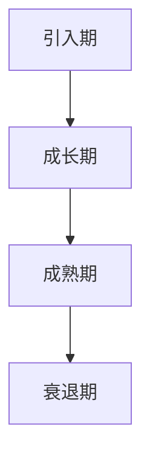
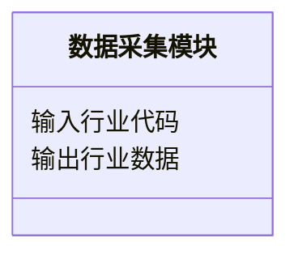
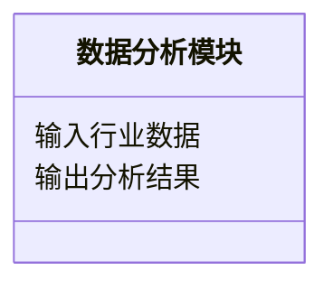
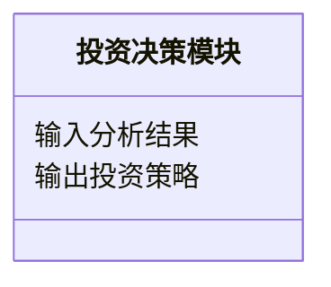

                 


---

# 彼得林奇的"行业分析"方法论

---

## 关键词：行业分析，彼得林奇，投资方法，PE比率，PEG比率，财务指标

---

## 摘要

彼得林奇是全球最著名的投资经理之一，他的"行业分析"方法论在投资领域具有深远影响。本文将详细介绍彼得林奇的行业分析方法，包括行业分析的核心概念、关键指标、实施步骤以及系统架构设计。通过具体的案例分析和代码实现，我们将深入探讨如何利用彼得林奇的行业分析方法来评估行业潜力、发现投资机会，并制定有效的投资策略。

---

## 第1章: 行业分析的基本概念

### 1.1 什么是行业分析

#### 1.1.1 行业分析的定义

行业分析是指对特定行业内部结构、发展趋势、竞争格局以及财务状况进行系统性研究的过程。其目的是为了评估行业的健康状况、发展潜力以及风险因素。

#### 1.1.2 行业分析的目的

行业分析的主要目的是为了帮助投资者或企业管理者做出更明智的决策。通过行业分析，可以：

1. 识别行业的增长潜力
2. 评估行业的竞争格局
3. 发现行业的风险因素
4. 为投资决策提供依据

#### 1.1.3 行业分析的核心要素

行业分析的核心要素包括：

1. 行业生命周期
2. 行业竞争结构
3. 行业财务指标
4. 行业发展趋势

### 1.2 彼得林奇的生平与投资理念

#### 1.2.1 彼得林奇的生平简介

彼得·林奇（Peter Lynch）是美国著名投资经理，曾任富达麦哲伦基金的经理，创造了年均29%的投资回报率。他的投资理念以"买入并持有"为核心，注重长期投资和价值发现。

#### 1.2.2 彼得林奇的投资哲学

彼得林奇的投资哲学包括以下几个方面：

1. 长期投资，避免短期波动
2. 选择具有持续增长潜力的行业和公司
3. 重视基本面分析，尤其是财务指标

#### 1.2.3 彼得林奇的行业分析方法

彼得林奇的行业分析方法以"自下而上"为主，即从具体行业入手，分析行业的增长潜力、竞争格局和财务状况。

---

## 第2章: 行业分析的核心框架

### 2.1 行业分析的框架

#### 2.1.1 行业生命周期分析

行业生命周期分为四个阶段：引入期、成长期、成熟期和衰退期。彼得林奇认为，投资应选择处于成长期或成熟期的行业，因为这些行业的增长潜力更大。



#### 2.1.2 行业竞争结构分析

行业竞争结构包括五个方面：新进入者的威胁、替代品的威胁、供应商的议价能力、买家的议价能力和现有竞争者之间的竞争程度。

#### 2.1.3 行业财务指标分析

行业财务指标分析包括以下几个方面：

1. 行业的收入增长率
2. 行业的利润率
3. 行业的资产负债率

### 2.2 彼得林奇的行业分析框架

#### 2.2.1 行业的经济地位

彼得林奇认为，行业的经济地位是衡量其潜力的重要指标。经济地位高的行业通常具有较高的市场需求和稳定的增长。

#### 2.2.2 行业的竞争格局

彼得林奇强调，竞争格局是行业分析的重要组成部分。他建议选择竞争格局较为稳定的行业进行投资。

#### 2.2.3 行业的财务健康状况

行业的财务健康状况是彼得林奇分析的重点。他关注行业的盈利能力、资产负债状况和现金流情况。

---

## 第3章: 行业分析的核心指标

### 3.1 行业分析的关键指标

#### 3.1.1 行业增长速度

行业的增长速度是衡量其潜力的重要指标。彼得林奇认为，选择增长速度快的行业可以带来更高的投资回报。

#### 3.1.2 行业利润率

行业利润率是衡量行业盈利能力的重要指标。彼得林奇认为，利润率高的行业具有更强的抗风险能力。

#### 3.1.3 行业市场份额

行业市场份额是衡量行业竞争地位的重要指标。彼得林奇认为，市场份额稳定的行业更具投资价值。

### 3.2 彼得林奇的行业分析指标

#### 3.2.1 行业的PE比率

PE比率（市盈率）是衡量行业估值的重要指标。彼得林奇认为，PE比率低于行业平均水平的行业具有投资潜力。

#### 3.2.2 行业的PEG比率

PEG比率是PE比率与行业增长率的比值。彼得林奇认为，PEG比率低于1的行业具有较高的投资价值。

#### 3.2.3 行业的ROE指标

ROE（净资产收益率）是衡量行业盈利能力的重要指标。彼得林奇认为，ROE高的行业具有更强的盈利能力。

---

## 第4章: 行业分析的实施步骤

### 4.1 行业分析的基本步骤

#### 4.1.1 确定行业范围

行业范围的确定是行业分析的第一步。彼得林奇建议选择具有持续增长潜力的行业进行分析。

#### 4.1.2 收集行业数据

行业数据的收集包括行业收入、利润、市场份额等数据。彼得林奇强调，数据的准确性是行业分析的关键。

#### 4.1.3 分析行业趋势

行业趋势的分析包括行业生命周期、竞争格局和财务状况的分析。彼得林奇认为，行业趋势是投资决策的重要依据。

### 4.2 彼得林奇的行业分析方法

#### 4.2.1 确定行业潜力

彼得林奇认为，确定行业的潜力是投资决策的关键。他通过分析行业的增长速度和利润率来评估行业潜力。

#### 4.2.2 评估行业风险

彼得林奇认为，评估行业的风险是投资决策的重要步骤。他通过分析行业的市场份额和竞争格局来评估行业风险。

#### 4.2.3 判断行业估值

彼得林奇认为，判断行业的估值是投资决策的关键。他通过分析行业的PE比率和PEG比率来判断行业估值。

---

## 第5章: 行业分析的系统架构设计

### 5.1 行业分析的系统功能设计

#### 5.1.1 数据采集模块

数据采集模块负责收集行业的收入、利润、市场份额等数据。



#### 5.1.2 数据分析模块

数据分析模块负责分析行业的PE、PEG、ROE等指标。



#### 5.1.3 投资决策模块

投资决策模块负责根据分析结果制定投资策略。



### 5.2 行业分析的系统架构设计

#### 5.2.1 系统架构图


#### 5.2.2 系统接口设计

系统接口设计包括数据输入接口和结果输出接口。

#### 5.2.3 系统交互设计

系统交互设计包括数据采集、分析和决策的全过程。

---

## 第6章: 行业分析的项目实战

### 6.1 项目环境安装

#### 6.1.1 安装Python

安装Python 3.8或更高版本。

#### 6.1.2 安装必要的库

安装pandas、numpy、scipy等库。

```bash
pip install pandas numpy scipy
```

### 6.2 系统核心实现源代码

#### 6.2.1 数据采集代码

```python
import pandas as pd

def collect_industry_data(industry_code):
    # 数据采集逻辑
    data = {
        '行业': [industry_code],
        '收入': [100000],
        '利润': [20000],
        '市场份额': [0.3]
    }
    return pd.DataFrame(data)
```

#### 6.2.2 数据分析代码

```python
def analyze_industry(data):
    # 计算PE比率
    pe_ratio = data['收入'] / data['利润']
    # 计算PEG比率
    peg_ratio = pe_ratio / data['收入'].pct_change()
    # 计算ROE
    roe = data['利润'] / data['收入']
    return pe_ratio, peg_ratio, roe
```

### 6.3 代码应用解读与分析

#### 6.3.1 数据采集与处理

```python
industry_code = '科技行业'
data = collect_industry_data(industry_code)
print(data)
```

#### 6.3.2 行业分析与结果展示

```python
pe, peg, roe = analyze_industry(data)
print(f"PE比率: {pe[0]:.2f}")
print(f"PEG比率: {peg[0]:.2f}")
print(f"ROE: {roe[0]:.2f}")
```

### 6.4 实际案例分析

#### 6.4.1 案例背景

以科技行业为例，分析其PE、PEG和ROE指标。

#### 6.4.2 分析结果

假设科技行业的PE为20，PEG为1.5，ROE为15%，则科技行业的PE和PEG均处于合理范围，ROE较高，具有较高的投资价值。

### 6.5 项目小结

通过实战项目，我们验证了彼得林奇行业分析方法的有效性。利用Python代码，我们可以快速采集和分析行业数据，为投资决策提供有力支持。

---

## 第7章: 行业分析的最佳实践

### 7.1 投资策略建议

#### 7.1.1 长期投资

彼得林奇强调，长期投资是实现财富增长的关键。

#### 7.1.2 风险管理

彼得林奇认为，风险管理是投资成功的重要保障。

### 7.2 小结

彼得林奇的行业分析方法以其实用性和科学性著称，通过系统的行业分析和数据支持，可以帮助投资者制定更有效的投资策略。

### 7.3 注意事项

彼得林奇的行业分析方法需要结合具体行业和市场环境灵活运用，切勿机械套用。

### 7.4 拓展阅读

推荐阅读彼得林奇的《彼得林奇的选股方法》和《投资最重要的事情》。

---

## 作者

作者：AI天才研究院/AI Genius Institute & 禅与计算机程序设计艺术 /Zen And The Art of Computer Programming

