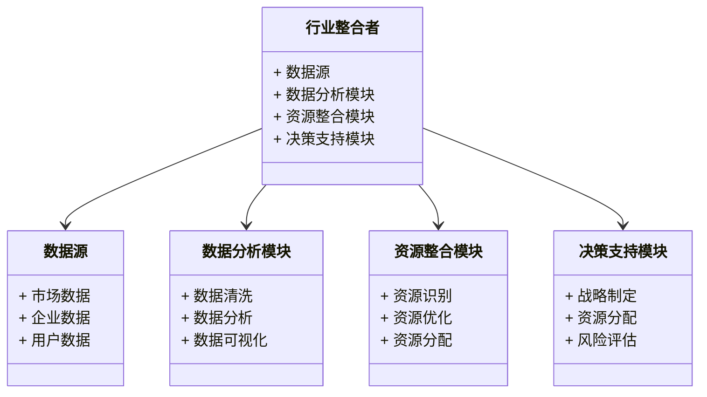
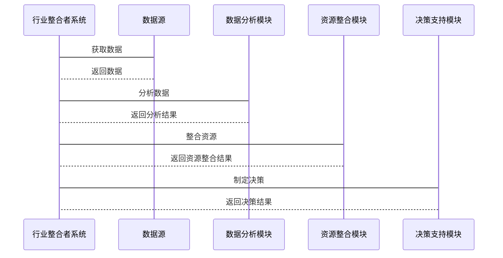

                 


# 彼得林奇的"行业整合者"在数字化浪潮中的特征

> 关键词：行业整合者、数字化浪潮、彼得·林奇、战略眼光、资源整合能力、数据驱动、系统架构

> 摘要：本文深入探讨彼得·林奇提出的“行业整合者”概念在数字化浪潮中的特征。通过分析行业整合者的战略眼光、资源整合能力以及数据驱动的特征，结合实际案例，揭示行业整合者在数字化转型中的核心作用。文章还详细分析了系统架构设计、算法实现及项目实战，为读者提供全面的视角和实践指导。

---

## 第一部分：行业整合者的定义与特征

### 第1章：行业整合者的定义与特征

#### 1.1 行业整合者的概念

##### 1.1.1 行业整合者的定义
行业整合者是指在特定行业中，能够整合内部和外部资源，优化资源配置，提升企业竞争力的组织或个人。他们通过整合产业链上下游资源，推动行业向更高效率和价值方向发展。

##### 1.1.2 行业整合者的核心特征
- **战略眼光**：能够洞察行业趋势，制定长远的发展战略。
- **资源整合能力**：擅长协调和整合内外部资源，优化资源配置。
- **创新能力**：能够推动技术和商业模式的创新，引领行业发展。
- **领导力**：具备强大的领导能力，能够带领团队实现战略目标。

##### 1.1.3 行业整合者的战略目标
行业整合者的目标是通过整合资源，提升行业整体效率，创造更大的价值，同时为企业和社会带来可持续的发展。

#### 1.2 彼得·林奇与行业整合者

##### 1.2.1 彼得·林奇的背景介绍
彼得·林奇是美国著名投资家，以其在富达投资的长期优异表现而闻名。他的投资理念强调深入研究企业，寻找具有长期增长潜力的公司。

##### 1.2.2 彼得·林奇对行业整合者的贡献
彼得·林奇在其投资实践中，注重选择那些能够整合行业资源、具备强大整合能力的公司。他提出的行业整合者概念，为后来的企业战略提供了重要的理论基础。

##### 1.2.3 彼得·林奇的行业整合者理论
彼得·林奇认为，行业整合者能够通过整合资源，降低运营成本，提高效率，从而在竞争中占据优势地位。他的理论强调了资源整合和战略规划的重要性。

### 第2章：数字化浪潮下的行业整合者

#### 2.1 数字化浪潮的背景

##### 2.1.1 数字化转型的定义
数字化转型是指企业利用数字技术（如大数据、人工智能、云计算等）改变其业务模式、流程、文化、技能和资产，以实现业务创新和价值增长。

##### 2.1.2 数字化转型的核心驱动力
- **技术创新**：大数据、人工智能、区块链等技术的快速发展，为数字化转型提供了技术基础。
- **市场需求**：客户对个性化、智能化服务的需求不断增长，推动企业进行数字化转型。
- **竞争优势**：数字化转型能够提高企业效率、降低成本，增强企业的市场竞争力。

##### 2.1.3 数字化转型对行业整合者的影响
数字化转型为行业整合者提供了新的工具和方法，使其能够更高效地整合资源，提升企业的整体竞争力。

#### 2.2 行业整合者在数字化浪潮中的角色

##### 2.2.1 行业整合者在数字化转型中的新定位
在数字化转型中，行业整合者需要扮演技术引领者、资源整合者和创新推动者的角色，利用数字化技术推动行业升级。

##### 2.2.2 数字化技术对行业整合者能力的要求
行业整合者需要具备以下能力：
- **技术能力**：熟悉大数据、人工智能等技术，并能够将其应用于资源整合和业务优化。
- **数据分析能力**：能够从海量数据中提取有价值的信息，支持决策。
- **创新能力**：能够结合数字化技术，创新商业模式和业务流程。

##### 2.2.3 行业整合者在数字化浪潮中的竞争优势
行业整合者通过数字化技术的应用，能够实现资源的高效整合，提高企业的运营效率，降低成本，从而在市场竞争中占据优势地位。

---

## 第二部分：行业整合者的特征分析

### 第3章：行业整合者的战略眼光

#### 3.1 战略眼光的核心要素

##### 3.1.1 长期目标的设定
行业整合者需要制定长期的发展目标，明确企业的战略方向。

##### 3.1.2 市场趋势的洞察
行业整合者需要敏锐地捕捉市场趋势，预测行业的未来发展方向。

##### 3.1.3 竞争环境的分析
行业整合者需要对竞争环境进行深入分析，了解竞争对手的优势和劣势，制定相应的战略。

#### 3.2 战略眼光对行业整合者的影响

##### 3.2.1 战略眼光与资源整合能力的关系
战略眼光决定了资源整合的方向和优先级，是资源整合能力的基础。

##### 3.2.2 战略眼光对数字化转型的指导作用
战略眼光为行业整合者提供了数字化转型的方向和目标，指导企业在数字化浪潮中找到合适的发展路径。

##### 3.2.3 战略眼光在行业整合中的具体表现
行业整合者通过战略眼光，能够识别出具有潜力的资源整合机会，制定合理的整合策略，推动企业的可持续发展。

### 第4章：行业整合者的资源整合能力

#### 4.1 资源整合的核心要素

##### 4.1.1 内部资源的整合
行业整合者需要整合企业的内部资源，优化资源配置，提高企业的运营效率。

##### 4.1.2 外部资源的整合
行业整合者需要整合外部资源，如供应商、合作伙伴等，构建合作共赢的生态系统。

##### 4.1.3 资源整合的效率与效果
资源整合的效率和效果是衡量行业整合者能力的重要指标，高效整合能够显著提升企业的竞争力。

#### 4.2 资源整合能力对行业整合者的影响

##### 4.2.1 资源整合能力与企业竞争力的关系
资源整合能力是企业竞争力的重要组成部分，强大的资源整合能力能够为企业带来更多的资源和机会。

##### 4.2.2 资源整合能力在数字化转型中的应用
行业整合者需要在数字化转型中充分利用资源整合能力，整合数字技术资源，推动企业的数字化转型。

##### 4.2.3 资源整合能力对行业整合者长期发展的意义
资源整合能力是行业整合者长期发展的核心能力，能够帮助企业在激烈的市场竞争中立于不败之地。

---

## 第三部分：数字化浪潮中的行业整合者特征

### 第5章：数据驱动的行业整合者

#### 5.1 数据驱动的定义与特征

##### 5.1.1 数据驱动的定义
数据驱动是指通过收集、分析和利用数据，指导决策和行动的管理方式。

##### 5.1.2 数据驱动的核心特征
- **数据采集**：能够高效采集和处理各类数据。
- **数据分析**：具备强大的数据分析能力，能够从数据中提取有价值的信息。
- **数据应用**：能够将数据分析结果应用于实际业务，指导决策和行动。

#### 5.2 数据驱动对行业整合者的影响

##### 5.2.1 数据驱动在行业整合中的应用
行业整合者通过数据驱动，能够更好地理解市场需求，优化资源配置，提高企业的整体效率。

##### 5.2.2 数据驱动对行业整合者竞争优势的提升
数据驱动使得行业整合者能够更精准地把握市场趋势，制定更有效的整合策略，从而在竞争中占据优势地位。

##### 5.2.3 数据驱动对行业整合者长期发展的意义
数据驱动是行业整合者在数字化浪潮中保持竞争力的重要手段，能够帮助企业在长期发展中持续创新和优化。

---

## 第四部分：系统分析与架构设计方案

### 第6章：系统分析与架构设计方案

#### 6.1 问题场景介绍

##### 6.1.1 问题背景
随着数字化转型的深入，行业整合者需要构建一个高效的数据驱动系统，整合内外部资源，优化资源配置，提高企业的整体竞争力。

##### 6.1.2 问题描述
如何设计一个高效的数据驱动系统，整合内外部资源，优化资源配置，提高企业的整体竞争力。

##### 6.1.3 问题解决
通过系统架构设计，整合内外部资源，构建一个高效的数据驱动系统，优化资源配置，提高企业的整体竞争力。

#### 6.2 项目介绍

##### 6.2.1 项目目标
构建一个高效的数据驱动系统，整合内外部资源，优化资源配置，提高企业的整体竞争力。

##### 6.2.2 项目范围
包括数据采集、数据分析、资源优化配置等功能。

##### 6.2.3 项目技术选型
采用大数据技术、人工智能技术等，构建高效的数据驱动系统。

#### 6.3 系统功能设计

##### 6.3.1 领域模型（Mermaid 类图）


#### 6.4 系统架构设计

##### 6.4.1 系统架构（Mermaid 架构图）
```mermaid
architecturalDiagram
    component 行业整合者系统 {
        component 数据采集模块 {
            数据源
        }
        component 数据分析模块 {
            数据清洗、分析、可视化
        }
        component 资源整合模块 {
            资源识别、优化、分配
        }
        component 决策支持模块 {
            战略制定、风险评估
        }
    }
    数据采集模块 --> 数据分析模块
    数据分析模块 --> 资源整合模块
    资源整合模块 --> 决策支持模块
```

#### 6.5 系统接口设计

##### 6.5.1 系统接口（Mermaid 序列图）


---

## 第五部分：项目实战

### 第7章：项目实战

#### 7.1 环境安装

##### 7.1.1 环境要求
- 操作系统：Windows、Linux 或 macOS
- Python 版本：3.6 以上
- 依赖库：Pandas、NumPy、Scikit-learn、Matplotlib

##### 7.1.2 安装依赖
```bash
pip install pandas numpy scikit-learn matplotlib
```

#### 7.2 核心代码实现

##### 7.2.1 数据清洗代码
```python
import pandas as pd
import numpy as np

# 读取数据
data = pd.read_csv('data.csv')

# 删除缺失值
data.dropna(inplace=True)

# 处理异常值
Q1 = data.quantile(0.25)
Q3 = data.quantile(0.75)
IQR = Q3 - Q1
data = data[(data <= Q3 + 1.5 * IQR) & (data >= Q1 - 1.5 * IQR)]
```

##### 7.2.2 数据分析代码
```python
from sklearn import preprocessing
import matplotlib.pyplot as plt

# 标准化数据
scaler = preprocessing.StandardScaler()
data_scaled = scaler.fit_transform(data)

# 可视化数据
plt.scatter(data_scaled[:, 0], data_scaled[:, 1])
plt.show()
```

##### 7.2.3 资源整合代码
```python
from sklearn.cluster import KMeans

# 聚类分析
kmeans = KMeans(n_clusters=3)
clusters = kmeans.fit_predict(data_scaled)

# 输出聚类结果
print(clusters)
```

#### 7.3 案例分析

##### 7.3.1 案例介绍
假设我们有一个制造企业，希望通过数据整合优化生产流程，降低成本。

##### 7.3.2 数据分析结果
通过数据分析，我们发现生产流程中存在瓶颈，可以通过优化资源配置来提高效率。

##### 7.3.3 资源整合结果
通过聚类分析，我们识别出三个主要的资源消耗区域，并提出了优化建议。

##### 7.3.4 决策支持结果
基于数据分析和资源整合的结果，我们制定了优化生产流程的决策，并预测了实施后的效果。

#### 7.4 项目小结
通过本项目，我们展示了如何利用数据驱动的方法，整合资源，优化企业的生产流程，降低成本，提高效率。

---

## 第六部分：总结与展望

### 第8章：总结与展望

#### 8.1 总结

##### 8.1.1 核心要点回顾
- 行业整合者在数字化浪潮中的重要性
- 数据驱动对行业整合者的影响
- 系统架构设计与实现

##### 8.1.2 实践中的注意事项
- 数据质量的重要性
- 算法选择的合理性
- 系统维护的持续性

#### 8.2 展望

##### 8.2.1 未来趋势
- 人工智能在行业整合中的应用
- 区块链技术在资源管理中的潜力
- 边缘计算在数据驱动中的作用

##### 8.2.2 挑战与机遇
- 如何应对数据隐私和安全的挑战
- 如何抓住新技术带来的机遇

##### 8.2.3 对行业整合者的建议
- 加强技术创新能力
- 提高数据驱动能力
- 建立合作共赢的生态系统

---

## 作者信息

作者：AI天才研究院/AI Genius Institute & 禅与计算机程序设计艺术/Zen And The Art of Computer Programming

---

这篇文章通过系统地分析彼得·林奇的“行业整合者”在数字化浪潮中的特征，结合理论与实践，为读者提供了全面的视角和深入的分析。通过详细的系统架构设计和项目实战，帮助读者更好地理解和应用这些概念。希望本文能为行业整合者在数字化转型中的角色和能力提供有价值的参考。

