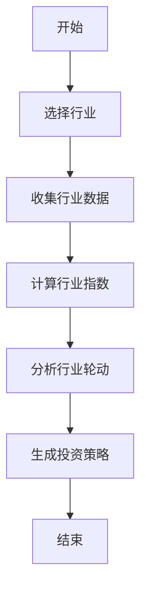
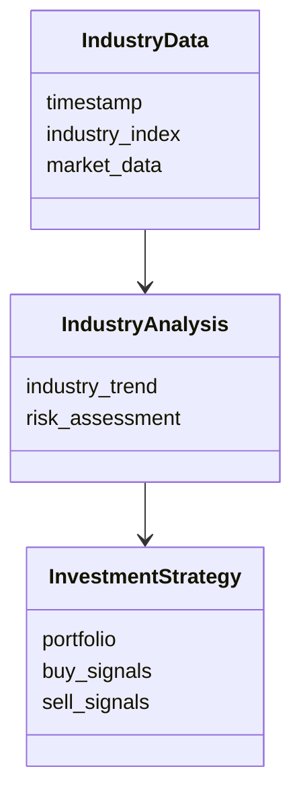
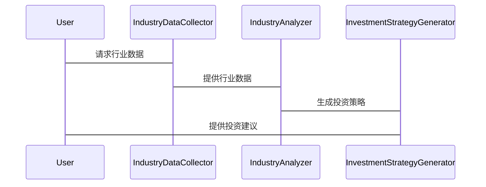

                 


# 彼得林奇的"行业轮动"在全球产业链重构中的应用

> **关键词**：彼得林奇，行业轮动，全球产业链重构，投资策略，系统架构，数学模型

> **摘要**：本文探讨了彼得林奇的行业轮动理论在全球产业链重构中的应用。首先，介绍了行业轮动的基本概念和彼得林奇的投资策略，分析了全球产业链重构的背景与趋势。接着，详细阐述了行业轮动与产业链重构的关联性，以及彼得林奇策略在全球产业链重构中的具体应用。通过数学模型和算法实现，本文展示了如何利用行业轮动策略优化投资决策。最后，结合实际案例，分析了系统架构与实现，并提供了项目实战和最佳实践的总结。

---

## 第1章：行业轮动的基本概念与理论基础

### 1.1 行业轮动的定义与核心要素

#### 1.1.1 行业轮动的基本定义
行业轮动是指在经济周期中，不同行业之间投资表现的交替上升和下降现象。彼得林奇在其投资策略中强调，行业轮动是市场波动中的一种自然现象，投资者可以通过识别行业轮动的规律，捕捉投资机会。

#### 1.1.2 行业轮动的核心要素分析
- **经济周期**：行业轮动与经济周期密切相关，不同行业在扩张期和衰退期的表现不同。
- **行业特性**：不同行业的盈利能力和抗风险能力差异显著，影响行业轮动的节奏。
- **市场情绪**：投资者情绪的变化也会推动行业轮动的发生。

#### 1.1.3 行业轮动的驱动因素
- **宏观经济因素**：如GDP增长率、利率水平、通货膨胀等。
- **行业自身因素**：如技术创新、政策变化、市场需求等。
- **市场结构**：如市场竞争程度、企业并购等。

### 1.2 彼得林奇的行业轮动理论

#### 1.2.1 彼得林奇的投资者背景
彼得林奇是美国著名投资经理，以其在富达麦哲伦基金的卓越表现闻名。他的投资策略注重长期价值，善于通过行业轮动捕捉市场机会。

#### 1.2.2 彼得林奇行业轮动的核心观点
- **行业轮动的周期性**：彼得林奇认为，行业轮动是市场周期性变化的必然结果，投资者可以通过识别周期变化，提前布局。
- **行业轮动的选股标准**：彼得林奇强调选择具有强大基本面和良好管理的公司，而非仅仅关注行业表现。

#### 1.2.3 彼得林奇行业轮动的策略框架
- **行业筛选**：根据宏观经济指标和行业特性，筛选出具有增长潜力的行业。
- **个股选择**：在选定行业中，挑选具有竞争优势和估值合理的个股。
- **时机选择**：根据市场周期和行业轮动的规律，确定买入和卖出的时机。

### 1.3 全球产业链重构的背景与趋势

#### 1.3.1 全球化与产业链的基本概念
全球化背景下，产业链分工日益细化，各国在全球产业链中占据不同的位置，形成了复杂的供应链网络。

#### 1.3.2 产业链重构的驱动因素
- **技术进步**：人工智能、大数据等技术推动产业链升级。
- **地缘政治**：贸易摩擦、疫情等事件促使企业重新布局供应链。
- **成本因素**：劳动力、原材料成本的变化影响产业链分工。

#### 1.3.3 全球产业链重构的趋势分析
- **区域化趋势**：产业链向区域化发展，减少对单一国家的依赖。
- **本地化趋势**：企业倾向于在靠近市场的国家建立生产基地。
- **智能化趋势**：通过数字化技术提升产业链效率。

---

## 第2章：行业轮动与全球产业链重构的关联性分析

### 2.1 行业轮动对全球产业链重构的影响

#### 2.1.1 行业轮动如何影响产业链布局
行业轮动导致不同行业的需求变化，进而影响全球产业链的分工和布局。

#### 2.1.2 行业轮动对产业链竞争力的提升作用
通过行业轮动，企业可以更好地适应市场变化，提升在全球产业链中的竞争力。

#### 2.1.3 行业轮动与产业链重构的互动关系
行业轮动为产业链重构提供了动力，而产业链重构又反过来影响行业轮动的节奏和方向。

### 2.2 全球产业链重构对行业轮动的反向影响

#### 2.2.1 产业链重构如何改变行业轮动的周期性
产业链重构可能导致行业轮动周期缩短或延长，影响投资者的决策。

#### 2.2.2 产业链重构对行业轮动策略的挑战
重构过程中，传统的行业轮动策略可能失效，需要投资者重新调整策略。

#### 2.2.3 产业链重构对行业轮动风险的放大效应
产业链重构可能导致市场波动加剧，增加行业轮动中的投资风险。

---

## 第3章：彼得林奇行业轮动策略在全球产业链重构中的应用

### 3.1 彼得林奇行业轮动策略的核心框架

#### 3.1.1 行业轮动的周期性分析
彼得林奇通过分析经济周期，预测行业轮动的周期变化。

#### 3.1.2 行业轮动的选股标准
选择具有强大基本面和竞争优势的个股，而非仅仅关注行业表现。

#### 3.1.3 行业轮动的时机选择
根据市场周期和行业轮动的规律，确定买入和卖出的时机。

### 3.2 全球产业链重构中的行业轮动机会

#### 3.2.1 新兴产业的崛起与行业轮动机会
新兴技术产业的崛起为投资者提供了新的行业轮动机会。

#### 3.2.2 传统产业的转型与行业轮动机会
传统产业通过技术创新和管理优化，重新获得竞争优势。

#### 3.2.3 区域产业链重构中的行业轮动机会
区域化趋势为投资者提供了在特定区域内布局的机会。

---

## 第4章：行业轮动策略的数学模型与算法实现

### 4.1 行业轮动的数学模型构建

#### 4.1.1 行业轮动的基本假设
- 市场存在周期性波动。
- 不同行业在周期中的表现不同。

#### 4.1.2 行业轮动的数学模型
$$ P_{t+1} = \alpha P_t + \beta Q_t $$
其中，\( P_t \) 表示当前行业表现，\( Q_t \) 表示市场整体表现，\(\alpha\) 和 \(\beta\) 为系数。

#### 4.1.3 行业轮动模型的参数选择
根据历史数据，通过回归分析确定参数 \(\alpha\) 和 \(\beta\)。

### 4.2 行业轮动算法的实现

#### 4.2.1 行业轮动算法的流程图


#### 4.2.2 行业轮动算法的代码实现
```python
import pandas as pd
import numpy as np

# 数据获取
industry_data = pd.read_csv('industry.csv')

# 行业指数计算
industry_index = industry_data.rolling(20).mean()

# 行业轮动分析
from sklearn.linear_model import LinearRegression
model = LinearRegression()
model.fit(industry_index, industry_data)
```

---

## 第5章：全球产业链重构下的行业轮动系统架构与实现

### 5.1 系统功能设计

#### 5.1.1 问题场景介绍
投资者需要在全球产业链重构的背景下，利用行业轮动策略优化投资决策。

#### 5.1.2 系统功能设计
- 数据采集与处理
- 行业轮动分析
- 投资策略生成
- 风险评估与优化

#### 5.1.3 领域模型设计


### 5.2 系统架构设计

#### 5.2.1 系统架构设计
```mermaid
docker
    service IndustryDataCollector
    service IndustryAnalyzer
    service InvestmentStrategyGenerator
    service RiskEvaluator
    service UserInterface
```

#### 5.2.2 系统接口设计
- 数据接口：数据采集与处理模块的接口设计。
- 分析接口：行业分析模块的接口设计。
- 策略接口：投资策略生成模块的接口设计。

### 5.3 系统交互设计

#### 5.3.1 系统交互流程


---

## 第6章：项目实战与案例分析

### 6.1 项目实战

#### 6.1.1 环境配置
- 数据源：股票价格数据、行业指数数据。
- 工具：Python、Pandas、Scikit-learn。

#### 6.1.2 代码实现
```python
import pandas as pd
import numpy as np
from sklearn.linear_model import LinearRegression

# 数据加载
data = pd.read_csv('industry.csv')

# 行业指数计算
data['industry_index'] = data.rolling(20).mean()

# 行业轮动模型训练
model = LinearRegression()
model.fit(data[['industry_index']], data['price'])
```

#### 6.1.3 案例分析
分析某行业的历史数据，预测未来行业轮动趋势，并制定投资策略。

### 6.2 实际案例分析

#### 6.2.1 案例背景
某行业在经济周期中的表现，以及产业链重构对该行业的影响。

#### 6.2.2 案例分析
通过行业轮动模型，预测该行业的未来表现，并制定投资策略。

---

## 第7章：最佳实践与小结

### 7.1 最佳实践 tips

#### 7.1.1 行业轮动策略的注意事项
- 风险控制：避免过度集中投资。
- 灵活调整：根据市场变化及时调整策略。
- 数据质量：确保数据的准确性和完整性。

#### 7.1.2 系统架构优化建议
- 数据源多样化：获取多源数据，提高模型准确性。
- 模型优化：定期更新模型参数，适应市场变化。
- 系统维护：及时修复系统漏洞，确保运行稳定。

### 7.2 小结

### 7.3 注意事项

### 7.4 拓展阅读

---

**作者：AI天才研究院/AI Genius Institute & 禅与计算机程序设计艺术 /Zen And The Art of Computer Programming**

---

这篇文章通过系统地分析彼得林奇的行业轮动理论，结合全球产业链重构的背景，展示了如何在全球化背景下应用行业轮动策略优化投资决策。通过数学模型和系统架构的设计，本文为投资者提供了一种新的视角和方法，帮助其在全球产业链重构中捕捉投资机会，降低投资风险。

