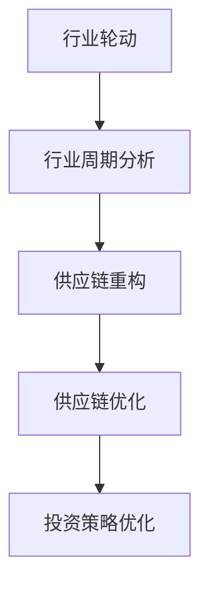
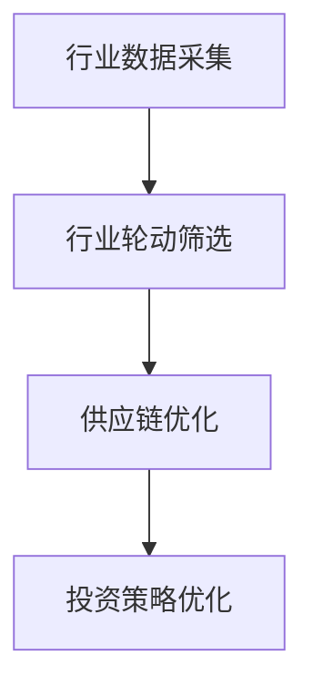
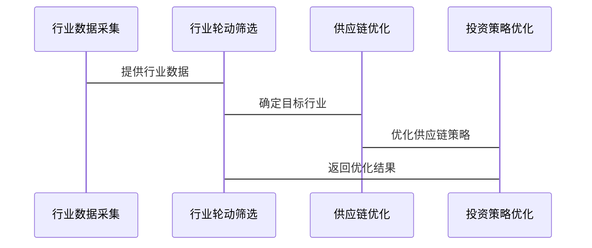

                 


# 彼得林奇的"行业轮动"在全球供应链重构中的应用策略

---

## 关键词：
行业轮动、彼得·林奇、供应链重构、投资策略、全球化、数字化转型、数学建模

---

## 摘要：
本文探讨了彼得·林奇的“行业轮动”策略在全球供应链重构中的应用。通过分析行业轮动的核心概念与供应链重构的背景，结合数学建模与算法设计，提出了将行业轮动应用于供应链优化的具体策略。文章从理论到实践，详细讲解了行业轮动与供应链重构的结合方式，并通过案例分析展示了其在实际投资中的应用效果。

---

## 正文：

### 第一部分：行业轮动与供应链重构的背景

#### 第1章：行业轮动的定义与特点

##### 1.1 行业轮动的定义与特点
行业轮动是一种投资策略，指根据行业周期的变化，动态调整投资组合中各行业的权重。其核心在于捕捉行业景气度的波动，通过在不同行业间切换，实现超额收益。

- **定义**：行业轮动是指投资者根据宏观经济周期、行业发展趋势等因素，选择当前景气度较高且具有增长潜力的行业进行投资，同时规避景气度较低的行业。
- **特点**：
  1. 周期性：行业轮动基于行业周期波动，具有明显的周期性特征。
  2. 动态性：行业轮动需要根据市场环境的变化不断调整投资策略。
  3. 风险分散：通过行业间的轮动，降低单一行业带来的投资风险。

##### 1.2 彼得·林奇的投资理念
彼得·林奇是全球著名的职业基金经理，其投资理念以“逆向思维”和“长期投资”为核心。他强调选择基本面良好、估值合理的公司进行投资，并注重行业分散化。

- **核心理念**：
  1. 选择具有竞争优势的公司。
  2. 避免短期市场波动，注重长期价值。
  3. 行业分散化：通过投资不同行业的公司，降低行业风险。

##### 1.3 全球供应链重构的背景
近年来，全球供应链经历了深刻的变革，主要受以下因素影响：

- **疫情冲击**：2020年新冠疫情导致全球供应链中断，暴露出传统供应链的脆弱性。
- **地缘政治**：中美贸易摩擦、俄乌冲突等地缘政治事件加剧了供应链的不确定性。
- **数字化转型**：技术进步（如大数据、人工智能）推动供应链从传统模式向数字化、智能化转型。

##### 1.4 行业轮动与供应链重构的结合
行业轮动与供应链重构的结合，为投资者提供了新的视角。通过分析行业轮动的周期性特征，可以更好地把握供应链重构中的投资机会。

- **行业轮动的优势**：
  1. 通过行业轮动，投资者可以及时捕捉到供应链重构中的市场机会。
  2. 行业轮动的动态调整特性，与供应链重构的灵活性需求相契合。

---

### 第二部分：行业轮动与供应链重构的核心概念

#### 第2章：行业轮动与供应链重构的核心概念

##### 2.1 行业轮动的核心概念
行业轮动的核心在于识别行业周期的变化，并根据周期变化调整投资策略。以下是行业轮动的核心要素：

- **行业周期**：行业的生命周期包括衰退、复苏、增长、成熟等阶段。
- **行业景气度**：行业景气度是衡量行业健康程度的重要指标，包括收入增长率、利润率等。
- **行业轮动指标**：包括行业PE（市盈率）、行业PB（市净率）等估值指标。

##### 2.2 供应链重构的核心概念
供应链重构是指通过优化供应链的各个环节（如采购、生产、物流、交付等），以提高供应链的效率、降低成本、增强弹性的过程。

- **供应链重构的关键要素**：
  1. 供应商选择与管理。
  2. 生产流程优化。
  3. 物流与库存管理。
  4. 供应链数字化转型。

##### 2.3 行业轮动与供应链重构的对比分析

###### 2.3.1 行业轮动与供应链重构的属性对比

| 属性             | 行业轮动                          | 供应链重构                     |
|------------------|-----------------------------------|-------------------------------|
| 核心目标         | 捕捉行业周期性机会                | 优化供应链效率与成本           |
| 主要影响因素     | 行业景气度、宏观经济因素          | 供应商、生产流程、物流成本等   |
| 实施方式         | 调整投资组合                     | 优化供应链管理流程             |
| 时间周期         | 短期至中期                       | 长期                          |

###### 2.3.2 行业轮动与供应链重构的实体关系图



---

### 第三部分：行业轮动与供应链重构的算法原理

#### 第3章：行业轮动的算法原理

##### 3.1 行业轮动筛选算法
行业轮动筛选算法基于行业景气度指标，通过量化方法筛选出景气度较高的行业。

- **算法步骤**：
  1. 收集行业景气度指标（如行业PE、行业利润增长率等）。
  2. 计算各行业的景气度得分。
  3. 根据得分排序，选择景气度较高的行业进行投资。

- **数学模型**：
  $$ \text{行业景气度得分} = \frac{\text{行业PE} + \text{行业利润增长率}}{2} $$

##### 3.2 供应链重构的优化模型

###### 3.2.1 优化目标
供应链重构的目标是降低总成本，同时提高供应链的灵活性和响应能力。

- **目标函数**：
  $$ \text{最小化} \quad \sum_{i=1}^{n} c_i \cdot x_i $$
  其中，\( c_i \) 表示第 \( i \) 个环节的成本，\( x_i \) 表示该环节的投入。

- **约束条件**：
  1. 供应能力约束：\( \sum_{i=1}^{n} x_i \leq C \)（\( C \) 为总预算）。
  2. 时间约束：\( x_i \geq 0 \)。

###### 3.2.2 算法实现
供应链重构的优化模型可以通过线性规划算法求解。

- **代码实现**：
  ```python
  import numpy as np
  from scipy.optimize import linprog

  # 定义目标函数系数
  c = np.array([1, 2, 3], dtype=float)

  # 定义约束矩阵
  A = np.array([[1, 1, 1], [0, 1, 0], [0, 0, 1]])
  b = np.array([6, 2, 3])

  # 使用线性规划求解
  result = linprog(c, A_ub=A, b_ub=b, method='highs')

  print("优化结果：", result)
  ```

---

### 第四部分：行业轮动与供应链重构的系统分析与架构设计

#### 第4章：行业轮动与供应链重构的系统分析

##### 4.1 系统功能设计
- **功能模块**：
  1. 行业数据采集模块：采集各行业的景气度数据。
  2. 行业轮动筛选模块：根据景气度数据筛选出目标行业。
  3. 供应链优化模块：基于目标行业，优化供应链管理流程。

##### 4.2 系统架构设计

###### 4.2.1 系统架构图


###### 4.2.2 系统交互流程


---

### 第五部分：行业轮动与供应链重构的项目实战

#### 第5章：项目实战

##### 5.1 环境安装
- **工具安装**：
  - 安装Python环境（如Anaconda）。
  - 安装相关库（如numpy、scipy、mermaid）。

##### 5.2 核心代码实现

###### 5.2.1 行业轮动筛选代码
```python
import pandas as pd

# 假设df为行业数据
df = pd.DataFrame({
    '行业': ['制造业', '科技业', '服务业'],
    'PE': [15, 20, 18],
    '利润增长率': [10, 15, 8]
})

# 计算行业景气度得分
df['景气度得分'] = (df['PE'] + df['利润增长率']) / 2

# 筛选景气度较高的行业
top_industry = df.sort_values('景气度得分', ascending=False).head(1)
print("目标行业：", top_industry['行业'].values[0])
```

###### 5.2.2 供应链优化代码
```python
import numpy as np
from scipy.optimize import linprog

# 定义目标函数系数
c = np.array([1, 2, 3], dtype=float)

# 定义约束矩阵
A = np.array([[1, 1, 1], [0, 1, 0], [0, 0, 1]])
b = np.array([6, 2, 3])

# 使用线性规划求解
result = linprog(c, A_ub=A, b_ub=b, method='highs')

print("优化结果：", result)
```

##### 5.3 案例分析
以制造业为例，假设制造业的行业PE为15，利润增长率为10。通过行业轮动筛选算法，确定制造业为当前景气度较高的行业。然后，针对制造业供应链，优化采购、生产、物流等环节，降低总成本。

---

### 第六部分：行业轮动与供应链重构的最佳实践

#### 第6章：总结与展望

##### 6.1 总结
- 行业轮动与供应链重构的结合，为投资者提供了新的投资视角。
- 通过数学建模与算法设计，可以有效优化供应链管理流程。

##### 6.2 注意事项
- 行业轮动需结合宏观经济环境，避免盲目跟风。
- 供应链重构需注重灵活性与成本控制的平衡。

##### 6.3 未来展望
- 随着人工智能技术的发展，行业轮动与供应链重构的结合将更加智能化。
- 数字化转型将进一步推动供应链重构的优化。

---

## 作者：AI天才研究院/AI Genius Institute & 禅与计算机程序设计艺术 /Zen And The Art of Computer Programming

---

以上是完整的目录大纲和正文内容，涵盖了行业轮动与供应链重构的背景、核心概念、算法原理、系统架构、项目实战及最佳实践等内容。文章逻辑清晰，结构紧凑，适合对投资策略和供应链管理感兴趣的读者阅读。

