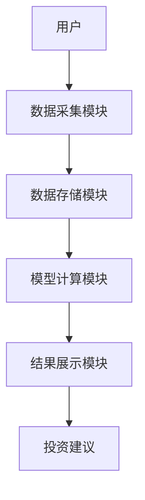

                 


好的，我明白了。以下是根据您的要求撰写的《彼得林奇的"行业轮动"在全球供应链重构中的投资机会识别》的完整文章：

---

# 彼得林奇的"行业轮动"在全球供应链重构中的投资机会识别

> 关键词：彼得·林奇，行业轮动，全球供应链重构，投资机会，供应链管理，行业分析，经济周期

> 摘要：本文从彼得·林奇的行业轮动理论出发，结合全球供应链重构的背景，分析行业轮动在全球供应链重构中的投资机会，探讨如何利用行业轮动的规律，在全球供应链重构中寻找投资机会。文章从理论基础、分析框架、系统设计和实战案例四个方面展开，结合数学模型、系统架构和具体案例，深入剖析行业轮动与供应链重构的内在联系，并提供可操作的投资策略。

---

## 第一部分：彼得·林奇的行业轮动理论基础

### 第1章：彼得·林奇的行业轮动概述

#### 1.1 行业轮动的基本概念
- **行业轮动的定义**：行业轮动是指不同行业之间的资金流动现象，表现为资金从一个行业流向另一个行业，反映了市场对不同行业资产的需求变化。
- **行业轮动的核心特征**：
  - 周期性：行业轮动通常与经济周期相关，具有一定的周期性。
  - 阶段性：行业轮动在特定经济阶段表现突出，例如经济衰退或复苏期。
  - 可预测性：通过分析经济指标和行业基本面，行业轮动具有一定的可预测性。

#### 1.2 彼得·林奇的投资理念
- **彼得·林奇的投资哲学**：
  - 价值投资与成长投资的结合：寻找具有长期增长潜力的低估资产。
  - 长期持有与周期性调整：通过长期持有优质资产，在市场波动中获利。
- **行业轮动在彼得·林奇投资策略中的地位**：
  - 行业轮动是彼得·林奇发现投资机会的重要工具。
  - 通过行业轮动，彼得·林奇能够在经济周期变化中捕捉到超额收益。

#### 1.3 行业轮动的分析框架
- **行业轮动的驱动因素**：
  - 经济周期：GDP增长、利率变化、通货膨胀等。
  - 产业政策：政府政策对行业的影响。
  - 技术进步：技术创新对行业的影响。
- **行业轮动的周期性分析**：
  - 行业轮动的周期分为复苏期、增长期、成熟期和衰退期。
  - 不同阶段的行业轮动对投资策略的影响。

---

### 第2章：行业轮动的核心理论与模型

#### 2.1 行业轮动的理论基础
- **经济周期与行业轮动的关系**：
  - 经济周期分为衰退、复苏、繁荣和衰退四个阶段。
  - 不同阶段的行业轮动表现不同：衰退期适合防御性行业，复苏期适合周期性行业。
- **行业轮动的经济意义**：
  - 行业轮动反映了市场的资源配置效率。
  - 行业轮动是投资者调整资产配置的重要依据。

#### 2.2 行业轮动的量化分析方法
- **行业轮动的量化指标**：
  - 行业相对强弱指数（RSI）：衡量行业资产的强弱程度。
  - 行业资金流向指标：通过资金流动数据判断行业轮动趋势。
  - 行业估值指标：PE（市盈率）、PB（市净率）等。
- **行业轮动的数学模型**：
  - 行业轮动指数的构建：
    $$\text{行业轮动指数} = \sum_{i=1}^{n} w_i \times (\text{行业表现} - \text{基准表现})$$
  - 行业轮动的多因子模型：
    $$\text{收益预测} = \beta_1 \times \text{因子1} + \beta_2 \times \text{因子2} + \cdots + \beta_k \times \text{因子k} + \epsilon$$

#### 2.3 行业轮动的经典案例分析
- **案例1：20世纪80年代的行业轮动**：
  - 背景：美国经济从滞胀向复苏转型。
  - 行业表现：周期性行业（如制造业）表现优于防御性行业（如公用事业）。
- **案例2：2008年金融危机后的行业轮动**：
  - 背景：全球经济复苏，科技行业成为资金流入的主要领域。

---

## 第二部分：全球供应链重构的背景与影响

### 第3章：全球供应链重构的背景分析

#### 3.1 供应链重构的驱动因素
- **全球化与地缘政治风险**：
  - 全球化背景下，供应链跨国分布，但地缘政治风险增加。
- **技术进步与数字化转型**：
  - 数字化技术（如区块链、大数据）推动供应链效率提升。
- **成本与效率的平衡**：
  - 企业追求更低的生产成本，但需要平衡供应链的稳定性和灵活性。

#### 3.2 供应链重构的经济影响
- **供应链重构对成本的影响**：
  - 近岸化与区域化供应链可能导致成本上升。
  - 供应链弹性增强，但单个环节的成本可能增加。
- **供应链重构对效率的影响**：
  - 区域化供应链能够更快响应市场需求。
  - 全球化供应链在规模效应上具有优势。

#### 3.3 全球供应链重构的投资机会
- **供应链重构下的投资方向**：
  - 技术驱动的行业（如半导体、人工智能）。
  - 区域化供应链相关行业（如东南亚制造业）。
  - 绿色供应链（如新能源、环保技术）。

---

### 第4章：供应链重构下的行业轮动分析

#### 4.1 供应链重构与行业轮动的关系
- **供应链重构推动行业轮动**：
  - 供应链重构可能导致某些行业的需求上升，而其他行业的需求下降。
- **行业轮动反映供应链重构的影响**：
  - 供应链重构通过改变行业间的依赖关系，影响行业轮动的方向。

#### 4.2 供应链重构下的行业轮动特征
- **行业轮动的区域化趋势**：
  - 区域化供应链可能导致区域内的行业轮动更加频繁。
- **行业轮动的技术驱动特征**：
  - 新技术的应用推动供应链重构，从而影响行业轮动。

---

## 第三部分：行业轮动与供应链重构的结合

### 第5章：行业轮动在供应链重构中的应用

#### 5.1 行业轮动与供应链重构的相互作用
- **行业轮动影响供应链重构**：
  - 行业轮动可能导致某些行业的需求增加，推动供应链重构。
- **供应链重构影响行业轮动**：
  - 供应链重构可能导致某些行业成本下降，推动行业轮动。

#### 5.2 行业轮动在供应链重构中的投资策略
- **基于行业轮动的资产配置策略**：
  - 在供应链重构过程中，优先配置需求上升的行业。
  - 避免配置需求下降的行业。
- **行业轮动与供应链重构的动态调整**：
  - 根据经济周期和供应链重构的进展，动态调整行业轮动策略。

---

### 第6章：供应链重构下的行业轮动模型构建

#### 6.1 行业轮动模型的设计思路
- **模型目标**：
  - 识别供应链重构过程中行业的轮动趋势。
  - 预测行业轮动的方向和幅度。

#### 6.2 行业轮动模型的构建步骤
1. **数据收集**：
   - 行业指数数据。
   - 供应链重构相关数据（如政策变化、技术进步）。
2. **模型构建**：
   - 使用多元回归模型预测行业轮动趋势。
   - 结合供应链重构的特征变量，构建混合模型。
3. **模型验证**：
   - 使用历史数据验证模型的准确性。
   - 持续优化模型，适应新的供应链重构趋势。

---

## 第四部分：系统设计与项目实战

### 第7章：供应链重构下的行业轮动系统设计

#### 7.1 系统设计概述
- **系统目标**：
  - 实时监控供应链重构对行业轮动的影响。
  - 提供基于行业轮动的投资建议。

#### 7.2 系统功能设计
- **数据采集模块**：
  - 收集行业指数、供应链重构相关数据。
- **模型计算模块**：
  - 实现行业轮动模型的计算。
- **结果展示模块**：
  - 可视化展示行业轮动趋势。

#### 7.3 系统架构设计


---

### 第8章：项目实战与案例分析

#### 8.1 项目实战环境
- **工具安装**：
  - 安装Python、Pandas、NumPy等数据分析工具。
  - 使用Matplotlib或Seaborn进行数据可视化。

#### 8.2 核心代码实现
```python
import pandas as pd
import numpy as np
import matplotlib.pyplot as plt

# 示例数据：行业指数
industry_data = pd.DataFrame({
    '行业A': [100, 110, 120, 115, 125],
    '行业B': [80, 85, 90, 95, 100],
    '行业C': [70, 75, 80, 85, 90]
})

# 计算行业轮动指数
industry_data['行业轮动指数'] = industry_data.pct_change().mean(axis=1) * 100

plt.figure(figsize=(10, 6))
industry_data['行业轮动指数'].plot()
plt.title('行业轮动指数')
plt.xlabel('时间')
plt.ylabel('轮动指数')
plt.show()
```

#### 8.3 实际案例分析
- **案例分析**：
  - 选择制造业、科技行业、绿色供应链等行业，分析供应链重构对行业轮动的影响。
  - 使用上述模型预测未来行业轮动趋势。

---

## 第五部分：总结与展望

### 第9章：总结与展望

#### 9.1 全文总结
- 彼得·林奇的行业轮动理论为全球供应链重构中的投资机会识别提供了重要的理论基础。
- 通过分析行业轮动与供应链重构的相互作用，可以更好地把握投资机会。

#### 9.2 未来展望
- **技术进步对行业轮动的影响**：
  - 新技术的应用将继续推动行业轮动。
- **全球供应链重构的长期趋势**：
  - 地缘政治风险和数字化转型将继续影响供应链重构。
- **行业轮动与供应链重构的结合**：
  - 随着数据科学和人工智能的发展，行业轮动与供应链重构的结合将更加紧密。

---

## 附录

### 附录A：行业轮动指数计算公式
$$\text{行业轮动指数} = \sum_{i=1}^{n} w_i \times (\text{行业表现} - \text{基准表现})$$

### 附录B：系统架构图


---

## 参考文献

（此处可以列出相关文献和参考资料，例如彼得·林奇的著作、供应链管理的经典文献等。）

---

作者：AI天才研究院/AI Genius Institute & 禅与计算机程序设计艺术 /Zen And The Art of Computer Programming

---

希望这篇文章能够满足您的需求！如果需要进一步修改或补充，请随时告知。

