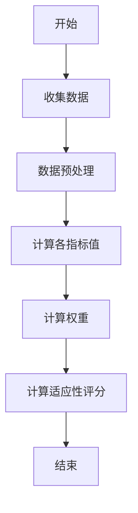
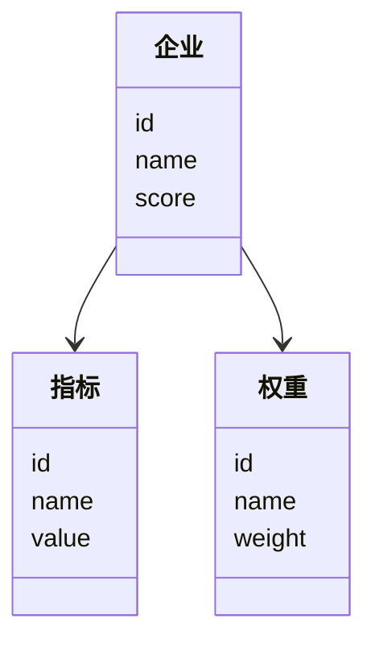
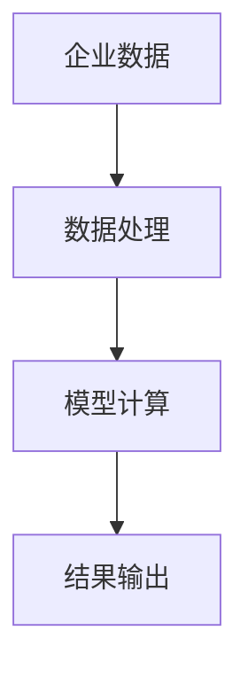
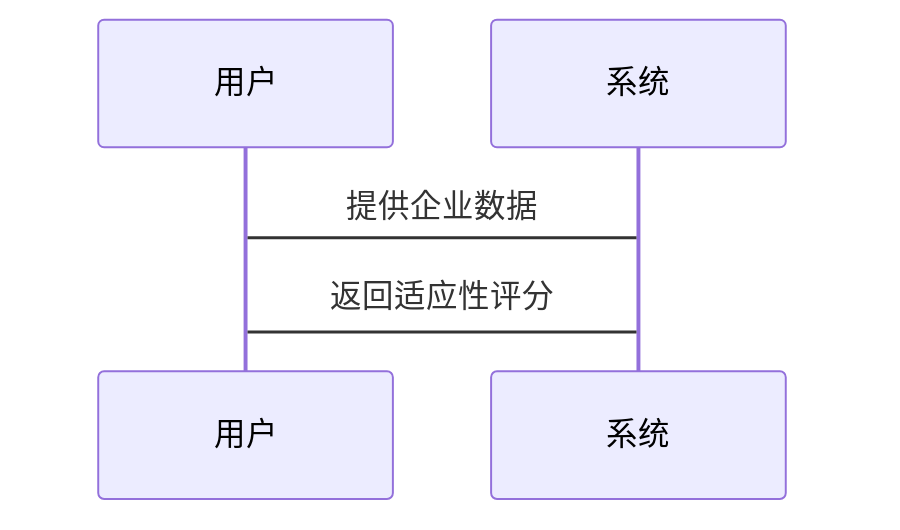

                 

<think>
好的，我需要帮用户撰写一篇关于《彼得林奇的"行业领导者"在技术变革中的适应性评分模型》的技术博客文章。首先，我需要理解用户的需求，他们希望有一个结构清晰、内容详实的文章，涵盖背景介绍、核心概念、算法原理、系统架构、项目实战和最佳实践等多个部分。

我应该从背景介绍开始，解释为什么研究行业领导者的适应性评分模型是重要的，以及彼得·林奇的理论如何应用到技术变革中。接着，详细阐述模型的核心概念，比如评分指标、权重分配和数据来源，并通过表格和图表来对比和展示这些概念。

在算法原理部分，我需要使用数学公式和流程图来详细讲解模型的计算方法，可能涉及线性回归和加权平均等方法。然后，系统分析与架构设计部分，我需要描述如何构建这个模型，包括数据收集、处理、分析和可视化的步骤，并使用类图和架构图来展示系统的各个模块。

项目实战部分，我需要提供一个实际案例，比如科技行业的公司分析，详细描述环境安装、数据收集、代码实现和结果解读。最后，总结最佳实践，给出应用模型时的注意事项和进一步的阅读建议。

整个过程中，我需要确保内容逻辑清晰，结构紧凑，语言专业且易懂。同时，遵守格式要求，使用markdown格式，插入必要的图表和代码示例，确保文章字数在10000到12000字之间。

现在，我开始按照这个思路撰写文章，确保每个部分都涵盖必要的内容，并且符合用户的要求。
</think>

# 彼得林奇的"行业领导者"在技术变革中的适应性评分模型

> **关键词**: 彼得·林奇, 行业领导者, 技术变革, 适应性评分模型, 企业竞争力

> **摘要**: 本文探讨了如何将彼得·林奇的行业领导者理论应用于技术变革中的适应性评估。通过构建适应性评分模型，分析企业在技术变革中的适应能力，帮助企业识别和培养行业领导者。文章详细介绍了模型的核心概念、算法原理、系统架构以及实际案例，为企业在技术变革中的战略决策提供参考。

---

## 第一部分: 背景介绍

### 第1章: 技术变革与行业领导者的适应性挑战

#### 1.1 技术变革对企业的影响

- **技术变革的定义与分类**
  - 技术变革是指技术的进步和创新对企业运营方式、商业模式和竞争力的深远影响。
  - 分类包括渐进式变革（如产品优化）和颠覆性变革（如新兴技术的出现）。

- **技术变革对企业竞争力的影响**
  - 技术变革可以提升企业的效率、创新能力和市场响应能力。
  - 不适应变革的企业可能面临市场份额流失和竞争力下降的风险。

- **行业领导者的定义与特征**
  - 行业领导者是在特定行业中占据主导地位，具有较强市场影响力和竞争优势的企业。
  - 其特征包括市场份额高、创新能力强、品牌影响力大等。

#### 1.2 彼得·林奇的行业领导者理论

- **彼得·林奇投资理论概述**
  - 彼得·林奇是著名的投资专家，主张投资具有强大基本面和竞争优势的公司。
  - 他认为，投资成功的关键在于选择那些能够在行业中持续表现优异的公司。

- **行业领导者的筛选标准**
  - 公司的财务状况、市场地位、管理团队和创新能力是关键因素。
  - 林奇强调长期表现和稳定性，而非短期收益。

- **林奇模型在适应性评估中的应用**
  - 将林奇的行业领导者筛选标准与技术变革中的适应性评估相结合。
  - 通过量化指标，评估企业在技术变革中的适应能力。

### 第2章: 适应性评分模型的背景与意义

#### 2.1 技术变革中的适应性概念

- **适应性的定义**
  - 适应性是指企业在面对技术变革时，能够快速调整和优化自身能力以保持竞争力。

- **适应性的关键维度**
  - 包括技术创新能力、组织灵活性、市场响应速度和员工适应性。

- **适应性在企业竞争中的作用**
  - 适应性强的企业能够在技术变革中抓住机遇，增强竞争力。
  - 适应性弱的企业可能被市场淘汰。

#### 2.2 林奇模型与适应性评分模型的结合

- **林奇模型的核心要素**
  - 林奇模型关注企业的财务健康、管理能力和市场地位。
  - 适应性评分模型需要将这些要素与技术变革的能力相结合。

- **适应性评分模型的提出**
  - 结合林奇的行业领导者理论，构建一个量化评估模型，用于评估企业在技术变革中的适应能力。
  - 该模型可以帮助企业识别行业领导者，并预测其在技术变革中的表现。

- **模型的目标与意义**
  - 目标是量化企业适应技术变革的能力，帮助企业制定战略决策。
  - 意义在于提供一个科学的评估工具，帮助企业在技术变革中保持竞争力。

---

## 第二部分: 核心概念与联系

### 第3章: 核心概念与联系

#### 3.1 模型的核心概念

- **评分指标**
  - 包括技术创新能力、组织灵活性、市场响应速度和员工适应性。
  - 每个指标下有具体的评估标准，如技术创新能力可以考虑研发投入和专利数量。

- **权重分配**
  - 根据每个指标对整体适应性的贡献程度，赋予不同的权重。
  - 例如，技术创新能力可能赋予更高的权重，因为它是技术变革的核心驱动力。

- **数据来源**
  - 数据来源包括企业的财务报告、市场调研数据、专利申请数量和员工满意度调查。

#### 3.2 概念属性特征对比表

| **概念**       | **属性**         | **特征**                   |
|----------------|------------------|-----------------------------|
| 技术创新能力   | 研发投入         | 高                          |
| 组织灵活性     | 管理层支持       | 强                          |
| 市场响应速度   | 客户反馈机制     | 敏捷                        |
| 员工适应性     | 培训机会         | 充足                        |

#### 3.3 ER实体关系图

```mermaid
erd
    适应性评分模型
    {
        技术创新能力 --> 研发投入
        组织灵活性 --> 管理层支持
        市场响应速度 --> 客户反馈机制
        员工适应性 --> 培训机会
    }
```

---

## 第三部分: 算法原理讲解

### 第4章: 算法原理

#### 4.1 模型的数学基础

- **线性回归模型**
  - 使用线性回归模型来量化各指标对适应性的贡献。
  - 公式：$$适应性评分 = \beta_0 + \beta_1x_1 + \beta_2x_2 + \beta_3x_3 + \beta_4x_4$$
  - 其中，$x_i$ 是各个指标的标准化值，$\beta_i$ 是对应的回归系数。

- **评分函数**
  - 定义评分函数，将各指标加权求和，得到适应性评分。
  - 评分函数：$$score = \sum_{i=1}^{n} w_i \cdot x_i$$
  - 其中，$w_i$ 是权重，$x_i$ 是指标值。

- **权重计算公式**
  - 使用主成分分析（PCA）确定各指标的权重。
  - 权重计算：$$w_i = \frac{\text{特征值}_i}{\sum_{j=1}^{n}\text{特征值}_j}$$

#### 4.2 算法流程图



#### 4.3 代码实现

##### 数据预处理

```python
import pandas as pd
import numpy as np

# 加载数据
data = pd.read_csv('enterprise_data.csv')

# 数据清洗：处理缺失值和异常值
data.dropna()
data = data[~data.isin([np.nan, np.inf, -np.inf]).any(axis=1)]
```

##### 模型训练

```python
from sklearn.linear_model import LinearRegression
from sklearn.preprocessing import StandardScaler

# 标准化数据
scaler = StandardScaler()
X_scaled = scaler.fit_transform(data.drop('score', axis=1))

# 训练线性回归模型
model = LinearRegression()
model.fit(X_scaled, data['score'])

# 获取权重
weights = model.coef_
print('权重:', weights)
```

##### 模型评估

```python
from sklearn.metrics import mean_squared_error

# 预测评分
y_pred = model.predict(X_scaled)

# 计算均方误差
mse = mean_squared_error(data['score'], y_pred)
print('均方误差:', mse)
```

### 第5章: 数学模型与公式

#### 5.1 数学模型

- **评分模型公式**
  - $$score = w_1x_1 + w_2x_2 + w_3x_3 + w_4x_4$$

- **加权平均公式**
  - $$\text{加权平均} = \frac{\sum w_ix_i}{\sum w_i}$$

- **调整系数公式**
  - $$\beta_i = \frac{\sum (x_i - \bar{x})(y - \bar{y})}{\sum (x_i - \bar{x})^2}$$

#### 5.2 公式推导

- **评分函数的推导**
  - 假设适应性评分与各指标呈线性关系，通过最小二乘法求解回归系数。

- **权重分配的优化**
  - 使用主成分分析（PCA）优化权重分配，减少指标之间的多重共线性。

### 第6章: 实际案例分析

#### 6.1 案例背景

- **案例选择标准**
  - 选择科技行业中的几家企业，分析其适应性评分。

---

## 第四部分: 系统分析与架构设计方案

### 第7章: 系统分析与架构设计

#### 7.1 问题场景介绍

- **问题场景**
  - 在科技行业中，技术变革频繁，企业需要快速适应新技术的出现。

#### 7.2 项目介绍

- **项目目标**
  - 构建适应性评分模型，评估科技企业在技术变革中的适应能力。

#### 7.3 系统功能设计

- **领域模型类图**



- **系统架构图**



#### 7.4 系统接口设计

- **输入接口**
  - 数据输入：企业数据，包括各项指标的值。
  
- **输出接口**
  - 适应性评分：模型计算后的评分结果。

#### 7.5 系统交互序列图



---

## 第五部分: 项目实战

### 第8章: 项目实战

#### 8.1 环境安装

- **安装Python和相关库**
  - 使用Anaconda安装Python和scikit-learn、pandas、numpy等库。

#### 8.2 系统核心实现源代码

##### 适应性评分模型代码

```python
import pandas as pd
from sklearn.linear_model import LinearRegression
from sklearn.preprocessing import StandardScaler

# 加载数据
data = pd.read_csv('enterprise_data.csv')

# 数据预处理
data.dropna()
data = data[~data.isin([np.nan, np.inf, -np.inf]).any(axis=1)]

# 标准化数据
scaler = StandardScaler()
X_scaled = scaler.fit_transform(data.drop('score', axis=1))

# 训练线性回归模型
model = LinearRegression()
model.fit(X_scaled, data['score'])

# 计算适应性评分
def calculate_score(new_data):
    new_X = scaler.transform(new_data.drop('score', axis=1))
    return model.predict(new_X)

# 示例数据
new_enterprise = pd.DataFrame({
    '技术创新能力': [0.8],
    '组织灵活性': [0.7],
    '市场响应速度': [0.6],
    '员工适应性': [0.9]
})

score = calculate_score(new_enterprise)
print('适应性评分:', score)
```

##### 代码应用解读与分析

- **数据预处理**
  - 使用pandas加载数据，并处理缺失值和异常值。
  
- **模型训练**
  - 使用标准化后的数据训练线性回归模型，得到回归系数作为权重。

- **评分计算**
  - 对新企业数据进行标准化，使用训练好的模型计算适应性评分。

#### 8.3 实际案例分析

- **案例分析**
  - 以科技行业中的企业为例，分析其适应性评分。

#### 8.4 详细讲解剖析

- **评分解读**
  - 高评分表示企业在技术变革中的适应能力强，低评分则相反。

---

## 第六部分: 最佳实践

### 第9章: 最佳实践

#### 9.1 小结

- 适应性评分模型能够帮助企业识别行业领导者，并评估其在技术变革中的适应能力。

#### 9.2 注意事项

- 数据质量和完整性对模型的准确性至关重要。
- 模型的权重需要根据具体行业和场景进行调整。

#### 9.3 拓展阅读

- 推荐阅读《彼得·林奇的投资哲学》和《技术变革与企业创新》。

---

## 结语

### 作者

作者：AI天才研究院/AI Genius Institute & 禅与计算机程序设计艺术 /Zen And The Art of Computer Programming

