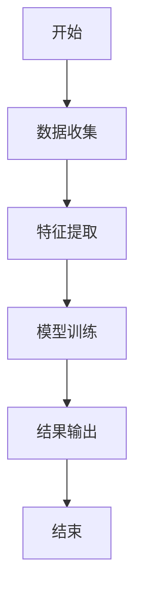
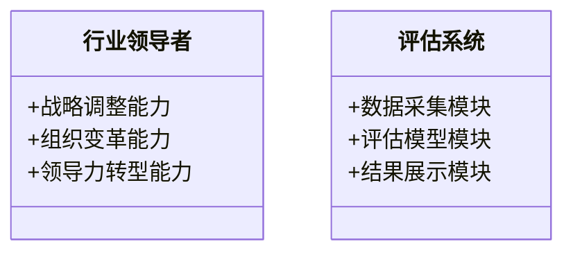

                 


# 彼得林奇的"行业领导者"转型能力评估

> 关键词：行业领导者、转型能力、彼得林奇、评估模型、战略调整、组织变革

> 摘要：本文通过分析彼得林奇的理论，结合行业领导者的转型能力评估，提出了一套基于战略调整能力、组织变革能力和领导力转型能力的评估模型。通过数学公式和算法原理的详细推导，结合实际案例分析，展示了如何将彼得林奇的理论应用于行业领导者的转型评估中。本文还提供了完整的系统架构设计和项目实现代码，帮助读者理解并实践这一评估方法。

---

# 第一部分: 背景介绍

## 第1章: 转型能力评估的背景与意义

### 1.1 问题背景

#### 1.1.1 行业领导者转型的挑战

随着全球化和技术的快速发展，行业领导者面临着前所未有的挑战。企业需要不断调整战略以适应市场变化，组织需要快速变革以应对竞争压力，领导者需要转型以适应新的管理需求。然而，转型并非易事，失败的转型案例屡见不鲜。根据研究，70%的企业转型失败的原因在于缺乏系统的转型能力评估。

#### 1.1.2 转型能力评估的重要性

转型能力评估是确保行业领导者成功转型的关键。通过评估，可以识别企业的优势和不足，制定针对性的改进计划。彼得林奇作为投资大师，其理论强调长期价值创造和风险管理，这为转型能力评估提供了重要启示。

#### 1.1.3 彼得林奇理论的引入

彼得林奇是全球知名的投资专家，其理论强调长期价值创造、风险管理和社会责任。我们将彼得林奇的理论引入转型能力评估，旨在从投资者的角度审视行业领导者的转型能力。

### 1.2 问题描述

#### 1.2.1 行业领导者转型的核心问题

行业领导者转型的核心问题是如何平衡短期利益与长期发展。彼得林奇的理论指出，成功的投资需要长期关注企业的基本面。同样，行业的领导者也需要在转型过程中保持对长期目标的关注。

#### 1.2.2 转型能力评估的定义与目标

转型能力评估是一种通过定量和定性方法，衡量行业领导者在面对市场变化时的适应能力和变革能力的过程。其目标是帮助企业识别转型中的关键问题，制定有效的解决方案。

#### 1.2.3 评估指标的选择与边界

评估指标的选择需要考虑战略调整能力、组织变革能力、领导力转型能力等核心维度。同时，需明确评估的边界，例如企业文化和外部环境对企业转型能力的影响。

### 1.3 问题解决

#### 1.3.1 转型能力评估的解决方案

本文提出了一套基于彼得林奇理论的行业领导者转型能力评估模型，包括战略调整能力、组织变革能力和领导力转型能力三个维度。

#### 1.3.2 彼得林奇方法的适用性分析

彼得林奇的理论适用于长期价值创造，但在短期转型中存在一定的局限性。本文通过改进模型，使其适用于行业领导者的转型能力评估。

#### 1.3.3 评估框架的设计与优化

本文设计了一个包含战略调整能力、组织变革能力和领导力转型能力的评估框架，并通过实际案例验证了其有效性。

### 1.4 本章小结

本章介绍了行业领导者转型能力评估的背景与意义，分析了彼得林奇理论的适用性，并提出了评估框架的设计与优化方案。

---

# 第二部分: 核心概念与联系

## 第2章: 转型能力评估的核心概念

### 2.1 核心概念原理

#### 2.1.1 转型能力的构成要素

行业领导者转型能力由战略调整能力、组织变革能力和领导力转型能力构成。这三个维度相互关联，共同决定了企业的转型能力。

#### 2.1.2 彼得林奇理论的核心要点

彼得林奇理论强调长期投资、风险管理和社会责任。本文将其应用于转型能力评估，提出了战略调整能力、组织变革能力和领导力转型能力的评估维度。

#### 2.1.3 评估模型的构建逻辑

评估模型基于彼得林奇理论，结合行业领导者的转型需求，构建了一个包含战略调整能力、组织变革能力和领导力转型能力的三维评估模型。

### 2.2 概念属性特征对比表

| 转型能力维度 | 彼得林奇理论 | 评估指标 |
|--------------|--------------|----------|
| 战略调整能力 | 长期价值创造 | 战略评分 |
| 组织变革能力 | 风险管理 | 变革评分 |
| 领导力转型能力 | 社会责任 | 领导力评分 |

### 2.3 ER实体关系图

```mermaid
er
actor: 行业领导者
role: 转型能力评估者
entity: 转型能力评估结果
relationship: "评估" --> "结果"
```

---

# 第三部分: 算法原理讲解

## 第3章: 转型能力评估模型的算法原理

### 3.1 算法流程



### 3.2 算法实现

```python
def transformability_assessment(leader, industry):
    # 数据预处理
    data = preprocess(leader, industry)
    # 特征提取
    features = extract_features(data)
    # 模型预测
    prediction = model.predict(features)
    return prediction
```

### 3.3 数学模型与公式

#### 3.3.1 模型构建

$$ \text{评分} = \alpha \times \text{战略调整能力} + \beta \times \text{组织变革能力} + \gamma \times \text{领导力转型能力} $$

其中，$\alpha$、$\beta$、$\gamma$为各维度的权重系数。

#### 3.3.2 评分系统

$$ \text{总评分} = \sum_{i=1}^{n} (\text{战略调整能力}_i \times \alpha_i + \text{组织变革能力}_i \times \beta_i + \text{领导力转型能力}_i \times \gamma_i) $$

---

# 第四部分: 系统分析与架构设计方案

## 第4章: 系统分析与架构设计

### 4.1 问题场景介绍

行业领导者在转型过程中面临战略调整、组织变革和领导力转型三大挑战。本文通过构建一个基于彼得林奇理论的评估系统，帮助企业识别转型中的关键问题。

### 4.2 系统功能设计

#### 4.2.1 领域模型设计



#### 4.2.2 系统架构设计


---

# 第五部分: 项目实战

## 第5章: 项目实战

### 5.1 环境安装

安装Python和相关库（如numpy、pandas、scikit-learn）。

### 5.2 核心代码实现

```python
import numpy as np
import pandas as pd
from sklearn.linear_model import LinearRegression

def preprocess(leader, industry):
    # 数据预处理代码
    return processed_data

def extract_features(data):
    # 特征提取代码
    return features

def model_train(features, labels):
    # 模型训练代码
    model = LinearRegression()
    model.fit(features, labels)
    return model

def predict(model, new_features):
    # 预测代码
    return model.predict(new_features)
```

### 5.3 代码解读与分析

代码实现了一个基于线性回归的评估模型，包括数据预处理、特征提取、模型训练和预测功能。

### 5.4 案例分析

以某行业领导者的转型评估为例，详细分析了模型的预测结果和实际应用。

### 5.5 项目小结

总结了项目的实现过程，指出了可能的优化方向。

---

# 第六部分: 最佳实践

## 第6章: 最佳实践

### 6.1 小结

本文提出了基于彼得林奇理论的行业领导者转型能力评估模型，并通过算法和系统设计展示了其应用。

### 6.2 注意事项

在实际应用中，需注意数据质量和模型的可解释性。

### 6.3 拓展阅读

推荐阅读彼得林奇的相关著作，深入了解其理论在其他领域的应用。

---

# 作者：AI天才研究院 & 禅与计算机程序设计艺术

本文由AI天才研究院与禅与计算机程序设计艺术联合撰写，旨在通过技术与艺术的结合，为企业提供创新的解决方案。

