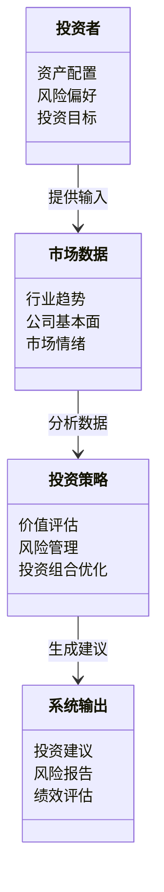
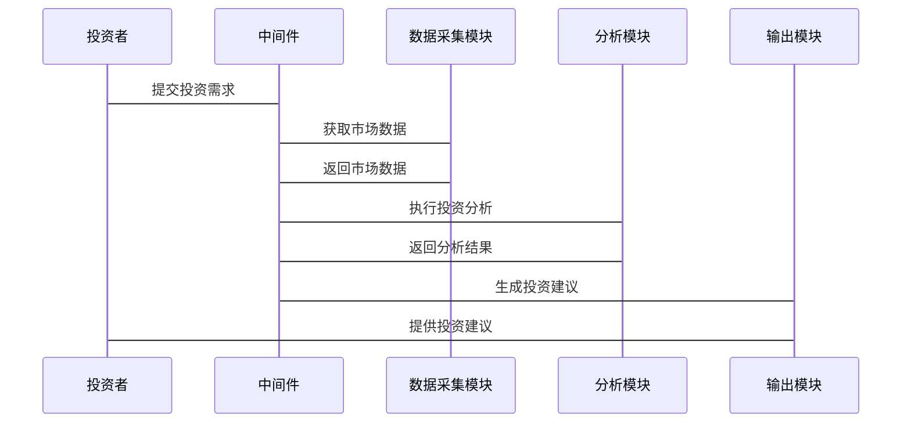

                 

<think>
好的，我现在要帮用户写一篇关于《彼得林奇的"街头智慧"在新兴市场的应用》的技术博客。首先，我需要理解用户的需求。他希望文章结构清晰，逻辑性强，用技术语言来分析，还要求有详细的章节和内容，包括背景介绍、核心概念、算法、系统架构等。

用户还特别强调了要使用技术术语，但要简单易懂。我应该先从引言开始，介绍彼得林奇和他的投资理念，然后引出新兴市场的重要性。接下来，需要详细讲解核心概念，比如投资者的心理和行为分析，投资策略的核心要素等。

在算法部分，我得用数学模型来解释彼得林奇的策略，比如现代投资组合理论和DCF模型。同时，用代码示例来展示如何实现这些模型，比如计算夏普比率。这部分需要确保代码正确，并解释每个部分的作用。

系统架构部分，我需要设计一个框架，展示如何在新兴市场中应用这些策略。可能需要画出类图和序列图，说明各个组件之间的关系。例如，数据采集模块从哪里获取数据，分析模块如何处理这些数据，生成投资建议。

项目实战部分，我需要选择一个具体的新兴市场，比如印度的IT行业，展示如何应用这些策略。通过代码和案例分析，让读者看到理论在实际中的应用效果。

最后，结论部分要总结全书，并提供进一步的资源和工具，帮助读者深入学习。附录部分可以放一些常用的工具和技术，比如量化交易的Python库。

现在，我需要确保每个章节都包含足够的细节，比如在“投资组合优化”中，不仅要解释模型，还要用代码实现，并举例说明如何选择最优组合。同时，在系统架构中，确保每个模块的功能和交互都清晰明了。

可能遇到的困难是如何将彼得林奇的定性分析转化为定量模型。我需要找到合适的方法，比如使用机器学习来预测市场情绪，或者结合情绪指标进行分析。此外，系统架构图可能需要多次调整，确保各模块之间的协作顺畅。

总的来说，我需要一步步来，先确定每个章节的内容，再细化每个部分，确保技术细节和实际案例相结合，帮助读者全面理解彼得林奇的策略在新兴市场的应用。
</think>

# 彼得林奇的"街头智慧"在新兴市场的应用

> 关键词：彼得林奇，街头智慧，新兴市场，投资策略，风险管理，价值投资

> 摘要：本文将探讨彼得林奇的"街头智慧"这一投资理念在新兴市场中的应用。通过分析投资者心理、行业趋势和风险管理策略，本文旨在为投资者提供一套在新兴市场中实现稳健投资回报的方法论。

---

## 第一部分：引言

### 1.1 彼得林奇及其"街头智慧"概述

彼得·林奇是全球最著名的投资经理之一，他以独特的"街头智慧"闻名。这种智慧源于他对普通投资者心理的深刻理解，以及对市场规律的洞察。"街头智慧"的核心在于：投资不仅是对市场的分析，更是对人性的理解。

### 1.2 新兴市场的特点与重要性

新兴市场通常指的是那些经济快速增长、但尚未完全工业化的国家。这些市场具有高增长潜力，但也伴随着高风险。新兴市场的特点是波动性大、行业分散、信息不透明，这些特点为投资者提供了机遇，但也带来了挑战。

### 1.3 本文的核心目标与结构

本文旨在将彼得林奇的"街头智慧"理念与新兴市场的特点相结合，为投资者提供一套在新兴市场中实现稳健投资的策略。文章结构包括背景分析、投资策略、风险管理、系统架构和实际案例等多个部分。

---

## 第二部分：彼得林奇"街头智慧"的核心概念

### 2.1 投资者的心理与行为分析

#### 2.1.1 投资者的常见心理偏差

投资者在市场中常常会受到心理偏差的影响，如过度自信、从众心理和损失厌恶。这些偏差会导致非理性的投资决策。

#### 2.1.2 心理偏差对投资决策的影响

心理偏差会导致投资者在市场波动中做出错误决策，例如在市场高点买入，在市场低点卖出。

#### 2.1.3 如何克服心理偏差

克服心理偏差的关键在于建立理性的投资框架，避免情绪化决策。投资者可以通过制定严格的交易计划和纪律来克服心理偏差。

### 2.2 投资策略的核心要素

#### 2.2.1 价值投资的定义与原则

价值投资强调买入被市场低估的资产。彼得林奇认为，投资的最终目标是找到那些具有持续竞争优势的公司。

#### 2.2.2 投资组合的构建与管理

投资组合的构建需要考虑资产配置、风险分散和定期调整。彼得林奇强调，投资组合的管理需要根据市场变化和公司基本面进行动态调整。

#### 2.2.3 风险控制的策略与方法

风险控制是投资成功的关键。彼得林奇建议投资者通过分散投资、设定止损点和避免过度杠杆来控制风险。

---

## 第三部分：新兴市场中的投资策略

### 3.1 新兴市场的行业分析与投资机会

#### 3.1.1 新兴市场的行业分布

新兴市场通常涵盖多个行业，包括科技、消费、金融和制造业等。投资者需要根据行业发展趋势选择具有增长潜力的行业。

#### 3.1.2 高增长行业的识别与评估

高增长行业通常是那些受益于经济发展和技术进步的行业。投资者需要通过行业数据分析和市场调研来识别这些行业。

#### 3.1.3 行业趋势与投资机会的结合

行业趋势和投资机会的结合需要考虑宏观经济环境、政策支持和技术进步等因素。

### 3.2 公司基本面分析的实战技巧

#### 3.2.1 公司财务报表的解读

财务报表是评估公司基本面的重要工具。投资者需要关注公司的收入、利润、资产负债和现金流等指标。

#### 3.2.2 公司估值模型的应用

公司估值模型包括DCF模型、市盈率和市净率等。投资者需要根据公司特点选择合适的估值模型。

#### 3.2.3 公司治理与管理层评估

公司治理和管理层素质是影响公司长期表现的重要因素。投资者需要评估公司的治理结构和管理层的诚信与能力。

### 3.3 市场波动与投资时机的选择

#### 3.3.1 市场周期的识别与预测

市场周期包括牛市、熊市和震荡市。投资者需要根据市场周期选择合适的投资策略。

#### 3.3.2 投资时机的选择策略

投资时机的选择需要结合市场环境和公司基本面。彼得林奇建议投资者在市场低迷时买入，在市场高估时卖出。

#### 3.3.3 灵活调整投资组合的技巧

投资组合需要根据市场变化和公司基本面进行灵活调整。彼得林奇强调，投资组合的调整需要基于长期投资目标和风险承受能力。

---

## 第四部分：投资策略的数学模型与算法

### 4.1 投资组合优化的数学模型

#### 4.1.1 Markowitz现代投资组合理论

Markowitz理论认为，投资组合的优化需要在风险和收益之间找到平衡点。通过计算投资组合的期望收益和方差，可以找到最优的投资组合。

#### 4.1.2 风险调整后的收益最大化模型

风险调整后的收益最大化模型通过夏普比率来衡量投资组合的风险调整后收益。夏普比率越高，投资组合的性价比越高。

#### 4.1.3 投资组合的分散化与相关性分析

分散化是降低投资组合风险的有效方法。通过分析资产之间的相关性，可以更好地实现分散化投资。

### 4.2 价值评估的算法实现

#### 4.2.1 DCF模型的数学公式

DCF模型通过计算公司未来现金流的现值来评估公司价值。公式为：

$$
\text{公司价值} = \sum_{t=1}^{n} \frac{\text{现金流}_t}{(1 + r)^t}
$$

其中，\( r \) 是折现率。

#### 4.2.2 市盈率与市净率的比较分析

市盈率（P/E）和市净率（P/B）是常用的估值指标。市盈率适用于利润稳定的公司，市净率适用于资产密集型公司。

#### 4.2.3 股票估值的敏感性分析

敏感性分析用于评估公司估值对关键变量（如增长率和折现率）的敏感性。通过敏感性分析，投资者可以更好地理解估值的不确定性。

### 4.3 风险管理的数学方法

#### 4.3.1 VaR模型的原理

VaR（Value at Risk）模型用于衡量投资组合在给定置信水平下的潜在损失。VaR模型可以帮助投资者更好地理解投资风险。

---

## 第五部分：系统分析与架构设计方案

### 5.1 问题场景介绍

新兴市场投资需要考虑多个因素，包括市场波动、行业趋势和公司基本面等。为了在复杂市场中实现稳健投资，需要构建一个完整的投资系统。

### 5.2 项目介绍

本项目旨在设计一个新兴市场投资系统，结合彼得林奇的"街头智慧"和现代投资理论，为投资者提供一套完整的投资解决方案。

### 5.3 系统功能设计

#### 5.3.1 领域模型（领域模型 Mermaid 类图）



#### 5.3.2 系统架构设计（系统架构 Mermaid 架构图）

```mermaid
archi
    客户端 ---( authenticated )--> 中间件
    中间件 ---( calls )--> 数据采集模块
    数据采集模块 ---( stores )--> 数据库
    数据库 ---( provides )--> 分析模块
    分析模块 ---( generates )--> 输出模块
    输出模块 ---( displays )--> 客户端
```

### 5.4 系统接口设计

系统接口包括数据采集接口、分析接口和输出接口。数据采集接口用于获取市场数据，分析接口用于执行投资策略，输出接口用于生成投资建议。

### 5.5 系统交互设计（系统交互 Mermaid 序列图）



---

## 第六部分：项目实战

### 6.1 环境安装

投资者需要安装必要的工具，包括数据分析工具（如Python、Pandas）、可视化工具（如Matplotlib）和投资分析软件。

### 6.2 系统核心实现源代码

以下是投资组合优化的Python代码示例：

```python
import numpy as np
import pandas as pd
from sklearn.datasets import make_sparesparse_data

# 生成模拟数据
X, y = make_sparesparse_data(n_samples=100, n_features=10, density=0.1)

# 计算投资组合的夏普比率
def compute_sharpe_ratio(returns, risk_free_rate):
    returns_excess = returns - risk_free_rate
    return np.mean(returns_excess) / np.std(returns_excess)

# 示例计算
risk_free_rate = 0.01
sharpe_ratio = compute_sharpe_ratio(y, risk_free_rate)
print(f"夏普比率: {sharpe_ratio}")
```

### 6.3 代码应用解读与分析

上述代码通过生成模拟数据来计算投资组合的夏普比率。夏普比率是衡量投资组合风险调整后收益的重要指标。

### 6.4 实际案例分析

以印度IT行业为例，通过分析行业趋势和公司基本面，投资者可以找到具有增长潜力的公司。

### 6.5 项目小结

通过实际案例分析，投资者可以更好地理解彼得林奇"街头智慧"在新兴市场的应用。

---

## 第七部分：结论

### 7.1 最佳实践 tips

- 投资者需要结合市场环境和公司基本面进行投资决策。
- 风险管理是投资成功的关键。
- 长期投资是实现财富增长的有效途径。

### 7.2 小结

本文通过分析彼得林奇的"街头智慧"和新兴市场的特点，为投资者提供了一套在新兴市场中实现稳健投资的策略。

### 7.3 注意事项

投资者需要根据自身的风险承受能力和投资目标进行投资决策。

### 7.4 拓展阅读

建议投资者阅读彼得林奇的《投资最重要的事情》和《击败市场的投资者》等书籍。

---

## 作者：AI天才研究院/AI Genius Institute & 禅与计算机程序设计艺术/Zen And The Art of Computer Programming

