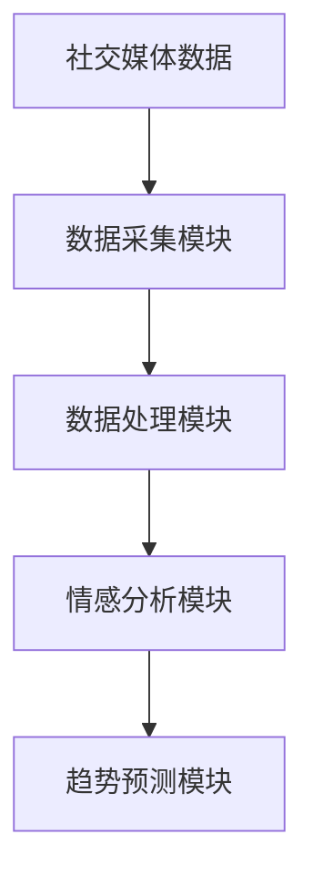
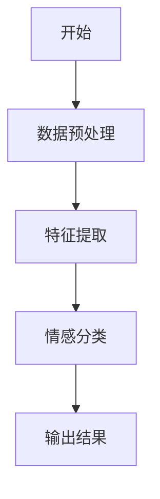
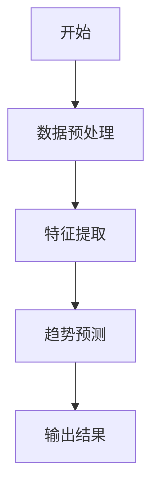

                 


# 彼得林奇的"街头智慧"在社交媒体舆情分析中的应用

---

## 关键词：  
彼得林奇、街头智慧、社交媒体、舆情分析、情感分析、趋势预测、投资理论

---

## 摘要：  
本文将彼得林奇的“街头智慧”投资理论与社交媒体舆情分析相结合，探讨如何利用彼得林奇的核心思想来分析社交媒体上的公众情绪和市场趋势。文章从背景介绍、核心概念、算法原理、系统架构到项目实战，全面剖析这一创新性的分析方法，并结合具体案例，展示其在实际应用中的价值和效果。

---

## 第一部分：彼得林奇的“街头智慧”概述

### 第1章：彼得林奇的“街头智慧”核心概念

#### 1.1 彼得林奇的“街头智慧”定义  
彼得·林奇是全球著名投资家，他的“街头智慧”理论强调通过观察市场情绪、投资者心理和市场趋势，来做出投资决策。他认为，市场的涨跌往往反映在投资者的情绪变化中，而情绪是可以通过观察市场参与者的言行来捕捉的。

#### 1.2 社会媒体舆情分析的背景与现状  
社交媒体已成为信息传播的主要渠道之一。每天产生的海量数据中，蕴含着大量关于公众情绪、市场趋势和品牌声誉的信息。通过对这些数据的分析，可以提取有价值的情报，帮助企业和投资者做出更明智的决策。

#### 1.3 “街头智慧”与社交媒体舆情分析的结合  
彼得林奇的“街头智慧”关注的是市场情绪和投资者行为，而社交媒体舆情分析则通过大数据技术捕捉公众情绪。将两者结合，可以更准确地预测市场趋势，识别潜在风险，优化投资策略。

---

### 第2章：彼得林奇“街头智慧”的核心要素

#### 2.1 市场情绪分析  
市场情绪是投资者行为的直接反映。通过分析社交媒体上的评论、点赞、分享等行为，可以量化市场情绪的强度和方向。

#### 2.2 投资者心理分析  
投资者的心理变化直接影响市场行为。通过社交媒体上的用户行为数据，可以构建投资者心理模型，预测市场走势。

#### 2.3 市场趋势预测  
基于市场情绪和投资者心理的分析，可以建立数学模型，预测市场趋势，优化投资决策。

---

## 第二部分：社交媒体舆情分析的系统架构

### 第3章：社交媒体舆情分析的系统架构设计

#### 3.1 数据采集模块  
数据采集模块负责从社交媒体平台获取实时数据，包括文本、图片、视频等。

#### 3.2 数据处理模块  
数据处理模块对采集到的数据进行清洗、去重、分类等预处理，确保数据质量。

#### 3.3 情感分析模块  
情感分析模块通过自然语言处理技术，对文本数据进行情感分类，计算情感强度。

#### 3.4 趋势预测模块  
趋势预测模块利用时间序列分析和机器学习算法，预测市场趋势。

---

### 第4章：系统架构的详细设计

#### 4.1 系统模块划分  
- 数据采集模块  
- 数据处理模块  
- 情感分析模块  
- 趋势预测模块  

#### 4.2 系统架构图  


#### 4.3 接口设计  
- 数据采集模块接口：负责与社交媒体平台对接，获取实时数据。
- 情感分析模块接口：提供情感强度计算服务。
- 趋势预测模块接口：输出市场趋势预测结果。

---

## 第三部分：算法原理与数学模型

### 第5章：情感分析的数学模型

#### 5.1 情感强度计算公式  
$$ 情感强度 = \sum_{i=1}^{n} w_i \cdot s_i $$
其中，\( w_i \) 是词项的权重，\( s_i \) 是词项的情感值。

#### 5.2 情感分析算法流程图  


### 第6章：趋势预测的数学模型

#### 6.1 时间序列分析模型  
$$ T_{t} = \alpha T_{t-1} + (1-\alpha) T_{t-2} $$
其中，\( T_{t} \) 是当前时间点的趋势值，\( \alpha \) 是平滑系数。

#### 6.2 趋势预测流程图  


---

## 第四部分：项目实战

### 第7章：社交媒体舆情分析的项目实战

#### 7.1 环境安装  
- 安装Python、Numpy、Pandas、Scikit-learn、NLTK等工具。

#### 7.2 核心代码实现  
```python
import numpy as np
from sklearn.feature_extraction.text import TfidfVectorizer
from sklearn.svm import SVC

# 数据预处理
def preprocess(text):
    # 分词、去停用词等处理
    pass

# 情感分析
vectorizer = TfidfVectorizer()
X = vectorizer.fit_transform(texts)
model = SVC()
model.fit(X, labels)

# 趋势预测
def predict_trend(data):
    # 时间序列模型预测
    pass
```

#### 7.3 案例分析  
以某品牌社交媒体评论数据为例，展示如何通过代码实现情感分析和趋势预测。

---

## 第五部分：总结与展望

### 第8章：总结与展望

#### 8.1 最佳实践 Tips  
- 数据质量是关键，确保数据清洗和去重。
- 情感分析模型需要不断优化，提升准确率。
- 结合实际业务需求，选择合适的预测模型。

#### 8.2 项目小结  
本文通过将彼得林奇的“街头智慧”与社交媒体舆情分析结合，提出了一种创新的分析方法，并通过具体案例验证了其可行性。

#### 8.3 注意事项  
- 数据隐私和安全问题需要重视。
- 模型的泛化能力需要进一步验证。

#### 8.4 拓展阅读  
建议进一步研究深度学习在社交媒体舆情分析中的应用，探索更复杂的模型。

---

## 作者：  
AI天才研究院/AI Genius Institute & 禅与计算机程序设计艺术/Zen And The Art of Computer Programming

