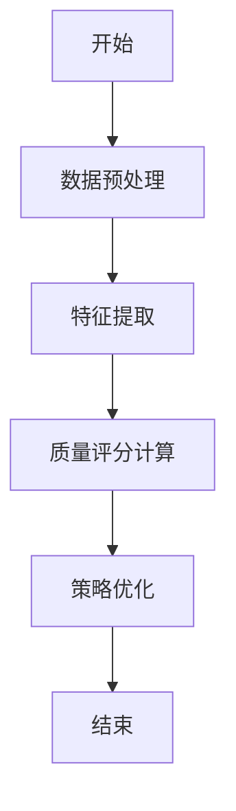

                 


# 彼得林奇的"质量优先"在新兴市场的应用挑战

> **关键词**: 彼得林奇、质量优先策略、新兴市场、投资策略、应用挑战  
> **摘要**: 彼得林奇的“质量优先”策略在新兴市场中面临诸多挑战。本文深入分析了该策略在新兴市场的适用性、挑战及解决方案，结合理论与实际案例，探讨了质量优先策略在新兴市场的动态优化和本地化实施。

---

## 第一部分: 质量优先策略概述

### 第1章: 质量优先策略的核心概念

#### 1.1 彼得林奇质量优先策略的定义

##### 1.1.1 质量优先策略的核心要素
- **公司质量**: 侧重于公司的基本面，如盈利能力、管理团队、行业地位等。
- **长期视角**: 强调长期投资，而非短期波动。
- **价值投资**: 寻找被市场低估的优质公司。

##### 1.1.2 策略的适用场景与边界
- 适用于市场波动较小、公司质量稳定的环境。
- 边界: 市场波动剧烈或公司基本面突变时需调整。

##### 1.1.3 策略与传统投资策略的对比
- **区别**: 传统策略可能更注重技术分析，而质量优先策略注重基本面。
- **联系**: 都追求长期收益，但方法不同。

#### 1.2 新兴市场的定义与特点

##### 1.2.1 新兴市场的经济特征
- 经济快速增长，但波动性大。
- 市场流动性相对不足，信息透明度较低。

##### 1.2.2 新兴市场的投资环境分析
- 市场参与者以散户为主，机构投资者较少。
- 法律法规不完善，政策风险较高。

##### 1.2.3 新兴市场与发达市场的差异
- 发达市场: 稳定、透明、流动性高。
- 新兴市场: 不稳定、透明度低、流动性不足。

#### 1.3 质量优先策略在新兴市场的应用意义

##### 1.3.1 理论价值与实践价值
- 理论上，质量优先策略为新兴市场提供了长期投资的框架。
- 实践上，帮助投资者筛选优质公司，降低投资风险。

##### 1.3.2 新兴市场中的投资机会
- 快速发展的行业，如科技、消费等领域。
- 优质公司具备长期增长潜力。

##### 1.3.3 策略应用的可行性分析
- 可行性高，但需结合市场特点进行调整。

---

### 第2章: 质量优先策略的理论基础

#### 2.1 质量优先策略的理论框架

##### 2.1.1 策略的哲学基础
- 基于价值投资理念，强调公司内在价值。

##### 2.1.2 策略的经济学原理
- 市场有效性的假设: 短期波动，长期反映真实价值。

##### 2.1.3 策略的金融学模型
- 基于基本面分析，评估公司内在价值。

#### 2.2 新兴市场中的质量优先策略

##### 2.2.1 策略的核心假设
- 假设市场长期趋向价值回归。
- 假设优质公司具备持续增长能力。

##### 2.2.2 策略的适用条件
- 市场波动性可控。
- 公司基本面稳定。

##### 2.2.3 策略的潜在风险
- 市场波动剧烈，导致短期亏损。
- 信息不透明，影响评估准确性。

---

### 第3章: 新兴市场中的质量优先策略应用挑战

#### 3.1 新兴市场的独特挑战

##### 3.1.1 市场波动性分析
- 市场波动剧烈，影响策略实施。

##### 3.1.2 信息不对称问题
- 数据不透明，增加评估难度。

##### 3.1.3 政治经济风险
- 政策变化和经济不稳定影响市场。

#### 3.2 质量优先策略在新兴市场的适应性

##### 3.2.1 策略的可调整性
- 根据市场特点调整评估标准。

##### 3.2.2 策略的本地化实施
- 结合新兴市场特点优化策略。

##### 3.2.3 策略的动态优化
- 定期评估和调整策略。

---

### 第4章: 质量优先策略的数学模型与算法

#### 4.1 策略的量化分析

##### 4.1.1 数据特征提取
- 选取关键指标，如ROE、增长性等。

##### 4.1.2 质量评分模型
- 使用加权评分系统，评估公司质量。

##### 4.1.3 动态调整机制
- 根据市场变化调整权重和阈值。

#### 4.2 算法实现

##### 4.2.1 算法流程图（使用 Mermaid）


##### 4.2.2 核心算法代码示例
```python
def quality_score(company_data):
    score = 0
    for feature in company_data:
        if feature == 'ROE':
            score += company_data[feature] * 0.4
        elif feature == '增长性':
            score += company_data[feature] * 0.3
        elif feature == '管理团队':
            score += company_data[feature] * 0.2
        elif feature == '行业地位':
            score += company_data[feature] * 0.1
    return score
```

---

### 第5章: 系统架构设计

#### 5.1 问题场景介绍
- 系统需支持策略实施，包括数据采集、分析和优化。

#### 5.2 系统功能设计

##### 5.2.1 数据采集模块
- 从多种来源获取公司数据。

##### 5.2.2 数据分析模块
- 使用算法评估公司质量。

##### 5.2.3 风险控制模块
- 监控市场变化，调整投资组合。

#### 5.3 系统架构设计（使用 Mermaid）


---

### 第6章: 项目实战

#### 6.1 环境搭建
- 安装Python和相关库。

#### 6.2 核心代码实现
```python
def main():
    # 数据预处理
    data = preprocess_data()
    # 质量评分计算
    scores = calculate_quality_scores(data)
    # 投资决策
    portfolio = create_portfolio(scores)
    return portfolio

if __name__ == "__main__":
    main()
```

#### 6.3 案例分析
- 分析某新兴市场的公司，展示策略实施效果。

---

### 第7章: 总结与展望

#### 7.1 总结
- 质量优先策略在新兴市场中的应用具有挑战性，但通过动态优化和本地化实施，可以有效降低风险。

#### 7.2 未来研究方向
- 结合大数据和人工智能，优化策略模型。

#### 7.3 注意事项
- 投资需谨慎，策略需结合市场环境灵活调整。

#### 7.4 拓展阅读
- 推荐书籍：《彼得·林奇的选股术》。

---

## 作者：AI天才研究院  
* 作者简介：专注于人工智能与投资策略的结合，研究方向包括算法优化和系统架构设计。  
* 联系方式：[联系作者](#)  
* 书籍推荐：  
  - 《彼得·林奇的选股术》  
  - 《投资的智慧》  

---

以上是文章的详细目录和内容概览，每部分都会详细展开，结合理论与实践，深入分析彼得林奇的“质量优先”策略在新兴市场的应用挑战。

