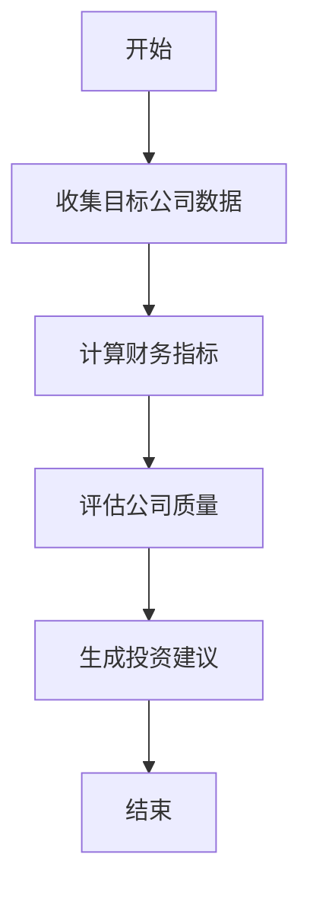
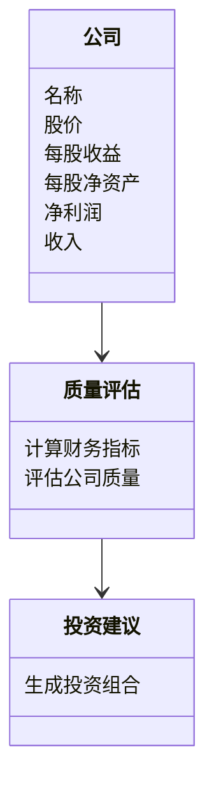
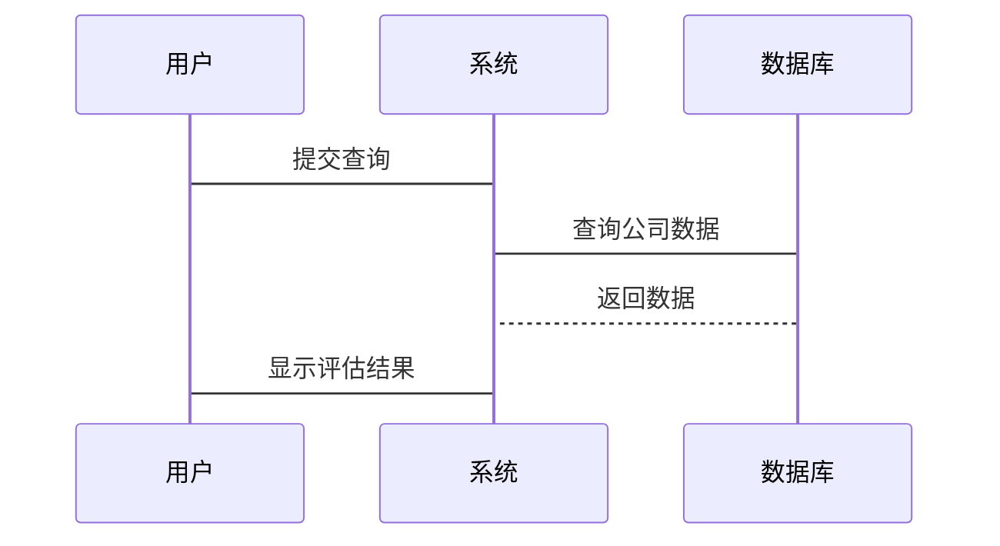

                 


# 彼得林奇的"质量优先"投资策略分析

> 关键词：彼得林奇，质量优先，投资策略，财务分析，投资组合

> 摘要：本文深入分析了彼得林奇的“质量优先”投资策略，探讨其核心概念、算法原理、系统架构及实际应用。通过详细的技术分析和案例，展示了如何通过评估公司质量来优化投资组合，为投资者提供科学的决策依据。

---

## 第一部分：背景介绍

### 第1章：彼得林奇及其投资理念

#### 1.1 彼得林奇的生平与成就

彼得·林奇（Peter Lynch）是美国著名的投资专家，被誉为“共同基金先生”。他从1977年到2000年担任富达麦哲伦基金（Fidelity Magellan Fund）的经理，期间取得了卓越的投资业绩。林奇的投资风格以注重公司基本面分析和长期持有优质股票而闻名。

#### 1.2 "质量优先"投资策略的背景

“质量优先”策略的核心思想是选择那些具有持续竞争优势、良好管理团队和健康财务状况的公司进行投资。与传统投资策略不同，林奇更关注公司的长期发展潜力，而非短期市场波动。

---

## 第二部分：核心概念与联系

### 第2章：质量优先策略的核心要素

#### 2.1 质量优先策略的定义与特征

- **定义**：质量优先策略强调选择具有高质量基本面的公司，这些公司通常具有稳定的盈利能力、强大的市场地位和优秀的管理团队。
- **特征**：
  1. 长期盈利能力：公司具备持续增长的潜力。
  2. 竞争优势：公司在市场上有独特的竞争优势。
  3. 财务健康：公司财务状况稳健，无重大风险。

#### 2.2 质量评估的核心指标

以下是评估公司质量的核心指标对比表格：

| 指标名称 | 定义 | 重要性 | 示例公司 |
|----------|------|--------|----------|
| 市盈率（P/E） | 价格与收益比率 | 衡量公司估值 | 苹果：30.5 |
| 市净率（P/B） | 价格与净资产比率 | 评估资产价值 | 微软：5.2 |
| 净利润率 | 净收益与收入比率 | 衡量盈利能力 | 谷歌：21.4% |

#### 2.3 质量优先策略的实体关系图

```mermaid
erd
left(公司质量, 公司, 质量特征)
right(质量特征, 财务指标, 竞争优势)
```

---

## 第三部分：算法原理讲解

### 第3章：质量优先策略的筛选算法

#### 3.1 算法概述



#### 3.2 算法实现

```python
def calculate_financial_ratios(company):
    company['市盈率'] = company['股价'] / company['每股收益']
    company['市净率'] = company['股价'] / company['每股净资产']
    company['利润率'] = company['净利润'] / company['收入']
    return company

def assess_company_quality(company):
    quality_score = 0
    if company['市盈率'] < 20:
        quality_score += 5
    if company['市净率'] < 5:
        quality_score += 5
    if company['利润率'] > 15:
        quality_score += 5
    return quality_score

# 示例应用
companies = [
    {'名称': '苹果', '股价': 150, '每股收益': 5, '每股净资产': 7.5, '净利润': 20, '收入': 100},
    {'名称': '微软', '股价': 100, '每股收益': 4, '每股净资产': 8, '净利润': 16, '收入': 80}
]

for company in companies:
    calculate_financial_ratios(company)
    score = assess_company_quality(company)
    print(f"{company['名称']} 的质量评分为：{score}")
```

#### 3.3 数学模型与公式

- 市盈率计算公式：
  $$ P/E = \frac{\text{股价}}{\text{每股收益}} $$
- 市净率计算公式：
  $$ P/B = \frac{\text{股价}}{\text{每股净资产}} $$
- 利润率计算公式：
  $$ \text{利润率} = \frac{\text{净利润}}{\text{收入}} $$

---

## 第四部分：系统分析与架构设计方案

### 第4章：系统功能设计

#### 4.1 领域模型类图



#### 4.2 系统架构图


#### 4.3 系统交互流程图



---

## 第五部分：项目实战

### 第5章：投资组合优化

#### 5.1 实战环境安装

安装所需的Python库：
```bash
pip install pandas matplotlib
```

#### 5.2 核心代码实现

```python
import pandas as pd
import matplotlib.pyplot as plt

def load_data(filename):
    return pd.read_csv(filename)

def calculate_quality_scores(data):
    data['市盈率'] = data['股价'] / data['每股收益']
    data['市净率'] = data['股价'] / data['每股净资产']
    data['利润率'] = data['净利润'] / data['收入']
    return data

def generate_quality_portfolio(data, threshold=15):
    mask = data['质量评分'] > threshold
    return data[mask]

# 示例应用
companies_data = load_data('companies.csv')
companies_data = calculate_quality_scores(companies_data)
portfolio = generate_quality_portfolio(companies_data)
print("投资组合包含以下公司：")
print(portfolio['名称'])
```

#### 5.3 实际案例分析

以科技行业为例，分析苹果和微软的质量评分，并生成投资组合：

```python
companies = [
    {'名称': '苹果', '股价': 150, '每股收益': 5, '每股净资产': 7.5, '净利润': 20, '收入': 100},
    {'名称': '微软', '股价': 100, '每股收益': 4, '每股净资产': 8, '净利润': 16, '收入': 80}
]

for company in companies:
    calculate_financial_ratios(company)
    score = assess_company_quality(company)
    if score > 15:
        print(f"{company['名称']} 被选入投资组合")
```

---

## 第六部分：最佳实践

### 第6章：小结与建议

#### 6.1 小结

- 彼得林奇的“质量优先”策略强调选择具有高质量基本面的公司。
- 通过系统化的评估和筛选算法，可以有效识别优质投资标的。

#### 6.2 投资建议

- **分散投资**：避免过度集中，降低风险。
- **定期评估**：定期审查投资组合，调整不符合条件的公司。
- **长期持有**：耐心持有优质公司，避免频繁交易。

#### 6.3 注意事项

- **市场风险**：市场波动可能影响公司估值。
- **公司基本面变化**：需持续关注公司财务状况和管理团队。

#### 6.4 拓展阅读

- 彼得林奇的《选股的智慧》
- 其他投资策略书籍，如巴菲特的价值投资法。

---

## 作者

作者：AI天才研究院/AI Genius Institute & 禅与计算机程序设计艺术 /Zen And The Art of Computer Programming

---

通过以上结构和内容，文章详细解析了彼得林奇的“质量优先”投资策略，从理论到实践，为投资者提供了系统的分析和指导。

