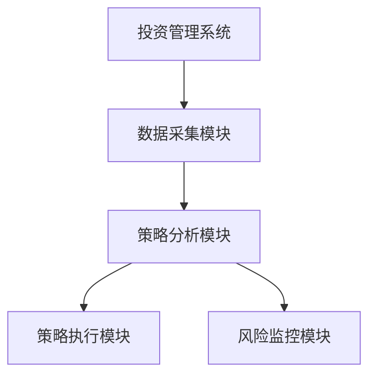

                 


# 彼得林奇的"质量成长"vs"价值重估"在新经济中的平衡

> 关键词：彼得林奇，质量成长，价值重估，投资策略，新经济，平衡策略

> 摘要：本文深入探讨了彼得林奇提出的“质量成长”与“价值重估”两种投资策略在新经济环境下的应用与平衡。通过分析两种策略的核心概念、理论基础、数学模型及实际案例，结合系统架构与项目实战，揭示了在当前数字经济时代如何有效结合这两种策略以实现投资目标的方法。

---

## 第一部分：引言

### 第1章：彼得林奇的投资理念概述

#### 1.1 彼得林奇的投资哲学

彼得·林奇（Peter Lynch）是全球最著名的职业基金经理之一，以其独特的投资策略和长期的投资业绩而闻名。他的投资哲学主要围绕“质量成长”和“价值重估”两种策略展开。

- **质量成长**：关注具有持续增长潜力的企业，尤其是那些在行业内具有竞争优势、市场地位稳固且财务状况健康的公司。这种策略注重企业的基本面，而非市场的短期波动。
  
- **价值重估**：寻找市场价格低于其内在价值的企业，尤其是那些因为市场情绪或短期因素被低估的公司。这种策略更关注市场的估值偏差，试图通过逆向投资来获利。

彼得林奇认为，成功的投资需要在这两种策略之间找到平衡点，特别是在新经济环境下，这种平衡尤为重要。

---

### 第2章：质量成长与价值重估的背景分析

#### 2.1 新经济环境下的投资挑战

新经济的崛起，尤其是数字经济的快速发展，为投资带来了新的机遇和挑战。以下是新经济环境下的关键变化：

- **技术驱动**：科技企业的崛起使得技术壁垒和创新能力成为企业价值的重要决定因素。
- **市场波动**：新经济企业的估值往往受到市场情绪和短期因素的影响，导致价格与价值的偏离。
- **投资者行为**：机构投资者和个人投资者的行为模式发生变化，短期交易和高频交易增多。

在这样的环境下，传统的投资策略需要进行调整，以适应新经济的特点。

---

### 第3章：质量成长与价值重估的理论基础

#### 3.1 质量成长投资的核心要素

质量成长策略的核心在于寻找那些具有可持续增长潜力的企业。以下是其核心要素：

- **企业基本面**：包括收入增长、利润率、资产负债表健康状况等。
- **市场地位**：企业在行业内的竞争地位，包括市场份额、品牌影响力等。
- **技术创新**：企业是否具备持续的技术创新能力，以保持竞争优势。

#### 3.2 价值重估投资的核心要素

价值重估策略的核心在于寻找市场价格低于内在价值的企业。以下是其核心要素：

- **估值指标**：包括市盈率（P/E）、市净率（P/B）、EV/EBITDA等。
- **市场情绪**：市场参与者的行为和情绪对估值的影响。
- **潜在价值**：企业是否具备被低估的潜力，尤其是在行业周期性低谷时。

---

## 第二部分：新经济环境下的投资策略平衡

### 第4章：质量成长与价值重估的平衡策略

#### 4.1 平衡策略的理论基础

在新经济环境下，投资策略的平衡至关重要。以下是平衡策略的关键点：

- **动态调整**：根据市场环境的变化，动态调整投资组合中质量成长和价值重估策略的比例。
- **风险控制**：通过分散投资和风险对冲，降低单一策略带来的风险。
- **长期视角**：虽然新经济环境波动较大，但长期投资仍需关注企业的基本面和可持续增长潜力。

#### 4.2 平衡策略的数学模型

为了量化质量成长和价值重估策略的平衡，我们可以构建一个简单的数学模型。假设投资组合中，质量成长策略和价值重估策略的比例分别为\( x \)和\( y \)，且\( x + y = 1 \)。

- 质量成长策略的预期收益：\( R_g = r_g \cdot x \)
- 价值重估策略的预期收益：\( R_v = r_v \cdot y \)

其中，\( r_g \)和\( r_v \)分别为质量成长和价值重估策略的预期收益率。

通过优化模型，可以找到\( x \)和\( y \)的最优组合，以最大化投资组合的预期收益。

---

### 第5章：系统架构与项目实战

#### 5.1 系统架构设计

为了实现质量成长与价值重估策略的平衡，我们可以设计一个投资管理系统，包括以下几个模块：

- **数据采集**：收集企业的财务数据、市场数据等。
- **策略分析**：计算质量成长和价值重估的指标。
- **策略执行**：根据分析结果，动态调整投资组合。
- **风险监控**：实时监控投资组合的风险指标。

系统架构图如下：



---

### 第6章：项目实战与案例分析

#### 6.1 环境配置与数据准备

假设我们选择一个新经济领域的行业（例如科技行业），我们需要收集以下数据：

- 企业的财务数据（收入、利润、资产负债表等）。
- 市场数据（股价、市盈率、市净率等）。
- 行业竞争数据（市场份额、品牌影响力等）。

#### 6.2 核心代码实现

以下是实现质量成长与价值重估策略平衡的Python代码示例：

```python
import pandas as pd
import numpy as np

# 数据准备
data = pd.DataFrame({
    '企业名称': ['公司A', '公司B', '公司C'],
    '收入': [100, 200, 150],
    '利润': [20, 30, 25],
    '市盈率': [15, 20, 18]
})

# 计算质量成长评分（示例）
data['质量成长评分'] = (data['收入'] / data['收入'].max()) * 0.5 + (data['利润'] / data['利润'].max()) * 0.5

# 计算价值重估评分（示例）
data['价值重估评分'] = (data['市盈率'] / data['市盈率'].min()) * 0.5 + (data['收入'] / data['收入'].max()) * 0.5

# 确定投资比例
data['投资比例'] = (data['质量成长评分'] + data['价值重估评分']) / 2
```

---

### 第7章：总结与展望

#### 7.1 总结

在新经济环境下，彼得林奇的“质量成长”与“价值重估”策略的平衡至关重要。通过理论分析、数学建模和系统设计，我们可以更好地应对市场的波动和变化。

#### 7.2 展望

未来，随着科技的发展和经济环境的变化，投资策略的平衡将更加复杂。我们需要不断优化模型和策略，以适应新的挑战。

---

## 附录

- **术语表**：详细解释文章中涉及的专业术语。
- **参考文献**：列出文章中引用的主要文献和资料。
- **扩展阅读**：推荐与主题相关的书籍和资源。

---

作者：AI天才研究院/AI Genius Institute & 禅与计算机程序设计艺术/Zen And The Art of Computer Programming

