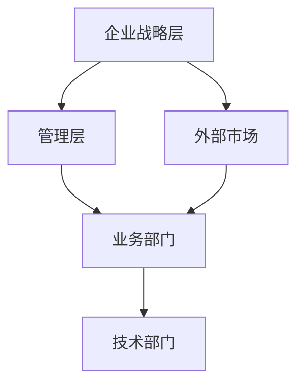

                 


# 彼得林奇的"质量成长"在传统企业转型中的应用

## 关键词：彼得·林奇、质量成长、企业转型、投资策略、数字化转型、企业架构

## 摘要

本文探讨了彼得·林奇的质量成长策略在传统企业转型中的应用。通过分析质量成长策略的核心概念，结合实际案例，展示了如何将该策略应用于企业的数字化转型和市场竞争中。文章详细阐述了质量成长的定义、特征、数学模型，并通过系统架构设计和项目实战，展示了质量成长策略如何帮助企业实现可持续增长。最后，讨论了转型中的挑战及解决方案，展望了未来的发展趋势。

---

## 第一章：引言

### 1.1 彼得·林奇与质量成长策略

#### 1.1.1 彼得·林奇的生平简介

彼得·林奇是全球著名投资经理，以其在富达投资管理公司的长期成功闻名。他倡导“质量成长”投资策略，专注于投资具有强大基本面和成长潜力的企业。

#### 1.1.2 质量成长策略的核心思想

质量成长策略强调选择那些具备强大市场地位、良好管理团队和持续盈利能力的企业。林奇认为，投资于这样的企业能够在长期实现超额收益。

#### 1.1.3 质量成长策略的哲学基础

质量成长策略基于价值投资理念，认为企业的内在价值是其未来现金流的折现值。通过深入分析企业基本面，投资者可以识别出具备长期增长潜力的优质企业。

### 1.2 传统企业转型的背景与挑战

#### 1.2.1 传统企业面临的外部环境变化

数字化转型、市场竞争加剧和技术革新使得传统企业面临巨大压力。企业必须适应快速变化的市场环境，否则将被竞争对手淘汰。

#### 1.2.2 企业转型的核心问题与痛点

传统企业在转型中常面临以下问题：缺乏清晰的战略方向、组织架构不合理、技术落后、创新能力不足等。这些问题阻碍了企业的可持续发展。

#### 1.2.3 质量成长策略在企业转型中的应用价值

质量成长策略提供了一种以企业质量为核心的投资和管理方法，帮助企业在转型中识别和投资于具备长期增长潜力的领域，实现可持续发展。

---

## 第二章：质量成长策略的核心概念与原理

### 2.1 质量成长的定义与内涵

#### 2.1.1 质量成长的定义

质量成长是指企业在保持或提升产品质量的同时，实现销售收入和利润的持续增长。这种增长不仅体现在财务数据上，还包括企业核心竞争力的提升。

#### 2.1.2 质量成长的核心要素分析

- **市场地位**：企业在市场中的占有率和品牌影响力。
- **管理团队**：领导层的愿景、战略和执行能力。
- **盈利能力**：企业的财务健康状况和盈利能力。
- **创新能力**：企业持续创新的能力和研发投入。

#### 2.1.3 质量成长与传统投资策略的对比

质量成长策略不同于传统的价值投资和成长投资，它结合了两者的优点，既关注企业的内在价值，又注重其成长潜力。

### 2.2 质量成长策略的关键特征

#### 2.2.1 高质量企业的特征分析

- **稳定的财务表现**：收入和利润持续增长，财务状况健康。
- **强大的管理团队**：领导者具备战略眼光和执行力。
- **创新能力强**：企业具备持续创新的能力和研发投入。
- **良好的市场地位**：企业在市场中具备竞争力和品牌影响力。

#### 2.2.2 质量成长的量化指标

- **市盈率（P/E）**：衡量企业股价与盈利的关系。
- **市净率（P/B）**：衡量企业股价与净资产的关系。
- **ROE（净资产收益率）**：衡量企业的盈利能力。
- **收入增长率**：衡量企业的成长潜力。

#### 2.2.3 质量成长与企业生命周期的关系

质量成长策略适用于企业生命周期的成长期和成熟期。在成长期，企业需要快速扩展市场份额；在成熟期，企业需要通过创新和优化实现持续增长。

### 2.3 质量成长策略的数学模型

#### 2.3.1 质量成长指数的计算公式

质量成长指数（QGI）是一个综合衡量企业质量成长能力的指标。其计算公式如下：

$$
QGI = \frac{收入增长率 \times 净利润率 \times 股东权益增长率}{总负债率 \times 股价波动率}
$$

#### 2.3.2 质量成长模型的验证与应用

通过历史数据分析验证质量成长模型的有效性。以某行业为例，计算其QGI指数，并与实际股价走势进行对比，验证模型的预测能力。

---

## 第三章：质量成长策略在企业转型中的应用

### 3.1 企业转型中的质量成长策略框架

#### 3.1.1 质量成长策略的总体框架

- **战略规划**：明确企业转型的目标和方向。
- **组织架构优化**：调整组织结构以支持转型。
- **技术创新**：引入新技术提升企业竞争力。
- **人才培养**：加强员工培训，提升团队能力。

#### 3.1.2 质量成长策略的实施步骤

1. 评估企业现状：分析企业的财务状况、市场地位和管理能力。
2. 确定转型目标：明确企业转型后的目标和方向。
3. 制定转型计划：包括战略规划、组织优化和技术创新等方面。
4. 实施转型计划：执行转型计划，监控进展并及时调整。
5. 评估转型效果：通过财务和非财务指标评估转型成果。

#### 3.1.3 质量成长策略的适用场景

质量成长策略适用于处于成长期和成熟期的企业，尤其适合那些希望在竞争激烈的市场中实现可持续增长的企业。

### 3.2 质量成长策略在企业战略中的应用

#### 3.2.1 企业战略的选择与优化

- **市场战略**：通过质量提升和创新产品，提高市场竞争力。
- **创新战略**：加大研发投入，推动产品和服务创新。
- **资本运作**：通过并购和投资，扩大企业规模和影响力。

#### 3.2.2 质量成长策略对企业战略的影响

质量成长策略通过优化企业战略，提升企业的核心竞争力，实现可持续增长。

#### 3.2.3 案例分析：某传统企业通过质量成长策略实现战略转型

以某传统制造企业为例，通过实施质量成长策略，企业实现了从传统制造向高端制造的转型，成功提升了市场地位和盈利能力。

---

## 第四章：系统分析与架构设计方案

### 4.1 系统分析

#### 4.1.1 问题场景介绍

企业转型过程中，需要构建一个支持质量成长的系统架构，以实现企业内部管理和外部市场的高效对接。

#### 4.1.2 系统功能设计

- **领域模型设计**：通过Mermaid类图展示企业各部门的功能模块及其相互关系。
- **系统架构设计**：通过Mermaid架构图展示系统的整体架构和模块划分。

### 4.2 系统架构设计

#### 4.2.1 系统架构图



#### 4.2.2 系统接口设计

- **内部接口**：企业内部各部门之间的数据接口。
- **外部接口**：与供应商、客户和合作伙伴的接口。

#### 4.2.3 系统交互设计

通过Mermaid序列图展示系统内部的交互流程，例如企业战略层与管理层的交互、管理层与业务部门的交互等。

---

## 第五章：项目实战

### 5.1 环境安装

详细说明如何安装和配置所需的开发环境，包括操作系统、编程语言、数据库等。

### 5.2 核心代码实现

#### 5.2.1 代码实现

以下是实现质量成长指数计算的Python代码：

```python
def calculate_qgi(revenue_growth, net_profit_margin, equity_growth, debt_ratio, stock_volatility):
    qgi = (revenue_growth * net_profit_margin * equity_growth) / (debt_ratio * stock_volatility)
    return qgi

# 示例数据
revenue_growth = 0.15  # 收入增长率15%
net_profit_margin = 0.2  # 净利润率20%
equity_growth = 0.1  # 股东权益增长率10%
debt_ratio = 0.3  # 总负债率30%
stock_volatility = 0.2  # 股价波动率20%

qgi = calculate_qgi(revenue_growth, net_profit_margin, equity_growth, debt_ratio, stock_volatility)
print(f"质量成长指数：{qgi}")
```

#### 5.2.2 代码解读与分析

解释上述代码的实现逻辑，说明每个参数的意义和计算公式。

### 5.3 实际案例分析

通过具体案例分析，展示质量成长策略在实际项目中的应用效果和成果。

---

## 第六章：挑战与解决方案

### 6.1 质量成长策略实施中的挑战

#### 6.1.1 组织文化转型

企业内部文化是否支持质量成长策略的实施，例如员工的创新意识和团队协作能力。

#### 6.1.2 技术适配

现有技术架构是否支持质量成长策略的实施，例如数据采集、分析和决策支持系统的建设。

#### 6.1.3 数据隐私与安全

在实施质量成长策略过程中，如何确保企业数据的安全和隐私。

### 6.2 解决策略

#### 6.2.1 组织文化转型策略

- **领导力转型**：培养具有创新意识和战略眼光的领导者。
- **员工培训**：加强员工的技能培训和创新意识培养。
- **激励机制**：建立有效的激励机制，鼓励员工积极参与质量成长策略的实施。

#### 6.2.2 技术适配策略

- **技术评估**：评估现有技术架构是否支持质量成长策略的实施。
- **技术升级**：引入新技术，优化企业技术架构。
- **数据安全**：加强数据安全防护，确保企业数据的安全和隐私。

---

## 第七章：总结与展望

### 7.1 全文总结

总结全文内容，重申质量成长策略在传统企业转型中的重要性。

### 7.2 未来展望

展望质量成长策略在企业转型中的未来发展趋势，例如人工智能、大数据等技术的进一步应用。

---

## 作者：AI天才研究院/AI Genius Institute & 禅与计算机程序设计艺术 /Zen And The Art of Computer Programming

