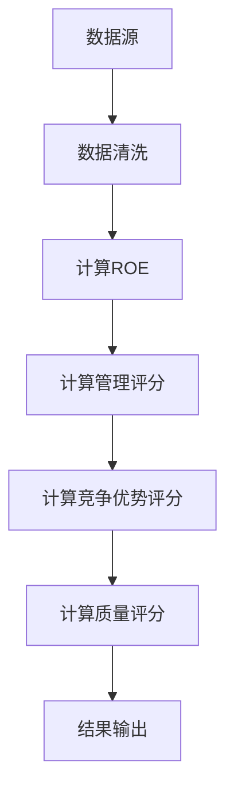
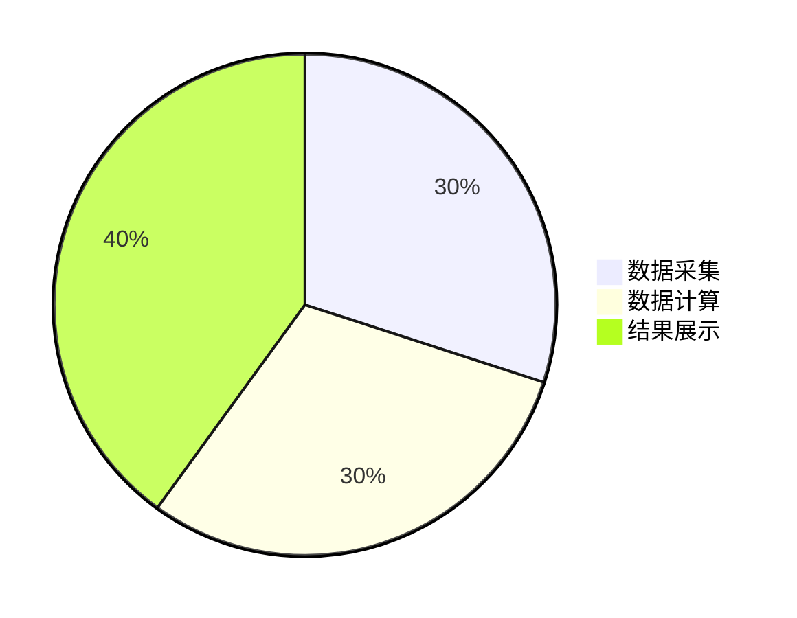

                 


# 彼得林奇的"质量成长"在新经济公司中的应用

> 关键词：彼得林奇，质量成长，新经济公司，投资策略，系统架构，算法模型

> 摘要：本文深入探讨了彼得林奇的“质量成长”投资策略在新经济公司中的应用。通过分析质量成长的核心要素、新经济公司的特点，以及结合算法和系统架构，本文详细讲解了如何在新经济环境中识别和投资优质成长型公司。文章还提供了实际案例和项目实战，帮助读者将理论应用于实践。

---

## 第一章：质量成长的定义与背景

### 1.1 投资的基本概念
投资是通过资源配置以获得未来收益的行为。质量成长策略关注的是那些具有持续增长潜力且财务健康、管理团队优秀的公司。

### 1.2 质量成长的背景
彼得林奇是著名的投资专家，他的质量成长策略强调选择那些具有竞争优势、财务稳健且管理团队优秀的公司。在新经济环境下，科技、互联网等行业的公司具有更高的增长潜力。

---

## 第二章：质量成长的核心要素

### 2.1 质量成长的核心要素
- **财务健康状况**：ROE（净资产收益率）是衡量公司财务健康的重要指标。
- **管理团队的能力**：团队的稳定性与公司的长期发展密切相关。
- **竞争优势**：公司在市场中的独特优势决定了其增长潜力。

### 2.2 新经济公司的特点
- **高增长性**：科技行业的公司通常具有快速的增长潜力。
- **创新性**：新经济公司依赖技术创新，推动业务增长。
- **依赖资本**：新经济公司的初期投入通常较高，但回报潜力巨大。

---

## 第三章：质量成长策略在新经济中的应用

### 3.1 新经济公司的投资机会
- **科技与互联网行业**：如苹果、谷歌等公司，具有强大的技术和市场优势。
- **电子商务与数字营销**：如亚马逊，通过持续创新和扩张实现增长。

### 3.2 投资策略的具体实施
- **公司筛选标准**：ROE > 15%，管理团队稳定，竞争优势明显。
- **风险控制**：定期跟踪公司财务和市场表现，及时调整投资组合。

---

## 第四章：质量成长策略的算法与数学模型

### 4.1 质量成长的数学模型
- **ROE模型**：
  $$ROE = \frac{\text{净利润}}{\text{股东权益}}$$
  该模型用于评估公司的盈利能力。

- **质量评分模型**：
  $$\text{质量评分} = 0.4 \times ROE + 0.3 \times \text{管理评分} + 0.3 \times \text{竞争优势评分}$$

### 4.2 数据流的流程图（使用mermaid）


---

## 第五章：质量成长策略的系统架构设计

### 5.1 系统分析与设计
- **系统功能需求分析**：包括数据采集、计算、分析和报告生成。
- **系统架构设计**：采用分层架构，包括数据层、计算层和应用层。

### 5.2 系统架构图（使用mermaid）


---

## 第六章：项目实战

### 6.1 环境安装
- **工具安装**：安装Python、Pandas、Matplotlib等工具。
- **数据源获取**：从公开数据库获取新经济公司的财务数据。

### 6.2 核心实现代码
```python
import pandas as pd
import matplotlib.pyplot as plt

# 数据加载
data = pd.read_csv('new_economy_companies.csv')

# 计算ROE
data['ROE'] = data['净利润'] / data['股东权益']

# 质量评分计算
data['质量评分'] = 0.4 * data['ROE'] + 0.3 * data['管理评分'] + 0.3 * data['竞争优势评分']

# 可视化
plt.bar(data['公司名称'], data['质量评分'])
plt.title('公司质量评分分布')
plt.xlabel('公司名称')
plt.ylabel('质量评分')
plt.show()
```

---

## 第七章：总结与展望

### 7.1 最佳实践
- 定期评估公司质量，及时调整投资组合。
- 结合技术分析和基本面分析，提高投资决策的准确性。

### 7.2 小结
本文详细讲解了彼得林奇的“质量成长”策略在新经济公司中的应用，通过算法模型和系统架构设计，帮助投资者识别和投资优质成长型公司。

### 7.3 注意事项
- 投资需谨慎，建议结合市场环境和个人风险承受能力进行决策。
- 定期跟踪公司和市场动态，避免过度依赖单一策略。

### 7.4 拓展阅读
- 彼得林奇的《投资学入门：股票的入门买入术》
- 新经济公司相关的行业报告和研究文献

---

## 作者

作者：AI天才研究院/AI Genius Institute  
禅与计算机程序设计艺术/Zen And The Art of Computer Programming

