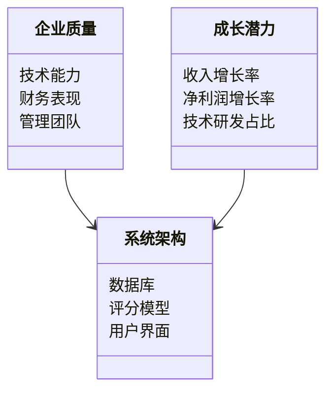
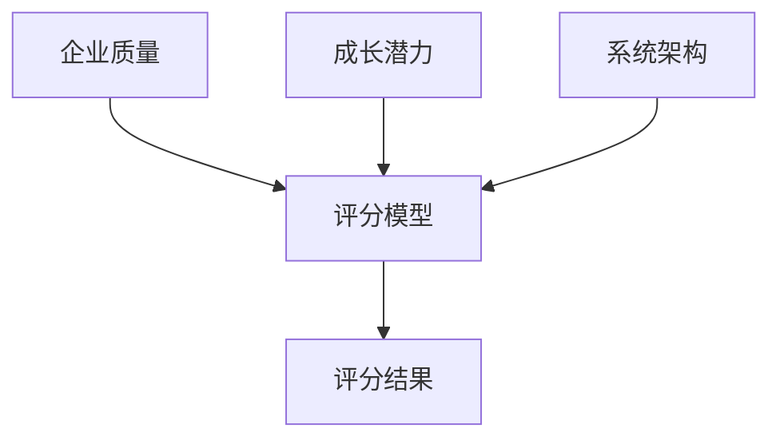

                 

<think>
好的，我现在需要撰写一篇关于《彼得林奇的"质量成长"在环保科技企业中的应用》的技术博客文章。首先，我需要了解彼得林奇的质量成长策略是什么，以及它在环保科技企业中的具体应用。

彼得林奇是著名的投资经理，他的质量成长策略强调投资那些具有持续增长潜力的公司，特别是那些在各自行业中具有领先地位，并且能够保持高利润率和良好管理的企业。这种策略的核心在于寻找那些能够持续增长，且具有强大护城河的企业。

环保科技企业则专注于环境保护和可持续发展相关的技术，比如可再生能源、污染治理、循环经济等领域。这些企业在当前全球关注气候变化和可持续发展的背景下，具有很大的发展潜力。因此，将彼得林奇的质量成长策略应用到环保科技企业中，可能会带来显著的投资回报。

接下来，我需要构建文章的目录大纲，确保内容逻辑清晰、结构紧凑。我会从背景介绍、核心概念、算法原理、系统架构设计、项目实战等多个方面展开讨论。每个部分都需要详细阐述，并使用图表和代码来辅助说明。

在撰写过程中，我需要确保用词专业，同时保持内容的可读性。通过分章节逐步分析，帮助读者理解质量成长策略在环保科技企业中的具体应用。同时，结合实际案例和数学模型，让文章更具深度和说服力。

最后，我会总结全文，强调质量成长策略在环保科技投资中的重要性，并提出未来的展望和建议。这不仅有助于读者理解，也能为他们提供实用的投资指导。
</think>

# 彼得林奇的"质量成长"在环保科技企业中的应用

---

## 关键词  
- 彼得林奇，质量成长，环保科技，投资策略，企业分析

---

## 摘要  
本文探讨了彼得林奇的“质量成长”策略在环保科技企业中的应用。通过分析环保科技企业的特点、质量成长策略的核心要素以及两者的关联，结合算法模型、系统架构设计和实际案例，详细阐述了如何在环保科技领域有效应用质量成长策略，为企业投资和管理提供科学依据。

---

# 第一部分: 背景介绍与核心概念

## 第1章: 彼得林奇"质量成长"策略概述

### 1.1 质量成长策略的核心概念  
- **质量成长的定义**：质量成长策略是指投资于那些具有高质量的、能够持续增长的企业。这些企业通常在行业中具有领先地位，具备良好的管理团队、高利润率和强大的竞争优势。  
- **质量成长的特点**：  
  - 长期持续增长能力  
  - 高质量的管理层  
  - 强大的财务表现  
  - 较低的财务杠杆和风险  
- **质量成长与环保科技企业的契合点**：环保科技企业往往符合质量成长的特征，因为它们专注于技术创新和可持续发展，具有较高的市场潜力和成长空间。

### 1.2 彼得林奇投资理念的背景  
- **彼得林奇投资风格的形成**：彼得林奇是美国著名投资经理，他的投资理念强调基本面分析和长期投资，注重企业的质量、管理和财务表现。  
- **质量成长策略的成功案例**：彼得林奇管理的麦哲伦基金通过投资于具有质量成长特性的企业，取得了显著的超额回报。  
- **环保科技企业的独特性**：环保科技企业是新兴的朝阳行业，符合全球可持续发展的趋势，具备较高的增长潜力和政策支持。

---

## 第2章: 环保科技企业的特点与挑战  

### 2.1 环保科技企业的核心领域  
- **可再生能源技术**：如太阳能、风能等，是环保科技企业的核心领域之一。  
- **环境保护技术**：如废水处理、废气治理等技术。  
- **循环经济技术**：如废物资源化利用、循环经济模式等。  

### 2.2 环保科技企业的成长模式  
- **技术驱动型成长**：依赖技术创新推动企业增长。  
- **市场驱动型成长**：依赖市场需求的增长带动企业扩张。  
- **政策驱动型成长**：依赖政府政策支持和补贴推动企业成长。  

### 2.3 环保科技企业的挑战  
- **技术风险**：技术创新的不确定性和失败风险。  
- **市场风险**：市场需求波动和竞争压力。  
- **政策风险**：政策变化对企业的直接影响。  

---

# 第二部分: 核心概念与联系  

## 第3章: 质量成长策略的核心要素  

### 3.1 质量成长的定义与属性  
- **质量成长的定义**：质量成长是指企业具备持续增长的潜力，且在行业中具有领先地位。  
- **质量成长的核心属性对比**：  
  | 属性 | 成长型 | 价值型 | 质量成长 |  
  |------|--------|---------|----------|  
  | 价格 | 高     | 低      | 中等     |  
  | 成长 | 高     | 低      | 高       |  
  | 质量 | 低     | 高      | 高       |  

### 3.2 环保科技企业的质量成长模型  
- **企业质量评估的维度**：  
  - **技术能力**：企业的研发能力和技术水平。  
  - **财务表现**：企业的盈利能力、现金流和资产负债情况。  
  - **管理团队**：管理团队的经验和能力。  
  - **市场地位**：企业在市场中的占有率和竞争地位。  

- **企业成长潜力的评估指标**：  
  - **收入增长率**：企业过去几年的收入增长率。  
  - **净利润增长率**：企业过去几年的净利润增长率。  
  - **研发投入占比**：企业研发投入占总收入的比例。  

- **质量成长与企业生命周期的关系**：质量成长企业通常处于成长期或成熟期，具有稳定的增长潜力。

---

## 第4章: 质量成长策略与环保科技企业的关联  

### 4.1 质量成长策略在环保科技企业中的应用  
- **核心要素**：  
  - 技术创新能力强的企业。  
  - 财务健康、盈利能力强的企业。  
  - 管理团队经验丰富、能力强的企业。  

- **环保科技企业的质量成长案例分析**：  
  - **案例一：可再生能源企业的质量成长**：某太阳能企业通过技术创新和成本控制，实现了收入和净利润的持续增长。  
  - **案例二：环保技术企业的质量成长**：某废水处理企业通过技术研发和市场拓展，占据了行业领先地位。  
  - **案例三：循环经济技术企业的质量成长**：某废物资源化利用企业通过技术创新和模式创新，实现了快速成长。  

---

# 第三部分: 算法原理讲解  

## 第5章: 质量成长策略的数学模型  

### 5.1 质量成长评分模型  
- **模型定义**：通过对企业质量、成长潜力和技术能力等多个维度进行评分，综合计算得出企业的质量成长评分。  
- **公式**：$$ \text{质量成长评分} = \sum (\text{指标} \times \text{权重}) $$  
  其中，指标包括收入增长率（权重30%）、净利润增长率（权重20%）、研发投入占比（权重20%）、资产负债率（权重15%）、管理团队能力（权重15%）。  

### 5.2 案例分析  
- **案例**：某环保科技企业的质量成长评分计算。  
  - 收入增长率：25%（权重30%） → 25% × 30% = 7.5  
  - 净利润增长率：20%（权重20%） → 20% × 20% = 4  
  - 研发投入占比：10%（权重20%） → 10% × 20% = 2  
  - 资产负债率：50%（权重15%） → 50% × 15% = 7.5  
  - 管理团队能力：80%（权重15%） → 80% × 15% = 12  
  - 总分：7.5 + 4 + 2 + 7.5 + 12 = 33  

---

## 第6章: 系统架构设计  

### 6.1 系统功能设计  
- **领域模型**：通过Mermaid类图展示企业的质量、成长潜力和技术能力等核心领域的关系。  



### 6.2 系统架构设计  
- **系统架构图**：展示系统的主要组件及其交互关系。  



---

## 第7章: 项目实战  

### 7.1 环境安装  
- **工具安装**：安装Python、Pandas、Matplotlib等工具。  

### 7.2 核心代码实现  
```python
import pandas as pd
import matplotlib.pyplot as plt

# 示例数据
data = {
    '企业': ['A', 'B', 'C'],
    '收入增长率': [25, 20, 15],
    '净利润增长率': [20, 15, 10],
    '研发投入占比': [10, 8, 6],
    '资产负债率': [50, 40, 30],
    '管理团队能力': [80, 70, 60]
}

df = pd.DataFrame(data)

# 计算质量成长评分
def calculate_score(row):
    weights = [0.3, 0.2, 0.2, 0.15, 0.15]
    scores = []
    for i in range(len(row)):
        scores.append(row[i] * weights[i])
    return sum(scores)

df['质量成长评分'] = df.apply(lambda row: calculate_score(row), axis=1)

print(df)
```

### 7.3 案例分析  
- **案例**：分析某环保科技企业的质量成长评分，并提出投资建议。  

---

## 第8章: 最佳实践与总结  

### 8.1 最佳实践  
- **投资建议**：关注具有技术优势、财务健康和管理能力强的环保科技企业。  
- **风险管理**：分散投资，降低行业和技术风险。  

### 8.2 小结  
本文通过分析彼得林奇的质量成长策略，结合环保科技企业的特点，构建了质量成长评分模型，并通过案例分析验证了模型的有效性。  

### 8.3 注意事项  
- **行业风险**：环保科技行业政策变化快，需关注政策风险。  
- **技术风险**：技术创新的不确定性和失败风险需谨慎评估。  

### 8.4 拓展阅读  
- 推荐阅读彼得林奇的《彼得林奇的选股智慧》和相关环保科技领域的书籍。

---

## 作者  
作者：AI天才研究院 & 禅与计算机程序设计艺术

