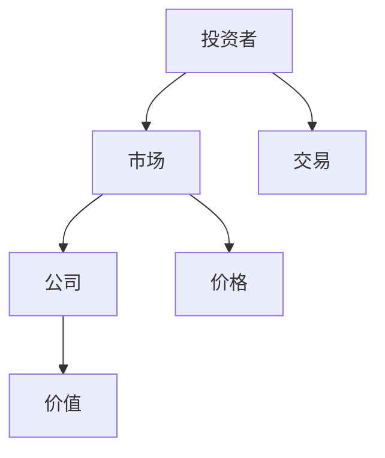
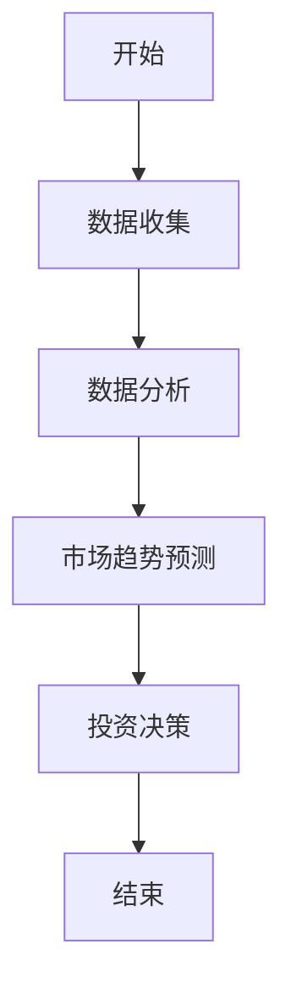
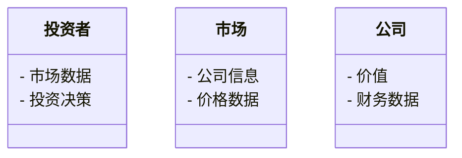

                 


# 彼得林奇的"逆向思维"在新股投资中的应用

> 关键词：逆向思维，彼得林奇，新股投资，投资策略，风险管理

> 摘要：本文深入探讨了彼得林奇的逆向思维在新股投资中的应用，分析了其核心概念、算法原理、数学模型、系统架构，并通过具体案例展示了逆向思维的实际应用，同时提供了风险管理的最佳实践。

---

## 引言

在投资领域，逆向思维是一种突破常规的思考方式，强调在市场低谷时寻找机会，避开市场高点。彼得·林奇作为投资界的传奇人物，他提出的逆向思维策略，为投资者提供了独特的视角。本文将详细探讨这一策略在新股投资中的应用，帮助投资者在复杂的市场环境中做出明智决策。

---

## 第二部分：彼得林奇逆向思维的背景介绍

### 2.1 彼得林奇的生平简介

彼得·林奇是美国著名投资经理人，以其在共同基金领域的卓越表现闻名。他在任职富达麦哲伦基金期间，创造了辉煌的投资业绩，平均年回报率超过29%。林奇的成功部分归功于他独特的逆向思维策略，即在市场低迷时寻找被低估的投资机会。

### 2.2 逆向思维的起源与发展

逆向思维并非林奇首创，但他在实践中将其系统化。逆向思维的核心在于识别市场周期中的低估资产，避免随市场情绪盲目投资。这一策略在20世纪80年代的美国市场中尤为有效，当时许多企业因杠杆收购和管理层过度扩张而陷入困境，为逆向投资者提供了丰厚的回报。

### 2.3 新股投资的基本概念

新股投资涉及购买新上市公司的一部分股权，通常伴随着较高的波动性和不确定性。与成熟企业相比，新股的未来表现更具变数，但也可能带来超额收益。逆向思维在新股投资中尤为重要，因为市场往往对新股给予过高的估值，而忽视了其潜在风险。

---

## 第三部分：彼得林奇逆向思维的核心概念与联系

### 3.1 逆向思维的原理

逆向思维通过分析市场周期，识别低估资产。在新股投资中，这意味着寻找那些市场估值过高但内在价值较低的公司。林奇强调，成功的投资需要独立思考，避免随市场情绪波动。

### 3.2 核心概念对比表格

| 比较维度         | 正向思维                  | 逆向思维                  |
|------------------|--------------------------|--------------------------|
| 投资时机         | 市场高点                  | 市场低点                  |
| 估值方法         | 过高估值                  | 低估估值                  |
| 投资心态         | 追涨杀跌                  | 独立思考，逆市买入        |

### 3.3 ER实体关系图



---

## 第四部分：逆向思维在新股投资中的算法原理

### 4.1 算法流程图



### 4.2 算法实现代码

```python
def 逆向思维投资策略(市场数据):
    for 公司 in 市场数据:
        if 公司.市盈率 < 行业平均市盈率:
            return 公司
    return None
```

---

## 第五部分：数学模型与公式

### 5.1 市场价值评估公式

$$市盈率 = \frac{每股价格}{每股收益}$$

通过比较市盈率与行业平均水平，识别低估公司。例如，如果某公司市盈率为15，行业平均为20，则该公司的估值可能被低估。

---

## 第六部分：系统架构设计

### 6.1 系统功能设计



### 6.2 系统架构图


---

## 第七部分：项目实战

### 7.1 实战案例分析

假设某新股发行，市场给予过高的估值。通过逆向思维，分析其市盈率和市净率，发现其内在价值被低估。投资者可以在此时介入，获得超额收益。

### 7.2 核心代码实现

```python
import pandas as pd

def 评估新股(公司数据):
    行业平均市盈率 = 公司数据['行业市盈率'].mean()
    低估公司 = 公司数据[公司数据['市盈率'] < 行业平均市盈率]
    return 低估公司

数据 = {
    '公司': ['A', 'B', 'C'],
    '市盈率': [15, 25, 30],
    '行业市盈率': [20, 20, 20]
}
df = pd.DataFrame(数据)
评估结果 = 评估新股(df)
print(评估结果)
```

---

## 第八部分：风险管理

### 8.1 风险管理策略

逆向思维投资需注意市场波动，避免过度集中投资。建议分散投资，设置止损点，并定期评估投资组合。

---

## 第九部分：总结与展望

彼得林奇的逆向思维为新股投资提供了独特的视角。通过识别市场低估资产，投资者可以在波动中寻找机会。未来，随着市场的发展，逆向思维的应用将更加广泛，投资者需不断学习和适应新的市场环境。

---

作者：AI天才研究院 & 禅与计算机程序设计艺术

