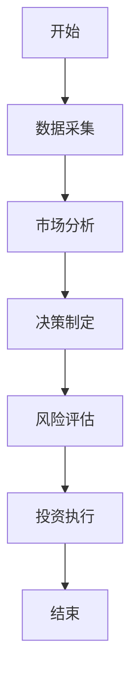
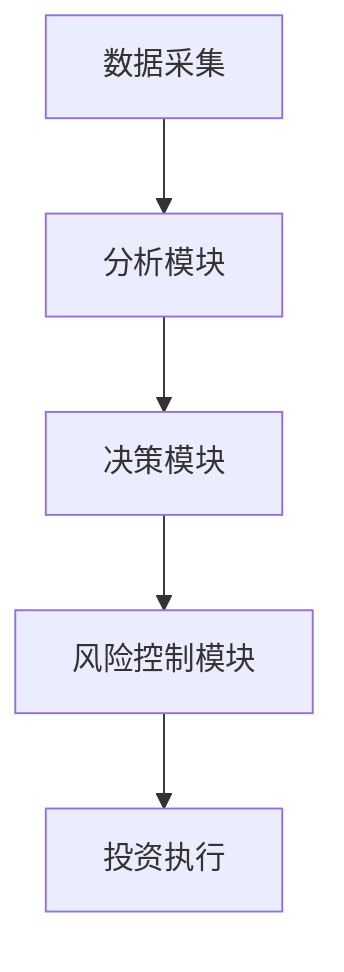
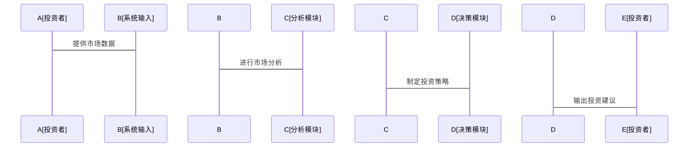

                 


# 彼得林奇的"逆向思维"在牛熊市的应用

> 关键词：彼得林奇，逆向思维，牛熊市，投资策略，风险管理，市场分析

> 摘要：本文深入探讨了彼得林奇的逆向思维在股票投资中的应用，特别是在牛熊市周期中的策略。通过分析逆向思维的核心原理、算法模型、系统架构以及实际案例，本文旨在为投资者提供一种在复杂市场环境中做出明智决策的框架。

---

# 第一部分: 逆向思维的背景与核心概念

## 第1章: 逆向思维的定义与特点

### 1.1 逆向思维的定义
逆向思维是一种与传统投资思维相反的策略，强调在市场低迷时买入优质资产，在市场繁荣时卖出或减少持有。这种思维的核心在于识别市场的非理性情绪，并利用这种情绪与实际价值的偏离来获利。

### 1.2 逆向思维的特点
- **反周期性**：逆向思维在市场低谷时更具优势。
- **长期视角**：关注企业的基本面，而非短期市场波动。
- **风险控制**：通过逆向操作降低投资组合的风险。

### 1.3 逆向思维与传统投资思维的区别
| 特性 | 逆向思维 | 传统投资思维 |
|------|----------|---------------|
| 市场情绪 | 利用市场的非理性 | 随市场趋势波动 |
| 投资时机 | 在市场低点买入，在高点卖出 | 在市场高点买入，在低点卖出 |
| 风险管理 | 强调安全边际 | 侧重于市场趋势 |

## 第2章: 彼得林奇的投资理念

### 2.1 彼得林奇的背景
彼得·林奇是富达投资的传奇经理人，以其长期优异的投资业绩闻名。他主张通过深入研究企业基本面，寻找那些被市场低估的优质企业。

### 2.2 逆向思维在彼得林奇策略中的应用
彼得林奇在其投资生涯中，多次在市场低迷时增持优质资产。例如，在2008年金融危机期间，他建议投资者寻找那些被市场错杀的优秀企业。

### 2.3 牛熊市的定义与特征
- **牛市**：市场情绪高涨，投资者乐观，股价普遍上涨。
- **熊市**：市场情绪低迷，投资者悲观，股价普遍下跌。

## 第3章: 逆向思维的核心概念

### 3.1 核心概念原理
逆向思维的核心在于识别市场的非理性波动，并利用这种波动与企业实际价值之间的差异。具体而言：
1. **识别市场情绪**：通过分析市场参与者的心理和行为，判断市场的非理性程度。
2. **分析企业基本面**：评估企业的盈利能力、财务状况和行业地位。
3. **制定投资策略**：在市场低估时买入，在市场高估时卖出。

### 3.2 核心概念的属性特征对比
| 属性 | 逆向思维 | 传统投资 |
|------|----------|-----------|
| 投资时机 | 低谷买入，高位卖出 | 随市场波动 |
| 风险偏好 | 低风险偏好 | 高风险偏好 |
| 分析方法 | 侧重于价值分析 | 侧重于趋势分析 |

---

# 第二部分: 逆向思维的算法与系统分析

## 第4章: 逆向思维的算法原理

### 4.1 算法框架
逆向思维的算法框架可以分为以下几个步骤：
1. **数据采集**：收集市场数据（如股价、成交量、市场情绪指标）。
2. **市场分析**：通过技术分析和基本面分析判断市场的当前状态。
3. **决策制定**：根据分析结果，制定买入或卖出的策略。
4. **风险评估**：计算投资组合的风险，并进行调整。

### 4.2 算法流程图


### 4.3 数学模型
逆向思维的数学模型可以通过以下公式表示：
$$
\text{投资决策} = \begin{cases}
\text{买入} & \text{如果市场低估} \\
\text{卖出} & \text{如果市场高估}
\end{cases}
$$

### 4.4 举例说明
假设某股票的市盈率低于行业平均水平，说明该股票可能被市场低估。此时，逆向思维策略建议投资者买入该股票。

## 第5章: 系统架构设计

### 5.1 系统功能设计
- **数据采集模块**：负责收集市场数据。
- **分析模块**：进行技术分析和基本面分析。
- **决策模块**：根据分析结果制定投资策略。
- **风险控制模块**：评估投资组合的风险。

### 5.2 系统架构图


### 5.3 接口设计
- **输入接口**：接收市场数据和投资参数。
- **输出接口**：输出投资决策和风险评估结果。

### 5.4 交互设计


---

# 第三部分: 项目实战与案例分析

## 第6章: 项目实战

### 6.1 环境安装
- **工具**：Python、Pandas、Matplotlib。
- **数据源**：Yahoo Finance API。

### 6.2 核心代码实现
```python
import pandas as pd
import numpy as np
import yfinance as yf

# 下载数据
data = yf.download('AAPL', start='2020-01-01', end='2023-12-31')

# 计算市盈率
data['PE'] = data['Close'] / data['EPS']

# 逆向思维策略
data['Signal'] = np.where(data['PE'] < data['PE'].mean(), 1, -1)
```

### 6.3 代码解读
- **数据下载**：使用Yahoo Finance API下载股票数据。
- **市盈率计算**：计算股票的市盈率。
- **信号生成**：根据市盈率与行业平均水平的比较，生成买入（1）或卖出（-1）信号。

## 第7章: 案例分析

### 7.1 案例背景
2008年金融危机期间，彼得林奇通过逆向思维策略，成功抄底市场，获得了丰厚的回报。

### 7.2 分析与解读
- **市场情绪**：金融危机期间，市场恐慌情绪达到顶点，许多优质股票被错杀。
- **企业基本面**：许多企业基本面良好，但由于市场恐慌，股价大幅下跌。
- **投资策略**：在市场低点买入优质股票，最终获得超额收益。

---

# 第四部分: 总结与展望

## 第8章: 总结

### 8.1 本章总结
- 逆向思维是一种有效的投资策略，特别是在牛熊市周期中。
- 通过深入分析市场情绪和企业基本面，投资者可以制定合理的投资策略。

### 8.2 最佳实践
- 保持耐心，避免短期市场波动的干扰。
- 重视企业基本面分析，寻找被市场低估的优质企业。

## 第9章: 展望

### 9.1 未来研究方向
- 结合人工智能技术，进一步优化逆向思维策略。
- 研究逆向思维在不同市场环境下的表现。

### 9.2 给读者的建议
- 深入学习彼得林奇的投资理念。
- 结合实际情况，制定适合自己的投资策略。

---

# 作者

作者：AI天才研究院 & 禅与计算机程序设计艺术

