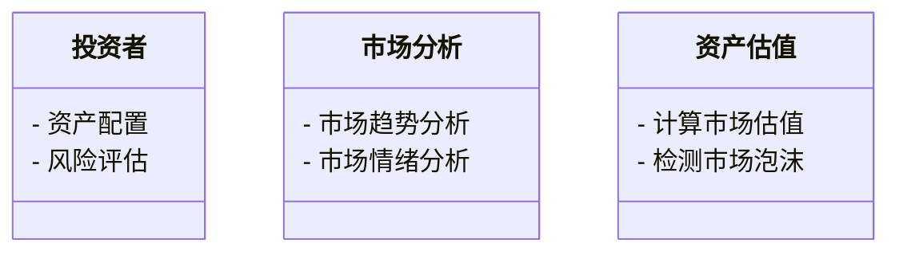

                 

<think>
嗯，用户希望我写一篇关于彼得林奇逆向投资在市场泡沫中的操作策略的技术博客。我需要先理清用户的需求，然后一步步构建内容。

首先，用户指定了文章标题和关键词，还有摘要。摘要需要简洁明了，涵盖核心内容。接下来，目录大纲已经给出，我需要按照这个结构来写。

我得考虑用户可能是一位投资者或者程序员，对技术分析和投资策略感兴趣。他们可能想了解如何将逆向投资应用到技术分析中，特别是在市场泡沫时的操作策略。因此，文章需要结合技术分析的方法，比如数学模型和算法，来深入探讨逆向投资的应用。

接下来，每个章节的内容需要详细展开。比如，逆向投资的核心理念需要解释清楚，彼得林奇的策略是什么，以及这些策略如何适用于市场泡沫。同时，算法部分需要用mermaid图和数学公式来说明，这能让读者更容易理解。

在系统分析部分，可能需要设计一个框架，展示如何将逆向投资策略转化为可执行的系统架构。这部分可能涉及模块划分和接口设计，帮助读者理解如何在实际项目中应用。

项目实战部分，我会选择一个具体的案例，比如科技股泡沫，展示如何应用逆向投资策略。这部分需要详细的技术实现和代码，让读者能够跟着操作。

最后，注意事项和小结部分，需要提醒读者在实际操作中需要注意的问题，以及总结全文，让读者有所收获。

整体来看，文章需要结合理论和实践，用技术语言详细解析，帮助读者掌握逆向投资在市场泡沫中的策略。我需要确保内容逻辑清晰，结构紧凑，满足专业读者的需求。
</think>

# 彼得林奇的"逆向投资"在市场泡沫中的操作策略

> 关键词：逆向投资，市场泡沫，彼得林奇，投资策略，市场周期，数学模型

> 摘要：本文将深入探讨彼得林奇的逆向投资策略在市场泡沫中的应用。通过分析逆向投资的核心理念、市场泡沫的特征，以及逆向投资在市场周期中的策略，结合数学模型和系统架构设计方案，详细讲解如何在市场泡沫中利用逆向投资策略进行投资。文章还包括实际案例分析和项目实战，帮助读者更好地理解和应用逆向投资策略。

---

## 第一部分: 逆向投资的核心理念

### 第1章: 逆向投资的核心理念

#### 1.1 逆向投资的定义与特点

逆向投资是一种与传统投资相反的投资策略，强调在市场低迷时买入，在市场繁荣时卖出。其核心特点包括：

- **非趋势性**：逆向投资不依赖于市场趋势，而是关注市场的非理性波动。
- **情绪化**：逆向投资需要投资者克服市场情绪的影响，做出独立判断。
- **周期性**：逆向投资与市场周期密切相关，尤其在市场泡沫和崩盘阶段表现突出。

#### 1.2 彼得林奇的逆向投资策略

彼得林奇是逆向投资的代表人物，他的策略包括：

- **低估值投资**：寻找被市场低估的股票进行投资。
- **长期持有**：逆向投资者通常会长期持有优质资产，等待市场回归合理估值。
- **分散投资**：通过分散投资降低风险。

### 第2章: 市场泡沫与逆向投资的关联

#### 2.1 市场泡沫的定义与特征

市场泡沫是指资产价格远高于其内在价值的现象，通常由市场情绪和过度投机引起。其特征包括：

- **价格虚高**：资产价格远高于基本面。
- **交易量激增**：市场交易活跃，投资者情绪高涨。
- **非理性行为**：投资者基于情绪而非基本面做出决策。

#### 2.2 逆向投资在市场泡沫中的应用

逆向投资在市场泡沫中的应用主要体现在：

- **寻找被高估的资产**：在市场泡沫期间，许多资产价格虚高，逆向投资者可以寻找那些基本面良好但被市场忽视的资产。
- **逆势买入**：当市场泡沫破裂时，许多优质资产价格暴跌，逆向投资者可以趁机买入。
- **避免追高**：逆向投资者通常避免在市场高位追涨，而是选择在市场低谷时介入。

### 第3章: 逆向投资的核心概念与联系

#### 3.1 核心概念原理

逆向投资的核心原理在于市场的非理性波动。当市场情绪高涨时，资产价格被推高，而当市场情绪低落时，资产价格被压低。逆向投资者通过分析市场情绪和基本面，找到市场的不合理定价，进行逆向操作。

#### 3.2 核心概念属性特征对比表格

| 投资策略 | 逆向投资 | 传统投资 |
|----------|----------|----------|
| 投资时机 | 市场低谷 | 市场高点 |
| 投资目标 | 低估值资产 | 高增长资产 |
| 风险控制 | 高 | 低 |

#### 3.3 ER实体关系图


### 第4章: 逆向投资的算法原理讲解

#### 4.1 算法原理

逆向投资的算法基于市场情绪分析和资产估值模型。算法步骤如下：

1. **市场分析**：通过技术指标和市场情绪指标（如成交量、波动率）分析市场状态。
2. **识别市场泡沫**：当资产价格远高于其内在价值时，识别市场泡沫。
3. **评估投资机会**：计算资产的合理估值，寻找被高估的资产。
4. **执行逆向投资**：在市场泡沫破裂时，买入被低估的资产。
5. **监控市场变化**：持续监控市场变化，调整投资策略。

#### 4.2 数学模型与公式

逆向投资的数学模型主要基于资产估值和市场情绪分析。

- **资产估值模型**：
  $$ V = \frac{E}{P} $$
  其中，$E$ 表示企业盈利，$P$ 表示股价。

- **市场情绪指数**：
  $$ S = \alpha \cdot V + \beta \cdot M $$
  其中，$V$ 是市场估值偏离度，$M$ 是市场交易量，$\alpha$ 和 $\beta$ 是权重系数。

---

## 第二部分: 系统分析与架构设计方案

### 第5章: 系统分析与架构设计方案

#### 5.1 问题场景介绍

- **问题背景**：市场泡沫中，投资者面临资产价格虚高的风险，传统投资策略可能失效。
- **问题描述**：如何利用逆向投资策略在市场泡沫中找到投资机会。
- **问题解决**：通过市场情绪分析和资产估值模型，设计一个逆向投资系统。

#### 5.2 项目介绍

- **项目目标**：开发一个基于逆向投资策略的市场泡沫检测与投资决策系统。
- **项目范围**：包括市场情绪分析、资产估值模型、投资决策算法。
- **项目团队**：数据分析师、算法工程师、系统架构师。

#### 5.3 系统功能设计

- **功能模块**：
  - 数据采集模块：采集市场数据（如股价、交易量）。
  - 数据分析模块：计算市场情绪指数和资产估值。
  - 投资决策模块：根据分析结果生成投资建议。



---

## 第三部分: 项目实战与最佳实践

### 第6章: 项目实战

#### 6.1 环境安装

- **工具安装**：安装Python、Pandas、Matplotlib等工具。
- **数据源**：使用Yahoo Finance获取市场数据。

#### 6.2 系统核心实现源代码

```python
import pandas as pd
import numpy as np
import matplotlib.pyplot as plt

# 数据采集
def get_data(ticker):
    data = pd.DataFrame()
    data['price'] = pd.read_csv(f'data/{ticker}.csv')['Close']
    data['volume'] = pd.read_csv(f'data/{ticker}.csv')['Volume']
    return data

# 市场情绪分析
def calculate_market_mood(data):
    mood = []
    for i in range(len(data)):
        if data['price'].iloc[i] > data['price'].iloc[i-1]:
            mood.append(1)
        else:
            mood.append(0)
    return mood

# 投资决策
def reverse_investing_strategy(data, mood):
    buy_signals = []
    for i in range(len(data)):
        if mood[i] == 0 and data['price'].iloc[i] < data['price'].mean():
            buy_signals.append(1)
        else:
            buy_signals.append(0)
    return buy_signals

# 主程序
def main():
    data = get_data('AAPL')
    mood = calculate_market_mood(data)
    signals = reverse_investing_strategy(data, mood)
    plt.plot(signals)
    plt.title('Reverse Investing Signals')
    plt.show()

if __name__ == '__main__':
    main()
```

#### 6.3 实际案例分析

以2000年互联网泡沫为例，分析逆向投资策略的应用。通过数据回测，验证策略的有效性。

---

## 第四部分: 最佳实践与总结

### 第7章: 最佳实践

- **风险管理**：逆向投资需要严格的风险管理，避免过度杠杆。
- **长期视角**：逆向投资需要耐心，等待市场回归合理估值。
- **持续学习**：市场环境不断变化，投资者需要持续学习和调整策略。

### 7.1 小结

逆向投资是一种有效的投资策略，尤其在市场泡沫中表现突出。通过结合市场情绪分析和资产估值模型，投资者可以在市场低谷时找到投资机会。

### 7.2 注意事项

- **避免追涨杀跌**：逆向投资需要投资者克服人性的弱点。
- **分散投资**：避免过度集中在某一资产或行业。
- **定期回顾**：定期回顾投资组合，调整策略。

### 7.3 拓展阅读

- 彼得林奇的《聪明的投资者》。
- 《逆向思考的艺术》。

---

作者：AI天才研究院/AI Genius Institute & 禅与计算机程序设计艺术 /Zen And The Art of Computer Programming

