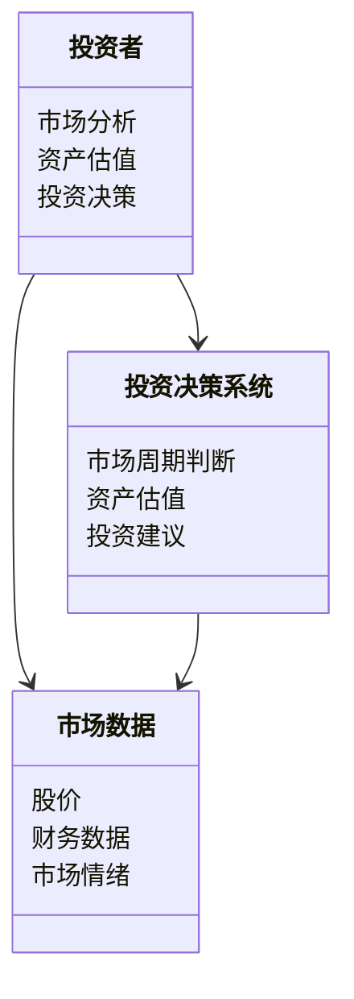

                 


# 彼得林奇的"逆向投资"心理准备

## 关键词：逆向投资、彼得林奇、投资心理、价值投资、市场周期、风险管理

## 摘要：逆向投资是一种在市场低迷时买入优质资产、在市场高涨时卖出的策略，强调在市场非理性波动中寻找价值。本文从彼得林奇的投资理念出发，详细分析逆向投资的心理准备，包括市场周期、心理模型、风险管理等方面，帮助投资者在复杂市场环境中保持理性决策。

---

# 第一部分: 逆向投资的心理准备基础

## 第1章: 逆向投资的核心概念

### 1.1 逆向投资的定义与背景

#### 1.1.1 逆向投资的定义
逆向投资是一种与市场情绪相反的投资策略，强调在市场恐慌时买入，在市场狂热时卖出。其核心在于利用市场非理性波动，寻找被低估的投资机会。

#### 1.1.2 逆向投资的背景与重要性
- **市场周期性**：市场会经历周期性波动，投资者需在不同阶段采取不同策略。
- **非理性行为**：投资者常受情绪影响，逆向投资利用这种偏差获利。
- **长期收益**：逆向投资注重价值，长期来看回报更高。

#### 1.1.3 彼得林奇与逆向投资的关系
彼得林奇是逆向投资的倡导者，他强调买入被市场低估的公司，长期持有，等待市场回归理性。

---

### 1.2 投资者心理与逆向思维

#### 1.2.1 投资者的常见心理偏差
- **从众心理**：跟随市场趋势，导致高位买入。
- **恐惧与贪婪**：市场下跌时恐慌卖出，上涨时贪婪买入。
- **过度自信**：认为自己能准确预测市场走势。

#### 1.2.2 逆向思维在投资中的应用
- **反向决策**：在市场底部买入，顶部卖出。
- **独立思考**：不被市场情绪左右，坚持价值判断。

#### 1.2.3 心理准备对投资决策的影响
心理准备帮助投资者在市场波动中保持冷静，避免情绪化决策。

---

## 第2章: 逆向投资的市场周期分析

### 2.1 市场周期的定义与特征

#### 2.1.1 市场周期的四个阶段
1. **复苏期**：市场逐渐复苏，估值较低。
2. **上升期**：市场上涨，估值合理。
3. **狂热期**：市场过度上涨，估值过高。
4. **衰退期**：市场下跌，估值被低估。

#### 2.1.2 每个阶段的特征与表现
- **复苏期**：投资者逐渐恢复信心，资金流入市场。
- **上升期**：市场稳步上涨，投资者情绪乐观。
- **狂热期**：市场出现泡沫，投资者疯狂买入。
- **衰退期**：市场大幅下跌，投资者恐慌卖出。

#### 2.1.3 周期性波动对投资者的影响
市场周期波动会导致投资者情绪波动，影响投资决策。

---

### 2.2 逆向投资与市场周期的关系

#### 2.2.1 在市场低谷时的买入机会
- **识别低谷**：通过估值指标（如PE、PB）判断市场是否被低估。
- **买入策略**：在市场底部买入优质资产。

#### 2.2.2 在市场高点时的卖出策略
- **识别高点**：通过市场情绪指标（如成交量、涨跌比率）判断市场是否过热。
- **卖出策略**：在市场顶部卖出部分仓位。

#### 2.2.3 如何识别市场周期的转折点
- **估值指标**：如PE、PB低于历史平均水平，表明市场可能处于低谷。
- **情绪指标**：如市场成交量、投资者情绪指数，帮助判断市场情绪。

---

## 第3章: 逆向投资的核心策略

### 3.1 逆向投资的三大原则

#### 3.1.1 坚持价值投资
- **价值投资**：寻找被市场低估的资产，长期持有。
- **基本面分析**：关注公司财务状况、盈利能力、行业地位。

#### 3.1.2 避免从众心理
- **独立思考**：不随大流，避免从众心理。
- **逆向决策**：在市场恐慌时买入，在市场狂热时卖出。

#### 3.1.3 保持独立思考
- **理性分析**：基于数据和逻辑，而非情绪做出决策。
- **长期视角**：关注长期价值，忽略短期波动。

---

### 3.2 彼得林奇的选股方法

#### 3.2.1 寻找被市场低估的股票
- **估值指标**：PE、PB低于行业平均水平。
- **公司基本面**：关注盈利能力、财务健康、行业地位。

#### 3.2.2 分析公司的基本面
- **财务报表分析**：利润表、资产负债表、现金流。
- **行业地位**：公司在行业中的竞争力。

#### 3.2.3 长期持有优质资产
- **长期视角**：关注公司的长期价值，避免频繁交易。

---

## 第4章: 逆向投资的心理模型与决策框架

### 4.1 心理模型的构建

#### 4.1.1 心理模型的定义
心理模型是投资者对市场的认知框架，影响投资决策。

#### 4.1.2 心理模型的特征
- **简化性**：用简单的方式理解复杂市场。
- **动态性**：根据市场变化调整模型。

#### 4.1.3 如何构建心理模型
- **学习市场历史**：了解市场周期和典型事件。
- **分析投资者行为**：理解情绪对市场的影响。

---

### 4.2 决策框架的建立

#### 4.2.1 决策框架的定义
决策框架是指导投资决策的规则和流程。

#### 4.2.2 决策框架的步骤
1. **市场分析**：判断市场所处周期阶段。
2. **资产估值**：评估资产是否被低估或高估。
3. **投资决策**：根据分析结果做出买入或卖出决策。

---

### 4.3 心理模型与决策框架的对比

| 特征       | 心理模型                | 决策框架                |
|------------|------------------------|------------------------|
| 定义       | 认知框架                | 决策规则和流程          |
| 目标       | 理解市场                | 指导决策                |
| 调整方式    | 根据经验动态调整        | 定期评估和优化          |

---

## 第5章: 逆向投资的数学模型与公式

### 5.1 市场估值指标

#### 5.1.1 市盈率（PE）
- **定义**：市盈率 = 股价 / 每股净利润。
- **公式**：$$ PE = \frac{\text{股价}}{\text{每股净利润}} $$
- **作用**：衡量股票的相对估值。

#### 5.1.2 市净率（PB）
- **定义**：市净率 = 股价 / 每股净资产。
- **公式**：$$ PB = \frac{\text{股价}}{\text{每股净资产}} $$
- **作用**：衡量股票的资产价值。

---

### 5.2 投资组合优化

#### 5.2.1 风险与收益的权衡
- **公式**：$$ \text{风险} = \text{收益} \times \text{波动率} $$
- **解释**：收益越高，风险越大。

#### 5.2.2 投资组合的夏普比率
- **公式**：$$ \text{夏普比率} = \frac{\text{超额收益}}{\text{收益波动率}} $$
- **解释**：衡量投资组合的风险调整后收益。

---

## 第6章: 逆向投资的系统分析与架构设计

### 6.1 系统功能设计

#### 6.1.1 领域模型（Mermaid 类图）


---

### 6.2 系统架构设计（Mermaid 架构图）

```mermaid
archiecture
    前端 --> 投资者界面
    后端 --> 数据处理逻辑
    数据库 --> 市场数据
    服务层 --> 投资决策算法
```

---

## 第7章: 逆向投资的项目实战

### 7.1 环境安装

#### 7.1.1 安装 Python 环境
- 使用 Anaconda 或虚拟环境。

#### 7.1.2 安装必要的库
- ```bash
  pip install pandas numpy matplotlib
  ```

---

### 7.2 核心实现源代码

#### 7.2.1 读取数据
```python
import pandas as pd

# 读取股票数据
df = pd.read_csv('stock_data.csv')
```

#### 7.2.2 计算市盈率
```python
def calculate_pe(df):
    df['PE'] = df['股价'] / df['每股净利润']
    return df

df = calculate_pe(df)
```

#### 7.2.3 绘制市场周期图
```python
import matplotlib.pyplot as plt

plt.plot(df['日期'], df['股价'], label='股价')
plt.xlabel('日期')
plt.ylabel('股价')
plt.legend()
plt.show()
```

---

### 7.3 案例分析

#### 7.3.1 案例背景
假设市场处于衰退期，寻找被低估的股票。

#### 7.3.2 数据分析
- 计算市盈率和市净率。
- 筛选出PE和PB均低于行业平均水平的股票。

#### 7.3.3 投资决策
- 买入被低估的股票，长期持有。

---

## 第8章: 逆向投资的最佳实践

### 8.1 心理准备的要点

#### 8.1.1 保持冷静
- 面对市场波动，保持冷静，避免情绪化决策。

#### 8.1.2 独立思考
- 不受市场情绪影响，坚持独立思考。

#### 8.1.3 长期视角
- 关注长期价值，忽略短期波动。

---

### 8.2 小结

逆向投资是一种有效的投资策略，但需要投资者具备心理准备，包括独立思考、冷静判断和长期视角。

---

### 8.3 注意事项

- **风险控制**：设置止损点，避免重大损失。
- **持续学习**：不断更新知识，适应市场变化。
- **纪律性**：严格按照策略执行，避免随意改变决策。

---

### 8.4 拓展阅读

- 彼得林奇的《投资的真相》
- 《逆向投资的艺术》

---

## 作者信息

作者：AI天才研究院 & 禅与计算机程序设计艺术  
联系邮箱：[contact@yourdomain.com](mailto:contact@yourdomain.com)  
GitHub：[https://github.com/yourusername](https://github.com/yourusername)  

---

通过以上详细的内容，您可以根据需要进一步扩展和完善文章的具体内容，确保文章逻辑清晰、内容详实，能够为读者提供有价值的见解和指导。

