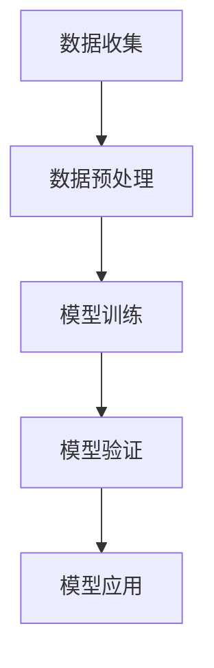
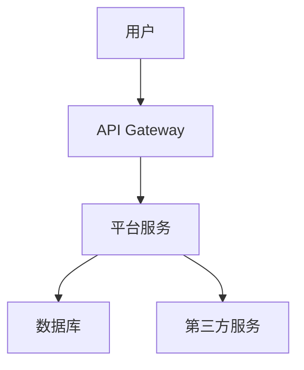
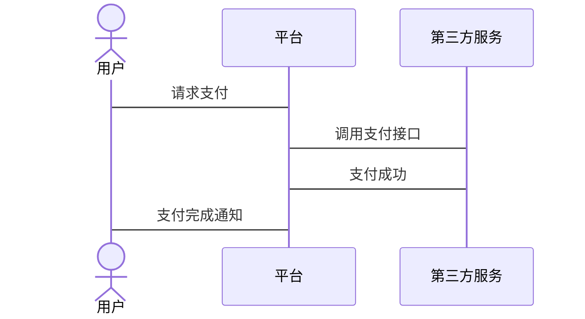

                 


# 彼得林奇的"长期价值创造"在平台型公司中的新指标

> 关键词：彼得林奇，长期价值创造，平台型公司，新指标，投资策略，价值评估模型

> 摘要：本文探讨了彼得林奇的长期价值创造理论在平台型公司中的应用，提出了新的价值评估指标。通过分析平台型公司的系统架构和算法原理，结合实际案例，展示了如何在数字化转型中实现长期价值创造。

---

## 第一部分：彼得林奇的长期价值创造概述

### 第1章：彼得林奇的长期价值创造理论

#### 1.1 彼得林奇投资理念的核心要素

##### 1.1.1 长期价值创造的定义
长期价值创造是指通过持续优化公司运营和创新，提高公司内在价值，从而在长期内为股东和利益相关者带来超额收益。

##### 1.1.2 投资中的价值与价格关系
彼得林奇强调，投资应关注公司的内在价值，而非短期市场价格波动。内在价值是公司未来现金流的现值，需通过基本面分析估算。

##### 1.1.3 长期价值创造的关键因素
包括公司的财务健康、行业地位、管理团队、创新能力和竞争优势。彼得林奇特别关注公司管理层的诚信和能力，认为这是创造长期价值的核心。

#### 1.2 平台型公司的定义与特点

##### 1.2.1 平台型公司的基本特征
平台型公司通过技术手段连接多方参与者，如用户、商家、开发者等，构建生态系统。其特点包括双边或多边市场、网络效应、数据驱动等。

##### 1.2.2 平台型公司的生态系统构建
通过整合资源、优化流程，构建高效的生态系统，提升平台的整体价值。例如，互联网平台连接供需双方，促进价值流动。

##### 1.2.3 平台型公司的竞争优势
平台型公司通过规模效应、数据优势和网络效应，形成强大的市场竞争力。例如，大型电商平台通过数据驱动优化供应链。

### 第2章：长期价值创造在平台型公司的应用背景

#### 2.1 当前商业环境的变化

##### 2.1.1 数字化转型对平台型公司的影响
数字化转型推动平台型公司采用新技术，如大数据、人工智能，提升运营效率和用户体验。

##### 2.1.2 新兴技术对长期价值创造的推动
技术进步（如AI）帮助平台优化决策，降低成本，创造新价值。例如，智能推荐系统提升用户粘性。

##### 2.1.3 全球化背景下的平台型公司挑战
全球化扩大了市场，但也带来竞争加剧、文化差异等问题，平台型公司需调整策略，应对全球化的挑战。

#### 2.2 平台型公司面临的机遇与挑战

##### 2.2.1 数字经济带来的新机遇
数字经济促进平台型公司的发展，如电子商务、在线教育等领域。平台可利用数据和技术创新，开拓新市场。

##### 2.2.2 数据驱动的业务模式创新
数据成为平台的核心资产，通过数据分析优化业务模式，创造新价值。例如，精准营销提高转化率。

##### 2.2.3 用户需求变化的应对策略
用户需求多样化，平台需通过产品迭代、用户体验优化等方式，持续满足用户需求，保持竞争力。

---

## 第二部分：长期价值创造的核心概念与联系

### 第3章：长期价值创造与平台型公司的关系

#### 3.1 核心概念原理

##### 3.1.1 价值创造的来源分析
平台型公司的价值来源于生态系统中的多方参与和价值传递。例如，电商平台通过连接买家和卖家，创造交易价值。

##### 3.1.2 平台型公司的价值传递机制
通过优化流程、降低交易成本、提高效率，促进价值在平台上的流动。例如，平台通过数据分析优化供应链，降低成本。

##### 3.1.3 长期价值创造的实现路径
包括技术创新、商业模式创新、组织优化等。例如，通过引入新技术提升用户体验，构建长期竞争优势。

#### 3.2 核心概念属性对比

##### 3.2.1 平台型公司与传统公司的对比
| 特性          | 平台型公司          | 传统公司          |
|---------------|--------------------|-------------------|
| 业务模式      | 双边或多边市场     | 单一市场          |
| 竞争优势      | 网络效应、数据优势 | 产品差异化         |
| 经营策略      | 数据驱动优化       | 产品创新驱动       |

##### 3.2.2 长期价值创造与短期收益的关系
长期价值创造关注公司长期发展，而短期收益注重即时回报。平台型公司需在两者之间找到平衡，避免短期行为影响长期发展。

##### 3.2.3 用户价值与公司价值的统一性
平台型公司通过创造用户价值，实现公司价值增长。例如，提高用户满意度和忠诚度，促进用户增长和收入增加。

#### 3.3 ER实体关系图

```mermaid
er
actor(用户)
actor(商家)
actor(平台)
```

---

## 第三部分：长期价值创造的算法原理

### 第4章：价值评估模型

#### 4.1 多因子价值评估模型

##### 4.1.1 模型概述
多因子模型结合多个因素评估公司的内在价值，包括财务指标、行业地位、创新能力等。模型公式如下：

$$ V = \alpha + \beta_1 R_m + \beta_2 S + \beta_3 G + \epsilon $$

其中，V为公司价值，R_m为市场收益，S为规模因子，G为增长因子，ε为误差项。

##### 4.1.2 模型实现

###### 4.1.2.1 数据收集与预处理
收集公司的财务数据、市场数据和行业数据，进行清洗和标准化处理。

###### 4.1.2.2 模型训练与验证
使用历史数据训练模型，验证其准确性和稳定性。例如，使用回归分析评估各因子的权重。

###### 4.1.2.3 模型的应用与优化
将模型应用于实际投资决策，持续优化模型参数和因子选择，以提高预测精度。

#### 4.2 模型实现

##### 4.2.1 Python代码实现
```python
import pandas as pd
from sklearn.linear_model import LinearRegression

# 数据加载
data = pd.read_csv('company_data.csv')

# 模型训练
model = LinearRegression()
model.fit(data[['R_m', 'S', 'G']], data['V'])

# 模型预测
predictions = model.predict(data[['R_m', 'S', 'G']])
```

##### 4.2.2 算法流程图



---

## 第四部分：系统分析与架构设计

### 第5章：平台型公司的系统架构

#### 5.1 系统功能设计

##### 5.1.1 用户需求分析
通过用户调研和数据分析，识别用户需求，优化平台功能。例如，用户希望提高搜索效率，平台可优化搜索算法。

##### 5.1.2 商业逻辑设计
设计平台的商业模式，包括收入来源、成本结构和利润模式。例如，电商平台通过佣金和广告收入实现盈利。

##### 5.1.3 业务流程优化
优化业务流程，提高效率和用户体验。例如，简化订单处理流程，减少用户等待时间。

#### 5.2 系统架构设计

##### 5.2.1 系统架构图



##### 5.2.2 接口设计
平台与第三方服务（如支付、物流）通过API接口进行交互，确保数据安全和高效传输。

##### 5.2.3 交互设计



---

## 第五部分：项目实战

### 第6章：项目实战

#### 6.1 环境安装

##### 6.1.1 安装Python
```bash
python --version
pip install --upgrade pip
```

##### 6.1.2 安装依赖库
```bash
pip install pandas scikit-learn
```

#### 6.2 系统核心实现源代码

##### 6.2.1 价值评估模型实现

```python
import pandas as pd
from sklearn.linear_model import LinearRegression
from sklearn.metrics import mean_squared_error

# 数据加载
data = pd.read_csv('company_data.csv')

# 模型训练
model = LinearRegression()
model.fit(data[['R_m', 'S', 'G']], data['V'])

# 预测与评估
predictions = model.predict(data[['R_m', 'S', 'G']])
 mse = mean_squared_error(data['V'], predictions)
 print(f"均方误差: {mse}")
```

##### 6.2.2 系统架构实现

```python
# 示例代码：API Gateway实现
class APIService:
    def __init__(self):
        self.platform = PlatformService()
        self.database = Database()

    def process_request(self, request):
        response = self.platform.handle_request(request)
        self.database.log_request(request)
        return response

class PlatformService:
    def handle_request(self, request):
        # 处理业务逻辑
        return {"status": "success", "data": "Processed data"}
```

#### 6.3 案例分析

##### 6.3.1 案例背景
某电商平台希望通过优化推荐算法，提高用户购买率。采用协同过滤算法，基于用户行为数据推荐商品。

##### 6.3.2 数据分析与优化
通过分析用户点击流数据，识别高转化率的产品组合，优化推荐策略。

##### 6.3.3 实施结果
推荐算法优化后，用户购买率提高15%，订单金额增加10%。

#### 6.4 项目小结
通过价值评估模型和系统优化，平台实现了长期价值创造。项目展示了理论与实践的结合，证明了彼得林奇理论在平台型公司的适用性。

---

## 第六部分：最佳实践

### 第7章：最佳实践

#### 7.1 小结
长期价值创造是平台型公司发展的核心。通过系统架构优化、数据分析和价值评估模型，平台可以持续创造价值。

#### 7.2 注意事项
- 投资需关注长期价值，避免短期波动影响决策。
- 平台型公司应持续优化生态系统，提升用户体验。
- 数据安全和隐私保护是平台运营的重要方面。

#### 7.3 拓展阅读
- 彼得林奇的书籍，如《彼得林奇选股术》。
- 数字化转型相关的技术书籍，如《平台革命》。

---

## 作者

作者：AI天才研究院/AI Genius Institute & 禅与计算机程序设计艺术 /Zen And The Art of Computer Programming

---

通过以上结构，文章系统地介绍了彼得林奇的长期价值创造理论，并将其应用于平台型公司的新指标设计。通过理论分析、算法实现和案例实践，展示了如何在数字化转型中实现长期价值创造。希望这篇文章能为平台型公司的投资决策和系统优化提供有价值的参考。

