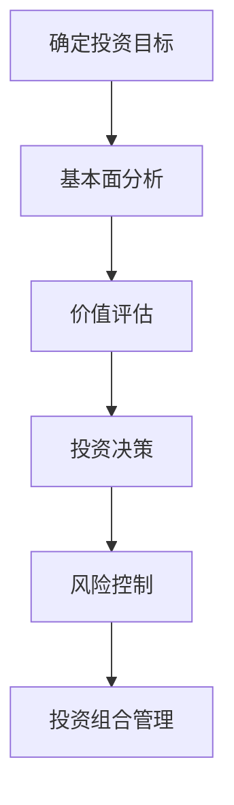

                 


# 彼得林奇的"长期价值"投资案例分析

> 关键词：彼得林奇，长期价值投资，投资策略，案例分析，价值评估

> 摘要：本文通过分析彼得林奇的长期价值投资理念，结合其投资案例，深入探讨了长期价值投资的核心概念、数学模型、算法原理、系统架构设计以及实战应用。文章以清晰的逻辑和专业的技术语言，详细解读了彼得林奇的投资策略，并通过实际案例分析，为读者提供了深刻的见解和实用的建议。

---

# 第一部分：彼得林奇与长期价值投资概述

## 第1章：彼得林奇与长期价值投资概述

### 1.1 彼得林奇的生平与投资理念

#### 1.1.1 彼得林奇的生平简介

彼得·林奇（Peter Lynch）是美国著名的投资家和基金经理，被誉为“共同基金之王”。他从1974年到1990年担任富达麦哲伦基金（Fidelity Magellan Fund）的经理，在此期间，他以卓越的投资业绩闻名于世，年平均回报率达到29%。林奇的投资风格以长期价值投资为核心，注重对公司基本面的深入研究和长期持有。

#### 1.1.2 彼得林奇的投资理念与风格

彼得林奇的投资理念可以概括为“长期价值投资”。他认为，成功的投资不仅需要对市场有深刻的理解，还需要对公司、行业和经济趋势有敏锐的洞察力。他强调选择那些具有强大竞争优势、良好管理团队和持续增长潜力的公司，并长期持有这些股票。

#### 1.1.3 长期价值投资的核心思想

长期价值投资的核心思想在于关注企业的内在价值，而非市场的短期波动。林奇认为，市场的短期波动往往掩盖了企业的真正价值，因此投资者应该以长期的视角来看待投资，耐心等待企业的价值逐渐显现。

### 1.2 长期价值投资的定义与特点

#### 1.2.1 长期价值投资的定义

长期价值投资是一种以长期持有优质资产为核心策略的投资方法。它强调通过对企业基本面的深入分析，选择那些具有持续增长潜力和竞争优势的公司，并在较长的时间内持有这些资产，以实现资本的增值。

#### 1.2.2 长期价值投资的核心特点

- **长期持有**：长期价值投资的核心是长期持有优质资产，避免频繁交易。
- **价值导向**：注重企业的内在价值，而非市场的短期波动。
- **基本面分析**：通过对企业财务状况、行业地位和管理团队的分析，选择具有竞争优势的公司。
- **分散投资**：通过分散投资降低风险，同时捕捉多个优质资产的增长潜力。

#### 1.2.3 长期价值投资与短期投资的区别

| 特性 | 长期价值投资 | 短期投资 |
|------|---------------|----------|
| 时间跨度 | 长期持有（数年） | 短期交易（数周或数月） |
| 投资目标 | 寻找具有长期增长潜力的公司 | 利用市场波动获利 |
| 风险控制 | 通过分散投资降低风险 | 风险较高，依赖市场短期波动 |

### 1.3 彼得林奇投资策略的背景与环境

#### 1.3.1 美国20世纪80年代的经济环境

20世纪80年代的美国经济经历了 stagflation（停滞膨胀）之后逐渐复苏，企业盈利能力提升，市场整体呈现上升趋势。这一时期为长期价值投资提供了良好的环境。

#### 1.3.2 美国共同基金行业的发展现状

20世纪70年代末至90年代初，美国共同基金行业经历了快速增长，投资者对专业管理的需求增加。富达麦哲伦基金在这一时期成为市场的领导者，彼得林奇的管理风格和投资理念也为基金的成功奠定了基础。

#### 1.3.3 彼得林奇投资策略的形成背景

彼得林奇的投资策略形成于对市场波动和企业基本面的深刻理解。他意识到，市场的短期波动往往掩盖了企业的真正价值，因此选择长期持有优质资产成为其投资的核心策略。

---

## 第2章：长期价值投资的核心概念

### 2.1 长期价值投资的核心概念

#### 2.1.1 长期价值投资的三要素

长期价值投资的核心要素包括：

1. **企业内在价值**：企业的内在价值是其未来现金流的现值，反映了企业的实际盈利能力。
2. **竞争优势**：企业必须具备强大的竞争优势，能够在行业中长期保持领先地位。
3. **管理团队**：优秀的管理团队是企业持续增长的关键，彼得林奇非常重视企业高层的管理能力和战略眼光。

#### 2.1.2 长期价值投资的三要素对比表格

| 要素 | 描述 |
|------|------|
| 企业内在价值 | 企业未来现金流的现值，反映其盈利能力 |
| 竞争优势 | 企业在市场中的独特优势，如技术、品牌、成本等 |
| 管理团队 | 企业的管理能力和战略眼光，影响企业长期发展 |

#### 2.1.3 长期价值投资的ER实体关系图

```mermaid
erDiagram
    investor -> holds : "持有"
    company -> has : "具有"
    company -> managed_by : "由...管理"
    investor -> selects : "选择"
    company -> generates : "产生"
    value -> determined : "由...决定"
    company -> impacts : "影响"
    market -> driven_by : "由...驱动"
```

---

### 2.2 长期价值投资的数学模型

#### 2.2.1 长期价值投资的数学模型

长期价值投资的核心是通过对企业内在价值的评估，确定其合理的价格区间。以下是彼得林奇常用的价值评估模型：

$$ \text{内在价值} = \sum_{t=1}^{n} \frac{\text{现金流}_t}{(1 + r)^t} $$

其中，$r$ 是折现率，$n$ 是企业的生命周期。

#### 2.2.2 长期价值投资的数学公式

彼得林奇认为，企业的内在价值可以通过对其未来现金流的贴现来计算。以下是一个简化的公式：

$$ \text{内在价值} = \frac{\text{现金流}_1}{(1 + r)} + \frac{\text{现金流}_2}{(1 + r)^2} + \dots + \frac{\text{现金流}_n}{(1 + r)^n} $$

其中，$r$ 是折现率，$n$ 是企业的生命周期。

#### 2.2.3 长期价值投资的数学模型实例

假设某企业的未来现金流如下：

- 年现金流：$100, 200, 300, 400$
- 折现率：$r = 0.10$

计算其内在价值：

$$ \text{内在价值} = \frac{100}{1.1} + \frac{200}{1.1^2} + \frac{300}{1.1^3} + \frac{400}{1.1^4} $$

计算结果为：

$$ \text{内在价值} ≈ 751.31 $$

---

### 2.3 长期价值投资的算法原理

#### 2.3.1 长期价值投资的算法流程

1. **确定投资目标**：选择具有长期增长潜力的行业和企业。
2. **基本面分析**：对企业财务状况、竞争优势和管理团队进行深入分析。
3. **价值评估**：计算企业的内在价值，确定其合理的价格区间。
4. **投资决策**：根据价值评估结果，决定是否买入、持有或卖出。
5. **风险控制**：通过分散投资和定期评估，降低投资风险。

#### 2.3.2 长期价值投资的算法实现

以下是长期价值投资的算法实现流程图：



---

### 2.4 长期价值投资的系统分析与架构设计

#### 2.4.1 投资框架设计

1. **投资目标设定**：选择具有长期增长潜力的行业和企业。
2. **投资策略选择**：制定基于基本面分析和价值评估的投资策略。
3. **投资组合管理**：通过分散投资降低风险，优化投资组合的回报率。

#### 2.4.2 风险控制设计

1. **风险评估指标**：包括波动率、β值、VaR等。
2. **风险分散策略**：通过投资不同行业和资产类别降低风险。
3. **风险监控机制**：定期评估投资组合的风险状况，及时调整投资策略。

---

### 2.5 长期价值投资的项目实战

#### 2.5.1 投资案例分析

以彼得林奇投资的某公司为例，分析其投资过程和结果：

1. **公司基本面分析**：企业具有强大的竞争优势和良好的管理团队。
2. **价值评估**：计算企业的内在价值，确定其合理的价格区间。
3. **投资决策**：根据价值评估结果，决定买入并长期持有。
4. **投资结果**：企业股价长期上涨，投资回报率显著。

#### 2.5.2 投资策略优化

1. **优化方向**：根据市场变化和企业基本面，定期评估和调整投资策略。
2. **优化方法**：通过动态调整投资组合，捕捉新的投资机会。
3. **优化效果**：投资组合的回报率和抗风险能力显著提升。

---

## 第3章：长期价值投资的最佳实践与总结

### 3.1 投资过程中的注意事项

#### 3.1.1 风险控制的重要性

长期价值投资需要注重风险控制，避免过度集中投资或忽视市场风险。

#### 3.1.2 投资心态的调整

投资者需要保持耐心和纪律，避免被市场的短期波动所影响。

#### 3.1.3 投资纪律的遵守

严格遵守投资策略和纪律，避免情绪化投资。

### 3.2 投资策略的持续优化

#### 3.2.1 投资策略的定期评估

定期评估投资策略的有效性和适应性，及时进行调整。

#### 3.2.2 投资策略的动态调整

根据市场变化和企业基本面，动态调整投资策略。

#### 3.2.3 投资策略的长期坚持

长期坚持投资策略，避免频繁更换或盲目跟风。

### 3.3 投资总结与展望

#### 3.3.1 投资过程中的经验总结

长期价值投资需要深入的企业基本面分析和长期的耐心等待。

#### 3.3.2 长期价值投资的未来展望

随着全球经济的发展和市场环境的变化，长期价值投资将继续作为一种有效的投资策略。

#### 3.3.3 投资

---

**作者：AI天才研究院/AI Genius Institute & 禅与计算机程序设计艺术 /Zen And The Art of Computer Programming**

---

这篇文章通过详细的分析和实例，深入探讨了彼得林奇的长期价值投资理念，并结合实际案例，为读者提供了深刻的投资见解。

