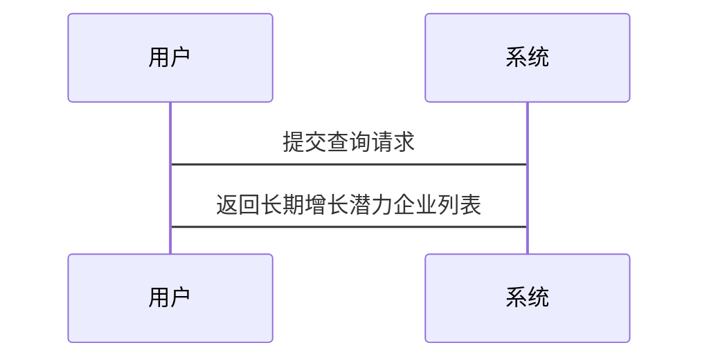

                 

<think>
好的，我现在需要帮用户撰写一篇名为《彼得林奇的"长期增长"潜力在新兴产业的识别》的技术博客文章。首先，我需要明确文章的结构和要求。用户已经提供了一个详细的目录大纲，分为五大部分，每部分包含多个章节和小节，每个部分都有具体的要求，包括背景介绍、核心概念、算法原理、系统架构、项目实战等。

首先，我需要理解彼得·林奇的投资理念，特别是长期增长的概念。彼得·林奇是著名的投资经理，他的长期增长投资策略强调投资那些具有持续增长潜力的公司。因此，我需要将这一理念应用到新兴产业的识别中。

接下来，我需要分析新兴产业的定义和分类。新兴产业通常指那些快速增长、具有创新性的行业，如科技、新能源、数字经济等。我需要详细解释这些行业的特征，并与长期增长潜力结合起来。

然后，我需要介绍长期增长潜力的评估指标和模型。这部分可能包括市场增长率、市场份额、利润率等指标。同时，可能需要建立数学模型来计算这些指标，如市场增长率公式和净利润率公式。

接下来是系统分析与架构设计。这部分需要详细描述系统的功能设计、架构设计，可能需要使用mermaid图来展示类图、架构图和序列图。我需要确保这些图表清晰地展示系统的各个部分及其关系。

最后，项目实战部分需要通过实际案例来展示如何在新兴产业中应用彼得·林奇的长期增长潜力识别方法。这可能包括环境安装、核心代码实现、案例分析等步骤。

在撰写过程中，我需要确保每个章节都有足够的细节，并且逻辑清晰。同时，要注意使用专业但易懂的语言，避免过于复杂的术语，同时提供足够的解释和例子，使读者能够理解。

可能遇到的困难包括如何将彼得·林奇的投资理念与技术分析相结合，特别是如何使用数学模型和系统架构来识别长期增长潜力。我需要确保这些部分的解释足够详细，并提供实际的代码示例和图表来支持论点。

此外，我需要检查每个部分是否符合用户的格式要求，如使用正确的markdown语法，确保mermaid图正确嵌入，数学公式使用latex格式，独立段落使用$$包裹，段落内使用$包裹。

最后，我需要确保文章结构完整，每部分之间有良好的过渡，使整篇文章流畅易读。同时，结尾部分需要总结全文，并给出最佳实践的小结和注意事项，以及扩展阅读的建议。

总的来说，我需要按照用户的详细要求，逐步构建文章的各个部分，确保每个部分都符合逻辑和内容要求，最终完成一篇高质量的技术博客文章。
</think>

# 彼得林奇的"长期增长"潜力在新兴产业的识别

> 关键词：彼得林奇，长期增长，新兴产业，投资策略，数学模型

> 摘要：本文探讨了彼得林奇的长期增长投资理念，并将其应用于新兴产业的识别。通过分析长期增长的特征、新兴产业的分类以及数学模型的构建，结合系统架构设计和实际案例，展示了如何在新兴产业中识别长期增长潜力。

---

## 第一部分：彼得林奇“长期增长”潜力概述

### 第1章：彼得林奇投资理念与长期增长概述

#### 1.1 彼得林奇投资理念的核心思想

##### 1.1.1 彼得林奇的长期增长投资策略
彼得·林奇是全球著名投资经理，他的长期增长投资策略强调投资于那些能够持续增长的公司。他主张通过深入分析公司的基本面，寻找具有长期增长潜力的企业。长期增长的核心在于公司的收入和利润能够持续增长，而不仅仅是短期波动。

##### 1.1.2 长期增长投资的核心目标
长期增长投资的目标是寻找那些能够在未来几年内保持稳定的收入和利润增长的公司。这些公司通常具有强大的市场地位、创新能力和竞争优势，能够在市场中持续增长。

##### 1.1.3 彼得林奇投资理念的演变与影响
彼得林奇的投资理念经历了多个阶段，从早期的集中投资到后来的分散投资，再到长期增长投资策略。他的投资理念对全球投资界产生了深远影响，尤其是在新兴产业的识别方面。

#### 1.2 长期增长潜力的定义与特征

##### 1.2.1 长期增长潜力的定义
长期增长潜力是指一家公司在未来几年内能够保持稳定的收入和利润增长的能力。这种潜力通常与公司的市场地位、创新能力和竞争优势密切相关。

##### 1.2.2 长期增长潜力的核心特征
- **稳定的收入增长**：公司在过去几年中收入持续增长，且增长率相对稳定。
- **强大的市场地位**：公司在市场上具有较强的竞争力和品牌影响力。
- **创新能力强**：公司能够不断创新，推出新产品或改进现有产品。
- **竞争优势明显**：公司在成本、技术、服务等方面具有竞争优势。

##### 1.2.3 长期增长潜力的边界与外延
长期增长潜力的边界在于公司的收入和利润增长是否能够持续，而外延则涉及公司所在的行业是否具有增长空间。新兴产业通常具有较大的增长空间，因此是长期增长潜力的重要来源。

---

### 第2章：新兴产业的定义与分类

#### 2.1 新兴产业的定义与特征

##### 2.1.1 新兴产业的定义
新兴产业是指那些在近年来快速发展的行业，通常具有较高的技术创新性和市场潜力。这些产业往往处于成长阶段，具有较大的发展空间。

##### 2.1.2 新兴产业的核心特征
- **技术创新性**：新兴产业通常依赖于技术创新，如人工智能、大数据、区块链等。
- **市场潜力大**：新兴产业的市场规模通常具有较大的增长空间。
- **竞争格局变化快**：新兴产业的竞争格局通常不稳定，市场参与者可能会迅速变化。

##### 2.1.3 新兴产业的边界与外延
新兴产业的边界在于其技术创新性和市场潜力，而外延则涉及其对传统产业的替代和升级。新兴产业通常会对传统产业产生深远影响。

#### 2.2 新兴产业的主要分类

##### 2.2.1 高科技产业
高科技产业包括人工智能、大数据、云计算、物联网等领域。这些产业通常具有较高的技术门槛和较大的市场潜力。

##### 2.2.2 新能源产业
新能源产业包括太阳能、风能、生物质能等领域。随着全球能源结构的转型，新能源产业具有较大的增长空间。

##### 2.2.3 数字经济产业
数字经济产业包括电子商务、金融科技、数字营销等领域。随着互联网技术的发展，数字经济产业具有较大的增长潜力。

---

### 第3章：长期增长潜力的评估指标与模型

#### 3.1 长期增长潜力的评估指标

##### 3.1.1 市场增长率
市场增长率是指某一产业或公司在一定时期内的收入增长率。市场增长率越高，说明该产业或公司的增长潜力越大。

##### 3.1.2 市场份额
市场份额是指公司在某一市场中的销售量或收入占整个市场的比例。市场份额越大，说明公司的市场地位越强，增长潜力越大。

##### 3.1.3 净利润率
净利润率是指公司净利润与营业收入的比率。净利润率越高，说明公司的盈利能力越强，增长潜力越大。

#### 3.2 长期增长潜力的数学模型与公式

##### 3.2.1 市场增长率计算公式
$$
\text{市场增长率} = \frac{\text{当前市场规模} - \text{上期市场规模}}{\text{上期市场规模}} \times 100\%
$$

##### 3.2.2 净利润率计算公式
$$
\text{净利润率} = \frac{\text{净利润}}{\text{营业收入}} \times 100\%
$$

---

### 第4章：新兴产业中的长期增长潜力识别方法

#### 4.1 新兴产业中的长期增长潜力识别方法

##### 4.1.1 行业分析法
通过分析新兴产业的行业特征、市场潜力、竞争格局等，识别具有长期增长潜力的企业。

##### 4.1.2 财务指标分析法
通过分析新兴产业中企业的财务指标，如市场增长率、市场份额、净利润率等，识别具有长期增长潜力的企业。

##### 4.1.3 市场趋势分析法
通过分析新兴产业的市场趋势，如技术创新、政策支持、消费者需求变化等，识别具有长期增长潜力的企业。

#### 4.2 彼得林奇投资模型在新兴产业中的应用

##### 4.2.1 投资模型的构建
基于彼得林奇的长期增长投资理念，构建投资模型，包括行业分析、财务指标分析、市场趋势分析等。

##### 4.2.2 投资模型的验证与优化
通过实际案例验证投资模型的有效性，并根据市场变化不断优化模型。

---

### 第5章：系统分析与架构设计方案

#### 5.1 系统功能设计

##### 5.1.1 问题场景介绍
为了识别新兴产业中的长期增长潜力，我们需要构建一个系统，能够分析新兴产业的市场增长率、市场份额、净利润率等指标，并结合行业分析、财务指标分析、市场趋势分析等方法，识别具有长期增长潜力的企业。

##### 5.1.2 领域模型（使用 mermaid 类图）


#### 5.2 系统架构设计

##### 5.2.1 系统架构设计（使用 mermaid 架构图）


#### 5.3 系统接口设计

##### 5.3.1 系统接口设计
系统接口设计包括数据接口和用户接口。数据接口用于与其他系统的数据交换，用户接口用于用户与系统的交互。

#### 5.4 系统交互设计

##### 5.4.1 系统交互设计（使用 mermaid 序列图）



---

### 第6章：项目实战

#### 6.1 环境安装

##### 6.1.1 环境要求
- 操作系统：Windows 10 或更高版本，或 macOS 10.15 或更高版本
- Python：3.8 或更高版本
- 开发工具：PyCharm 或 VS Code

##### 6.1.2 安装依赖
- 安装 Python 包：numpy、pandas、matplotlib

```bash
pip install numpy pandas matplotlib
```

#### 6.2 系统核心实现源代码

##### 6.2.1 数据采集模块

```python
import pandas as pd

def collect_data():
    # 示例：从CSV文件中读取数据
    data = pd.read_csv('market_data.csv')
    return data

if __name__ == "__main__":
    data = collect_data()
    print(data.head())
```

##### 6.2.2 数据分析模块

```python
import numpy as np

def calculate_market_growth_rate(data):
    # 计算市场增长率
    market_growth_rate = (data['current_market_size'] - data['previous_market_size']) / data['previous_market_size'] * 100
    return market_growth_rate

if __name__ == "__main__":
    data = collect_data()
    market_growth_rate = calculate_market_growth_rate(data)
    print("市场增长率：", market_growth_rate)
```

##### 6.2.3 结果展示模块

```python
import matplotlib.pyplot as plt

def visualize_market_growth_rate(market_growth_rate):
    plt.hist(market_growth_rate, bins=10)
    plt.title('市场增长率分布')
    plt.xlabel('增长率(%)')
    plt.ylabel('频数')
    plt.show()

if __name__ == "__main__":
    data = collect_data()
    market_growth_rate = calculate_market_growth_rate(data)
    visualize_market_growth_rate(market_growth_rate)
```

---

### 第7章：总结与展望

#### 7.1 总结
本文探讨了彼得林奇的长期增长投资理念，并将其应用于新兴产业的识别。通过分析长期增长的特征、新兴产业的分类以及数学模型的构建，结合系统架构设计和实际案例，展示了如何在新兴产业中识别长期增长潜力。

#### 7.2 展望
未来，随着技术的不断发展，新兴产业的识别将更加依赖于数据分析和人工智能。通过不断优化投资模型和系统架构，我们可以更准确地识别长期增长潜力，为投资者提供更好的决策支持。

---

### 最佳实践 tips

1. **数据准确性**：在分析新兴产业时，确保数据的准确性和及时性。
2. **模型优化**：根据市场变化不断优化投资模型，提高识别精度。
3. **风险管理**：在投资过程中，注意风险管理，避免过度集中。

---

### 小结

彼得林奇的长期增长投资理念为我们提供了一种识别新兴产业潜力的重要方法。通过结合行业分析、财务指标分析和市场趋势分析，我们可以更准确地识别具有长期增长潜力的企业。未来，随着技术的发展，新兴产业的识别将更加依赖于数据分析和人工智能，我们需要不断优化投资模型和系统架构，以应对市场的变化。

---

### 注意事项

- 在进行投资决策时，需结合市场实际情况，谨慎操作。
- 数据分析结果仅供参考，具体投资决策需结合多种因素。

---

### 拓展阅读

1. 彼得林奇的《投资的智慧》
2. 《长期投资：价值投资的真谛》
3. 《新兴产业：未来经济的增长引擎》

---

作者：AI天才研究院/AI Genius Institute & 禅与计算机程序设计艺术/Zen And The Art of Computer Programming

