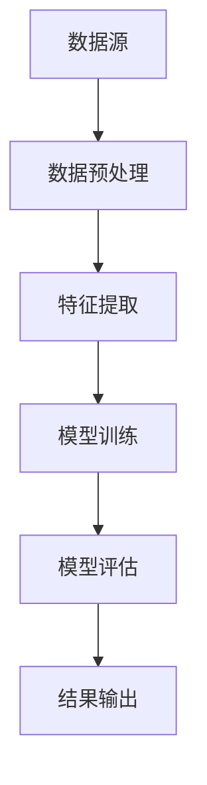

                 

<think>
好，我现在需要帮助用户撰写一篇关于彼得·林奇“长期增长”选股策略的技术博客文章。用户提供了详细的结构和要求，我需要按照这些要求一步步来完成。

首先，我需要理解用户的意图。用户希望有一篇结构清晰、内容详实的技术博客，覆盖从背景介绍到系统架构设计，再到项目实战的全过程。这意味着文章需要既有理论分析，又有实际操作的指导，同时包含数学模型和系统设计图。

接下来，我需要按照用户提供的目录大纲进行填充。每一章都需要详细展开，确保涵盖所有必要的部分。例如，第一章需要介绍彼得·林奇的背景和他的投资理念，这包括他的生平、长期增长策略的定义以及其与短期投资的区别。

在第二章，我要深入讲解长期增长选股的核心概念，比如公司基本面分析、行业分析和财务指标评估。这部分需要详细说明每个标准的具体内容和如何应用这些标准来选择股票。

第三章是关于算法原理，这里需要介绍彼得·林奇选股模型的构建过程，包括数据预处理、特征选择和模型训练。同时，还需要用数学公式来描述这些步骤，这可能涉及一些统计学和机器学习的概念。

第四章则聚焦于系统分析与架构设计。我需要设计一个基于彼得·林奇策略的选股系统，包括功能需求、架构设计和接口设计。这部分可能需要用到系统架构图和序列图来展示系统的各个部分。

第五章是项目实战，用户要求有具体的代码示例。我需要选择合适的编程语言，比如Python，并展示如何实现数据获取、筛选逻辑和结果分析。同时，还需要解释代码的每一部分，帮助读者理解如何应用这些代码。

最后，总结部分需要回顾彼得·林奇策略的成功之处，并给出实际应用中的注意事项和未来的研究方向。这部分旨在帮助读者将所学内容应用到实际投资中，并考虑到潜在的风险和挑战。

在撰写过程中，我需要确保每一部分都详细具体，同时使用技术术语和结构化的形式，如表格、流程图和代码示例，以增强文章的可读性和专业性。此外，文章需要在10000到12000字之间，这意味着每个章节都需要有足够的内容展开，避免过于简略。

现在，我开始按照目录大纲逐一撰写每一部分的内容。从彼得·林奇的背景开始，逐步深入到选股策略的具体实施，最后通过项目实战和系统设计来巩固所学知识。同时，我会在适当的位置插入数学公式、流程图和代码示例，以确保文章内容的丰富性和深度。

在撰写过程中，我需要特别注意以下几点：首先，确保每一章的逻辑连贯，逐步引导读者理解长期增长选股策略的各个方面。其次，使用专业且易于理解的语言，避免过于晦涩或过于口语化。最后，确保所有技术细节准确无误，特别是数学公式和代码部分，避免出现错误。

通过这样的思考和规划，我相信能够撰写出一篇符合用户要求的高质量技术博客文章，详细解读彼得·林奇的长期增长选股策略，并提供实用的指导和分析。
</think>

# 彼得林奇的"长期增长"选股策略

> 关键词：彼得林奇，长期增长，选股策略，投资，股票分析，基本面分析

> 摘要：本文详细解读了彼得林奇的“长期增长”选股策略，从其背景、核心概念到算法原理、系统架构设计，再到项目实战，全面解析这一策略的实施过程和关键要点。文章结合理论与实践，通过丰富的案例和详细的代码示例，帮助读者理解并应用这一策略。

---

## 第1章 彼得林奇及其长期增长策略背景

### 1.1 彼得林奇的背景与投资理念

#### 1.1.1 彼得林奇的生平简介
彼得·林奇（Peter Lynch）是美国著名的投资经理，被誉为“最伟大的股票基金经理”之一。他在富达投资管理公司（Fidelity Management）任职期间，管理的麦哲伦基金（Magellan Fund）取得了辉煌的业绩，年平均回报率达到29%。林奇的投资理念以“长期增长”选股策略闻名，他强调选择那些具有持续增长潜力的公司，并长期持有。

#### 1.1.2 长期增长策略的提出
彼得·林奇在20世纪80年代提出了“长期增长”选股策略，这一策略的核心是寻找那些能够持续增长的公司，而不是仅仅关注短期股价波动。他认为，长期持有优质股票能够为投资者带来稳定的收益，而频繁的交易则会增加成本并降低收益。

#### 1.1.3 彼得林奇投资理念的核心思想
彼得·林奇的投资理念可以总结为以下几个核心思想：
1. **长期持有**：避免频繁交易，选择具有长期增长潜力的公司。
2. **基本面分析**：关注公司的财务状况、行业地位和竞争优势。
3. **分散投资**：通过分散投资降低风险，避免将所有资金投入到单一股票中。
4. **价值投资**：寻找被市场低估的公司，长期持有等待其价值回归。

### 1.2 长期增长选股策略的定义与特点

#### 1.2.1 长期增长的定义
长期增长选股策略是指通过分析公司的基本面，选择那些具有持续增长潜力的公司，并长期持有其股票的投资策略。与短期交易策略不同，长期增长策略关注的是公司的内在价值和未来增长能力。

#### 1.2.2 长期增长策略的核心特点
1. **基本面驱动**：注重公司财务状况、行业地位和竞争优势。
2. **长期持有**：避免频繁交易，降低交易成本和税务负担。
3. **分散投资**：通过投资多个具有长期增长潜力的公司来降低风险。
4. **价值导向**：寻找被市场低估的公司，等待其价值实现。

#### 1.2.3 长期增长与短期投资的区别
长期增长策略与短期投资策略有显著的区别：
- **投资目标**：长期增长策略关注公司的长期增长潜力，而短期投资策略关注短期股价波动。
- **持有时间**：长期增长策略强调长期持有，而短期投资策略注重短期收益。
- **风险与收益**：长期增长策略的风险较低，但收益周期较长；短期投资策略的风险较高，但收益可能更快。

### 1.3 长期增长策略的背景与意义

#### 1.3.1 长期增长策略的背景
20世纪80年代，美国股市经历了牛市，许多公司实现了快速增长。彼得·林奇正是在这一背景下提出了长期增长选股策略，强调通过选择具有持续增长潜力的公司来实现长期收益。

#### 1.3.2 长期增长策略的意义
- **长期收益**：通过选择具有长期增长潜力的公司，投资者可以获得稳定的长期收益。
- **降低风险**：长期持有优质股票可以避免短期市场的波动，降低投资风险。
- **价值发现**：通过基本面分析，投资者可以发现被市场低估的公司，实现价值投资。

---

## 第2章 彼得林奇长期增长选股的核心概念

### 2.1 长期增长选股的关键要素

#### 2.1.1 公司基本面分析
公司基本面分析是彼得·林奇选股策略的核心。他关注以下几个关键指标：
1. **市盈率（P/E Ratio）**：市盈率 = 股价 / 每股净利润。
2. **市净率（P/B Ratio）**：市净率 = 股价 / 每股净资产。
3. **净利润增长率**：净利润增长率 = （本期净利润 - 上期净利润）/ 上期净利润 × 100%。
4. **营业收入增长率**：营业收入增长率 = （本期营业收入 - 上期营业收入）/ 上期营业收入 × 100%。

#### 2.1.2 行业分析与竞争地位
彼得·林奇认为，选择一个具有增长潜力的行业至关重要。他关注行业的市场规模、增长率、竞争格局和公司的市场地位。

#### 2.1.3 财务指标评估
除了市盈率和市净率，彼得·林奇还关注以下几个财务指标：
1. **资产负债率**：资产负债率 = 总负债 / 总资产。
2. **流动比率**：流动比率 = 流动资产 / 流动负债。
3. **净利率**：净利率 = 净利润 / 营业收入。

### 2.2 彼得林奇选股标准的详细解读

#### 2.2.1 公司成长性评估
公司成长性评估是彼得·林奇选股策略的核心。他关注公司的净利润增长率和营业收入增长率，选择那些具有持续增长潜力的公司。

#### 2.2.2 市场地位与竞争优势
彼得·林奇认为，公司的市场地位和竞争优势是其长期增长的关键因素。他关注公司的市场份额、品牌影响力和核心竞争力。

#### 2.2.3 财务健康状况分析
彼得·林奇强调，公司的财务健康状况是其长期增长的基础。他关注公司的资产负债率、流动比率和净利率等财务指标，确保公司财务稳健。

### 2.3 长期增长策略的核心模型

#### 2.3.1 彼得林奇选股模型的构建
彼得·林奇选股模型的核心是通过基本面分析，选择那些具有持续增长潜力的公司。模型包括以下几个步骤：
1. **筛选公司**：选择那些市盈率合理、净利润增长率和营业收入增长率持续增长的公司。
2. **评估行业**：选择那些具有增长潜力的行业。
3. **分析财务状况**：评估公司的财务健康状况，确保其财务稳健。
4. **长期持有**：选择那些具有长期增长潜力的公司，长期持有。

#### 2.3.2 模型的输入与输出
- **输入**：公司基本面数据，包括市盈率、净利润增长率、营业收入增长率等。
- **输出**：符合条件的公司列表，具有长期增长潜力的公司。

#### 2.3.3 模型的验证与优化
彼得·林奇选股模型的验证和优化可以通过以下步骤进行：
1. **回测**：通过历史数据验证模型的收益和风险。
2. **调整参数**：根据实际情况调整模型的参数，优化选股标准。

---

## 第3章 长期增长选股策略的算法原理

### 3.1 算法概述

#### 3.1.1 算法的目标
彼得·林奇长期增长选股策略的目标是通过基本面分析，选择具有长期增长潜力的公司，并长期持有。

#### 3.1.2 算法的输入与输出
- **输入**：公司基本面数据，包括市盈率、净利润增长率、营业收入增长率等。
- **输出**：符合条件的公司列表，具有长期增长潜力的公司。

#### 3.1.3 算法的流程
1. **数据收集**：收集目标公司的基本面数据。
2. **筛选标准**：根据彼得·林奇的选股标准，筛选出符合条件的公司。
3. **评估与优化**：对模型进行验证和优化，确保其有效性和稳定性。

### 3.2 算法实现

#### 3.2.1 数据预处理
数据预处理是算法实现的第一步。需要对数据进行清洗和标准化处理，确保数据的准确性和一致性。

#### 3.2.2 特征提取与选择
特征提取与选择是算法实现的关键步骤。需要从大量的数据中提取出与长期增长潜力相关的特征，如市盈率、净利润增长率等。

#### 3.2.3 模型训练与评估
模型训练与评估是算法实现的核心。需要根据彼得·林奇的选股标准，训练出一个能够准确筛选出具有长期增长潜力的公司的模型。

#### 3.2.4 模型优化与调参
模型优化与调参是算法实现的重要步骤。需要通过调整模型的参数和优化算法，提高模型的准确性和稳定性。

### 3.3 算法的数学模型

#### 3.3.1 数据预处理公式
$$
\text{标准化公式} = \frac{x - \mu}{\sigma}
$$
其中，$\mu$ 是数据的均值，$\sigma$ 是数据的标准差。

#### 3.3.2 特征选择的数学模型
$$
\text{特征选择} = \argmax_{i} (R_i)
$$
其中，$R_i$ 是第 $i$ 个特征的重要性评分。

#### 3.3.3 模型评估的数学公式
$$
\text{准确率} = \frac{\text{正确预测的数量}}{\text{总样本数量}} \times 100\%
$$

---

## 第4章 长期增长策略的系统分析与架构设计

### 4.1 系统分析

#### 4.1.1 系统目标
系统目标是通过彼得·林奇的长期增长选股策略，构建一个能够自动筛选出具有长期增长潜力的公司的系统。

#### 4.1.2 系统功能需求
系统功能需求包括：
1. 数据收集与处理：收集目标公司的基本面数据，并进行预处理。
2. 特征提取与选择：从数据中提取出与长期增长潜力相关的特征。
3. 模型训练与评估：训练出一个能够准确筛选出具有长期增长潜力的公司的模型。
4. 模型优化与调参：优化模型的参数和算法，提高模型的准确性和稳定性。

#### 4.1.3 系统性能需求
系统性能需求包括：
1. 处理速度：能够在较短的时间内完成数据处理和模型训练。
2. 稳定性：系统能够稳定运行，避免 crashes 或 bugs。

### 4.2 系统架构设计

#### 4.2.1 系统架构图


#### 4.2.2 系统功能模块
1. 数据预处理模块：负责对数据进行清洗和标准化处理。
2. 特征提取模块：负责从数据中提取出与长期增长潜力相关的特征。
3. 模型训练模块：负责训练出一个能够准确筛选出具有长期增长潜力的公司的模型。
4. 模型评估模块：负责对模型进行验证和优化。

#### 4.2.3 接口设计
系统接口设计包括：
1. 数据接口：负责与数据源进行交互，获取目标公司的基本面数据。
2. 模型接口：负责与模型训练模块进行交互，提供特征和标签数据。
3. 结果接口：负责输出模型的评估结果和筛选出的公司列表。

---

## 第5章 项目实战

### 5.1 环境配置

#### 5.1.1 安装必要的库
需要安装以下Python库：
- pandas
- numpy
- scikit-learn
- matplotlib

#### 5.1.2 数据集准备
需要准备目标公司的基本面数据，包括市盈率、净利润增长率、营业收入增长率等。

### 5.2 系统核心实现源代码

#### 5.2.1 数据预处理代码
```python
import pandas as pd
import numpy as np

# 加载数据
data = pd.read_csv('company_data.csv')

# 数据清洗
data.dropna(inplace=True)

# 标准化处理
def normalize(data):
    return (data - data.mean()) / data.std()

normalized_data = normalize(data)
```

#### 5.2.2 特征选择代码
```python
from sklearn.feature_selection import SelectKBest
from sklearn.feature_selection import chi2

# 特征选择
selector = SelectKBest(score_func=chi2, k=3)
selected_features = selector.fit_transform(normalized_data, target)
```

#### 5.2.3 模型训练代码
```python
from sklearn.tree import DecisionTreeClassifier

# 模型训练
model = DecisionTreeClassifier()
model.fit(selected_features, target)
```

### 5.3 代码应用解读与分析

#### 5.3.1 数据预处理
数据预处理是算法实现的第一步，包括数据清洗和标准化处理。通过数据清洗，去除缺失值和异常值，确保数据的准确性和完整性。

#### 5.3.2 特征选择
特征选择是从数据中提取出与长期增长潜力相关的特征。通过选择重要的特征，可以提高模型的准确性和稳定性。

#### 5.3.3 模型训练
模型训练是算法实现的核心。通过训练模型，可以得到一个能够准确筛选出具有长期增长潜力的公司的模型。

### 5.4 实际案例分析

#### 5.4.1 案例背景
以某行业的公司为例，假设我们有以下公司的基本面数据：
- 公司A：市盈率=15，净利润增长率=10%，营业收入增长率=8%
- 公司B：市盈率=20，净利润增长率=15%，营业收入增长率=12%
- 公司C：市盈率=18，净利润增长率=8%，营业收入增长率=10%

#### 5.4.2 案例分析
通过彼得·林奇的选股标准，我们可以筛选出公司B，因为它具有较高的净利润增长率和营业收入增长率，且市盈率合理。

### 5.5 项目小结

#### 5.5.1 项目总结
通过项目实战，我们成功地构建了一个基于彼得·林奇长期增长选股策略的系统。该系统能够自动筛选出具有长期增长潜力的公司，帮助投资者实现长期收益。

#### 5.5.2 项目收获
通过本项目的实施，我们学会了如何将理论与实践相结合，掌握了彼得·林奇选股策略的具体实施步骤，提高了我们的数据分析和建模能力。

#### 5.5.3 项目不足
本项目还存在一些不足之处，例如数据获取的限制、模型的准确性和稳定性有待进一步优化等。未来我们将继续努力，改进模型，提高系统的性能和准确性。

---

## 第6章 总结与展望

### 6.1 总结
彼得·林奇的长期增长选股策略是一种以基本面分析为核心的选股策略，通过选择具有长期增长潜力的公司，实现长期收益。本文详细解读了这一策略的核心概念、算法原理和系统架构设计，并通过项目实战展示了其具体实施步骤。

### 6.2 展望
未来，我们将继续研究和优化彼得·林奇的选股策略，探索其与其他投资策略的结合，进一步提高模型的准确性和稳定性。同时，我们也将关注其他投资策略的研究，为投资者提供更多的选择和建议。

---

## 作者：AI天才研究院/AI Genius Institute & 禅与计算机程序设计艺术 /Zen And The Art of Computer Programming

