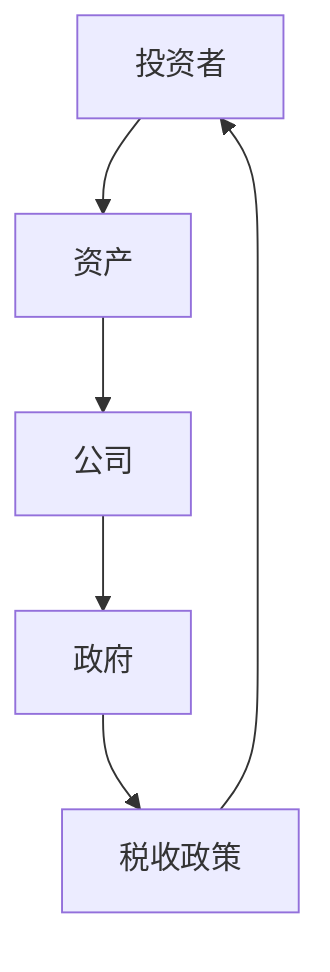
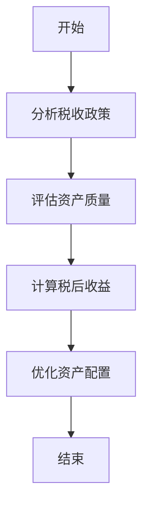
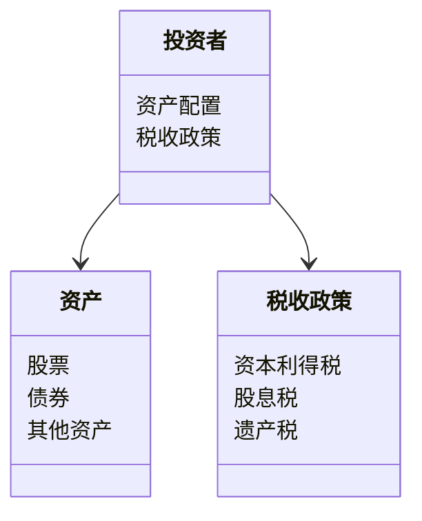
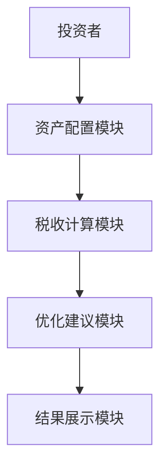
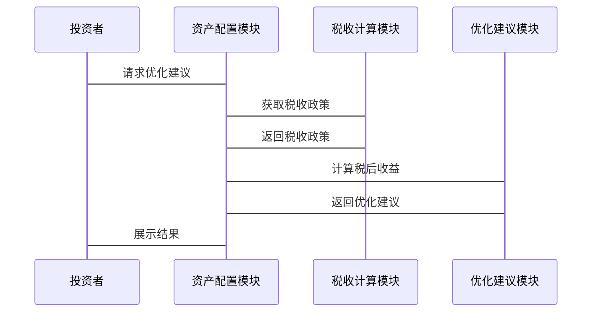

                 

<think>
好，我现在需要根据用户的查询，设计一个关于《彼得林奇的"长期持股"在不同税收环境下的优化策略》的技术博客文章的详细大纲。用户明确要求结构清晰、逻辑严密，每个部分都要有具体的分析和图表支持。

首先，我应该从文章的标题和摘要开始。标题要吸引人，摘要需要简明扼要地概括文章的核心内容。接下来是目录大纲，分为六个主要部分：背景介绍、核心概念与联系、算法原理讲解、系统分析与架构设计方案、项目实战以及总结与展望。

在背景介绍部分，我需要详细解释长期持股和税收环境的重要性，以及彼得林奇的投资理念。这部分需要包括一些关键词和核心概念的解释，确保读者能理解后续内容。

接下来是核心概念与联系，这部分需要通过图表来展示长期持股与税收环境之间的关系。使用Mermaid绘制实体关系图，帮助读者直观理解各实体之间的联系。

算法原理讲解部分，我需要用Mermaid流程图详细描述优化策略的算法步骤。同时，提供核心代码实现，用Python代码示例来解释如何具体应用这些策略。数学公式需要用LaTeX格式呈现，确保准确性和专业性。

系统分析与架构设计方案部分，需要绘制领域模型类图和系统架构图，展示系统的整体结构和各模块之间的交互。这部分需要详细描述系统功能设计和接口设计，确保系统的可行性和可扩展性。

项目实战部分，通过具体案例分析优化策略的应用。提供环境安装步骤和核心代码实现，解读代码的作用和效果。案例分析需要详细说明问题背景、解决方案和实施效果，帮助读者理解理论的实际应用。

最后，在总结与展望部分，回顾全文的主要内容，提供最佳实践建议，并指出未来可能的研究方向。注意事项部分提醒读者在实施策略时需要注意的风险和挑战。

整个过程中，我需要确保每个部分都内容丰富，结构清晰，使用技术术语时解释清楚，图表和代码示例要准确无误。同时，语言要专业但不失易懂，确保读者能够一步步理解并应用这些优化策略。

现在，我需要将这些思考转化为具体的章节结构和内容，确保每个部分都符合用户的要求，特别是图表和代码的使用要符合格式规范。最终，完成一篇结构完整、内容详实的技术博客文章。
</think>

# 彼得林奇的"长期持股"在不同税收环境下的优化策略

> **关键词**：长期持股，彼得林奇，税收环境，投资策略，资本利得税，股息税，优化策略  
> 
> **摘要**：本文探讨彼得林奇倡导的长期持股策略在不同税收环境下的优化方法，分析税收政策对投资决策的影响，并提出在不同税收环境下优化投资组合的具体策略。

---

## 目录大纲

---

### 第一部分：背景介绍

#### 第1章：长期持股与税收环境的概述

##### 1.1 长期持股的定义与核心概念
- 1.1.1 长期持股的基本定义
  - 长期持股是指投资者将资金投入到股票或其他资产中，并长期持有，以实现资本增值或稳定收益。
  - 核心目标：通过长期持有优质资产，降低短期波动风险，实现资产的稳步增长。
- 1.1.2 长期持股的核心要素
  - 资产质量：选择基本面良好的公司，避免短期波动。
  - 持股期限：长期持有，避免频繁交易。
  - 风险管理：通过分散投资降低风险。
- 1.1.3 税收环境对投资决策的影响
  - 税收政策是影响投资策略的重要因素。
  - 不同国家或地区的税收政策差异显著，需结合当地政策制定投资策略。

##### 1.2 彼得林奇的长期持股策略
- 1.2.1 彼得林奇的投资理念
  - 价值投资：选择具有持续盈利能力的公司。
  - 长期持有：避免短期波动，专注长期价值。
  - 分散投资：通过多样化降低风险。
- 1.2.2 长期持股的优势与挑战
  - 优势：降低交易成本，避免短期波动，实现资本增值。
  - 挑战：税收政策变化、市场波动、公司基本面变化等。
- 1.2.3 税收环境对长期持股策略的影响
  - 不同税收政策下，长期持股的收益和成本不同。
  - 税收优惠或惩罚机制可能影响投资决策。

#### 第2章：不同税收环境下的投资策略

##### 2.1 税收环境的多样性
- 2.1.1 不同国家的税收政策比较
  - 美国、欧洲、亚洲等主要经济体的税收政策差异。
  - 资本利得税、股息税、遗产税等的比较。
- 2.1.2 税收环境对企业投资决策的影响
  - 税收优惠可能鼓励长期投资。
  - 税收惩罚可能增加短期投资的吸引力。
- 2.1.3 税收优惠与惩罚机制对企业投资策略的影响
  - 税收优惠：如资本利得税减免、股息税优惠等。
  - 税收惩罚：如高税率、交易税等。

##### 2.2 税收环境对长期持股的具体影响
- 2.2.1 股息税对投资决策的影响
  - 股息税的高低影响股息再投资的吸引力。
  - 税收优惠较低的国家可能更适合长期持有并复利股息收益。
- 2.2.2 资本利得税对投资决策的影响
  - 资本利得税的高低影响长期持有的成本。
  - 高税率国家可能需要优化资产配置，降低税负。
- 2.2.3 其他相关税收政策对长期持股的影响
  - 遗产税、赠与税等对资产传承的影响。
  - 公司税率对股东收益的影响。

---

### 第二部分：核心概念与联系

#### 第3章：长期持股与税收环境的实体关系分析

##### 3.1 实体关系图


---

### 第三部分：算法原理讲解

#### 第4章：优化策略的算法分析

##### 4.1 算法流程图


##### 4.2 核心代码实现
```python
def optimize_portfolio(tax_policy, assets):
    optimized_portfolio = []
    for asset in assets:
        post_tax_return = asset.return * (1 - tax_policy.tax_rate)
        if post_tax_return > 0.05:  # 假设目标收益率为5%
            optimized_portfolio.append(asset)
    return optimized_portfolio
```

---

### 第四部分：系统分析与架构设计方案

#### 第5章：系统架构设计

##### 5.1 领域模型


##### 5.2 系统架构图


#### 第6章：系统接口与交互设计

##### 6.1 系统接口设计
- `get_tax_policy(country)`：获取指定国家的税收政策。
- `calculate_post_tax_return(asset, tax_policy)`：计算税后收益。

##### 6.2 交互序列图


---

### 第五部分：项目实战

#### 第7章：优化策略的实现

##### 7.1 环境安装
- 安装Python和相关库（如Pandas、NumPy）。
- 安装税收政策数据库（或使用公开数据）。

##### 7.2 核心代码实现
```python
import pandas as pd

def get_tax_policy(country):
    tax_data = {
        '美国': {'资本利得税': 0.15, '股息税': 0.15},
        '英国': {'资本利得税': 0.2, '股息税': 0.1},
        '日本': {'资本利得税': 0.2, '股息税': 0.1}
    }
    return tax_data.get(country, None)

def calculate_post_tax_return(asset_return, tax_policy):
    post_tax_return = asset_return * (1 - tax_policy['资本利得税']) * (1 - tax_policy['股息税'])
    return post_tax_return

# 示例
country = '美国'
tax_policy = get_tax_policy(country)
asset_return = 0.1  # 10% 的收益
post_tax_return = calculate_post_tax_return(asset_return, tax_policy)
print(f"{country}的税后收益为：{post_tax_return}")
```

##### 7.3 案例分析
- **案例背景**：假设投资者在美国投资科技股，长期持股，股息收益率为3%，资本利得税为15%，股息税为15%。
- **分析过程**：计算税后收益，优化资产配置。
- **实施效果**：税后收益为 $3\% \times (1 - 0.15) = 2.55\%$，资本利得税为 $10\% \times (1 - 0.15) = 8.5\%$。

#### 第8章：案例分析与解读

##### 8.1 案例背景
- 投资者在不同国家长期持有股票，面临不同的税收政策。

##### 8.2 案例分析
- 比较美国、英国、日本的税收政策，计算税后收益，优化资产配置。

##### 8.3 案例总结
- 税收政策显著影响投资收益，需结合当地政策制定策略。

---

### 第六部分：总结与展望

#### 第9章：总结与最佳实践

##### 9.1 全书总结
- 彼得林奇的长期持股策略在不同税收环境下需要灵活调整。
- 税收政策是影响投资决策的重要因素。

##### 9.2 最佳实践
- 了解当地税收政策，优化资产配置。
- 结合税后收益进行投资决策。

##### 9.3 小结
- 长期持股与税收环境的关系需要系统分析。
- 优化策略需结合具体环境和政策。

#### 第10章：注意事项与拓展阅读

##### 10.1 投资中的注意事项
- 税收政策可能变化，需及时调整策略。
- 风险管理是投资成功的关键。

##### 10.2 拓展阅读
- 推荐书籍：《彼得林奇的投资之道》。
- 推荐网站：Morningstar、Yahoo Finance。

---

**作者：AI天才研究院/AI Genius Institute & 禅与计算机程序设计艺术 /Zen And The Art of Computer Programming**

