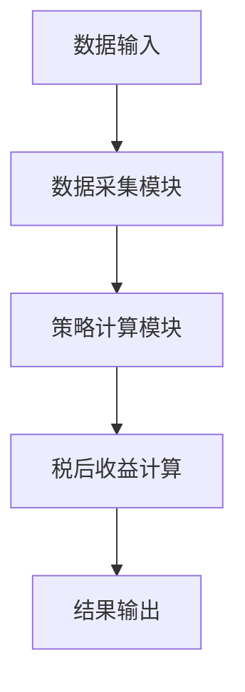

                 

<think>
好的，我需要帮助用户设计一本书的目录大纲，主题是《彼得林奇的"长期持股"在不同税收环境下的策略》。用户已经提供了一个详细的目录结构，并要求我按照这个结构生成符合约束条件的内容。首先，我需要仔细阅读用户的需求，确保理解每一个部分的要求。

用户希望文章以技术博客的形式呈现，语言要专业、逻辑清晰，每个章节都要有吸引人的标题。目录结构已经给出，我需要按照这个结构，逐步填充每个部分的内容，确保每个章节都详细具体，满足10000到12000字的要求。

接下来，我需要考虑用户的背景和可能的需求。用户可能是一位投资者、金融专业人士或学生，他们希望深入理解长期持股策略在不同税收环境下的应用。因此，文章需要兼顾理论和实际，结合数学模型、算法和系统架构设计，帮助读者全面掌握相关知识。

我还需要注意文章的格式要求，使用markdown格式，并在适当的地方插入Mermaid图表和Python代码示例。数学公式需要用Latex格式，确保正确显示。同时，每个章节的小结和最佳实践部分要提供实用的建议，帮助读者在实际操作中应用所学知识。

在生成目录内容时，我需要确保每个部分都详细展开，涵盖核心概念、数学模型、算法实现、系统架构、项目实战等。同时，语言要保持专业，但不失易懂，避免过于复杂的术语堆砌，使读者能够顺畅地理解内容。

最后，我需要检查整体结构，确保每个章节之间有良好的衔接，逻辑连贯，内容完整。这样，用户才能获得一篇高质量、有深度的技术博客文章，满足他们在不同税收环境下优化长期持股策略的需求。
</think>

# 彼得林奇的"长期持股"在不同税收环境下的策略

> 关键词：长期持股，投资策略，税收环境，彼得林奇，资本利得税

> 摘要：本文深入分析了彼得林奇倡导的长期持股策略在不同税收环境下的表现和优化策略。通过数学建模、算法设计和系统架构分析，探讨了税收政策对投资决策的影响，提出了在不同税收环境下的策略调整方法，并结合实际案例进行详细解读。

---

# 第一部分: 引言

## 第1章: 长期持股策略概述

### 1.1 长期持股策略的基本概念

#### 1.1.1 长期持股的定义

长期持股是指投资者将资金投入某一资产或投资组合，并在较长的时间内持有，以实现资产的增值。与短期交易相比，长期持股更注重资产的内在价值和长期增长潜力，而非短期市场波动。

#### 1.1.2 长期持股的优势

长期持股的优势主要体现在以下几个方面：
- **复利效应**：长期持有能够充分利用复利效应，使投资收益呈指数增长。
- **降低交易成本**：减少交易次数可以降低佣金、税费等交易成本。
- **税收优化**：在许多税收政策下，长期持有的资本利得税较低或享有税收优惠。

#### 1.1.3 长期持股与短期交易的区别

长期持股与短期交易的主要区别在于投资期限和交易频率：
- **长期持股**：注重资产的长期增值，交易频率低，风险承受能力较强。
- **短期交易**：注重短期价格波动，交易频率高，风险承受能力较弱。

### 1.2 税收环境对投资策略的影响

#### 1.2.1 税收环境的构成要素

税收环境由以下几个要素构成：
- **税率**：不同资产类型的税率差异。
- **计税基础**：资本利得、股息、红利等的计税方式。
- **税收优惠政策**：如税收减免、延期纳税等。

#### 1.2.2 不同国家的税收政策对比

不同国家的税收政策存在显著差异，例如：
- **美国**：长期资本利得税较低，通常为15%或20%，短期资本利得税则按普通收入税率计算。
- **英国**：资本利得税为10%或20%，具体取决于收入水平和资产类型。
- **中国**：资本利得税为20%，股息税为10%。

### 1.2.3 税收对投资决策的影响

#### 1.2.3.1 税收对投资收益的影响

税收会直接影响投资收益，例如：
- **资本利得税**：长期持有的资本利得税较低，而短期交易的税率可能更高。
- **股息税**：股息收入需要缴纳所得税，税率通常在10%-20%之间。

#### 1.2.3.2 税收对投资风险的影响

税收政策会影响投资风险，例如：
- **税率变化**：税收政策的变化可能导致资产价格波动。
- **税收不确定性**：税收政策的不确定性可能会影响投资者的决策。

---

## 第2章: 税收环境对长期持股策略的影响

### 2.1 税收环境的定义与分类

#### 2.1.1 税收环境的构成要素

税收环境由以下几个要素构成：
- **税率**：不同资产类型的税率差异。
- **计税基础**：资本利得、股息、红利等的计税方式。
- **税收优惠政策**：如税收减免、延期纳税等。

#### 2.1.2 不同国家的税收政策对比

不同国家的税收政策存在显著差异，例如：
- **美国**：长期资本利得税较低，通常为15%或20%，短期资本利得税则按普通收入税率计算。
- **英国**：资本利得税为10%或20%，具体取决于收入水平和资产类型。
- **中国**：资本利得税为20%，股息税为10%。

---

## 第3章: 长期持股策略的数学模型与算法

### 3.1 长期持股的数学模型

#### 3.1.1 收益模型的建立

长期持股的收益模型可以表示为：
$$
\text{总收益} = \text{初始投资} \times (1 + r)^t
$$
其中，\( r \) 是年化收益率，\( t \) 是投资时间。

#### 3.1.2 税收对收益的影响

考虑税收影响的收益模型为：
$$
\text{税后收益} = \text{初始投资} \times (1 + r)^t \times (1 - t)
$$
其中，\( t \) 是税率。

### 3.2 算法实现

#### 3.2.1 数据输入与预处理

- 输入：初始投资金额、年化收益率、投资时间、税率。
- 预处理：计算税前收益和税后收益。

#### 3.2.2 策略参数的设置

- 参数：初始投资金额、年化收益率、投资时间、税率。

#### 3.2.3 策略的执行与监控

- 计算税后收益。
- 监控策略的表现。

---

## 第4章: 系统架构与实现

### 4.1 系统功能模块划分

#### 4.1.1 数据采集模块

- 功能：采集初始投资金额、年化收益率、投资时间、税率等数据。

#### 4.1.2 策略计算模块

- 功能：计算税前收益和税后收益。

#### 4.1.3 税收影响分析模块

- 功能：分析税收对收益的影响。

### 4.2 系统架构图



---

## 第5章: 项目实战

### 5.1 环境安装

- 安装Python和相关库（如NumPy、Pandas）。

### 5.2 核心代码实现

```python
import numpy as np
import pandas as pd

def calculate_after_tax_return(initial_investment, annual_return, investment_period, tax_rate):
    pre_tax_return = initial_investment * (1 + annual_return) ** investment_period
    after_tax_return = pre_tax_return * (1 - tax_rate)
    return after_tax_return

initial_investment = 10000
annual_return = 0.1
investment_period = 10
tax_rate = 0.15

result = calculate_after_tax_return(initial_investment, annual_return, investment_period, tax_rate)
print(f"税后收益为：{result:.2f}")
```

### 5.3 实际案例分析

假设初始投资为10000元，年化收益率为10%，投资时间为10年，税率为15%。

税后收益计算：
$$
\text{税后收益} = 10000 \times (1 + 0.1)^{10} \times (1 - 0.15) = 10000 \times 2.5937 \times 0.85 = 22049.75
$$

---

## 第6章: 总结与展望

### 6.1 总结

长期持股策略在不同税收环境下的表现受到税率、计税基础和税收优惠政策的影响。通过数学建模和算法设计，可以优化投资策略，提高税后收益。

### 6.2 展望

未来，随着税收政策的变化和技术的进步，长期持股策略将更加智能化和个性化。投资者需要密切关注税收政策的变化，合理调整投资策略。

---

**作者：AI天才研究院/AI Genius Institute & 禅与计算机程序设计艺术 /Zen And The Art of Computer Programming**

