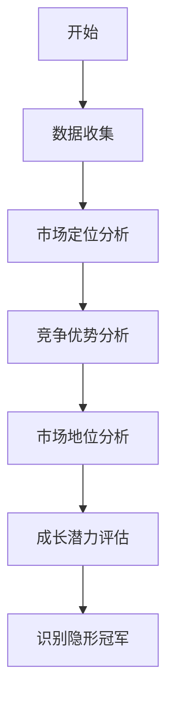
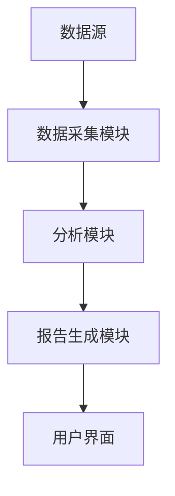

                 


# 彼得林奇的"隐形冠军"在传统行业中的发掘

---

## 关键词：
- 彼得林奇
- 隐形冠军
- 传统行业
- 投资策略
- 企业分析

---

## 摘要：
本文深入探讨了彼得·林奇提出的“隐形冠军”概念在传统行业中的应用。通过分析隐形冠军的定义、特征、识别方法以及投资价值，本文为投资者提供了在传统行业中发掘潜在优质企业的思路和策略。文章结合理论与实践，详细介绍了隐形冠军的识别算法、数学模型、系统架构设计以及实际案例分析，帮助读者更好地理解和应用这一投资理念。

---

## 第一部分：背景介绍

### 第1章：隐形冠军的概念与背景

#### 1.1 隐形冠军的定义与特征
隐形冠军是指在某个细分市场中占据领先地位，但未上市的中小企业。其核心特征包括：
- **市场专注**：专注于特定细分市场，成为该领域的领导者。
- **隐形性**：未上市，因此不为大众所熟知。
- **竞争优势**：在产品、技术或成本方面具有显著优势。
- **持续性**：能够长期保持市场领先地位。

#### 1.2 隐形冠军的重要性和投资价值
隐形冠军在传统行业中的重要性体现在：
- **高成长潜力**：由于专注于细分市场，隐形冠军通常具有较高的成长潜力。
- **低竞争压力**：未上市的隐形冠军往往面临较小的竞争压力。
- **高回报潜力**：这些企业一旦被发现并投资，通常能带来较高的回报。

与传统投资方法相比，隐形冠军的投资价值在于其潜在的高成长性和低估的市场估值。

#### 1.3 传统行业中的隐形冠军案例
- **制造行业**：某专注于高端轴承生产的隐形冠军企业。
- **零售行业**：某区域性连锁超市，专注于特定区域市场。
- **服务行业**：某专注于企业咨询服务的隐形冠军。

这些案例展示了隐形冠军在不同传统行业中的分布特点。

#### 1.4 本书的核心目标与方法论
本书的核心目标是帮助读者在传统行业中识别隐形冠军企业，并通过系统化的分析方法进行投资决策。方法论包括：
- 理论分析：探讨隐形冠军的定义、特征及识别方法。
- 实践应用：通过实际案例分析，展示如何在传统行业中发掘隐形冠军。
- 技术支持：结合算法、数学模型和系统架构设计，提供科学的投资决策工具。

---

## 第二部分：核心概念与联系

### 第2章：隐形冠军的核心概念与联系

#### 2.1 隐形冠军的核心概念原理
隐形冠军的核心概念原理包括：
- **市场定位**：专注于细分市场，成为该领域的领导者。
- **竞争优势**：通过技术创新、成本控制或优质服务，在竞争中占据优势。
- **可持续发展**：通过持续优化产品和服务，保持市场领先地位。

#### 2.2 隐形冠军的特征对比表格
以下是隐形冠军与非隐形冠军的特征对比：

| 特征               | 隐形冠军                          | 非隐形冠军                        |
|--------------------|------------------------------------|------------------------------------|
| 市场定位           | 细分市场专注                      | 广泛市场覆盖                      |
| 竞争优势           | 产品/技术优势                    | 品牌/规模优势                    |
| 市场地位           | 细分市场领导者                    | 广泛市场竞争者                  |
| 成长潜力           | 高                              | 中低                             |
| 隐私性             | 高                              | 低                              |

#### 2.3 隐形冠军的ER实体关系图
以下是隐形冠军的ER实体关系图（Mermaid流程图）：

```mermaid
er
actor 隐形冠军 {
  --> 企业信息
  --> 市场定位
  --> 竞争优势
  --> 可持续发展能力
}
```

---

## 第三部分：算法原理讲解

### 第3章：隐形冠军的识别算法

#### 3.1 隐形冠军的识别算法原理
隐形冠军的识别算法包括以下步骤：
1. **数据收集**：收集目标行业的企业信息。
2. **市场定位分析**：筛选专注于细分市场的企业。
3. **竞争优势分析**：评估企业的技术、产品或服务优势。
4. **市场地位分析**：分析企业的市场份额和竞争力。
5. **成长潜力评估**：预测企业的未来成长潜力。

#### 3.2 算法的Mermaid流程图
以下是隐形冠军识别的流程图（Mermaid）：



#### 3.3 算法的Python代码示例
以下是识别隐形冠军的Python代码示例：

```python
def identify_invisible_champion(industry_data):
    champions = []
    for enterprise in industry_data:
        if is_market_leader(enterprise) and hascompetitive_advantage(enterprise) and is_sustainable(enterprise):
            champions.append(enterprise)
    return champions

def is_market_leader(enterprise):
    return enterprise['market_share'] > 0.1

def hascompetitive_advantage(enterprise):
    return enterprise['技术创新'] > 0.2 or enterprise['成本优势'] > 0.2

def is_sustainable(enterprise):
    return enterprise['年增长率'] > 0.1 and enterprise['净利润率'] > 0.1
```

---

## 第四部分：数学模型与公式

### 第4章：隐形冠军的数学模型与公式

#### 4.1 市盈率模型
市盈率（P/E）是衡量企业价值的重要指标：

$$ P/E = \frac{市价}{每股收益} $$

#### 4.2 市净率模型
市净率（P/B）是另一个重要的估值指标：

$$ P/B = \frac{市价}{每股净资产} $$

#### 4.3 成长潜力模型
成长潜力可以通过以下公式评估：

$$ 成长潜力 = (市场份额增长率) \times (净利润增长率) $$

---

## 第五部分：系统分析与架构设计

### 第5章：隐形冠军识别系统的架构设计

#### 5.1 系统功能设计
系统功能设计包括：
- 数据采集模块：收集企业信息。
- 分析模块：进行市场定位、竞争优势分析。
- 报告生成模块：输出识别结果。

#### 5.2 系统架构设计
以下是系统架构图（Mermaid）：



---

## 第六部分：项目实战

### 第6章：隐形冠军识别的实战分析

#### 6.1 项目环境配置
- 数据来源：行业数据库。
- 工具：Python、Pandas、Matplotlib。

#### 6.2 核心代码实现
以下是核心代码实现：

```python
import pandas as pd
import matplotlib.pyplot as plt

def plot_market_share(data):
    plt.bar(data['企业'], data['市场份额'], label='市场份额')
    plt.xlabel('企业')
    plt.ylabel('市场份额')
    plt.title('市场份额分布')
    plt.legend()
    plt.show()

# 示例数据
data = {
    '企业': ['企业A', '企业B', '企业C'],
    '市场份额': [0.2, 0.15, 0.1],
    '技术创新': [0.3, 0.2, 0.1],
    '成本优势': [0.2, 0.15, 0.1]
}

df = pd.DataFrame(data)
plot_market_share(df)
```

#### 6.3 案例分析与解读
以某传统制造行业为例，分析隐形冠军的识别过程：

1. **数据收集**：收集行业内的企业信息。
2. **市场定位分析**：筛选专注于高端轴承生产的隐形冠军。
3. **竞争优势分析**：评估技术创新和成本优势。
4. **市场地位分析**：分析市场份额和竞争力。
5. **成长潜力评估**：预测企业的未来成长潜力。

---

## 第七部分：总结与展望

### 第7章：总结与展望

#### 7.1 小结
隐形冠军是传统行业中的潜在优质企业，其识别方法包括市场定位、竞争优势分析和成长潜力评估。

#### 7.2 投资建议
投资者应重点关注传统行业中的隐形冠军，尤其是那些具有技术创新和成本优势的企业。

#### 7.3 注意事项
在识别隐形冠军时，需注意数据的准确性和模型的适用性。

#### 7.4 拓展阅读
建议进一步阅读彼得·林奇的相关著作，深入了解隐形冠军的投资策略。

---

## 作者：AI天才研究院/AI Genius Institute & 禅与计算机程序设计艺术 /Zen And The Art of Computer Programming

