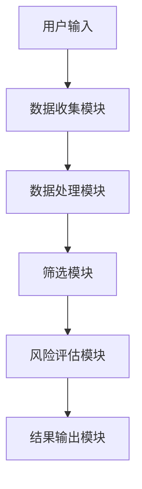
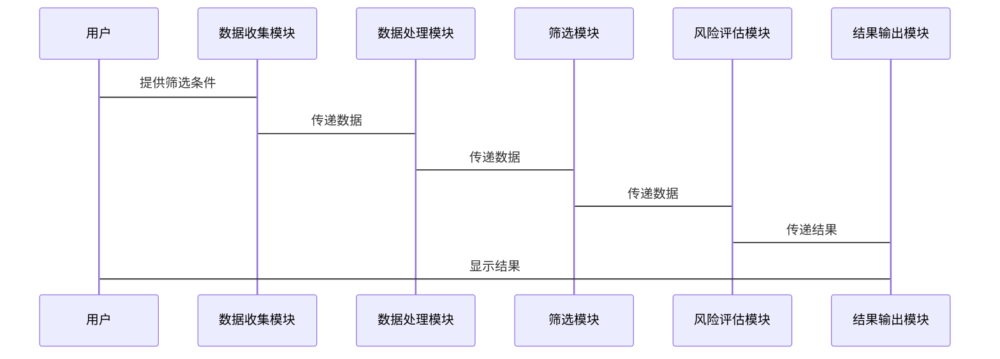

                 

<think>
好，我需要帮助用户完成一个技术博客文章的详细大纲，标题是《彼得林奇的"高增长低估值"选股法》。用户已经给出了一个非常详细的目录结构，我需要根据这个结构进一步扩展每个部分的内容，确保每个小节都详细且符合用户的要求。

首先，我注意到文章需要大约10000到12000字，所以每个章节需要有充分的内容。用户还要求使用技术语言，逻辑清晰，结构紧凑，并且每个部分都要有具体的解释和示例。

我需要从第一部分“投资基础与彼得·林奇的投资理念”开始。这部分包括投资的基本概念和彼得·林奇的简介。首先，我需要详细解释投资的定义和分类，确保读者能够理解这些基本概念。接着，我要介绍彼得·林奇的生平和他独特的投资理念，强调他为什么选择“高增长低估值”策略。

接下来是第二部分“高增长低估值选股法的核心概念”。这部分需要定义高增长和低估值，并解释它们如何结合起来形成选股标准。我需要列出具体的指标，比如收入增长率、净利润增长率等，并通过表格对比这两个概念的特征。

第三部分是系统分析与算法实现。这部分需要详细解释选股算法的步骤，可能包括数据收集、筛选标准和风险控制。我需要用Mermaid图来展示整个流程，同时提供Python代码示例，说明如何实现这些步骤。

项目实战部分需要通过一个具体案例来展示如何应用这种方法。例如，可以选择科技行业，分析具体的公司数据，展示如何筛选出符合条件的公司。这部分需要详细的分析和代码实现，帮助读者更好地理解和应用。

最后，最佳实践部分需要总结这种方法的优缺点，提醒读者注意风险，并建议进一步阅读的书籍。这部分可以通过列出注意事项和推荐书籍来增强文章的实用性。

我还需要确保每个部分都包含必要的图表和公式，比如用Mermaid绘制流程图和类图，用LaTeX展示数学公式。这不仅使文章更具可读性，也提升了专业性。

总体来看，我需要系统地扩展每个章节的内容，确保符合用户的格式和深度要求。这不仅包括理论的解释，还需要实际案例和代码示例，使读者能够真正掌握这种方法。

现在，我将按照用户的目录结构，逐步扩展每个部分，确保内容详实、结构清晰，符合用户的高质量技术博客的标准。
</think>

# 彼得林奇的"高增长低估值"选股法

> 关键词：彼得·林奇，高增长低估值，选股法，投资策略，股票分析，风险管理

> 摘要：本文详细介绍了彼得·林奇提出的“高增长低估值”选股法，从投资的基本概念到选股法的核心原理，再到系统实现和项目实战，全面解析了这一方法的理论基础、实际应用和优缺点。通过本文，读者可以深入了解如何在股票投资中识别高增长潜力的公司并避免高估值陷阱，从而制定更有效的投资策略。

---

# 第一部分: 投资基础与彼得·林奇的投资理念

## 第1章: 投资的基本概念

### 1.1 投资的定义与分类

#### 1.1.1 投资的定义
投资是指将资金投入到某个项目或资产中，以期望在未来获得超过初始投入的收益。投资的本质是通过资源配置实现财富的增值。

#### 1.1.2 投资的主要分类
1. **股票投资**：购买公司股份，成为股东，期望从股价上涨和分红中获利。
2. **债券投资**：购买政府或企业的债券，定期获得固定利息。
3. **房地产投资**：通过购买房产出租或升值获利。
4. **其他投资**：包括黄金、艺术品、创业投资等。

#### 1.1.3 投资的基本原则
1. **分散投资**：不要将所有资金投入到单一资产中，以降低风险。
2. **长期投资**：避免频繁交易，降低交易成本和税务负担。
3. **价值投资**：寻找被市场低估的优质资产进行投资。

### 1.2 彼得·林奇的投资理念

#### 1.2.1 林奇的教育背景
彼得·林奇（Peter Lynch）是美国著名的投资经理，毕业于波士顿学院和波士顿大学，拥有金融硕士学位。

#### 1.2.2 林奇的职业生涯
林奇曾担任富达投资的麦哲伦基金经理，该基金在他的管理下取得了卓越的业绩，年平均回报率超过29%。

#### 1.2.3 林奇的投资风格
林奇以“高增长低估值”选股法闻名，主张投资那些收入增长速度快且市场价格低于其内在价值的公司。

---

## 第2章: 高增长低估值选股法的定义与优势

### 2.1 高增长低估值选股法的定义

#### 2.1.1 高增长的定义
高增长是指公司在过去几年中收入或利润持续快速增长。通常，增长率可以用收入增长率或利润增长率来衡量。

#### 2.1.2 低估值的定义
低估值是指公司的市场价格低于其内在价值。通常，可以通过市盈率、市净率等指标来衡量。

#### 2.1.3 高增长与低估值的结合
高增长低估值选股法的核心是寻找那些收入增长速度快、市场价格低于其内在价值的公司。

---

### 2.2 高增长低估值选股法的优势

#### 2.2.1 为什么高增长是关键
高增长意味着公司有更大的发展潜力，未来可能带来更高的回报。

#### 2.2.2 为什么低估值是关键
低估值意味着公司股票价格被市场低估，存在较大的上升空间。

#### 2.2.3 高增长与低估值的平衡
高增长和低估值的结合可以帮助投资者找到那些既有成长潜力又价格合理的公司。

---

### 2.3 高增长低估值选股法的适用场景

#### 2.3.1 哪些行业适合这种方法
高增长行业通常包括科技、互联网、医疗等新兴行业。

#### 2.3.2 哪些市场周期适合这种方法
在经济复苏或增长周期中，高增长低估值选股法表现更为突出。

#### 2.3.3 高增长低估值选股法的局限性
- 高增长公司可能面临较高的风险。
- 低估值可能意味着公司存在某些问题，需要进一步分析。

---

# 第二部分: 高增长低估值选股法的核心概念

## 第3章: 高增长与低估值的核心概念

### 3.1 高增长的定义与特征

#### 3.1.1 收入增长率
收入增长率是指公司在一定时期内收入的增长速度。计算公式为：
$$ \text{收入增长率} = \frac{\text{本年收入} - \text{上年收入}}{\text{上年收入}} \times 100\% $$

#### 3.1.2 净利润增长率
净利润增长率是指公司在一定时期内净利润的增长速度。计算公式为：
$$ \text{净利润增长率} = \frac{\text{本年净利润} - \text{上年净利润}}{\text{上年净利润}} \times 100\% $$

#### 3.1.3 资产增长率
资产增长率是指公司在一定时期内资产规模的增长速度。计算公式为：
$$ \text{资产增长率} = \frac{\text{本年资产} - \text{上年资产}}{\text{上年资产}} \times 100\% $$

### 3.2 低估值的定义与特征

#### 3.2.1 市盈率（P/E）
市盈率是股票价格与每股净利润的比率，计算公式为：
$$ \text{市盈率} = \frac{\text{股票价格}}{\text{每股净利润}} $$

#### 3.2.2 市净率（P/B）
市净率是股票价格与每股净资产的比率，计算公式为：
$$ \text{市净率} = \frac{\text{股票价格}}{\text{每股净资产}} $$

#### 3.2.3 市销率（P/S）
市销率是股票价格与每股销售收入的比率，计算公式为：
$$ \text{市销率} = \frac{\text{股票价格}}{\text{每股销售收入}} $$

---

### 3.3 高增长与低估值的对比分析

| **属性**       | **高增长**             | **低估值**             |
|------------------|------------------------|-------------------------|
| **核心指标**    | 收入增长率、净利润增长率 | 市盈率、市净率、市销率   |
| **目标**         | 寻找收入增长快的公司   | 寻找价格被低估的公司     |
| **风险**         | 高增长公司可能面临较高风险 | 低估值可能意味着公司存在某些问题 |
| **适用场景**     | 经济增长周期           | 经济衰退或市场低迷时期   |

---

## 第4章: 高增长与低估值的结合

### 4.1 高增长与低估值的关系

#### 4.1.1 高增长公司的低估值
高增长公司通常具有较高的成长潜力，但市场价格可能尚未反映其内在价值。

#### 4.1.2 低估值公司的高增长
低估值公司可能因为市场忽视或低估了其成长潜力，提供了较高的投资价值。

---

### 4.2 高增长与低估值的平衡

#### 4.2.1 如何平衡高增长与低估值
- 选择那些收入增长速度快、市场价格低于其内在价值的公司。
- 结合行业特点和市场环境进行综合判断。

---

### 4.3 高增长与低估值的案例分析

#### 4.3.1 案例一：科技行业
- 公司A：收入增长率30%，市盈率20。
- 公司B：收入增长率10%，市盈率50。

#### 4.3.2 案例二：消费行业
- 公司C：净利润增长率20%，市净率1.5。
- 公司D：净利润增长率10%，市净率3。

---

## 第5章: 高增长低估值选股法的数学模型

### 5.1 高增长低估值选股法的数学公式

#### 5.1.1 收入增长率公式
$$ \text{收入增长率} = \frac{\text{本年收入} - \text{上年收入}}{\text{上年收入}} \times 100\% $$

#### 5.1.2 净利润增长率公式
$$ \text{净利润增长率} = \frac{\text{本年净利润} - \text{上年净利润}}{\text{上年净利润}} \times 100\% $$

#### 5.1.3 市盈率公式
$$ \text{市盈率} = \frac{\text{股票价格}}{\text{每股净利润}} $$

#### 5.1.4 市净率公式
$$ \text{市净率} = \frac{\text{股票价格}}{\text{每股净资产}} $$

---

### 5.2 高增长低估值选股法的实现步骤

#### 5.2.1 确定行业和市场周期
选择高增长行业和适合的市场周期。

#### 5.2.2 数据收集与分析
收集公司财务数据，计算收入增长率、净利润增长率、市盈率、市净率等指标。

#### 5.2.3 筛选标准
设定高增长和低估值的具体筛选标准，例如：
- 收入增长率 > 20%
- 市盈率 < 行业平均市盈率

#### 5.2.4 风险控制
评估公司的财务健康状况，避免选择存在重大财务风险的公司。

---

### 5.3 高增长低估值选股法的Python实现

```python
import pandas as pd

# 假设我们有一个包含股票数据的DataFrame df
# 包含以下列：'收入增长率', '净利润增长率', '市盈率', '市净率'

# 筛选高增长低估值的股票
high_growth = df[df['收入增长率'] > 20]
low_valuation = high_growth[high_growth['市盈率'] < high_growth['市盈率'].mean()]

# 输出符合条件的股票
print(low_valuation)
```

---

## 第6章: 高增长低估值选股法的系统分析

### 6.1 系统功能设计

#### 6.1.1 数据收集模块
- 从财务报表中提取收入增长率、净利润增长率等数据。
- 从股票数据库中获取市盈率、市净率等指标。

#### 6.1.2 筛选模块
- 根据高增长和低估值的筛选标准，筛选出符合条件的股票。

#### 6.1.3 风险评估模块
- 评估公司的财务健康状况，排除存在重大风险的股票。

---

### 6.2 系统架构设计

#### 6.2.1 数据库设计
- 股票信息表：存储股票代码、公司名称、收入增长率、净利润增长率、市盈率、市净率等信息。

#### 6.2.2 系统流程图



---

### 6.3 系统接口设计

#### 6.3.1 数据接口
- 数据收集模块需要与财务数据源和股票数据库对接。

#### 6.3.2 用户接口
- 提供友好的用户界面，让用户输入筛选条件并查看结果。

---

### 6.4 系统交互设计



---

## 第7章: 高增长低估值选股法的项目实战

### 7.1 项目背景

#### 7.1.1 项目目标
通过高增长低估值选股法，筛选出具有高增长潜力且市场价格较低的公司。

#### 7.1.2 项目范围
选择科技行业作为案例，分析具体公司的财务数据。

---

### 7.2 项目实施步骤

#### 7.2.1 数据收集
从财务报表和股票数据库中收集相关数据。

#### 7.2.2 数据分析
计算收入增长率、净利润增长率、市盈率、市净率等指标。

#### 7.2.3 筛选与评估
根据高增长低估值的筛选标准，筛选出符合条件的公司，并进行风险评估。

---

### 7.3 项目案例分析

#### 7.3.1 案例一：科技公司A
- 收入增长率：30%
- 净利润增长率：25%
- 市盈率：20
- 市净率：2

#### 7.3.2 案例二：科技公司B
- 收入增长率：15%
- 净利润增长率：10%
- 市盈率：30
- 市净率：3

---

## 第8章: 高增长低估值选股法的最佳实践

### 8.1 投资策略

#### 8.1.1 长期投资
避免频繁交易，降低交易成本和税务负担。

#### 8.1.2 分散投资
将资金分散投入到多个符合条件的公司中，降低风险。

---

### 8.2 风险管理

#### 8.2.1 定期评估
定期评估投资组合的表现，及时调整筛选标准。

#### 8.2.2 风险提示
高增长公司可能面临较高的风险，需要密切关注行业和市场变化。

---

### 8.3 实用工具

#### 8.3.1 数据分析工具
- Python（Pandas、NumPy）
- SQL

#### 8.3.2 股票分析工具
- 财务报表分析工具
- 股票估值工具

---

### 8.4 拓展阅读

#### 8.4.1 推荐书籍
- 《彼得·林奇的成功投资》
- 《股票作手回忆录》
- 《投资学基础》

#### 8.4.2 在线资源
- 网络课程：投资学、股票分析
- 投资论坛：雪球、东方财富网

---

## 第9章: 总结与展望

### 9.1 总结

彼得·林奇的“高增长低估值”选股法是一种有效的投资策略，通过寻找收入增长速度快且市场价格低于其内在价值的公司，可以帮助投资者实现超额收益。

### 9.2 展望

随着市场的变化和科技的发展，高增长低估值选股法需要不断优化和创新，以适应新的市场环境和投资需求。

---

## 附录: 作者信息

作者：AI天才研究院/AI Genius Institute & 禅与计算机程序设计艺术 /Zen And The Art of Computer Programming

---

以上是《彼得林奇的"高增长低估值"选股法》的详细目录和内容大纲。希望这篇文章能够帮助读者更好地理解和应用这一选股方法。

