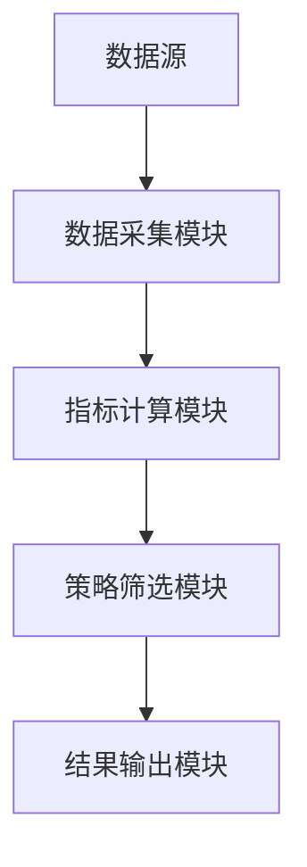
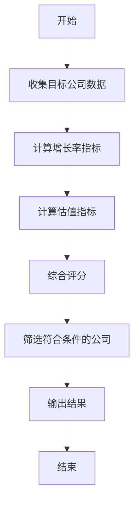

                 


# 彼得林奇的"高增长低估值"选股策略

> 关键词：彼得林奇，高增长，低估值，选股策略，投资哲学，成长股

> 摘要：本文详细探讨了彼得林奇的“高增长低估值”选股策略，从其投资哲学、策略的核心思想、量化指标到实际应用案例，系统分析了该策略的优势、局限性和风险管理方法。文章还提供了数学模型和系统架构图，帮助读者更好地理解和实施这一策略。

---

## 目录

### 第一部分: 彼得林奇投资理念概述

#### 第1章: 彼得林奇及其投资风格

- 1.1 彼得林奇的生平简介
  - 出生背景与早期经历
  - 投资职业生涯的里程碑
  - 主要著作与影响力

- 1.2 投资风格解析
  - 成长股投资的核心理念
  - 价值投资与成长投资的结合
  - 长期持有与深度研究的策略

- 1.3 高增长低估值策略的核心思想
  - 为何选择高增长公司
  - 低估值的重要性
  - 高增长与低估值的平衡点

#### 第2章: 高增长与低估值的量化分析

- 2.1 高增长的量化指标
  - 净利润增长率
  - 营收增长率
  - 其他增长指标（如ROE增长率）

- 2.2 低估值的量化指标
  - 市盈率（P/E）计算
  - 市净率（P/B）计算
  - EV/EBITDA等其他估值指标

- 2.3 高增长与低估值的关系
  - 增长与估值的动态平衡
  - 为何高增长公司可能被低估
  - 市场情绪对估值的影响

### 第二部分: 高增长低估值选股策略的系统分析

#### 第3章: 高增长低估值选股策略的系统架构

- 3.1 选股策略的总体框架
  - 系统输入：市场数据、公司财务数据
  - 系统处理：增长指标计算、估值指标计算、综合评分
  - 系统输出：符合条件的股票列表

- 3.2 系统功能设计
  - 数据采集模块
  - 指标计算模块
  - 策略筛选模块
  - 结果输出模块

- 3.3 系统架构图（使用mermaid）



#### 第4章: 选股策略的数学模型与算法流程

- 4.1 数学模型构建
  - 增长率评估模型
  - 估值指标评估模型
  - 综合评分模型

- 4.2 算法流程图（使用mermaid）



#### 第5章: 项目实战——基于彼得林奇策略的选股系统实现

- 5.1 环境安装与数据准备
  - Python环境搭建
  - 数据来源与获取方法
  - 数据清洗与预处理

- 5.2 核心算法实现
  - 增长率计算函数
  - 估值指标计算函数
  - 综合评分函数

- 5.3 代码实现
  ```python
  def calculate_growth_rates(finance_data):
      # 计算净利润增长率
      growth_rates = []
      for i in range(1, len(finance_data)):
          growth = (finance_data[i] - finance_data[i-1]) / finance_data[i-1] * 100
          growth_rates.append(growth)
      return growth_rates

  def calculate_valuation_metrics(stock_data):
      # 计算市盈率
      pe_ratio = stock_data['股价'] / stock_data['每股收益']
      return pe_ratio

  def综合评分(growth_score, valuation_score):
      return (growth_score + valuation_score) / 2
  ```

- 5.4 实际案例分析
  - 以微软为例：高增长与低估值的完美结合
  - 英特尔案例：高增长但估值过高的风险

### 第三部分: 风险管理与策略优化

#### 第6章: 风险管理与策略优化

- 6.1 风险识别
  - 估值过高的风险
  - 市场波动的风险
  - 行业周期性的影响

- 6.2 风险管理策略
  - 分散投资
  - 定期调整投资组合
  - 设置止损点

- 6.3 策略优化
  - 动态调整增长率与估值的权重
  - 引入更多的财务指标
  - 结合技术分析

#### 第7章: 项目小结与展望

- 7.1 项目总结
  - 策略的有效性
  - 系统的可行性
  - 实际应用中的注意事项

- 7.2 未来展望
  - 算法的改进方向
  - 数据源的扩展
  - 结合人工智能进行优化

### 第四部分: 附录

#### 附录A: 高增长低估值选股策略的数学公式

- 净利润增长率
  $$\text{净利润增长率} = \frac{\text{本期净利润} - \text{上期净利润}}{\text{上期净利润}} \times 100\%$$
- 市盈率
  $$\text{市盈率} = \frac{\text{股价}}{\text{每股收益}}$$

#### 附录B: 常用的估值工具与数据来源

- 估值工具推荐
  - Yahoo Finance
  - Morningstar
  - Bloomberg Terminal
- 数据来源
  - FactSet
  - S&P Capital IQ
  - 公司财报

---

## 作者：AI天才研究院 & 禅与计算机程序设计艺术

---

本文通过系统的分析和详细的案例，全面介绍了彼得林奇的“高增长低估值”选股策略。从理论到实践，从量化分析到风险管理，为投资者提供了全面的指导和实用的工具。希望本文能帮助读者更好地理解和应用这一策略，实现长期稳健的投资收益。

