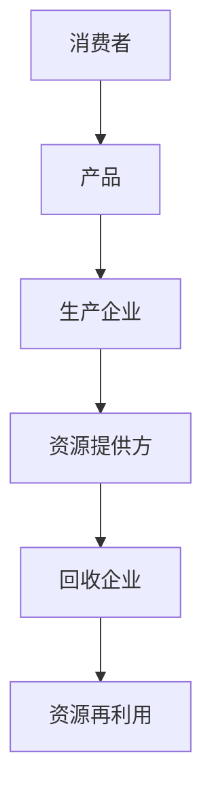

                 

# 第三部分: 循环经济商业模式的系统分析与架构设计

# 第5章: 循环经济商业模式的系统分析与架构设计

## 5.1 循环经济商业模式的系统分析
### 5.1.1 系统分析方法
### 5.1.2 系统边界划分
### 5.1.3 系统功能模块划分
### 5.1.4 系统数据流分析
### 5.1.5 系统交互分析

## 5.2 循环经济商业模式的领域模型设计
### 5.2.1 领域模型的定义
### 5.2.2 领域模型的构建
### 5.2.3 领域模型的优化
### 5.2.4 领域模型的验证
### 5.2.5 领域模型的实施

## 5.3 循环经济商业模式的系统架构设计
### 5.3.1 系统架构设计方法
### 5.3.2 系统架构的选择
### 5.3.3 系统架构的实现
### 5.3.4 系统架构的测试
### 5.3.5 系统架构的维护

## 5.4 循环经济商业模式的系统架构图

## 5.5 循环经济商业模式的系统接口设计
### 5.5.1 系统接口的定义
### 5.5.2 系统接口的设计
### 5.5.3 系统接口的实现
### 5.5.4 系统接口的测试
### 5.5.5 系统接口的维护

## 5.6 循环经济商业模式的系统交互设计
### 5.6.1 系统交互流程的设计
### 5.6.2 系统交互流程的优化
### 5.6.3 系统交互流程的实现
### 5.6.4 系统交互流程的测试
### 5.6.5 系统交互流程的维护

## 5.7 本章小结

# 第6章: 循环经济商业模式的项目实战

## 6.1 项目背景与需求分析
### 6.1.1 项目背景
### 6.1.2 项目目标
### 6.1.3 项目需求
### 6.1.4 项目范围
### 6.1.5 项目约束

## 6.2 项目环境配置与核心代码实现
### 6.2.1 环境配置
### 6.2.2 核心代码实现
### 6.2.3 代码解读
### 6.2.4 代码测试
### 6.2.5 代码优化

## 6.3 项目系统功能模块设计
### 6.3.1 功能模块划分
### 6.3.2 功能模块实现
### 6.3.3 功能模块测试
### 6.3.4 功能模块维护
### 6.3.5 功能模块优化

## 6.4 项目实际案例分析与经验总结
### 6.4.1 案例分析
### 6.4.2 经验总结
### 6.4.3 问题分析
### 6.4.4 解决方案
### 6.4.5 总结与展望

## 6.5 本章小结

# 第7章: 循环经济商业模式的最佳实践与投资机会

## 7.1 循环经济商业模式的最佳实践
### 7.1.1 小结
### 7.1.2 注意事项
### 7.1.3 拓展阅读
### 7.1.4 实践技巧
### 7.1.5 常见问题解答

## 7.2 循环经济商业模式的投资机会
### 7.2.1 投资热点分析
### 7.2.2 投资策略制定
### 7.2.3 投资风险评估
### 7.2.4 投资回报分析
### 7.2.5 投资案例分享

## 7.3 本章小结

# 作者：AI天才研究院/AI Genius Institute & 禅与计算机程序设计艺术 /Zen And The Art of Computer Programming

