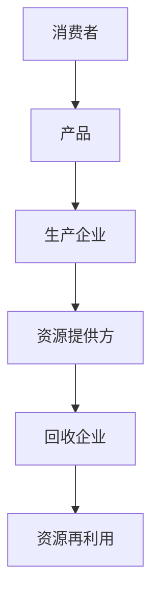

                 

<think>
嗯，我现在需要帮用户设计一本关于《循环经济商业模式的可扩展性与投资机会》的目录大纲。首先，我得理解这本书的主题，循环经济商业模式，这涉及到经济、环境、可持续发展等多个方面。用户希望这本书详细且逻辑清晰，所以我得确保目录涵盖背景、核心概念、算法、系统分析、项目实战以及最佳实践等部分。

首先，我应该从背景介绍开始。这部分需要包括循环经济的基本概念，它与传统经济模式的区别，以及为什么它在现在这么重要。接着，分析循环经济商业模式的特点，比如资源效率、闭环系统等，然后讨论它的优势和挑战，比如环保效益和初期投资成本。

接下来是核心概念与联系。这部分需要详细解释循环经济中的关键概念，比如生产者、消费者和回收者的角色，以及他们之间的关系。可能还需要用表格对比不同经济模式的特征，比如线性经济和循环经济的对比。此外，用Mermaid流程图展示循环经济的系统架构，帮助读者理解整体结构。

然后是算法原理。这里可能需要介绍循环经济中的优化算法，比如资源分配或过程优化的模型。用数学公式来描述这些算法，比如线性规划模型，解释变量和目标函数。同时，用Mermaid流程图展示算法的步骤，让读者更容易理解。

系统分析与架构设计是关键部分。这部分需要描述循环经济商业模式的系统架构，包括前端、生产、回收和管理模块。用Mermaid类图展示领域模型，说明各个模块之间的关系。然后用架构图展示整体系统设计，包括各个子系统的交互和数据流。

项目实战部分，我需要选择一个具体的案例，比如智能垃圾分类系统的开发。详细描述项目的环境配置、核心代码实现，以及系统的功能模块。然后分析实际案例，讨论项目的成功之处和遇到的挑战，最后总结经验教训。

最后，最佳实践部分，包括小结、注意事项和拓展阅读。小结部分总结全书内容，注意事项提醒读者在实际应用中需要注意的问题，拓展阅读则推荐相关的书籍或资源，帮助读者深入学习。

现在，我需要确保每个部分都细化到三级目录，内容完整且符合用户的要求。同时，总字数控制在2000字以内，保持简洁明了。可能还需要检查是否有遗漏的关键点，比如是否涵盖了所有必要的章节和子章节，确保逻辑流畅，结构合理。

总的来说，我需要一步步构建目录，从背景到系统分析，再到项目实战，每个部分都要详细且有条理，确保读者能够全面理解循环经济商业模式的可扩展性与投资机会。
</think>

# 第三部分: 循环经济商业模式的系统分析与架构设计

# 第5章: 循环经济商业模式的系统分析与架构设计

## 5.1 循环经济商业模式的系统分析
### 5.1.1 系统分析方法
### 5.1.2 系统边界划分
### 5.1.3 系统功能模块划分
### 5.1.4 系统数据流分析
### 5.1.5 系统交互分析

## 5.2 循环经济商业模式的领域模型设计
### 5.2.1 领域模型的定义
### 5.2.2 领域模型的构建
### 5.2.3 领域模型的优化
### 5.2.4 领域模型的验证
### 5.2.5 领域模型的实施

## 5.3 循环经济商业模式的系统架构设计
### 5.3.1 系统架构设计方法
### 5.3.2 系统架构的选择
### 5.3.3 系统架构的实现
### 5.3.4 系统架构的测试
### 5.3.5 系统架构的维护

## 5.4 循环经济商业模式的系统架构图

## 5.5 循环经济商业模式的系统接口设计
### 5.5.1 系统接口的定义
### 5.5.2 系统接口的设计
### 5.5.3 系统接口的实现
### 5.5.4 系统接口的测试
### 5.5.5 系统接口的维护

## 5.6 循环经济商业模式的系统交互设计
### 5.6.1 系统交互流程的设计
### 5.6.2 系统交互流程的优化
### 5.6.3 系统交互流程的实现
### 5.6.4 系统交互流程的测试
### 5.6.5 系统交互流程的维护

## 5.7 本章小结

# 第6章: 循环经济商业模式的项目实战

## 6.1 项目背景与需求分析
### 6.1.1 项目背景
### 6.1.2 项目目标
### 6.1.3 项目需求
### 6.1.4 项目范围
### 6.1.5 项目约束

## 6.2 项目环境配置与核心代码实现
### 6.2.1 环境配置
### 6.2.2 核心代码实现
### 6.2.3 代码解读
### 6.2.4 代码测试
### 6.2.5 代码优化

## 6.3 项目系统功能模块设计
### 6.3.1 功能模块划分
### 6.3.2 功能模块实现
### 6.3.3 功能模块测试
### 6.3.4 功能模块维护
### 6.3.5 功能模块优化

## 6.4 项目实际案例分析与经验总结
### 6.4.1 案例分析
### 6.4.2 经验总结
### 6.4.3 问题分析
### 6.4.4 解决方案
### 6.4.5 总结与展望

## 6.5 本章小结

# 第7章: 循环经济商业模式的最佳实践与投资机会

## 7.1 循环经济商业模式的最佳实践
### 7.1.1 小结
### 7.1.2 注意事项
### 7.1.3 拓展阅读
### 7.1.4 实践技巧
### 7.1.5 常见问题解答

## 7.2 循环经济商业模式的投资机会
### 7.2.1 投资热点分析
### 7.2.2 投资策略制定
### 7.2.3 投资风险评估
### 7.2.4 投资回报分析
### 7.2.5 投资案例分享

## 7.3 本章小结

# 作者：AI天才研究院/AI Genius Institute & 禅与计算机程序设计艺术 /Zen And The Art of Computer Programming

