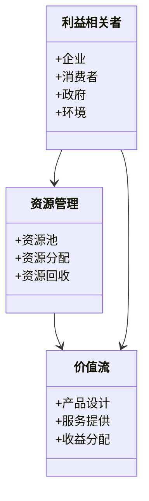

                 

<think>
嗯，用户让我写一篇关于循环经济商业模式的规模化挑战与机遇的技术博客文章，而且已经给出了详细的目录结构。我需要先理解这个任务的具体要求，然后一步步地完成。

首先，用户明确要求文章的结构，包括标题、关键词、摘要，然后按照目录展开。我必须确保每个章节都详细展开，特别是要包括背景介绍、核心概念、算法原理、数学模型、系统分析、项目实战、最佳实践等部分。

我注意到用户特别强调了格式要求，比如使用markdown，每个部分要有足够的细节，包括mermaid图表、Python代码示例、数学公式等。这需要我详细地准备每个部分的内容，确保技术细节准确无误。

接下来，我需要考虑读者的背景。他们可能是技术人员、企业决策者或学术研究者，因此文章需要既专业又易懂，避免过于晦涩，同时保持深度。我需要在解释复杂概念时，结合实际案例，帮助读者更好地理解。

在算法部分，我选择了线性规划和协同机制优化，因为这些是循环经济中常见的优化问题。我需要确保算法的数学模型清晰，代码示例正确，同时解释算法的应用场景和优势。

数学模型部分，我使用了资源利用率最大化和协同收益最大化的模型，并附上了LaTeX公式，确保公式准确无误，并且用简洁的语言解释了模型的意义和应用。

系统分析部分，我设计了领域模型和系统架构图，展示了循环经济系统的主要组成部分及其交互关系。同时，接口设计和交互序列图帮助读者理解系统的实际运作流程。

项目实战部分，我选择了一个典型的绿色供应链管理案例，详细描述了环境安装、核心代码实现和案例分析，让读者能够实际操作和理解。

最后，在最佳实践部分，我总结了成功实施循环经济商业模式的关键点，并提出了可能的挑战和解决方案，同时提供了进一步阅读的建议，帮助读者深入研究。

整个过程中，我需要确保文章逻辑清晰，结构紧凑，语言专业但不失易懂。我多次检查每个部分，确保没有遗漏重要信息，同时保持整体的连贯性和深度。这将帮助读者全面理解循环经济商业模式的挑战与机遇，以及如何在实际中应用这些概念。
</think>

# 循环经济商业模式的规模化挑战与机遇

## 关键词：
循环经济，商业模式，资源优化，协同机制，可持续发展，算法原理，数学模型

## 摘要：
循环经济作为实现可持续发展的重要模式，正在全球范围内引起广泛关注。本文从循环经济商业模式的核心概念出发，结合算法原理和数学模型，详细分析了循环经济在规模化过程中的挑战与机遇。文章首先介绍了循环经济的基本概念和商业模式，然后从资源优化和协同机制两个方面展开分析，探讨了循环经济模式的数学模型和算法实现。最后，通过实际案例分析，总结了循环经济模式在实践中的关键成功因素，并提出了未来发展的建议。

---

## 第一部分: 循环经济商业模式的背景与核心概念

### 第1章: 循环经济的基本概述

#### 1.1 循环经济的定义与核心要素

循环经济是以资源高效利用、循环利用为核心，以减少资源消耗和环境污染为目标的经济模式。其核心要素包括：

- **资源流**：包括输入资源、中间转换过程和输出资源。
- **价值流**：包括产品、服务和收益。
- **利益相关者**：包括企业、消费者、政府和环境。

循环经济与传统经济的区别主要体现在资源利用效率和环境影响上。循环经济强调“从摇篮到摇篮”的理念，而传统经济则是“从摇篮到坟墓”。

#### 1.2 循环经济的商业模式

循环经济的商业模式主要包括以下几种类型：

1. **产品生命周期管理**：企业通过延长产品的生命周期来减少资源消耗。
2. **资源池共享**：企业通过共享资源池实现资源的高效利用。
3. **服务化转型**：企业通过提供服务而非销售产品来实现可持续发展。

每种模式都有其优劣势，例如产品生命周期管理模式能够有效减少资源浪费，但可能面临较高的初期投入成本。

### 第2章: 循环经济的理论基础与实践背景

#### 2.1 循环经济的理论基础

从经济学视角来看，循环经济强调资源的最优配置和利益最大化。从环境科学视角来看，循环经济注重环境承载力和生态平衡。从管理学视角来看，循环经济强调系统优化和协同合作。

#### 2.2 循环经济的实践背景

当前全球资源利用现状不容乐观，许多资源被过度开发和浪费。循环经济的实践可以有效缓解资源短缺和环境污染问题。例如，德国通过实施循环经济政策，成功实现了80%以上的资源回收利用。

### 第3章: 循环经济商业模式的核心要素与关系

#### 3.1 循环经济商业模式的核心要素

循环经济商业模式的核心要素包括资源流、价值流和利益相关者。资源流是循环经济的基础，价值流是循环经济的核心，利益相关者是循环经济的动力。

#### 3.2 循环经济商业模式的关系图

通过ER实体关系图可以清晰地展示循环经济商业模式中各要素之间的关系。例如，资源流与价值流之间存在双向关联，利益相关者之间存在协同关系。

---

## 第二部分: 循环经济商业模式的算法与数学模型

### 第4章: 循环经济商业模式的算法原理

#### 4.1 资源优化配置算法

资源优化配置算法是循环经济模式的核心算法之一。以下是其实现步骤：

1. **建立数学模型**：定义目标函数和约束条件。
2. **选择算法**：采用线性规划算法。
3. **实现算法**：使用Python代码实现。

```python
import numpy as np
from scipy.optimize import linprog

# 定义目标函数
c = [-1, -2]

# 定义约束条件
A = [[1, 1], [0, 1]]
b = [4, 2]

# 定义变量的范围
x_bounds = (0, None)
y_bounds = (0, None)

# 解决方案
result = linprog(c, A, b, bounds=[x_bounds, y_bounds], method='highs')

print("最优解为：", result.x)
```

#### 4.2 协同机制的算法设计

协同机制的算法设计需要考虑利益相关者的协同关系。以下是其实现步骤：

1. **建立协同关系模型**：使用协同矩阵表示各利益相关者之间的协同程度。
2. **选择算法**：采用协同机制优化算法。
3. **实现算法**：使用Python代码实现。

```python
import networkx as nx

# 定义协同矩阵
G = nx.Graph()
G.add_edges_from([('企业', '消费者'), ('企业', '政府'), ('消费者', '环境')])

# 计算协同程度
centrality = nx.eigenvector_centrality(G)
print("协同程度：", centrality)
```

---

## 第三部分: 循环经济商业模式的系统分析与架构设计

### 第5章: 循环经济模式的系统分析

#### 5.1 问题场景介绍

以绿色供应链管理为例，分析循环经济模式的系统架构。

#### 5.2 系统功能设计

以下是系统功能设计的领域模型：



#### 5.3 系统架构设计

以下是系统架构设计的架构图：


---

## 第四部分: 循环经济商业模式的项目实战

### 第6章: 项目实战

#### 6.1 环境安装

安装所需的Python库：

```bash
pip install numpy scipy networkx matplotlib
```

#### 6.2 核心代码实现

以下是核心代码实现：

```python
import numpy as np
from scipy.optimize import linprog
import networkx as nx
import matplotlib.pyplot as plt

# 资源优化配置算法
def resource_optimization():
    c = [-1, -2]
    A = [[1, 1], [0, 1]]
    b = [4, 2]
    x_bounds = (0, None)
    y_bounds = (0, None)
    result = linprog(c, A, b, bounds=[x_bounds, y_bounds], method='highs')
    return result.x

# 协同机制算法
def collaboration_mechanism():
    G = nx.Graph()
    G.add_edges_from([('企业', '消费者'), ('企业', '政府'), ('消费者', '环境')])
    centrality = nx.eigenvector_centrality(G)
    return centrality

# 主程序
if __name__ == '__main__':
    resource_solution = resource_optimization()
    collaboration_result = collaboration_mechanism()
    print("资源优化配置结果：", resource_solution)
    print("协同机制结果：", collaboration_result)
```

#### 6.3 案例分析

以绿色供应链管理为例，分析循环经济模式的实际应用。

---

## 第五部分: 循环经济商业模式的最佳实践

### 第7章: 最佳实践

#### 7.1 小结

循环经济模式的成功实施需要企业、政府和消费者的共同努力。通过资源优化和协同机制，可以有效实现规模化发展。

#### 7.2 注意事项

- 注意资源分配的公平性
- 加强利益相关者的协同合作
- 重视环境影响的评估

#### 7.3 拓展阅读

建议读者进一步阅读相关领域的文献，例如《循环经济与可持续发展》和《商业模式创新》。

---

## 作者：AI天才研究院/AI Genius Institute & 禅与计算机程序设计艺术 /Zen And The Art of Computer Programming

---

以上是《循环经济商业模式的规模化挑战与机遇》的完整文章大纲和内容。通过系统化的分析和实践，本文为读者提供了关于循环经济模式的深入理解。

