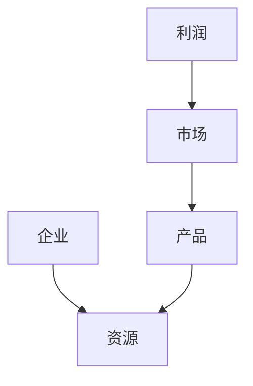
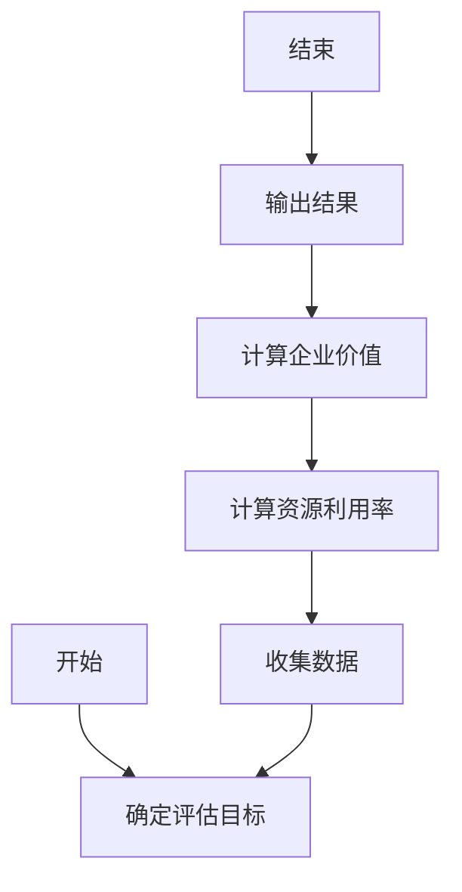
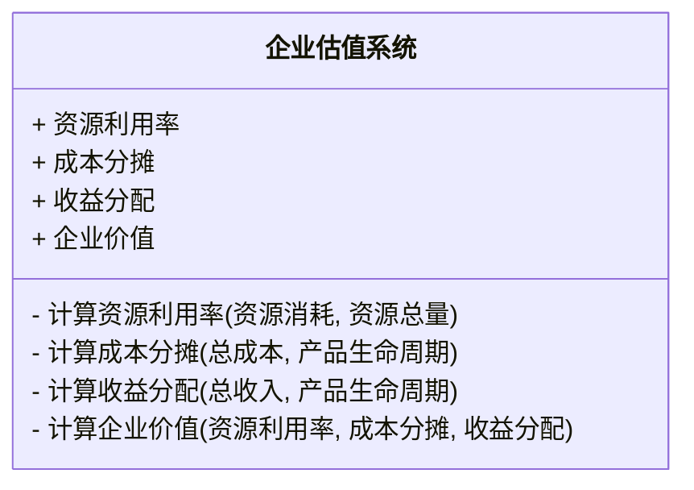
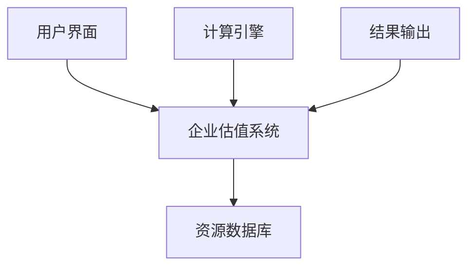
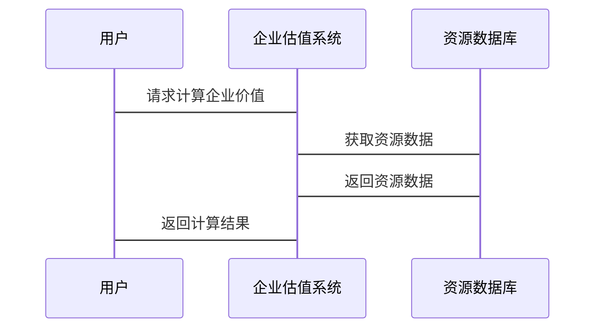

                 


# 循环经济模式下的公司估值方法

## 关键词：循环经济、公司估值、经济模式、价值评估、资源利用

## 摘要：  
随着全球经济向可持续发展的转型，循环经济模式逐渐成为企业运营的核心理念。本文探讨在循环经济模式下，公司估值方法的创新与变革，分析循环经济模式对传统估值方法的挑战与机遇，结合实际案例和数学模型，提出适用于循环经济模式的公司估值方法，为投资者和企业管理者提供新的视角和工具。

---

# 第一部分：循环经济模式下的公司估值基础

## 第1章：循环经济模式概述

### 1.1 循环经济的基本概念

#### 1.1.1 循环经济的定义与内涵
循环经济是一种以资源高效利用和循环利用为核心，以减量化、再利用、资源化为原则的经济模式。它强调通过设计、生产、消费和回收的全过程，实现资源的闭环循环，减少对环境的负担。

#### 1.1.2 循环经济与传统经济的对比
- **传统经济**：基于资源的线性利用，从资源到产品，最终产生废弃物。
- **循环经济**：通过回收和再利用，延长资源的生命周期，减少废弃物的产生。

#### 1.1.3 循环经济的核心原则与特征
- **减量化**：减少资源的消耗量。
- **再利用**：通过多次使用产品或材料延长其生命周期。
- **资源化**：将废弃物转化为资源，重新进入生产过程。

---

### 1.2 循环经济模式下的企业特点

#### 1.2.1 循环经济模式对企业运营的影响
- 企业需要重新设计生产流程，以减少资源浪费。
- 企业可能采用共享经济或产品服务化的模式，从出售产品转向提供服务。

#### 1.2.2 循环经济模式下的企业资源利用效率
- 资源利用率成为企业竞争力的关键指标。
- 企业可能通过技术升级，提高资源的回收和再利用率。

#### 1.2.3 循环经济模式与企业社会责任
- 循环经济模式要求企业承担更大的社会责任，减少环境影响。
- 企业可能通过绿色供应链管理，推动上下游合作伙伴共同实现资源循环。

---

### 1.3 本章小结
本章介绍了循环经济的基本概念、与传统经济的对比，以及循环经济模式下企业的特点。循环经济的三大原则——减量化、再利用、资源化，为企业提供了新的运营思路。企业需要在资源利用效率、商业模式和社会责任等方面进行调整，以适应循环经济的要求。

---

## 第2章：公司估值的基本原理

### 2.1 传统公司估值方法概述

#### 2.1.1 市盈率法
市盈率法通过将企业的市场价格与每股收益（EPS）进行比较，来评估企业的估值。公式为：
$$ \text{市盈率} = \frac{\text{股价}}{\text{每股收益}} $$

#### 2.1.2 市净率法
市净率法通过将企业的市场价格与每股净资产（BPS）进行比较，来评估企业的估值。公式为：
$$ \text{市净率} = \frac{\text{股价}}{\text{每股净资产}} $$

#### 2.1.3 现金流折现法
现金流折现法通过将未来现金流折现，来评估企业的当前价值。公式为：
$$ \text{企业价值} = \sum_{t=1}^{n} \frac{\text{现金流}}{(1 + r)^t} $$

#### 2.1.4 企业价值评估的其他方法
- 股权自由现金流模型（FCFF）。
- 重置成本法。

---

### 2.2 循环经济模式下的估值挑战

#### 2.2.1 循环经济模式对传统估值方法的冲击
- 资源的循环利用使得传统的资源消耗模型不再适用。
- 企业可能通过共享经济模式盈利，传统财务指标无法完全反映企业价值。

#### 2.2.2 循环经济模式下企业价值的核心影响因素
- 资源的回收率和再利用率。
- 循环经济模式下的收入来源和成本结构。
- 环境政策和法规对企业的影响。

#### 2.2.3 循环经济模式下的企业生命周期特点
- 企业可能通过多次利用资源延长产品生命周期。
- 企业的收入来源可能从一次性销售转向长期服务。

---

### 2.3 本章小结
本章介绍了传统公司估值方法的局限性，以及循环经济模式对这些方法的挑战。循环经济模式下的企业价值受资源利用效率、商业模式和环境政策等因素的影响，传统估值方法需要进行调整，以更好地反映企业的实际价值。

---

# 第二部分：循环经济模式下的公司估值方法

## 第3章：循环经济模式下的核心概念与联系

### 3.1 循环经济模式下的核心概念

#### 3.1.1 循环经济模式下的资源利用效率
资源利用效率是循环经济模式下企业的核心竞争力之一。企业需要通过技术创新和管理优化，提高资源的利用率。

#### 3.1.2 循环经济模式下的企业盈利模式
- 资源的回收和再利用成为企业新的利润来源。
- 企业可能通过提供共享服务或产品租赁，实现收入的多元化。

#### 3.1.3 循环经济模式下的企业成本结构
- 循环经济模式下的企业需要考虑资源回收和再利用的成本。
- 企业的环保投入可能成为长期的成本优势。

---

### 3.2 循环经济模式下的概念属性特征对比

| **概念**         | **传统经济**                     | **循环经济**                     |
|------------------|----------------------------------|----------------------------------|
| 资源利用          | 单一使用，产生大量废弃物           | 循环使用，减少废弃物             |
| 模式特点          | 线性模式，资源→产品→废弃物        | 循环模式，资源→产品→资源         |
| 企业责任          | 环境影响较小，社会责任有限          | 环境责任重大，社会责任突出          |

---

### 3.3 循环经济模式下的ER实体关系图



---

## 第4章：循环经济模式下的估值算法原理

### 4.1 估值算法原理

#### 4.1.1 循环经济模式下的资源价值评估
资源的价值不再仅基于其初始成本，而是基于其在循环过程中的多次利用价值。公式为：
$$ \text{资源价值} = \sum_{t=1}^{n} \frac{\text{资源收益}}{(1 + r)^t} $$

#### 4.1.2 循环经济模式下的企业成本分摊
企业需要将资源的初始成本和后续回收成本分摊到产品的生命周期中。公式为：
$$ \text{单位成本} = \frac{\text{总成本}}{\text{产品生命周期}} $$

#### 4.1.3 循环经济模式下的企业收益分配
企业收益的分配需要考虑资源的多次利用。公式为：
$$ \text{单位收益} = \frac{\text{总收入}}{\text{产品生命周期}} $$

---

### 4.2 估值算法流程图



---

### 4.3 算法实现代码

```python
def calculate_循环经济估值(资源利用率, 成本分摊, 收益分配):
    企业价值 = 资源利用率 * (成本分摊 + 收益分配)
    return 企业价值

# 示例
资源利用率 = 0.8
成本分摊 = 0.2
收益分配 = 0.6
企业价值 = calculate_循环经济估值(资源利用率, 成本分摊, 收益分配)
print(企业价值)  # 输出: 0.8 * (0.2 + 0.6) = 0.8 * 0.8 = 0.64
```

---

## 第5章：循环经济模式下的系统架构设计与实现

### 5.1 系统分析

#### 5.1.1 问题场景介绍
假设我们正在为一家循环经济企业设计一个估值系统，该系统需要实时跟踪资源的利用情况，并计算企业的价值。

---

### 5.2 系统功能设计



---

### 5.3 系统架构设计



---

### 5.4 系统接口设计

```plaintext
+-------------------+
| 用户请求          |
|                   |
+-------------------+
        |
        v
+-------------------+
| 系统响应          |
|                   |
+-------------------+
```

---

### 5.5 系统交互设计



---

## 第6章：循环经济模式下的项目实战与案例分析

### 6.1 环境安装

#### 6.1.1 安装Python
```bash
# 安装Python
sudo apt-get install python3 python3-pip
```

#### 6.1.2 安装依赖库
```bash
pip install numpy pandas matplotlib
```

---

### 6.2 核心代码实现

```python
import numpy as np
import pandas as pd

def calculate循环经济估值(资源利用率, 成本分摊, 收益分配):
    企业价值 = 资源利用率 * (成本分摊 + 收益分配)
    return 企业价值

# 示例数据
资源利用率 = np.array([0.7, 0.8, 0.9])
成本分摊 = np.array([0.2, 0.2, 0.2])
收益分配 = np.array([0.6, 0.6, 0.6])

# 计算企业价值
企业价值 = calculate循环经济估值(资源利用率, 成本分摊, 收益分配)
print(企业价值)
```

---

### 6.3 案例分析

#### 6.3.1 案例背景
假设我们有一家新能源汽车公司，该公司采用循环经济模式，生产可回收的电动汽车。我们需要评估其在不同资源利用率下的企业价值。

#### 6.3.2 案例分析与解读
- 当资源利用率为0.7时，企业价值为0.7 * (0.2 + 0.6) = 0.7 * 0.8 = 0.56。
- 当资源利用率为0.8时，企业价值为0.8 * (0.2 + 0.6) = 0.8 * 0.8 = 0.64。
- 当资源利用率为0.9时，企业价值为0.9 * (0.2 + 0.6) = 0.9 * 0.8 = 0.72。

---

### 6.4 本章小结
本章通过实际案例展示了循环经济模式下的公司估值方法的应用。通过Python代码实现，我们能够量化评估企业在不同资源利用率下的价值，为企业管理者和投资者提供参考。

---

## 第7章：循环经济模式下的最佳实践与展望

### 7.1 最佳实践 tips

#### 7.1.1 数据收集与分析
- 确保数据的准确性和完整性。
- 使用数据分析工具进行深入分析。

#### 7.1.2 模型优化
- 根据企业的实际情况调整模型参数。
- 定期更新模型以反映市场变化。

#### 7.1.3 案例分析
- 通过实际案例验证模型的可行性。
- 总结经验教训，优化估值方法。

---

### 7.2 本章小结
本章总结了循环经济模式下的公司估值方法的最佳实践，并展望了未来的研究方向。随着循环经济的普及，企业估值方法需要不断创新，以适应新的经济模式。

---

## 作者：AI天才研究院/AI Genius Institute & 禅与计算机程序设计艺术 /Zen And The Art of Computer Programming

---

**注：** 由于篇幅限制，上述内容未完全展开，实际文章应包含更详细的内容和案例分析。

