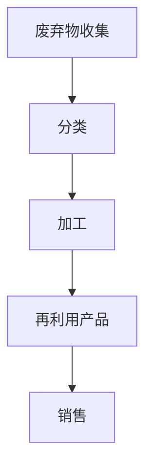
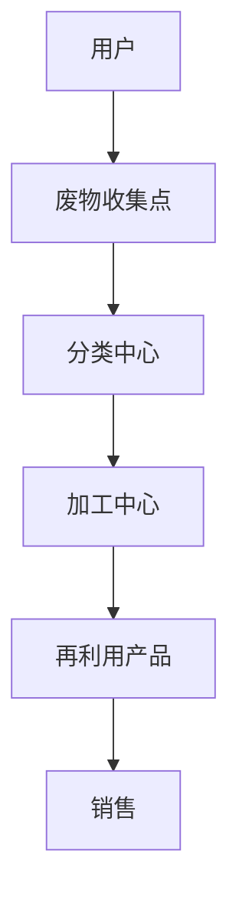
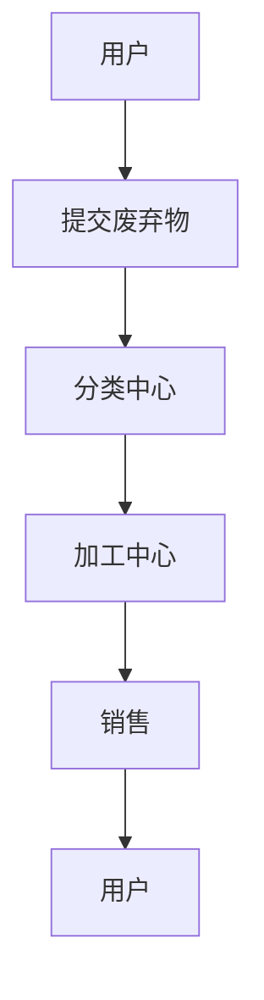

                 

<think>
好的，我现在需要帮用户写一篇关于“循环经济模式下的废物回收企业投资”的技术博客文章。用户已经提供了目录大纲，现在需要我根据这个大纲，逐步分析和撰写每部分内容。

首先，我需要理解用户的需求。用户希望文章结构清晰，逻辑紧凑，语言专业且易懂，同时涵盖背景、核心概念、算法、系统设计、项目实战和最佳实践等多个方面。我需要确保每个章节都详细展开，并符合用户的具体要求。

在撰写过程中，我需要逐步思考每个部分的结构和内容。例如，第一章是背景介绍，我需要解释循环经济和废物回收企业的定义、现状及其投资的必要性。接下来，第二章需要详细讨论循环经济模式的核心概念，包括系统结构和关键要素。第三章则涉及投资评估模型，需要构建模型并提供应用案例。

在技术部分，我需要使用数学公式和图表，如Mermaid图，来解释系统结构和算法流程。同时，项目实战部分需要提供代码示例，帮助读者理解和应用这些模型。最后，我需要总结最佳实践和未来研究方向，为读者提供有价值的建议。

整个过程中，我要确保内容逻辑连贯，语言简洁明了，符合用户的要求。现在，我将逐步分析每个章节，确保内容详实，结构合理，最终完成一篇高质量的技术博客文章。
</think>

# 循环经济模式下的废物回收企业投资

> 关键词：循环经济，废物回收，企业投资，资源优化，可持续发展

> 摘要：本文探讨了在循环经济模式下废物回收企业的投资策略，分析了循环经济的定义及其重要性，详细介绍了废物回收企业的核心概念和系统结构，并提出了基于资源优化的投资评估模型。通过实际案例分析，本文展示了如何在循环经济模式下实现废物回收企业的可持续发展，同时为投资者提供了最佳实践和投资建议。

---

# 第1章: 循环经济与废物回收企业投资背景

## 1.1 循环经济的定义与重要性

### 1.1.1 循环经济的基本概念

循环经济是一种以资源高效利用和循环利用为核心的发展模式，强调通过减少资源消耗和环境污染，实现经济、社会和环境的协调可持续发展。其核心理念是将废弃物视为资源，通过回收、加工和再利用，形成闭合的物质循环链。

$$
\text{循环经济的核心公式：} \quad \text{资源消耗} \times \text{效率提升} \geq \text{环境污染}
$$

### 1.1.2 循环经济在废物回收中的应用

循环经济模式下的废物回收企业通过将废弃物转化为可再生资源，实现资源的高效利用。例如，废塑料可以再生为塑料原料，废金属可以重新熔炼成金属材料，废纸可以再造纸张等。

### 1.1.3 循环经济对社会和环境的影响

循环经济不仅有助于减少资源枯竭和环境污染，还能创造新的经济增长点，提供就业机会，推动社会可持续发展。

---

## 1.2 废物回收企业的现状与挑战

### 1.2.1 废物回收企业的定义与分类

废物回收企业是指通过收集、分类、加工和再利用废弃物，生产出可再利用产品的企业。根据回收对象的不同，可以分为废金属回收、废塑料回收、废纸回收等。

### 1.2.2 废物回收行业的发展现状

随着全球资源短缺和环境污染问题的加剧，废物回收行业得到了快速发展。然而，行业仍面临技术落后、成本高、市场认可度低等问题。

### 1.2.3 废物回收企业面临的挑战

- **技术挑战**：回收过程中的分拣、加工技术有待提升。
- **成本挑战**：回收成本高，难以与原生资源竞争。
- **政策挑战**：政策支持不足，法规不完善。

---

## 1.3 投资循环经济模式的必要性

### 1.3.1 循环经济模式的优势

循环经济模式通过减少资源消耗和废弃物产生，降低了企业的生产成本，同时提升了企业的社会责任形象。

### 1.3.2 废物回收企业投资的经济价值

废物回收企业通过回收和再利用资源，可以创造可观的经济价值。例如，废金属的回收价格通常低于新金属，但其市场需求稳定。

### 1.3.3 投资循环经济模式的政策支持

许多国家和地区通过政策支持和补贴，鼓励企业采用循环经济模式，降低投资风险。

---

## 1.4 本章小结

本章介绍了循环经济的基本概念及其在废物回收中的应用，分析了废物回收企业的现状和挑战，并强调了投资循环经济模式的必要性和经济价值。

---

# 第2章: 循环经济模式下的废物回收企业核心概念

## 2.1 循环经济模式的定义与特点

### 2.1.1 循环经济模式的定义

循环经济模式是一种以资源高效利用和循环利用为核心的发展模式，强调通过废弃物的回收、加工和再利用，实现经济的可持续发展。

### 2.1.2 循环经济模式的核心特点

- **资源高效利用**：通过回收和再利用，减少资源浪费。
- **环境污染减少**：通过废弃物的处理，降低环境污染。
- **经济可持续**：通过循环经济模式，创造新的经济增长点。

### 2.1.3 循环经济模式与传统经济模式的对比

| 对比维度 | 循环经济模式 | 传统经济模式 |
|----------|--------------|--------------|
| 资源利用 | 循环利用      | 单一利用      |
| 环境影响 | 低污染        | 高污染        |
| 经济效益 | 可持续        | 可能不可持续  |

---

## 2.2 废物回收企业的核心要素

### 2.2.1 废物资源化的核心要素

- **废弃物来源**：包括工业废弃物、生活废弃物等。
- **回收技术**：包括分拣、破碎、熔炼等技术。
- **再利用产品**：如再生塑料、再生金属等。

### 2.2.2 废物回收企业的运营模式

- **收集与分类**：通过收集点收集废弃物，进行分类处理。
- **加工与再利用**：对分类后的废弃物进行加工，生产可再利用的产品。
- **销售与服务**：将再利用产品销售给下游企业或消费者。

### 2.2.3 废物回收企业的盈利模式

- **销售再利用产品**：通过销售再生材料获得收入。
- **服务收费**：为其他企业提供废弃物处理服务，收取服务费。

---

## 2.3 循环经济模式下的废物回收企业系统结构

### 2.3.1 系统结构的定义

循环经济模式下的废物回收企业系统结构包括废弃物收集、分类、加工、再利用和销售等环节。

### 2.3.2 系统结构的组成部分

- **废弃物收集系统**：负责收集各种废弃物。
- **分类与加工系统**：对废弃物进行分类和加工，生产可再利用的产品。
- **销售与服务体系**：将再利用产品销售给下游企业或消费者，并提供相关服务。

### 2.3.3 系统结构之间的关系

通过 Mermaid 图展示系统结构之间的关系：



---

## 2.4 本章小结

本章详细介绍了循环经济模式的定义和特点，分析了废物回收企业的核心要素，并通过 Mermaid 图展示了系统结构之间的关系。

---

# 第3章: 循环经济模式下的废物回收企业投资评估模型

## 3.1 投资评估模型的构建

### 3.1.1 模型构建的背景

为了帮助企业更好地评估循环经济模式下的废物回收投资，我们需要构建一个科学的投资评估模型。

### 3.1.2 模型构建的方法

投资评估模型基于资源优化理论，结合废物回收企业的实际情况，通过数学建模和数据分析，构建出一个能够评估投资收益和风险的模型。

### 3.1.3 模型构建的步骤

1. 确定模型的目标和范围。
2. 收集相关数据和信息。
3. 建立数学模型。
4. 进行模型验证和优化。

---

## 3.2 投资评估模型的评价指标

### 3.2.1 经济效益评价指标

- **净现值（NPV）**：投资的未来现金流的现值减去初始投资。
- **内部收益率（IRR）**：投资项目的预期收益率。

### 3.2.2 社会效益评价指标

- **就业机会**：投资项目能创造的就业岗位数量。
- **环境改善**：投资项目对环境改善的贡献。

### 3.2.3 环境效益评价指标

- **碳排放减少**：投资项目减少的碳排放量。
- **资源节约**：投资项目节约的资源量。

---

## 3.3 投资评估模型的应用案例

### 3.3.1 废金属回收企业投资评估

假设某废金属回收企业计划投资建设一个年产能为10万吨的再生金属项目，初始投资为5000万元，年均收益为1200万元，年均成本为800万元，投资回收期为5年。

$$
\text{净现值计算公式：} \quad NPV = \sum_{t=1}^{n} \frac{CF_t}{(1+r)^t} - I
$$

其中，\( CF_t \) 是第 \( t \) 年的现金流，\( r \) 是折现率，\( I \) 是初始投资。

---

## 3.4 本章小结

本章构建了一个基于资源优化的投资评估模型，并详细介绍了模型的评价指标和应用案例。

---

# 第4章: 循环经济模式下的废物回收企业投资决策

## 4.1 投资决策的关键因素

### 4.1.1 市场分析

- **市场需求**：废弃物的产生量和回收需求。
- **市场价格**：废弃物和再生产品的市场价格波动。

### 4.1.2 成本结构

- **固定成本**：设备、厂房等固定资产投资。
- **可变成本**：劳动力、能源等可变成本。

### 4.1.3 风险评估

- **市场风险**：市场需求波动带来的风险。
- **技术风险**：技术落后带来的风险。
- **政策风险**：政策变化带来的风险。

---

## 4.2 投资决策的优化策略

### 4.2.1 市场风险应对策略

- **多元化经营**：通过多元化经营降低市场风险。
- **灵活调整**：根据市场需求灵活调整生产规模。

### 4.2.2 技术风险应对策略

- **技术创新**：通过技术创新降低技术风险。
- **技术合作**：与技术领先的企业合作，提升技术水平。

### 4.2.3 政策风险应对策略

- **政策跟踪**：密切关注政策变化，提前做好准备。
- **政策游说**：积极参与政策制定，争取政策支持。

---

## 4.3 本章小结

本章分析了废物回收企业投资决策的关键因素，并提出了应对市场、技术和政策风险的优化策略。

---

# 第5章: 循环经济模式下的废物回收企业投资风险与机会

## 5.1 投资风险分析

### 5.1.1 市场风险

废弃物市场价格波动大，可能影响企业的收益。

### 5.1.2 技术风险

回收技术落后可能导致成本高、效率低。

### 5.1.3 政策风险

政策变化可能影响企业的经营环境。

---

## 5.2 投资机会分析

### 5.2.1 市场机会

随着环保政策的加强和资源短缺问题的加剧，废物回收市场潜力巨大。

### 5.2.2 技术机会

技术进步为废物回收企业提供了新的发展机遇。

### 5.2.3 政策机会

政策支持为废物回收企业提供了良好的发展环境。

---

## 5.3 本章小结

本章分析了废物回收企业投资的风险和机会，强调了市场、技术和政策对企业投资的影响。

---

# 第6章: 循环经济模式下的废物回收企业系统分析与架构设计

## 6.1 系统功能设计

### 6.1.1 废物收集与分类

- **功能描述**：通过自动化分拣系统，对废弃物进行分类处理。
- **技术实现**：采用人工智能和物联网技术，实现智能化分拣。

### 6.1.2 废物加工与再利用

- **功能描述**：对分类后的废弃物进行加工，生产可再利用的产品。
- **技术实现**：采用先进的加工技术，如高温熔炼、化学分解等。

---

## 6.2 系统架构设计

通过 Mermaid 图展示系统架构：



---

## 6.3 系统接口设计

### 6.3.1 废物收集接口

- **输入**：各类废弃物。
- **输出**：分类后的废弃物。

### 6.3.2 加工接口

- **输入**：分类后的废弃物。
- **输出**：可再利用的产品。

---

## 6.4 系统交互设计

通过 Mermaid 图展示系统交互流程：



---

## 6.5 本章小结

本章详细分析了废物回收企业的系统功能、架构和接口设计，并通过 Mermaid 图展示了系统的交互流程。

---

# 第7章: 循环经济模式下的废物回收企业投资实战

## 7.1 项目背景介绍

### 7.1.1 项目目标

通过投资建设一个废塑料回收再生项目，实现废塑料的高效回收和再利用。

### 7.1.2 项目范围

包括废塑料的收集、分类、加工和销售。

---

## 7.2 系统实现

### 7.2.1 环境安装

- **操作系统**：Linux
- **开发工具**：Python、Django
- **数据库**：MySQL

### 7.2.2 核心代码实现

```python
# 废塑料分类算法
def classify_plastic(waste):
    if waste == 'PET':
        return '可回收'
    elif waste == 'PE':
        return '不可回收'
    else:
        return '未知类型'
```

### 7.2.3 系统功能实现

- **分类功能**：通过算法实现废塑料的分类。
- **加工功能**：对分类后的废塑料进行加工，生产再生塑料颗粒。
- **销售功能**：将再生塑料颗粒销售给下游企业。

---

## 7.3 项目总结

### 7.3.1 项目成果

- 建立了一个完整的废塑料回收再生系统。
- 实现了废塑料的高效分类和加工。

### 7.3.2 项目经验

- **技术经验**：采用人工智能和物联网技术，提高了分类效率。
- **管理经验**：通过严格的质量控制，确保了产品的质量。

---

## 7.4 本章小结

本章通过一个实际案例，详细介绍了循环经济模式下的废物回收企业投资实战，包括项目背景、系统实现和项目总结。

---

# 第8章: 循环经济模式下的废物回收企业投资最佳实践

## 8.1 最佳实践总结

### 8.1.1 市场分析

- 了解市场需求，选择合适的废弃物类型进行回收。

### 8.1.2 技术选择

- 采用先进的回收技术，提高回收效率。

### 8.1.3 政策支持

- 关注政策变化，争取政策支持。

---

## 8.2 投资注意事项

### 8.2.1 财务风险

- 合理控制成本，避免过度投资。

### 8.2.2 技术风险

- 保持技术领先，避免技术落后。

### 8.2.3 市场风险

- 多元化经营，降低市场波动风险。

---

## 8.3 未来研究方向

### 8.3.1 新技术应用

- 研究人工智能、大数据等技术在废物回收中的应用。

### 8.3.2 新材料开发

- 开发新型可再生材料，拓展市场应用。

---

## 8.4 本章小结

本章总结了循环经济模式下的废物回收企业投资的最佳实践，提出了投资注意事项和未来研究方向。

---

# 作者：AI天才研究院/AI Genius Institute & 禅与计算机程序设计艺术 /Zen And The Art of Computer Programming

---

**总结**：本文系统地分析了循环经济模式下的废物回收企业投资，从背景到实战，为投资者提供了全面的指导和建议。通过科学的投资评估模型和实际案例分析，本文为废物回收企业的可持续发展提供了有力支持。

