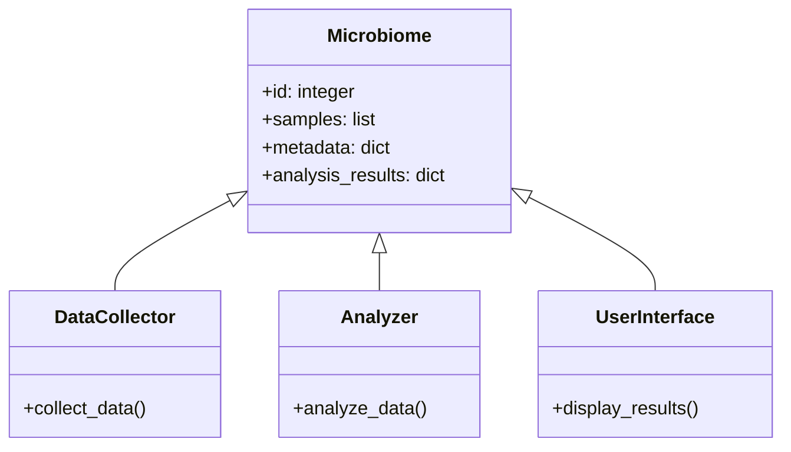
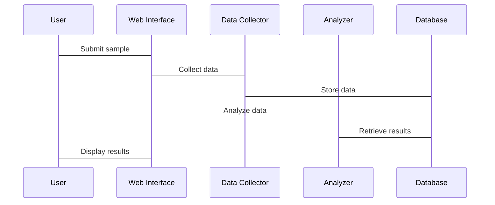

                 

# 微生物组研究对健康产业的影响与投资前景

> **关键词**：微生物组，健康产业，投资前景，生物技术，健康管理，个性化医疗

> **摘要**：微生物组研究是近年来生物技术领域的热点之一，其在健康产业中的应用潜力巨大。本文将从微生物组的定义、结构与功能出发，探讨其对制药、营养与健康、疾病预防等领域的深远影响，并分析投资机会、风险及未来发展趋势。

---

# 第一部分: 微生物组研究的背景与概念

## 第1章: 微生物组研究的背景与意义

### 1.1 微生物组的定义与组成

#### 1.1.1 微生物组的定义
微生物组（Microbiome）是指在一个特定环境或生态系统中所有微生物的集合，包括细菌、病毒、真菌等。在人体中，微生物组主要集中在肠道、口腔、皮肤等部位，其中肠道微生物组最为复杂和重要。

#### 1.1.2 微生物组的组成与分类
肠道微生物组主要由有益菌、有害菌和中性菌组成。有益菌如双歧杆菌和乳酸菌，有助于消化和免疫；有害菌如某些致病菌，可能导致疾病；中性菌在特定条件下可能变为有害菌。

#### 1.1.3 微生物组研究的重要性
微生物组研究有助于理解微生物与宿主的相互作用，揭示其在疾病预防、营养吸收和免疫调节中的作用。

### 1.2 微生物组研究的意义

#### 1.2.1 微生物组与人类健康的关系
微生物组在维持人体健康、代谢调节和疾病预防中起着关键作用。例如，肠道微生物组失衡可能导致肥胖、糖尿病等代谢性疾病。

#### 1.2.2 微生物组在生态系统中的作用
微生物组在分解有机物、循环物质和能量流动中起着重要作用，是生态系统的重要组成部分。

#### 1.2.3 微生物组研究的科学价值
微生物组研究不仅有助于揭示生命的奥秘，还能为新药开发、环境保护等领域提供科学依据。

### 1.3 本章小结
本章介绍了微生物组的定义、组成和分类，探讨了其在人类健康和生态系统中的重要性，为后续分析奠定了基础。

---

## 第2章: 微生物组研究的核心概念

### 2.1 微生物组的结构与功能

#### 2.1.1 微生物组的组成结构
微生物组由多种微生物组成，包括细菌、病毒、真菌等。肠道微生物组是研究的重点，因其复杂性和多样性。

#### 2.1.2 微生物组的功能特点
微生物组通过代谢活动影响宿主的健康，例如分解食物、合成维生素和调节免疫系统。

#### 2.1.3 微生物组与宿主的相互作用
微生物组与宿主通过代谢产物、免疫调节等方式相互作用，维持宿主健康。

### 2.2 微生物组研究的关键技术

#### 2.2.1 高通量测序技术
高通量测序技术如16S rRNA测序和全基因组测序，用于分析微生物组的组成和功能。

#### 2.2.2 生物信息学分析方法
生物信息学分析方法用于处理和解释测序数据，揭示微生物组的结构和功能。

#### 2.2.3 微生物组研究的实验设计
实验设计包括样本采集、处理和分析，确保研究结果的可靠性和准确性。

### 2.3 本章小结
本章详细介绍了微生物组的结构与功能，以及研究所需的关键技术，为后续分析提供了技术基础。

---

# 第三部分: 微生物组研究对健康产业的影响

## 第3章: 微生物组研究对健康产业的影响

### 3.1 微生物组研究对制药业的影响

#### 3.1.1 微生物组与新药研发
微生物组研究为新药开发提供了新思路，例如通过调节微生物组活性开发新型抗生素。

#### 3.1.2 微生物组在药物筛选中的应用
微生物组研究帮助发现新的药物靶点，提高药物筛选效率。

#### 3.1.3 微生物组对药物副作用的影响
微生物组可能影响药物代谢，从而影响药物效果和副作用。

### 3.2 微生物组研究对营养与健康领域的影响

#### 3.2.1 微生物组与营养吸收
微生物组影响食物的消化和营养吸收，有助于开发个性化营养补充剂。

#### 3.2.2 微生物组与代谢性疾病的关系
微生物组失衡可能导致肥胖、糖尿病等代谢性疾病，因此可以通过调节微生物组改善这些疾病。

#### 3.2.3 微生物组对功能性食品开发的影响
微生物组研究为功能性食品开发提供了科学依据，例如益生菌食品。

### 3.3 微生物组研究对疾病预防与健康管理的影响

#### 3.3.1 微生物组在疾病早期预警中的作用
微生物组研究可以帮助发现疾病早期标志物，实现疾病的早期预警。

#### 3.3.2 微生物组在个性化医疗中的应用
微生物组研究为个性化医疗提供了新思路，例如根据微生物组特征制定个性化治疗方案。

#### 3.3.3 微生物组对健康管理产业的推动
微生物组研究推动了健康管理产业的发展，例如通过监测微生物组变化制定健康管理计划。

### 3.4 本章小结
本章分析了微生物组研究对制药业、营养与健康领域以及疾病预防与健康管理的深远影响，展示了其在健康产业中的重要地位。

---

# 第四部分: 投资与市场分析

## 第4章: 微生物组研究的投资前景

### 4.1 微生物组研究的市场现状

#### 4.1.1 全球微生物组研究市场规模
全球微生物组研究市场规模持续增长，预计未来几年将保持较高增速。

#### 4.1.2 微生物组研究的主要应用领域
微生物组研究在制药、营养、疾病预防等领域有广泛应用。

#### 4.1.3 微生物组研究的市场趋势
随着技术进步和应用拓展，微生物组研究市场将呈现多元化发展趋势。

### 4.2 微生物组研究的投资机会

#### 4.2.1 微生物组技术的商业化潜力
微生物组技术在健康产品开发、疾病治疗等领域具有广阔的商业化潜力。

#### 4.2.2 微生物组研究在健康产品开发中的投资机会
微生物组研究为功能性食品、保健品等健康产品研发提供了新方向。

#### 4.2.3 微生物组研究在疾病治疗领域的投资潜力
微生物组研究在抗生素替代、癌症治疗等领域具有巨大投资潜力。

### 4.3 微生物组研究的投资风险与挑战

#### 4.3.1 技术风险
微生物组研究技术复杂，研发投入大，存在技术失败风险。

#### 4.3.2 市场风险
微生物组研究市场尚未成熟，存在市场接受度和竞争风险。

#### 4.3.3 法律与伦理风险
微生物组研究涉及个人隐私和数据安全，存在法律和伦理风险。

### 4.4 本章小结
本章分析了微生物组研究的市场现状、投资机会和风险，为投资者提供了科学的决策参考。

---

## 第5章: 微生物组研究的系统分析与架构设计

### 5.1 系统分析

#### 5.1.1 问题场景介绍
以肠道微生物组研究为例，分析其在健康监测和疾病预防中的应用。

#### 5.1.2 项目介绍
设计一个基于微生物组的健康管理平台，包括数据采集、分析和应用。

### 5.2 系统架构设计

#### 5.2.1 领域模型设计（Mermaid类图）

#### 5.2.2 系统架构设计（Mermaid架构图）

#### 5.2.3 系统接口设计
- 数据采集接口：接收样本数据。
- 分析接口：处理数据并返回结果。
- 用户界面接口：展示分析结果。

#### 5.2.4 系统交互设计（Mermaid序列图）

### 5.3 本章小结
本章通过系统分析和架构设计，展示了微生物组研究在健康管理平台中的应用，为实际项目提供了参考。

---

## 第6章: 微生物组研究的案例分析

### 6.1 案例介绍

#### 6.1.1 案例背景
某公司开发了一种基于微生物组的益生菌产品，用于改善肠道健康。

#### 6.1.2 数据采集与分析
通过高通量测序和生物信息学分析，确定了有益菌的组成和功能。

#### 6.1.3 应用效果
产品成功改善了消费者的肠道健康，提高了免疫力。

### 6.2 技术实现

#### 6.2.1 数据分析流程
1. 样本采集与处理。
2. 测序数据生成。
3. 数据分析与可视化。

#### 6.2.2 关键算法
- 聚类分析：识别微生物组的组成结构。
- 差异分析：比较不同组的微生物组差异。

### 6.3 小结
本章通过实际案例展示了微生物组研究在健康产品开发中的应用，验证了其商业价值。

---

## 第7章: 微生物组研究的未来趋势与投资展望

### 7.1 未来技术发展趋势

#### 7.1.1 新技术研发
- 新型测序技术：提高测序精度和速度。
- 生物信息学算法优化：提高数据分析效率。

#### 7.1.2 多组学研究
- 组学整合：结合基因组学、转录组学等技术，全面解析微生物组功能。

### 7.2 市场与投资展望

#### 7.2.1 技术驱动的市场增长
随着技术进步，微生物组研究市场将保持快速增长。

#### 7.2.2 应用领域的拓展
微生物组研究将在更多领域得到应用，如农业、环境监测等。

#### 7.2.3 投资策略建议
- 关注技术创新企业。
- 投资微生物组相关健康产品。

### 7.3 本章小结
本章展望了微生物组研究的未来技术发展趋势和市场投资前景，为投资者提供了参考。

---

## 附录

### 附录A: 微生物组研究术语表
- **微生物组（Microbiome）**：特定环境中的微生物集合。
- **高通量测序（High-throughput sequencing）**：用于大规模基因组研究的技术。

### 附录B: 微生物组研究数据资源与工具
- 数据库：NCBI、GenBank。
- 工具：QIIME、GEMIN。

### 附录C: 参考文献
- Smith, T. et al. (2020). The gut microbiome and its role in human health. *Nature Reviews Microbiology*, 18(4), 205-215.

---

**作者：AI天才研究院/AI Genius Institute & 禅与计算机程序设计艺术 /Zen And The Art of Computer Programming**

