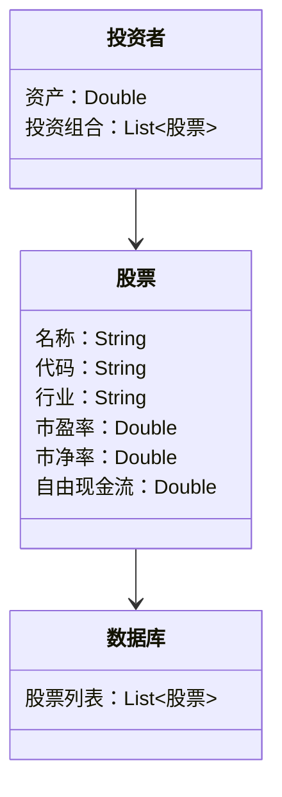
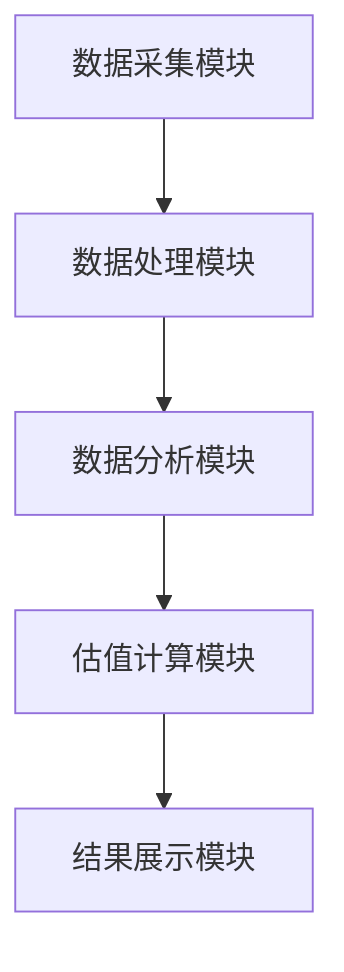
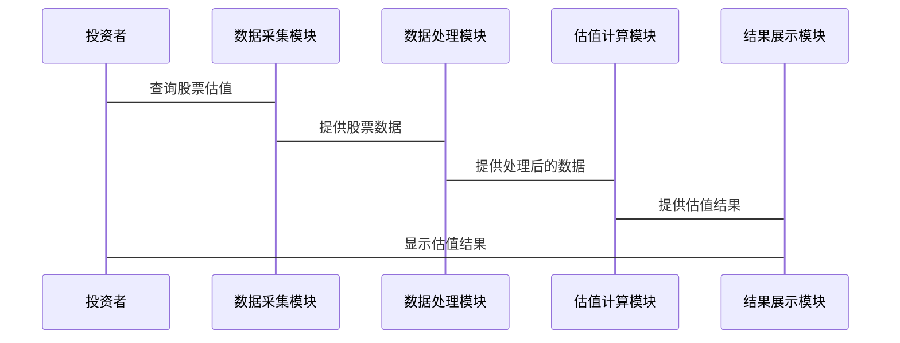

                 


# 德国股市估值: 欧洲经济引擎的投资前景

---

## 关键词
德国股市, 股票估值, 投资前景, 欧洲经济, 宏观经济, 行业分析, 技术分析

---

## 摘要
德国股市作为欧洲经济的引擎，不仅是全球投资者关注的焦点，也是理解欧洲乃至全球经济的重要窗口。本文通过分析德国股市的估值方法、行业结构和宏观经济背景，深入探讨其投资前景。我们从股票估值的核心概念出发，结合德国股市的特殊性，详细讲解市盈率、市净率等指标，并通过实际案例分析，展示如何在德国股市中寻找投资机会。此外，本文还探讨了宏观经济因素对德国股市的影响，为投资者提供了全面的视角和实用的策略。

---

## 第1章: 德国股市估值背景与重要性

### 1.1 德国股市的背景与重要性

#### 1.1.1 德国股市的定义与历史发展
德国股市是全球最重要的股票市场之一，以法兰克福证券交易所（Frankfurt Stock Exchange）为核心。其历史可以追溯到18世纪，经历了多次改革和发展，现已成为欧洲最大的股票市场之一。德国股市不仅是德国企业的融资平台，也是全球投资者投资欧洲市场的门户。

#### 1.1.2 德国股市在全球经济中的地位
德国股市在全球经济中占据重要地位，尤其在欧洲市场中更是核心引擎。德国不仅是欧洲最大的经济体，其制造业和出口能力在全球范围内具有竞争力。德国股市的波动往往会影响整个欧洲市场的表现。

#### 1.1.3 德国股市对投资者的吸引力
德国股市对投资者的吸引力主要体现在以下几个方面：
1. **强大的经济基础**：德国作为全球第四大经济体，其企业盈利能力和抗风险能力较强。
2. **丰富的行业分布**：德国股市涵盖制造业、科技、金融、能源等多个行业，投资者可以根据自身需求选择合适的投资标的。
3. **相对稳定的市场环境**：德国的法律体系和监管机构完善，市场透明度高，为投资者提供了较高的安全感。

### 1.2 德国股市与其他欧洲股市的对比

#### 1.2.1 欧洲主要股市的概况
欧洲主要股市包括德国股市（DAX）、法国股市（CAC 40）、英国股市（FTSE 100）和瑞士股市（SIX）。每个市场的特点不同，例如英国股市更偏向金融和能源行业，而瑞士股市则以稳定和高端制造业著称。

#### 1.2.2 德国股市的独特优势
德国股市的独特优势主要体现在以下几个方面：
1. **强大的制造业基础**：德国是全球制造业的领导者，其企业在汽车、机械、化工等领域的竞争力全球领先。
2. **科技创新能力强**：德国在科技领域的研发投入较高，许多创新型企业集中在德国股市。
3. **市场流动性高**：德国股市的交易量大，市场流动性好，投资者可以随时买卖股票。

#### 1.2.3 德国股市与非欧洲市场的差异
与美国和亚洲市场相比，德国股市具有以下特点：
1. **行业分布更集中**：美国市场更分散，涵盖科技、金融、消费等多个行业，而德国股市则更集中于制造业和科技。
2. **市场波动性较低**：德国股市受宏观经济影响较大，但波动性相对较低，适合稳健型投资者。
3. **文化与政策差异**：德国的企业治理和政策环境具有欧洲特色，投资者需要适应其文化背景。

### 1.3 投资德国股市的意义与目标

#### 1.3.1 投资者为何选择德国股市
投资者选择德国股市的原因包括：
1. ** diversification**：通过投资德国股市，投资者可以分散投资组合的风险。
2. **高增长潜力**：德国股市中的许多行业具有较高的增长潜力，尤其是在科技和制造业领域。
3. **稳定的收益**：德国股市的股息收益率较高，适合追求稳定收益的投资者。

#### 1.3.2 投资目标设定
投资者在投资德国股市时，需要明确自己的目标。例如：
1. **长期增长**：通过投资具有高增长潜力的企业实现长期收益。
2. **稳定收益**：通过投资高股息率的股票获得稳定的现金流。
3. **短期交易**：通过技术分析和市场波动进行短期买卖。

#### 1.3.3 投资风险与收益分析
投资德国股市需要考虑以下风险：
1. **宏观经济风险**：德国经济受欧洲和全球宏观经济的影响较大。
2. **行业风险**：某些行业可能受到政策或市场变化的影响。
3. **市场波动风险**：股市本身具有波动性，投资者需要做好风险管理工作。

---

## 第2章: 德国股市估值的核心概念与背景

### 2.1 股票估值的基本概念

#### 2.1.1 股票估值的定义与作用
股票估值是通过分析企业的财务数据、行业地位、市场前景等因素，确定其股票的合理价格。股票估值的作用在于帮助投资者做出明智的投资决策。

#### 2.1.2 股票估值的主要方法
股票估值的主要方法包括：
1. **相对估值法**：通过比较企业的估值指标（如市盈率、市净率）与行业平均水平或可比公司进行估值。
2. **绝对估值法**：通过现金流折现模型（DCF）等方法，计算企业的内在价值。
3. **技术分析法**：通过分析股票的价格走势和交易量来预测未来的价格变动。

#### 2.1.3 股票估值的关键指标
股票估值的关键指标包括：
- 市盈率（P/E Ratio）
- 市净率（P/B Ratio）
- 股息率（Dividend Yield）
- 自由现金流（Free Cash Flow）

### 2.2 德国股市估值的特殊性

#### 2.2.1 德国经济结构对股市估值的影响
德国的经济结构以制造业为主，其企业的盈利能力和现金流较为稳定，这使得德国股市的估值相对较为稳健。

#### 2.2.2 德国企业治理与估值的关系
德国的企业治理较为严格，董事会和管理层的职责分离，企业治理透明度高，这有助于提升投资者对企业的信任。

#### 2.2.3 德国股市的行业分布与估值特点
德国股市的行业分布较为集中，制造业和科技行业的企业占比高，这些行业的估值指标往往与其他行业有所不同。

### 2.3 德国股市估值的宏观经济背景

#### 2.3.1 欧洲经济对德国股市的影响
欧洲经济的波动对德国股市的影响较大。例如，欧元区的经济政策、债务问题等都会影响德国股市的表现。

#### 2.3.2 德国国内经济政策对股市估值的作用
德国的财政政策和货币政策对股市估值有直接影响。例如，宽松的货币政策可能会推高股市估值，而紧缩的财政政策可能会抑制股市表现。

#### 2.3.3 汇率波动对德国股市估值的影响
汇率波动对德国股市的影响主要体现在出口型企业。欧元升值可能会削弱出口企业的竞争力，从而影响其估值。

---

## 第3章: 德国股市估值的核心指标与方法

### 3.1 常用股票估值指标

#### 3.1.1 市盈率（P/E Ratio）
市盈率是衡量股票估值的重要指标，计算公式为：
$$ P/E = \frac{\text{股价}}{\text{每股收益}} $$

市盈率反映了市场对企业的估值水平。一般来说，市盈率越低，股票的估值越低，投资价值越高。

#### 3.1.2 市净率（P/B Ratio）
市净率是衡量股票估值的另一个重要指标，计算公式为：
$$ P/B = \frac{\text{股价}}{\text{每股净资产}} $$

市净率适用于评估资产密集型企业（如银行、房地产）的估值。

#### 3.1.3 股息率（Dividend Yield）
股息率是衡量股票收益能力的指标，计算公式为：
$$ \text{股息率} = \frac{\text{每股股息}}{\text{股价}} \times 100\% $$

股息率高意味着股票的投资回报率高，适合追求稳定收益的投资者。

### 3.2 德国股市估值的特殊指标

#### 3.2.1 企业价值（EV）与息税折旧及摊销前利润（EBITDA）
企业价值是衡量企业整体价值的重要指标，计算公式为：
$$ EV = \text{企业市值} + \text{债务} - \text{现金及等价物} $$

息税折旧及摊销前利润（EBITDA）是衡量企业盈利能力和现金流的重要指标。

#### 3.2.2 自由现金流（Free Cash Flow）
自由现金流是衡量企业财务健康状况的重要指标，计算公式为：
$$ \text{自由现金流} = \text{经营活动现金流} - \text{资本支出} $$

自由现金流高的企业具有较强的盈利能力和扩张能力。

#### 3.2.3 市场资本化率（Market to Book Ratio）
市场资本化率是衡量企业市场价值与账面价值之比，计算公式为：
$$ \text{市场资本化率} = \frac{\text{市场价值}}{\text{账面价值}} $$

市场资本化率高的企业可能具有较高的成长潜力。

### 3.3 德国股市估值的主要方法

#### 3.3.1 市盈率法
市盈率法适用于评估企业的相对估值。例如，如果德国股市的平均市盈率为15倍，而某企业的市盈率为12倍，则该企业的股票可能被低估。

#### 3.3.2 市净率法
市净率法适用于评估资产密集型企业。例如，如果某银行的市净率为1.5倍，而行业平均市净率为1.2倍，则该银行的股票可能被高估。

#### 3.3.3 现金流折现法（DCF）
现金流折现法是绝对估值法的一种，适用于评估企业的内在价值。通过预测企业的未来现金流并将其折现，计算企业的合理估值。

### 3.4 估值方法的优缺点对比

#### 3.4.1 各种估值方法的适用场景
- **市盈率法**适用于评估企业的相对估值。
- **市净率法**适用于评估资产密集型企业。
- **现金流折现法**适用于评估企业的内在价值。

#### 3.4.2 各种估值方法的优缺点分析
- **市盈率法**：简单易懂，但受行业和市场环境影响较大。
- **市净率法**：适用于资产密集型企业，但不适用于轻资产企业。
- **现金流折现法**：计算复杂，但结果较为准确。

#### 3.4.3 综合使用估值方法的优势
综合使用多种估值方法可以提高估值的准确性。例如，结合市盈率法和现金流折现法，可以从多个角度评估企业的估值水平。

---

## 第4章: 德国股市估值的行业与个股分析

### 4.1 行业分析与估值

#### 4.1.1 德国主要行业的估值特点
德国的主要行业包括：
1. **制造业**：如汽车、机械制造。
2. **科技行业**：如软件开发、半导体。
3. **金融行业**：如银行、保险。
4. **能源行业**：如石油、天然气。

#### 4.1.2 行业生命周期对估值的影响
行业生命周期的不同阶段会影响股票的估值。例如，处于成长期的行业可能具有较高的估值，而处于成熟期的行业则可能具有较低的估值。

#### 4.1.3 行业竞争格局对估值的影响
行业竞争格局对企业估值有重要影响。例如，垄断行业的企业可能具有较高的定价权和利润率，从而提高估值。

### 4.2 个股分析与估值

#### 4.2.1 个股分析的基本步骤
个股分析的基本步骤包括：
1. **基本面分析**：分析企业的财务数据、盈利能力、成长能力等。
2. **技术分析**：分析股票的价格走势、交易量等技术指标。
3. **行业分析**：分析企业所在行业的竞争格局和市场前景。

#### 4.2.2 个股估值的注意事项
- **数据的准确性**：确保使用的财务数据准确可靠。
- **行业特殊性**：不同行业的估值指标和方法可能不同。
- **市场环境**：宏观经济环境和政策变化会影响个股估值。

---

## 第5章: 德国股市估值的系统分析与架构设计

### 5.1 系统分析

#### 5.1.1 问题场景介绍
本文旨在通过系统分析的方法，帮助投资者更好地理解德国股市的估值问题。

#### 5.1.2 系统功能设计
系统功能设计包括以下几个方面：
1. **数据采集**：采集企业的财务数据、市场数据等。
2. **数据分析**：对数据进行清洗、处理和分析。
3. **估值计算**：根据分析结果计算股票的合理估值。
4. **结果展示**：将估值结果以图表等形式展示出来。

#### 5.1.3 系统架构设计
系统架构设计包括以下几个部分：
- **数据层**：包括数据采集模块和数据存储模块。
- **业务逻辑层**：包括数据处理模块和估值计算模块。
- **用户界面层**：包括数据展示模块和结果展示模块。

### 5.2 系统架构设计

#### 5.2.1 领域模型类图
以下是领域模型类图的Mermaid图：



#### 5.2.2 系统架构图
以下是系统架构图的Mermaid图：



### 5.3 系统接口设计

#### 5.3.1 数据采集接口
数据采集接口负责从外部数据源采集股票的财务数据和市场数据。

#### 5.3.2 数据处理接口
数据处理接口负责对采集到的数据进行清洗和处理，确保数据的准确性和完整性。

#### 5.3.3 估值计算接口
估值计算接口负责根据处理后的数据计算股票的合理估值。

#### 5.3.4 结果展示接口
结果展示接口负责将估值结果以图表等形式展示给投资者。

### 5.4 系统交互序列图

#### 5.4.1 投资者查询股票估值
以下是投资者查询股票估值的序列图：



---

## 第6章: 德国股市估值的项目实战

### 6.1 环境安装与配置

#### 6.1.1 安装Python环境
建议使用Anaconda作为Python环境的管理工具，安装步骤如下：
1. 下载并安装Anaconda（https://www.anaconda.com/）。
2. 配置环境变量，确保Python和Jupyter Notebook可以正常运行。

#### 6.1.2 安装必要的Python库
安装以下Python库：
```bash
pip install pandas numpy matplotlib seaborn yfinance
```

### 6.2 核心实现代码

#### 6.2.1 数据采集与处理
以下代码用于从Yahoo Finance获取德国股市数据：

```python
import yfinance as yf
import pandas as pd

# 下载德国股市数据
def get_stocks_data(tickers):
    data = yf.download(tickers, start="2020-01-01", end="2023-12-31")
    return data

# 示例：获取DAX指数成分股
dax_indices = ["AD","AG","ALV","AMG","Bayer","BMW","CGD","Continental","Daimler","FRE"]
data = get_stocks_data(dax_indices)
```

#### 6.2.2 估值计算与分析
以下代码用于计算股票的市盈率和市净率：

```python
import pandas as pd
import numpy as np

def calculate_valuation_metrics(stock_data):
    stock_data['PE'] = stock_data['Adj Close'] / stock_data['Earnings per Share']
    stock_data['PB'] = stock_data['Adj Close'] / stock_data['Book Value per Share']
    return stock_data

# 示例：计算估值指标
valuation_data = calculate_valuation_metrics(data)
```

### 6.3 实战案例分析

#### 6.3.1 案例背景
以德国汽车制造企业为例，分析其市盈率和市净率的变化趋势。

#### 6.3.2 数据分析与结果展示
以下代码用于绘制市盈率和市净率的柱状图：

```python
import matplotlib.pyplot as plt

valuation_data.groupby('Ticker')['PE'].mean().plot(kind='bar')
plt.title('平均市盈率')
plt.ylabel('PE')
plt.show()

valuation_data.groupby('Ticker')['PB'].mean().plot(kind='bar')
plt.title('平均市净率')
plt.ylabel('PB')
plt.show()
```

### 6.4 小结

#### 6.4.1 实战总结
通过实战案例，我们可以看到德国股市中不同企业的估值指标存在显著差异，投资者需要结合行业特点和企业基本面进行综合分析。

#### 6.4.2 投资策略建议
基于实战分析，建议投资者关注以下几点：
1. **行业选择**：优先选择具有高增长潜力的行业，如科技和制造业。
2. **估值指标**：结合市盈率和市净率等指标，寻找被低估的股票。
3. **风险控制**：合理分散投资组合，避免过度集中于某一行

