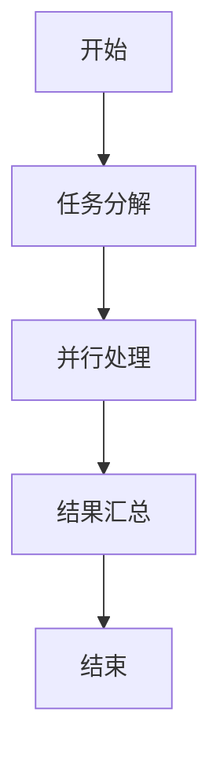
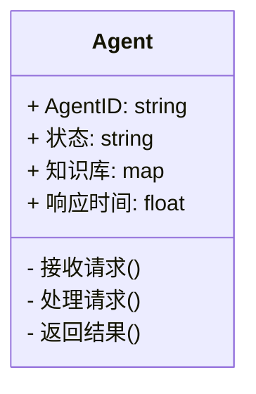
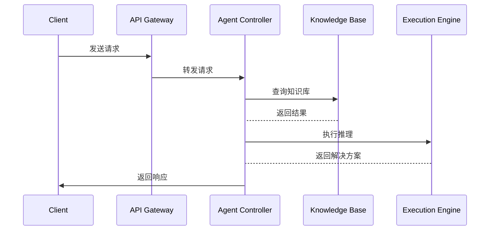

                 


# 性能优化：提升AI Agent的响应速度

> 关键词：性能优化，AI Agent，响应速度，算法优化，系统架构设计，硬件加速

> 摘要：本文将详细探讨如何优化AI Agent的响应速度，从背景介绍到核心概念，从算法原理到系统架构设计，再到项目实战，层层深入，为读者提供一套完整的性能优化解决方案。文章内容涵盖性能优化的必要性、优化策略、算法原理、系统设计、项目实现以及未来展望，帮助读者全面理解并掌握AI Agent性能优化的核心方法。

---

# 第1章 性能优化背景与问题描述

## 1.1 人工智能与AI Agent的发展现状

### 1.1.1 人工智能技术的演进历程

人工智能（Artificial Intelligence，AI）技术经历了从规则驱动到数据驱动，从单一任务到多任务，从单机运算到分布式计算的演进。当前，AI技术已广泛应用于自然语言处理、计算机视觉、机器人控制等领域，而AI Agent作为人工智能的核心实现形式之一，正在逐步渗透到各个行业，如智能客服、自动驾驶、智能助手等。

AI Agent（智能代理）是一种能够感知环境、自主决策并执行任务的智能实体。它通过与用户或环境的交互，完成特定目标，例如信息检索、任务调度、决策支持等。随着AI Agent的应用场景不断扩展，其性能优化问题也变得越来越重要。

### 1.1.2 AI Agent的基本概念与应用场景

AI Agent的核心特征包括：

- **自主性**：能够在没有外部干预的情况下自主决策。
- **反应性**：能够实时感知环境并做出反应。
- **目标导向性**：具有明确的目标，并通过行动实现目标。
- **学习能力**：能够通过经验或数据改进自身的性能。

AI Agent的应用场景包括：

- 智能助手（如Siri、Alexa）。
- 自动化交易系统。
- 智能监控系统。
- 无人驾驶汽车。

### 1.1.3 当前AI Agent性能优化的必要性

随着AI Agent的应用越来越广泛，其响应速度成为用户体验的关键指标。慢速的响应不仅会影响用户体验，还可能导致业务损失。例如，在智能客服场景中，如果AI Agent无法在短时间内提供准确的回复，用户可能会转向竞争对手。

此外，AI Agent的响应速度还直接影响系统的吞吐量和资源利用率。在高并发场景下，优化响应速度能够显著降低系统负载，提高资源利用率。

---

## 1.2 响应速度优化的核心问题

### 1.2.1 AI Agent响应速度的定义与衡量标准

AI Agent的响应速度是指从接收到请求到返回结果的时间间隔。衡量响应速度的标准包括：

- 平均响应时间（Average Response Time）。
- 响应时间的波动性（Jitter）。
- 响应时间的最长值（Latency）。

### 1.2.2 影响AI Agent响应速度的关键因素

影响AI Agent响应速度的主要因素包括：

- **算法复杂度**：算法的计算量直接影响响应时间。
- **数据处理效率**：数据预处理、特征提取等步骤的效率影响整体响应速度。
- **系统架构**：单机处理还是分布式处理，影响系统的扩展性和响应能力。
- **硬件性能**：CPU、GPU等硬件性能直接影响计算速度。

### 1.2.3 响应速度优化的目标与边界

响应速度优化的目标是通过算法优化、架构改进、硬件加速等手段，在保证准确性的同时，尽可能降低响应时间。优化的边界在于：

- 不得牺牲准确性：优化必须在保证结果正确性的前提下进行。
- 不得过度增加资源消耗：优化需要在成本可控的范围内进行。

---

## 1.3 本章小结

本章从AI Agent的发展现状出发，介绍了AI Agent的基本概念、应用场景及其性能优化的必要性。通过分析影响响应速度的关键因素，提出了响应速度优化的目标与边界。接下来，将深入探讨AI Agent性能优化的核心概念与原理。

---

# 第2章 AI Agent性能优化的核心概念

## 2.1 AI Agent的内部结构与工作原理

### 2.1.1 AI Agent的基本组成模块

AI Agent的内部结构主要包括以下几个模块：

- **感知模块**：负责接收外部输入并解析请求。
- **推理模块**：基于知识库或模型进行推理，生成候选解决方案。
- **执行模块**：将推理结果转化为具体行动。
- **学习模块**：通过反馈优化自身的模型或策略。

### 2.1.2 各模块的功能与交互关系

AI Agent的工作流程如下：

1. **感知模块**接收用户请求。
2. **推理模块**基于当前状态和知识库生成候选方案。
3. **执行模块**根据候选方案选择最优行动并执行。
4. **学习模块**根据执行结果更新知识库或模型。

### 2.1.3 Agent生命周期模型

AI Agent的生命周期包括初始化、运行、终止三个阶段。在运行阶段，Agent通过感知、推理、执行和学习四个步骤不断优化自身的性能。

---

## 2.2 性能优化的关键维度

### 2.2.1 计算效率优化

计算效率优化主要通过算法优化和硬件加速实现。例如，使用更高效的算法（如贪心算法）或利用GPU加速计算。

### 2.2.2 内存使用效率优化

内存使用效率优化主要通过数据压缩、缓存优化等手段实现。例如，使用压缩算法减少数据存储空间，或利用缓存机制减少重复计算。

### 2.2.3 并行与分布式处理优化

并行与分布式处理优化通过将任务分解为多个子任务并行执行，提高系统的吞吐量和响应速度。

---

## 2.3 核心概念的ER实体关系图

以下是一个简单的ER实体关系图，展示了AI Agent性能优化的核心概念之间的关系：

```mermaid
er
actor(AgentID, 响应时间, 任务类型) {
    AgentID: 唯一标识符
    响应时间: 响应速度指标
    任务类型: 任务分类
}
```

---

## 2.4 本章小结

本章详细介绍了AI Agent的内部结构与工作原理，并提出了性能优化的关键维度。通过ER实体关系图，展示了各核心概念之间的关系。接下来，将深入探讨性能优化的算法原理与数学模型。

---

# 第3章 性能优化算法原理与数学模型

## 3.1 常用性能优化算法概述

### 3.1.1 剪枝算法

剪枝算法是一种通过提前终止不必要的计算来优化响应速度的算法。例如，在决策树构建中，剪枝算法可以提前终止某些分支的计算。

### 3.1.2 并行计算算法

并行计算算法通过将任务分解为多个子任务并行执行，提高计算效率。例如，使用多线程或分布式计算框架（如MapReduce）。

### 3.1.3 分布式计算算法

分布式计算算法通过将任务分配到多个节点上并行执行，进一步提高系统的扩展性和响应速度。

---

## 3.2 剪枝算法的数学模型

### 3.2.1 剪枝原理

剪枝算法的核心思想是通过减少不必要的计算步骤来降低响应时间。例如，在决策树构建中，剪枝算法可以通过删除某些分支来降低计算复杂度。

### 3.2.2 剪枝策略的选择

剪枝策略的选择可以通过以下公式进行评估：

$$
剪枝收益 = \frac{计算时间减少量}{准确率损失量}
$$

### 3.2.3 剪枝效果的数学评估

通过剪枝算法，可以将计算时间从$O(n^2)$优化为$O(n)$，其中$n$是数据规模。

---

## 3.3 并行计算的流程图

以下是一个并行计算的流程图：



---

## 3.4 数学公式与实例分析

### 3.4.1 剪枝算法的公式推导

假设我们有一个决策树模型，通过剪枝可以将计算时间从$O(n^2)$优化为$O(n)$。具体推导过程如下：

$$
剪枝后计算时间 = 剪枝前计算时间 \times \frac{1}{剪枝比例}
$$

---

## 3.5 本章小结

本章通过数学模型和流程图，详细介绍了几种常用的性能优化算法。接下来，将从系统架构设计的角度，探讨如何进一步优化AI Agent的响应速度。

---

# 第4章 系统分析与架构设计

## 4.1 项目场景介绍

假设我们正在优化一个智能客服AI Agent，该系统需要处理大量的用户请求，包括问题解答、信息查询等。

## 4.2 系统功能设计

### 4.2.1 领域模型设计

以下是一个简单的领域模型类图：



### 4.2.2 系统架构设计

以下是一个AI Agent的系统架构图：


---

## 4.3 系统接口设计

### 4.3.1 接口设计

以下是AI Agent的主要接口：

- `receiveRequest(request: string) -> void`
- `processRequest() -> solution`
- `returnResponse(solution: string) -> void`

### 4.3.2 交互图

以下是一个交互图，展示了AI Agent与客户端之间的交互过程：



---

## 4.4 本章小结

本章从系统架构设计的角度，探讨了AI Agent的优化方法。通过领域模型和架构图，展示了如何通过优化系统架构来提升响应速度。

---

# 第5章 项目实战

## 5.1 环境安装

假设我们使用Python和TensorFlow框架，以下是环境安装命令：

```bash
pip install python tensorflow
```

---

## 5.2 系统核心实现源代码

以下是一个简单的AI Agent实现代码：

```python
class Agent:
    def __init__(self):
        self.AgentID = ""
        self.知识库 = {}

    def 接收请求(self, request):
        # 解析请求
        pass

    def 处理请求(self):
        # 推理和计算
        pass

    def 返回结果(self):
        # 返回响应
        pass

agent = Agent()
agent.接收请求("查询天气")
agent.处理请求()
agent.返回结果()
```

---

## 5.3 实际案例分析

以智能客服场景为例，假设我们有一个用户请求“查询订单状态”，AI Agent需要通过以下步骤完成任务：

1. **接收请求**：解析用户的查询内容。
2. **处理请求**：查询订单数据库，获取订单状态。
3. **返回结果**：将查询结果返回给用户。

---

## 5.4 项目小结

本章通过实际案例，展示了如何通过代码实现AI Agent的性能优化。接下来，将总结优化经验，并展望未来的研究方向。

---

# 第6章 总结与展望

## 6.1 优化经验总结

通过本文的探讨，我们得出以下优化经验：

- 算法优化是提升响应速度的核心手段。
- 系统架构设计是优化的基础。
- 硬件加速是进一步优化的有力支持。

## 6.2 未来研究方向

未来的研究方向包括：

- 更高效的算法设计。
- 更智能的系统架构优化。
- 更先进的硬件加速技术。

---

# 作者信息

作者：AI天才研究院（AI Genius Institute） & 禅与计算机程序设计艺术（Zen And The Art of Computer Programming）

---

以上是文章的完整目录大纲，每章内容将详细展开，为您提供更全面的性能优化解决方案。

