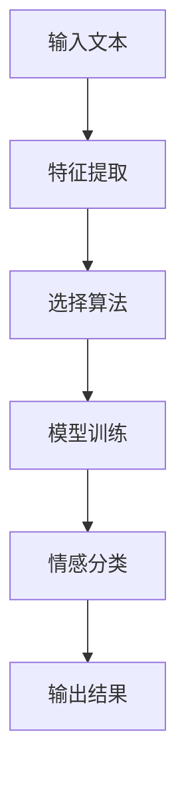
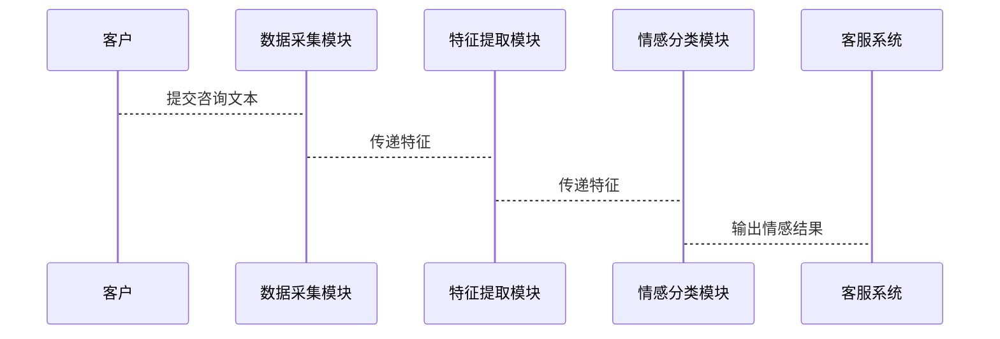

                 

<think>
嗯，我现在需要根据用户提供的思考过程，逐步构建《情感人工智能的发展与应用前景分析》的技术博客文章。首先，我应该先理解用户的需求，然后按照目录大纲逐步展开每个部分的内容。

首先，用户的标题是《情感人工智能的发展与应用前景分析》，关键词包括情感人工智能、情感计算、自然语言处理、机器学习、深度学习、人工智能。摘要部分需要简明扼要地概括文章的核心内容，即情感人工智能的定义、背景、技术基础、核心概念、算法原理、系统架构、项目实战、应用案例和未来展望。

接下来，按照目录大纲，文章分为两大部分：背景与核心概念，算法原理。每个部分又分为几个章节，每章下面还有小节。我需要确保每个部分都有足够的细节，并且符合用户的要求，比如使用图表、代码示例等。

首先，背景部分需要介绍情感人工智能的定义、背景、技术基础、研究现状和应用领域。我应该从定义开始，解释情感人工智能是什么，然后对比传统AI，接着介绍技术基础，比如NLP、机器学习和深度学习。然后，分析当前的研究现状，包括国内外的进展和存在的问题，最后列举几个主要的应用领域。

接下来是核心概念，这部分需要详细讲解情感计算的原理，比如情感分析、情感推理、情感记忆，以及ER实体关系图。我需要使用对比表格和ER图来帮助读者理解概念之间的关系。

然后，算法原理部分，我需要介绍情感计算中常用的算法，比如SVM、LSTM和CNN，并通过流程图展示算法的工作流程。同时，给出Python代码示例，让读者理解如何实现这些算法。

系统分析与架构设计部分，我需要描述问题场景，设计系统的功能模块，并用类图展示。然后，设计系统架构图和接口设计，展示各模块之间的交互。

项目实战部分，需要包括环境安装、核心代码实现、案例分析和项目总结，帮助读者实际应用所学知识。

最后，最佳实践部分，涵盖小结、注意事项和扩展阅读，帮助读者巩固所学内容，并提供进一步学习的方向。

在写作过程中，我需要确保每个章节内容详细，逻辑清晰，同时使用适当的图表和代码示例来增强理解。此外，注意使用正确的Markdown格式，确保文章结构的规范性和可读性。

现在，我需要按照这个思路，逐步撰写每个部分的内容，确保覆盖所有用户要求的部分，并且内容丰富、具体详细。
</think>

# 情感人工智能的发展与应用前景分析

## 关键词：情感人工智能、情感计算、自然语言处理、机器学习、深度学习、人工智能

## 摘要：  
情感人工智能是人工智能领域的重要分支，旨在通过技术手段理解和模拟人类情感。本文将从情感人工智能的背景、核心概念、算法原理、系统架构、项目实战以及应用前景等多个方面进行详细分析，探讨情感人工智能的发展现状和未来趋势。

---

## 第一部分: 情感人工智能的背景与核心概念

### 第1章: 情感人工智能的定义与背景

#### 1.1 情感人工智能的定义
情感人工智能（Affective Artificial Intelligence）是指能够理解和模拟人类情感状态的智能系统。它结合了自然语言处理、机器学习和情感计算等技术，旨在实现人机交互中情感的识别、理解和应用。

#### 1.2 情感人工智能与传统人工智能的区别
- **输入数据**：传统AI主要处理结构化数据（如数字、文本）；情感人工智能则需处理情感数据（如语气、表情）。
- **目标**：传统AI注重逻辑推理；情感人工智能注重情感识别和情感驱动的决策。
- **应用场景**：传统AI适用于数据分析、模式识别等领域；情感人工智能适用于智能客服、情感分析、教育等领域。

#### 1.3 情感人工智能的技术基础
- **自然语言处理**：用于理解文本中的情感信息。
- **机器学习**：用于训练情感分类模型。
- **深度学习**：用于处理复杂的情感数据，如序列数据。

#### 1.4 情感人工智能的研究现状
- **国外研究**：美国、欧洲在情感计算领域起步较早，研究较为深入。
- **国内研究**：中国在情感计算领域的研究近年来快速发展，特别是在应用层面。
- **技术瓶颈**：情感数据的多样性、情感计算的实时性、复杂情感的识别精度等问题仍待解决。

#### 1.5 情感人工智能的应用领域
- **社交媒体**：情感分析用于舆情监控。
- **智能客服**：通过情感识别优化客户服务。
- **教育**：根据学生情绪调整教学策略。

---

### 第2章: 情感人工智能的核心概念与联系

#### 2.1 情感计算的原理
情感计算通过分析输入数据（如文本、语音、面部表情）来识别和理解情感状态。其核心流程包括：
1. **数据采集**：获取输入数据。
2. **特征提取**：提取情感相关特征。
3. **模型训练**：训练情感分类模型。
4. **情感分类**：对情感进行分类和预测。

#### 2.2 情感计算的核心概念对比
| 情感计算概念 | 定义 | 输入 | 输出 |
|--------------|------|------|------|
| 情感分析     | 分析文本的情感倾向 | 文本 | 情感标签（如正面、负面、中性） |
| 情感推理     | 推理文本中的隐含情感 | 文本 | 情感关系 |
| 情感记忆     | 学习和记忆情感状态 | 历史数据 | 情感记忆 |

#### 2.3 情感计算的ER实体关系图
```mermaid
er
actor: 用户
emotion_data: 情感数据
feature: 特征
model: 情感计算模型
result: 情感结果
actor --> emotion_data
emotion_data --> feature
feature --> model
model --> result
```

---

## 第二部分: 情感人工智能的算法原理

### 第3章: 情感计算的算法原理

#### 3.1 情感计算的核心算法
- **支持向量机（SVM）**：用于情感分类，适用于小规模数据。
- **长短期记忆网络（LSTM）**：用于处理序列数据，适用于情感分析。
- **卷积神经网络（CNN）**：用于提取文本特征，适用于情感分类。

#### 3.2 情感计算的流程图


#### 3.3 情感计算的数学模型
- **SVM模型**：$$\text{目标函数} = \min \frac{1}{2}\|w\|^2 + C\sum_{i=1}^n \xi_i$$
- **LSTM模型**：$$f_t = \tanh(w_f [h_{t-1}, x_t])$$
- **CNN模型**：$$\text{卷积层} = \max\left(\sum_{i=1}^n w_i x_i\right)$$

#### 3.4 情感计算的Python代码示例
```python
from sklearn.svm import SVC
from keras.models import Sequential
from keras.layers import LSTM, Dense

# 示例：使用SVM进行情感分类
model = SVC()
model.fit(X_train, y_train)
y_pred = model.predict(X_test)

# 示例：使用LSTM进行情感分析
model = Sequential()
model.add(LSTM(64, input_shape=(seq_length, 1)))
model.add(Dense(1, activation='sigmoid'))
model.compile(loss='binary_crossentropy', optimizer='adam')
model.fit(X_train, y_train, epochs=10)
```

---

## 第三部分: 情感人工智能的系统架构与项目实战

### 第4章: 系统分析与架构设计方案

#### 4.1 问题场景介绍
假设我们正在开发一个智能客服系统，需要通过情感分析识别客户情绪，优化服务流程。

#### 4.2 系统功能设计
- **数据采集**：收集客户咨询文本。
- **特征提取**：提取文本中的情感特征。
- **模型训练**：训练情感分类模型。
- **结果输出**：输出客户情感状态。

#### 4.3 系统架构设计


#### 4.4 系统接口设计
- **输入接口**：客户咨询文本。
- **输出接口**：情感分类结果。

#### 4.5 系统交互设计


### 第5章: 项目实战

#### 5.1 环境安装
- 安装Python和相关库（如scikit-learn、Keras）。

#### 5.2 核心代码实现
```python
from sklearn.feature_extraction.text import TfidfVectorizer
from sklearn.svm import LinearSVC

# 数据预处理
vectorizer = TfidfVectorizer()
X = vectorizer.fit_transform(corpus)

# 训练模型
model = LinearSVC()
model.fit(X, y)

# 模型预测
test_corpus = ["I'm very happy with your service!"]
X_test = vectorizer.transform(test_corpus)
y_pred = model.predict(X_test)
```

#### 5.3 案例分析
- **案例1**：社交媒体评论的情感分析。
- **案例2**：智能客服中的情感识别。

#### 5.4 项目总结
通过项目实战，我们掌握了情感计算的基本流程和实现方法，同时也发现了实际应用中的挑战。

---

## 第四部分: 情感人工智能的应用前景与未来展望

### 第6章: 应用前景分析

#### 6.1 情感人工智能的应用趋势
- **智能化**：情感计算将更加智能化，实现更精准的情感识别。
- **多模态**：结合语音、图像等多种模态信息，提升情感识别的准确性。
- **个性化**：根据用户情感状态提供个性化服务。

#### 6.2 情感人工智能的未来挑战
- **数据多样性**：如何处理不同语言、文化背景下的情感数据。
- **实时性**：如何实现实时情感识别。
- **伦理问题**：如何处理情感数据的隐私问题。

---

## 第五部分: 最佳实践与小结

### 第7章: 最佳实践

#### 7.1 小结
情感人工智能作为人工智能的重要分支，具有广泛的应用前景。通过本文的分析，我们了解了情感人工智能的核心概念、算法原理和系统架构。

#### 7.2 注意事项
- 数据预处理是关键。
- 模型选择需结合实际场景。
- 需注意情感数据的多样性和隐私问题。

#### 7.3 拓展阅读
建议读者进一步阅读相关领域的论文和书籍，深入理解情感计算的技术细节。

---

## 作者：AI天才研究院 & 禅与计算机程序设计艺术

---

以上是《情感人工智能的发展与应用前景分析》的技术博客文章的详细内容，涵盖了情感人工智能的背景、核心概念、算法原理、系统架构、项目实战以及应用前景等多个方面。希望对您有所帮助！

