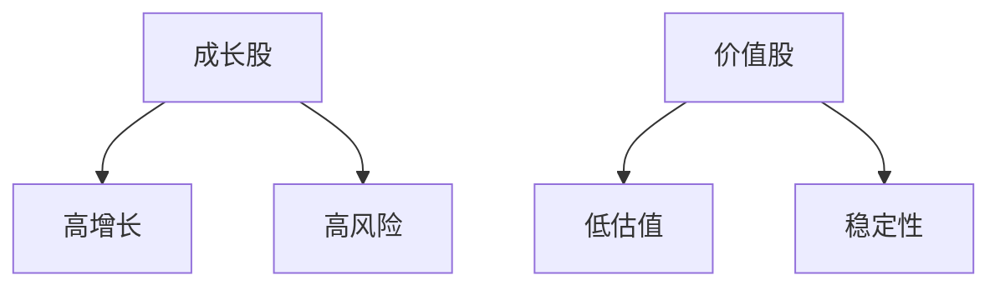
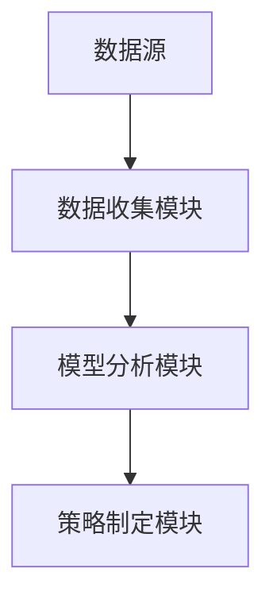

                 


# 成长股 vs 价值股：在当前市场环境中如何选择

## 关键词：成长股，价值股，投资策略，市场环境，股票分析

## 摘要：本文通过分析成长股和价值股的核心概念、投资策略和数学模型，帮助投资者在当前市场环境中做出明智的投资选择。文章从背景介绍、核心概念对比、投资策略选择、数学模型应用、系统架构设计到项目实战，全面探讨了如何在不同市场环境下选择适合的投资策略。

---

## 第一部分：背景介绍

### 第1章：股票投资基础知识

#### 1.1 股票的基本概念
股票是企业的一部分所有权，投资者通过购买股票成为公司的股东，享有分红和增值收益。股票市场分为主板、创业板等，投资者分为机构投资者和个人投资者。

#### 1.2 成长股和价值股的定义
- **成长股**：指那些增长速度快、未来盈利潜力大的股票，通常属于新兴产业或高增长行业。
- **价值股**：指市场价格低于其内在价值的股票，通常属于成熟行业，市盈率、市净率较低。

#### 1.3 当前市场环境分析
当前市场受经济周期、政策环境和行业趋势影响。例如，经济复苏期可能更适合成长股，而经济衰退期可能更适合价值股。

---

## 第二部分：成长股与价值股的核心概念与联系

### 第2章：成长股与价值股的核心概念对比

#### 2.1 核心概念的对比分析
| 属性       | 成长股                   | 价值股                   |
|------------|--------------------------|--------------------------|
| 估值方法   | 市盈率增长（PEG）         | 市盈率（PE）、市净率（PB） |
| 风险       | 高                      | 中等                     |
| 收益       | 高增长                   | 稳定                     |
| 适合投资者 | 风险承受能力强的长期投资者 | 追求稳定收益的中短期投资者 |

#### 2.2 成长股与价值股的特点对比
- 成长股：高增长潜力，但波动性大，风险高。
- 价值股：低估值，稳定性高，风险低。

使用Mermaid图展示对比分析：



---

## 第三部分：投资策略

### 第3章：投资策略的选择

#### 3.1 基本面分析
- **成长股**：关注PEG指标，选择PEG小于1的股票。
- **价值股**：关注PE、PB指标，选择PE低于行业平均水平的股票。

#### 3.2 技术分析
- **K线图分析**：观察股票价格走势，判断趋势。
- **均线分析**：使用MA（移动平均线）判断买卖点。

#### 3.3 投资策略选择
根据市场环境选择策略，例如在牛市中选择成长股，熊市中选择价值股。

---

## 第四部分：数学模型和算法

### 第4章：数学模型的应用

#### 4.1 成长股评估模型
使用现金流贴现模型（DCF）评估内在价值：

$$ \text{内在价值} = \sum_{t=1}^{n} \frac{\text{现金流}}{(1 + r)^t} + \frac{\text{终值}}{(1 + r)^n} $$

#### 4.2 价值股评估模型
使用市盈率和市净率分析：

$$ \text{合理股价} = \text{每股收益} \times \text{目标市盈率} $$

$$ \text{合理股价} = \text{每股净资产} \times \text{目标市净率} $$

---

## 第五部分：系统分析与架构设计

### 第5章：系统架构设计

#### 5.1 系统模块划分
- 数据收集模块：获取股票数据。
- 模型分析模块：计算估值指标。
- 策略制定模块：根据模型结果制定投资策略。

#### 5.2 使用Mermaid图展示系统架构



---

## 第六部分：项目实战

### 第6章：项目实战案例

#### 6.1 环境安装与数据准备
使用Python和相关库（如Pandas、Matplotlib）进行数据处理和可视化。

#### 6.2 代码实现
```python
import pandas as pd
import matplotlib.pyplot as plt

# 数据收集
data = pd.read_csv('stock_data.csv')

# 成长股筛选
growth_stocks = data[data['PEG'] < 1]
growth_stocks['PEG'].hist(bins=20, figsize=(10,6))
plt.title('成长股PEG分布')
plt.show()

# 价值股筛选
value_stocks = data[data['PE'] < data['PE'].mean()]
value_stocks['PE'].hist(bins=20, figsize=(10,6))
plt.title('价值股PE分布')
plt.show()
```

#### 6.3 案例分析与结果解读
以某公司为例，分析其是否为成长股或价值股，并展示如何应用上述模型进行投资决策。

---

## 第七部分：总结与展望

### 第7章：总结与展望

#### 7.1 核心内容回顾
本文详细对比了成长股和价值股的概念、特点和投资策略，提供了数学模型和系统架构设计，帮助投资者在不同市场环境中做出选择。

#### 7.2 未来发展趋势
随着市场环境的变化，投资者需要灵活调整策略，结合技术分析和基本面分析，制定最优投资计划。

#### 7.3 投资建议与注意事项
- 投资者应根据自身风险承受能力和投资目标选择策略。
- 长期投资需关注公司基本面，短期投资需关注市场情绪。

---

## 作者：AI天才研究院 & 禅与计算机程序设计艺术

通过以上结构，文章详细探讨了成长股和价值股的投资策略，帮助投资者在当前市场环境中做出明智选择。

