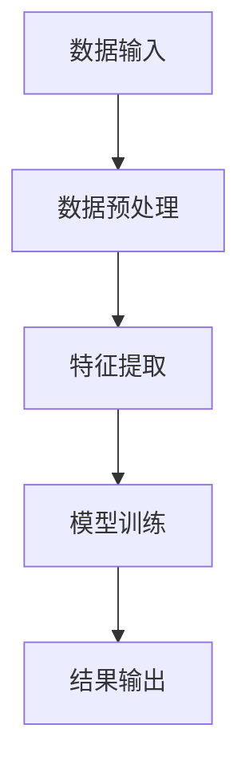
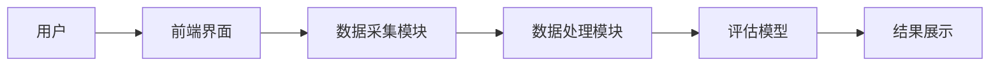
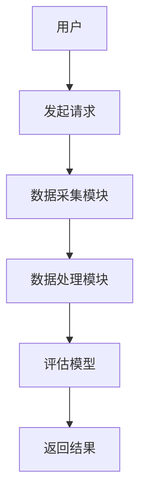

                 


# 房地产AI Agent：智能估价与市场分析

> 关键词：房地产AI Agent，智能估价，市场分析，机器学习，深度学习，数据驱动

> 摘要：本文将探讨房地产AI Agent在智能估价与市场分析中的应用。通过详细分析AI Agent的核心概念、算法原理、系统架构以及实际项目案例，我们将揭示如何利用人工智能技术提升房地产评估的准确性和效率。文章内容涵盖从数据预处理到模型优化，从系统设计到实际应用的全链条，为读者提供全面的技术解析和实践指导。

---

## 第一部分：房地产AI Agent概述

### 第1章：房地产AI Agent的背景与概念

#### 1.1 房地产AI Agent的定义与背景

房地产AI Agent是一种基于人工智能技术的智能系统，旨在通过数据驱动的方式，自动完成房地产市场的分析与评估工作。它能够实时获取房地产相关数据，结合机器学习算法，为用户提供精准的市场分析和价格评估。

**1.1.1 传统房地产评估的局限性**  
传统的房地产评估主要依赖人工经验，存在以下问题：  
1. 数据收集和处理耗时且成本高。  
2. 评估结果可能受评估师主观因素影响。  
3. 市场变化难以快速捕捉和反映。  

**1.1.2 AI技术在房地产领域的应用前景**  
AI技术的应用为房地产评估带来了革命性的变化，主要体现在：  
1. 数据处理能力的提升，能够快速分析海量数据。  
2. 模型的自动化优化，能够实时更新评估结果。  
3. 提供更精准的市场趋势预测，帮助用户做出更明智的决策。  

**1.1.3 房地产AI Agent的核心概念与目标**  
房地产AI Agent的核心目标是通过智能化手段，实现房地产市场的精准分析与评估。其主要功能包括：  
1. 房地产价格预测。  
2. 市场趋势分析。  
3. 风险评估与预警。  

#### 1.2 房地产AI Agent的核心要素

**1.2.1 数据驱动的特征提取**  
房地产AI Agent的数据来源多样，包括房价、面积、地理位置、周边设施等。通过特征提取，可以将这些数据转化为模型可识别的特征，例如：  
- 房屋面积（平方米）。  
- 位置坐标（经纬度）。  
- 周边学校、医院等设施的数量与距离。  

**1.2.2 智能算法的实现原理**  
AI Agent的核心是智能算法，常见的算法包括：  
1. 线性回归：用于简单的关系建模。  
2. 随机森林：用于特征重要性分析和非线性关系建模。  
3. 神经网络：用于复杂的模式识别。  

**1.2.3 人机交互的友好性与实时性**  
AI Agent需要提供友好的人机交互界面，并支持实时查询和更新。用户可以通过输入房屋的基本信息，快速获取评估结果。

#### 1.3 房地产AI Agent的场景与应用

**1.3.1 房地产市场分析与预测**  
AI Agent可以通过分析历史数据，预测未来的市场趋势，例如房价涨跌、供需变化等。  

**1.3.2 房地产价格评估与优化**  
AI Agent可以基于实时数据，为用户提供精准的房价评估，并提出优化建议。  

**1.3.3 AI Agent在房地产交易中的角色**  
AI Agent可以作为中介，帮助用户完成交易前的评估和谈判，降低交易风险。

---

### 第2章：房地产AI Agent的核心概念与联系

#### 2.1 AI Agent的基本原理

**2.1.1 AI Agent的定义与分类**  
AI Agent是一种智能主体，能够感知环境并采取行动以实现目标。在房地产领域，AI Agent主要分为两类：  
1. **基于规则的AI Agent**：通过预定义的规则进行决策。  
2. **基于学习的AI Agent**：通过机器学习算法自适应地优化决策策略。  

**2.1.2 房地产AI Agent的属性特征对比**  
下表展示了AI Agent与传统评估方法的主要区别：

| 属性 | AI Agent | 传统评估方法 |
|------|-----------|---------------|
| 数据处理能力 | 高效，支持大数据 | 低效，依赖人工 |
| 模型更新 | 自动化，实时更新 | 手动更新，滞后 |
| 精度 | 更高 | 受主观因素影响 |

**2.1.3 ER实体关系图的构建与分析**  
ER图（实体关系图）用于描述系统中的实体及其关系。以下是房地产AI Agent的ER图：

```mermaid
erd
    customer (客户ID, 姓名, 联系方式)
    property (物业ID, 房地产ID, 物业类型, 物业地址)
    market_analysis (市场分析ID, 分析时间, 分析结果)
    customer --| 委托 |--> property
    property --| 分析 |--> market_analysis
```

---

#### 2.2 房地产AI Agent的实体关系图

通过上述ER图可以看出，房地产AI Agent的核心实体包括：  
1. **客户**：发起市场分析请求的主体。  
2. **房地产**：需要进行分析的房产信息。  
3. **市场分析**：AI Agent生成的分析结果。  

#### 2.3 房地产AI Agent的核心算法流程

以下是房地产AI Agent的核心算法流程图：



---

## 第二部分：房地产AI Agent的算法原理与实现

### 第3章：房地产AI Agent的算法原理与实现

#### 3.1 数据预处理与特征工程

**3.1.1 数据清洗与标准化**  
数据清洗是确保模型准确性的基础。常见的数据清洗步骤包括：  
1. 处理缺失值：例如，使用均值、中位数填充。  
2. 删除异常值：例如，使用Z-score方法。  
3. 标准化：例如，使用Z-score标准化。  

**3.1.2 房屋特征的提取与选择**  
特征提取是将原始数据转化为模型可识别的特征。例如：  
- 房屋面积（平方米）。  
- 位置坐标（经纬度）。  
- 周边设施的数量与距离。  

**3.1.3 时间序列数据的处理**  
时间序列数据（如房价指数）需要特殊的处理方法，例如：  
1. 使用滑动窗口方法提取时间特征。  
2. 应用ARIMA模型进行预测。  

---

#### 3.2 智能估价模型的构建

**3.2.1 线性回归模型的原理**  
线性回归是一种简单的回归模型，其数学公式如下：  
$$ y = \beta_0 + \beta_1 x_1 + \beta_2 x_2 + \cdots + \beta_n x_n $$  
其中，$y$是目标变量（房价），$x_i$是特征变量。

**3.2.2 随机森林模型的实现**  
随机森林是一种基于树的集成学习方法，其数学模型如下：  
$$ y = \sum_{i=1}^{n} \text{Tree}(x_i) $$  

**3.2.3 深度学习模型的应用**  
深度学习模型（如LSTM）适用于时间序列数据的预测。其数学模型如下：  
$$ y_t = \text{LSTM}(x_{t-n}, x_{t-1}, \ldots, x_t) $$  

---

#### 3.3 模型训练与优化

**3.3.1 数据集的划分与交叉验证**  
将数据集划分为训练集和测试集，并使用交叉验证评估模型性能。  

**3.3.2 超参数调优与模型评估**  
常用的超参数包括学习率、树的深度等。评估指标包括均方误差（MSE）、R平方值等。  

**3.3.3 模型的鲁棒性与泛化能力**  
通过正则化方法（如L1、L2正则化）提升模型的泛化能力。  

---

## 第三部分：房地产AI Agent的系统架构与设计

### 第4章：房地产AI Agent的系统架构与设计

#### 4.1 系统功能设计

**4.1.1 数据采集与管理模块**  
负责收集房地产相关数据，例如房价、面积等。  

**4.1.2 智能评估模块**  
基于机器学习模型，生成评估结果。  

**4.1.3 可视化展示模块**  
将评估结果以图表形式展示给用户。  

---

#### 4.2 系统架构设计

以下是系统架构设计图：



---

#### 4.3 接口设计与交互流程

**4.3.1 API接口定义**  
API接口用于不同模块之间的通信，例如：  
- `/api/data/upload`：上传数据。  
- `/api/analysis/run`：运行分析。  

**4.3.2 系统交互流程图**  
以下是系统交互流程图：



---

## 第四部分：房地产AI Agent的项目实战

### 第5章：房地产AI Agent的项目实战

#### 5.1 环境搭建与数据准备

**5.1.1 开发环境**  
建议使用Python 3.8及以上版本，安装以下库：  
- pandas：数据处理。  
- scikit-learn：机器学习算法。  
- xgboost：优化算法。  

---

#### 5.2 系统核心实现源代码

以下是一个简单的线性回归模型实现代码：

```python
import pandas as pd
from sklearn.linear_model import LinearRegression
from sklearn.metrics import mean_squared_error

# 数据加载
data = pd.read_csv('real Estate.csv')

# 特征与目标分离
X = data[['面积', '位置坐标', '周边设施数量']]
y = data['房价']

# 模型训练
model = LinearRegression()
model.fit(X, y)

# 模型预测
y_pred = model.predict(X)

# 模型评估
mse = mean_squared_error(y, y_pred)
print(f'均方误差：{mse}')
```

---

#### 5.3 实际案例分析与详细讲解

以下是一个简单的案例分析：  
假设我们有一套面积为100平方米的房产，位于市中心，周边有5个学校。预测其房价。

---

## 第五部分：总结与展望

### 5.1 最佳实践Tips

1. 数据预处理是模型准确性的基础。  
2. 选择合适的算法能够提升模型性能。  
3. 模型优化需要不断调整超参数。  

### 5.2 小结

房地产AI Agent通过智能化手段，显著提升了房地产评估的效率与准确性。随着技术的不断进步，未来AI Agent将在房地产领域发挥更大的作用。

### 5.3 注意事项

1. 数据隐私问题需要注意。  
2. 模型的实时性可能受到数据更新频率的影响。  
3. 模型的泛化能力需要通过正则化方法提升。  

### 5.4 拓展阅读

- 《机器学习实战》  
- 《深度学习》  

---

## 作者：AI天才研究院 & 禅与计算机程序设计艺术

---

通过以上内容，我们可以看到，房地产AI Agent在智能估价与市场分析中的应用具有广阔的发展前景。希望本文能够为读者提供有价值的参考与启发。

