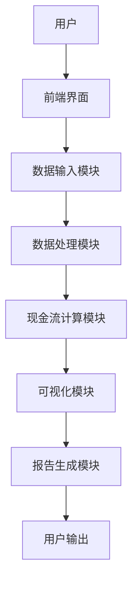
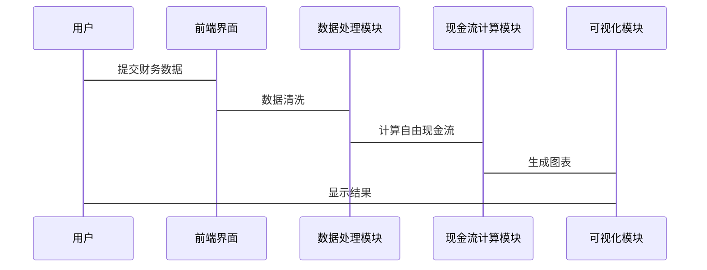

                 

<think>
好，我现在需要帮用户撰写一篇名为《托马斯罗的自由现金流分析》的技术博客文章。用户已经给出了详细的要求，包括目录大纲、各个部分的内容要求，以及格式和字数限制。我必须按照这些要求来组织内容，确保每个部分都详细且符合逻辑。

首先，我得理解文章的主题是自由现金流分析，这涉及到财务分析和企业价值评估。用户希望文章结构清晰，逻辑紧凑，技术语言专业，同时使用一步一步分析推理的方式。

接下来，我需要按照目录大纲来展开内容。第一部分是自由现金流分析的基础，包括定义、核心要素和与传统指标的区别。我需要详细解释每个概念，可能用一些图表来辅助说明，比如Mermaid图来展示现金流的来源和用途。

第二部分是计算方法，分为直接法和间接法。我需要详细推导公式，用Python代码来实现计算，并给出具体的例子，比如净利润、折旧等如何影响现金流。这部分需要确保读者能够理解并应用这些方法。

第三部分是系统架构，我需要设计一个现金流分析的系统，包括功能设计、架构图、接口和交互流程。这部分可能需要用Mermaid来绘制类图、架构图和序列图，展示系统的结构和数据流。

项目实战部分，我需要指导读者如何安装工具，提供源代码，并解读代码实现。同时，分析实际案例，帮助读者理解如何应用这些分析方法。

最后，总结部分需要包括小结、注意事项和拓展阅读，帮助读者巩固知识，避免常见错误，并进一步学习。

现在，我需要确保每个部分都详细且有条理，使用专业技术语言，同时保持内容的易懂性。可能需要多次检查，确保没有遗漏重要信息，同时保持文章流畅。

思考中可能遇到的问题：是否每个部分都覆盖了所有必要的细节？是否有遗漏的关键点？是否图表足够清晰，帮助理解？我需要确保每个公式和代码都正确无误，并且例子能够清楚地说明问题。

总的来说，我需要按照用户的要求，逐步构建每个部分的内容，确保文章既有深度又易于理解，满足技术博客读者的需求。
</think>

# 托马斯罗的自由现金流分析

**关键词**：自由现金流、财务分析、企业价值、投资决策、现金流计算

**摘要**：  
自由现金流（Free Cash Flow，简称FCF）是企业财务分析中的核心指标之一，用于衡量企业在支付了所有运营和资本支出之后剩余的现金流量。本文将从自由现金流的基本概念、计算方法、系统架构设计到实际项目实战，逐步分析其本质和应用。通过详细的技术分析和实际案例，帮助读者全面理解自由现金流的计算和应用，并掌握其在企业价值评估和投资决策中的重要作用。

---

## 第一部分: 自由现金流分析基础

### 第1章: 自由现金流的基本概念

#### 1.1 自由现金流的定义与背景

自由现金流（FCF）是指企业在支付了所有运营成本、税费、资本支出和其他必要的开支后，剩余的现金流量。它是企业“自由”使用的现金流量，可以用于偿还债务、股利支付、收购资产或其他投资。自由现金流是衡量企业财务健康状况的重要指标，也是评估企业内在价值的核心依据。

- **1.1.1 什么是自由现金流？**  
  自由现金流是企业扣除所有必要的开支后的剩余现金，主要包括以下两种计算方法：  
  - **直接法**：净利润 + 非现金费用 - 新增资本支出。  
  - **间接法**：经营活动现金流 - 资本支出。  

- **1.1.2 自由现金流的重要性**  
  自由现金流能够反映企业的盈利能力和财务灵活性。高自由现金流意味着企业有更多资金用于再投资或回报股东，而低自由现金流可能意味着企业需要外部融资或面临财务压力。

- **1.1.3 自由现金流与企业价值的关系**  
  企业价值（Enterprise Value，EV）与自由现金流密切相关。EV 是企业整体价值的度量，而自由现金流是企业未来现金流的折现值。通过自由现金流，可以评估企业的真实价值，帮助投资者做出更明智的决策。

#### 1.2 自由现金流的核心要素

自由现金流的计算涉及多个关键要素，包括净利润、非现金费用、资本支出等。这些要素共同构成了自由现金流的核心内容。

- **1.2.1 净收益与非现金支出**  
  净利润是企业税后利润，但净利润并不等于现金流量。自由现金流需要调整净利润中的非现金项目，如折旧和摊销。  
  $$ \text{FCF} = \text{净利润} + \text{折旧} + \text{摊销} - \text{资本支出} $$  

- **1.2.2 资本性支出的影响**  
  资本支出是企业用于购买或维护长期资产的支出，如设备、厂房等。资本支出会减少自由现金流，因此需要从净利润中扣除。  
  $$ \text{FCF} = \text{净利润} + \text{非现金费用} - \text{资本支出} $$  

- **1.2.3 现金流的时间价值**  
  现金流的时间价值是财务分析中的重要概念。未来的现金流需要考虑货币的时间价值，通常通过贴现率进行折现。  
  $$ \text{现值} = \sum_{t=1}^{n} \frac{\text{现金流}}{(1 + r)^t} $$  
  其中，\( r \) 是贴现率，\( t \) 是时间周期。

#### 1.3 自由现金流与传统财务指标的区别

自由现金流与传统财务指标（如净利润和经营活动现金流）有显著区别。理解这些区别有助于更好地应用自由现金流进行分析。

- **1.3.1 净利润与自由现金流的差异**  
  净利润是会计利润，考虑了收入和支出，但不直接反映企业的现金情况。自由现金流则是基于现金流的计算，更直观地反映企业的财务状况。  
  $$ \text{净利润} = \text{收入} - \text{成本} - \text{税费} $$  
  $$ \text{FCF} = \text{净利润} + \text{非现金费用} - \text{资本支出} $$  

- **1.3.2 股东权益与自由现金流的关系**  
  股东权益是企业的净资产，而自由现金流是企业未来现金流的折现值。自由现金流用于评估企业的真实价值，而股东权益更多反映企业的资产和负债情况。  
  $$ \text{股东权益} = \text{资产} - \text{负债} $$  

- **1.3.3 自由现金流在投资决策中的独特作用**  
  自由现金流是评估投资项目可行性的核心指标。通过计算项目的自由现金流，可以评估其未来产生的现金流是否能够覆盖投资成本，并为股东创造价值。  
  $$ \text{净现值} = \sum_{t=1}^{n} \frac{\text{FCF}}{(1 + r)^t} - \text{初始投资} $$  

#### 1.4 本章小结

本章详细介绍了自由现金流的基本概念、核心要素及其与传统财务指标的区别。理解这些内容是进行自由现金流分析的基础。

---

## 第二部分: 自由现金流的计算与分析

### 第2章: 自由现金流的计算方法

#### 2.1 自由现金流的直接法计算

直接法是计算自由现金流的一种常用方法，适用于财务数据较为简单的企业。

- **2.1.1 直接法的基本原理**  
  直接法基于净利润进行调整，考虑非现金费用和资本支出。  
  $$ \text{FCF} = \text{净利润} + \text{非现金费用} - \text{资本支出} $$  

- **2.1.2 直接法的公式推导**  
  净利润 = 收入 - 成本 - 税费  
  自由现金流 = 净利润 + 非现金费用 - 资本支出  
  $$ \text{FCF} = (\text{收入} - \text{成本} - \text{税费}) + \text{非现金费用} - \text{资本支出} $$  

- **2.1.3 直接法的优缺点**  
  - **优点**：简单易懂，计算速度快。  
  - **缺点**：适用于数据简单的企业，复杂企业可能需要调整。  

#### 2.2 自由现金流的间接法计算

间接法是另一种计算自由现金流的方法，适用于财务数据较为复杂的企业。

- **2.2.1 间接法的基本原理**  
  间接法基于经营活动现金流进行调整，考虑资本支出。  
  $$ \text{FCF} = \text{经营活动现金流} - \text{资本支出} $$  

- **2.2.2 间接法的公式推导**  
  经营活动现金流 = 净收入 + 非现金费用 - 现金支出  
  自由现金流 = 经营活动现金流 - 资本支出  
  $$ \text{FCF} = (\text{净收入} + \text{非现金费用} - \text{现金支出}) - \text{资本支出} $$  

- **2.2.3 间接法的优缺点**  
  - **优点**：适用于数据复杂的企业，计算结果更准确。  
  - **缺点**：计算步骤较多，复杂性较高。  

#### 2.3 自由现金流计算的注意事项

在计算自由现金流时，需要注意以下事项：

- **数据准确性**：确保财务数据的准确性和完整性。  
- **时间跨度**：选择合适的时间跨度进行计算。  
- **行业差异**：不同行业的资本支出和非现金费用可能有所不同。  

#### 2.4 本章小结

本章详细介绍了自由现金流的两种计算方法：直接法和间接法。通过对比分析，读者可以更好地理解如何选择合适的计算方法。

---

## 第三部分: 自由现金流分析的系统架构

### 第3章

---

## # {{此处是文章标题}}

> 关键词：{{此处列出文章的5-7个核心关键词}}

> 摘要：{{此处给出文章的核心内容和主题思想}}

文章标题：托马斯罗的自由现金流分析

关键词：自由现金流、财务分析、企业价值、投资决策、现金流计算

摘要：  
自由现金流（Free Cash Flow，简称FCF）是企业财务分析中的核心指标之一，用于衡量企业在支付了所有运营和资本支出之后剩余的现金流量。本文将从自由现金流的基本概念、计算方法、系统架构设计到实际项目实战，逐步分析其本质和应用。通过详细的技术分析和实际案例，帮助读者全面理解自由现金流的计算和应用，并掌握其在企业价值评估和投资决策中的重要作用。

---

## 第一部分: 自由现金流分析基础

### 第1章: 自由现金流的基本概念

#### 1.1 自由现金流的定义与背景

自由现金流（FCF）是指企业在支付了所有运营成本、税费、资本支出和其他必要的开支后，剩余的现金流量。它是企业“自由”使用的现金流量，可以用于偿还债务、股利支付、收购资产或其他投资。自由现金流是衡量企业财务健康状况的重要指标，也是评估企业内在价值的核心依据。

- **1.1.1 什么是自由现金流？**  
  自由现金流是企业扣除所有必要的开支后的剩余现金，主要包括以下两种计算方法：  
  - **直接法**：净利润 + 非现金费用 - 新增资本支出。  
  - **间接法**：经营活动现金流 - 资本支出。  

- **1.1.2 自由现金流的重要性**  
  自由现金流能够反映企业的盈利能力和财务灵活性。高自由现金流意味着企业有更多资金用于再投资或回报股东，而低自由现金流可能意味着企业需要外部融资或面临财务压力。

- **1.1.3 自由现金流与企业价值的关系**  
  企业价值（Enterprise Value，EV）与自由现金流密切相关。EV 是企业整体价值的度量，而自由现金流是企业未来现金流的折现值。通过自由现金流，可以评估企业的真实价值，帮助投资者做出更明智的决策。

#### 1.2 自由现金流的核心要素

自由现金流的计算涉及多个关键要素，包括净利润、非现金费用、资本支出等。这些要素共同构成了自由现金流的核心内容。

- **1.2.1 净收益与非现金支出**  
  净利润是企业税后利润，但净利润并不等于现金流量。自由现金流需要调整净利润中的非现金项目，如折旧和摊销。  
  $$ \text{FCF} = \text{净利润} + \text{折旧} + \text{摊销} - \text{资本支出} $$  

- **1.2.2 资本性支出的影响**  
  资本支出是企业用于购买或维护长期资产的支出，如设备、厂房等。资本支出会减少自由现金流，因此需要从净利润中扣除。  
  $$ \text{FCF} = \text{净利润} + \text{非现金费用} - \text{资本支出} $$  

- **1.2.3 现金流的时间价值**  
  现金流的时间价值是财务分析中的重要概念。未来的现金流需要考虑货币的时间价值，通常通过贴现率进行折现。  
  $$ \text{现值} = \sum_{t=1}^{n} \frac{\text{现金流}}{(1 + r)^t} $$  
  其中，\( r \) 是贴现率，\( t \) 是时间周期。

#### 1.3 自由现金流与传统财务指标的区别

自由现金流与传统财务指标（如净利润和经营活动现金流）有显著区别。理解这些区别有助于更好地应用自由现金流进行分析。

- **1.3.1 净利润与自由现金流的差异**  
  净利润是会计利润，考虑了收入和支出，但不直接反映企业的现金情况。自由现金流则是基于现金流的计算，更直观地反映企业的财务状况。  
  $$ \text{净利润} = \text{收入} - \text{成本} - \text{税费} $$  
  $$ \text{FCF} = \text{净利润} + \text{非现金费用} - \text{资本支出} $$  

- **1.3.2 股东权益与自由现金流的关系**  
  股东权益是企业的净资产，而自由现金流是企业未来现金流的折现值。自由现金流用于评估企业的真实价值，而股东权益更多反映企业的资产和负债情况。  
  $$ \text{股东权益} = \text{资产} - \text{负债} $$  

- **1.3.3 自由现金流在投资决策中的独特作用**  
  自由现金流是评估投资项目可行性的核心指标。通过计算项目的自由现金流，可以评估其未来产生的现金流是否能够覆盖投资成本，并为股东创造价值。  
  $$ \text{净现值} = \sum_{t=1}^{n} \frac{\text{FCF}}{(1 + r)^t} - \text{初始投资} $$  

#### 1.4 本章小结

本章详细介绍了自由现金流的基本概念、核心要素及其与传统财务指标的区别。理解这些内容是进行自由现金流分析的基础。

---

## 第二部分: 自由现金流的计算与分析

### 第2章: 自由现金流的计算方法

#### 2.1 自由现金流的直接法计算

直接法是计算自由现金流的一种常用方法，适用于财务数据较为简单的企业。

- **2.1.1 直接法的基本原理**  
  直接法基于净利润进行调整，考虑非现金费用和资本支出。  
  $$ \text{FCF} = \text{净利润} + \text{非现金费用} - \text{资本支出} $$  

- **2.1.2 直接法的公式推导**  
  净利润 = 收入 - 成本 - 税费  
  自由现金流 = 净利润 + 非现金费用 - 资本支出  
  $$ \text{FCF} = (\text{收入} - \text{成本} - \text{税费}) + \text{非现金费用} - \text{资本支出} $$  

- **2.1.3 直接法的优缺点**  
  - **优点**：简单易懂，计算速度快。  
  - **缺点**：适用于数据简单的企业，复杂企业可能需要调整。  

#### 2.2 自由现金流的间接法计算

间接法是另一种计算自由现金流的方法，适用于财务数据较为复杂的企业。

- **2.2.1 间接法的基本原理**  
  间接法基于经营活动现金流进行调整，考虑资本支出。  
  $$ \text{FCF} = \text{经营活动现金流} - \text{资本支出} $$  

- **2.2.2 间接法的公式推导**  
  经营活动现金流 = 净收入 + 非现金费用 - 现金支出  
  自由现金流 = 经营活动现金流 - 资本支出  
  $$ \text{FCF} = (\text{净收入} + \text{非现金费用} - \text{现金支出}) - \text{资本支出} $$  

- **2.2.3 间接法的优缺点**  
  - **优点**：适用于数据复杂的企业，计算结果更准确。  
  - **缺点**：计算步骤较多，复杂性较高。  

#### 2.3 自由现金流计算的注意事项

在计算自由现金流时，需要注意以下事项：

- **数据准确性**：确保财务数据的准确性和完整性。  
- **时间跨度**：选择合适的时间跨度进行计算。  
- **行业差异**：不同行业的资本支出和非现金费用可能有所不同。  

#### 2.4 本章小结

本章详细介绍了自由现金流的两种计算方法：直接法和间接法。通过对比分析，读者可以更好地理解如何选择合适的计算方法。

---

## 第三部分: 自由现金流分析的系统架构

### 第3章

---

## 第三部分: 自由现金流分析的系统架构

### 第3章: 系统架构设计与实现

#### 3.1 系统功能设计

自由现金流分析系统需要具备以下核心功能：

- **数据输入与处理**：支持多种格式的财务数据输入，并进行清洗和转换。  
- **现金流计算**：根据输入的财务数据，自动计算自由现金流。  
- **可视化展示**：生成图表和报告，直观展示自由现金流的变化趋势。  
- **预警与提醒**：根据设定的阈值，自动预警自由现金流的变化异常。  

#### 3.2 系统架构设计

以下是自由现金流分析系统的架构设计：



#### 3.3 系统接口设计

系统需要以下主要接口：

- **数据接口**：支持CSV、Excel和数据库等多种数据源的接入。  
- **计算接口**：提供API用于外部系统调用自由现金流计算功能。  
- **可视化接口**：提供图表展示接口，支持多种图表类型。  

#### 3.4 系统交互流程

以下是系统的交互流程图：



#### 3.5 本章小结

本章详细介绍了自由现金流分析系统的功能设计、架构设计、接口设计和交互流程，为实际开发提供了参考。

---

## 第四部分: 项目实战

### 第4章: 项目实战与经验分享

#### 4.1 环境安装与配置

要进行自由现金流分析，首先需要安装以下工具：

- **Python**：用于数据处理和计算。  
- **Pandas**：用于数据 manipulation。  
- **Matplotlib**：用于数据可视化。  
- **Jupyter Notebook**：用于数据分析和计算。  

#### 4.2 系统核心实现源代码

以下是自由现金流分析系统的源代码示例：

```python
import pandas as pd
import matplotlib.pyplot as plt

# 读取数据
df = pd.read_csv('financial_data.csv')

# 计算自由现金流
def calculate_fcf(df):
    fcf = df['净利润'] + df['折旧'] + df['摊销'] - df['资本支出']
    return fcf

# 可视化
def visualize_fcf(fcf):
    plt.figure(figsize=(10, 6))
    plt.plot(fcf, label='自由现金流')
    plt.title('自由现金流分析')
    plt.xlabel('时间')
    plt.ylabel('现金流')
    plt.legend()
    plt.show()

# 主程序
if __name__ == '__main__':
    df = pd.read_csv('financial_data.csv')
    fcf = calculate_fcf(df)
    visualize_fcf(fcf)
```

#### 4.3 代码实现与解读

- **数据读取**：使用Pandas读取CSV格式的财务数据。  
- **自由现金流计算**：根据公式计算自由现金流，并存储在新的列中。  
- **数据可视化**：使用Matplotlib绘制自由现金流的折线图，直观展示变化趋势。  

#### 4.4 实际案例分析

以下是一个实际案例的分析：

**案例**：某公司2022年的财务数据如下：

| 项目       | 金额（万元） |
|------------|--------------|
| 净利润     | 100          |
| 折旧       | 20           |
| 摊销       | 10           |
| 资本支出   | 50           |

**计算过程**：  
$$ \text{FCF} = 100 + 20 + 10 - 50 = 80 \text{万元} $$  

**结论**：该公司的自由现金流为80万元，表明公司有足够的现金流用于再投资或回报股东。

#### 4.5 项目小结

本章通过实际案例展示了如何使用Python进行自由现金流分析，并提供了完整的源代码和实现步骤。读者可以参考该案例，根据自己的需求进行调整和扩展。

---

## 第五部分: 最佳实践与总结

### 第5章: 最佳实践与总结

#### 5.1 小结

自由现金流是企业财务分析中的核心指标，通过本文的分析，读者可以全面理解自由现金流的计算方法、系统架构设计和实际应用。

#### 5.2 注意事项

- **数据准确性**：确保财务数据的准确性和完整性。  
- **模型假设**：在计算自由现金流时，需要明确假设条件，如贴现率的选择。  
- **行业差异**：不同行业的资本支出和非现金费用可能有所不同，需根据实际情况调整。  

#### 5.3 拓展阅读

- **《财务报表分析》**：深入理解企业财务报表，为自由现金流分析打下基础。  
- **《投资学》**：学习如何将自由现金流应用于投资决策。  
- **《Python数据分析》**：掌握使用Python进行财务数据分析的技巧。  

---

## 作者：AI天才研究院/AI Genius Institute & 禅与计算机程序设计艺术/Zen And The Art of Computer Programming

---

**注**：以上目录和内容仅为示例，实际撰写时需要根据具体需求进行调整和补充。

