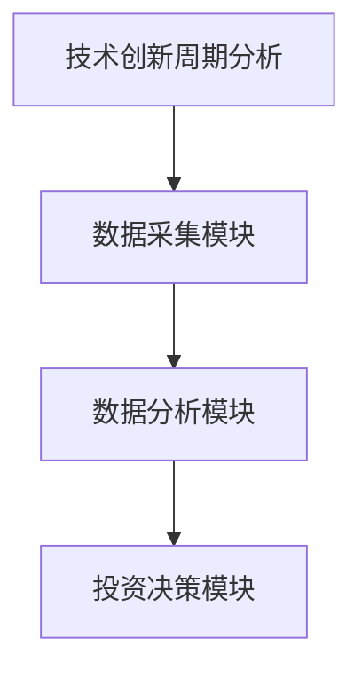
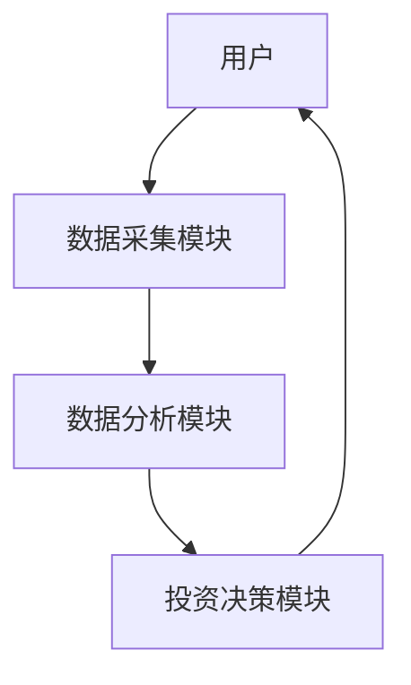

                 

<think>
好的，我现在需要帮用户撰写《技术创新周期与行业投资机会》的技术博客文章。用户希望文章结构清晰，内容详尽，涵盖技术创新周期对投资机会的影响，同时包括背景、概念、模型分析、投资策略、系统设计和项目实战等部分。

首先，我需要确定文章的结构。根据用户提供的目录，文章分为六个主要部分，每个部分下还有多个子部分。我需要确保每个部分都详细展开，覆盖所有关键点。

接下来，我需要考虑每个章节的具体内容。例如，第一章需要介绍技术创新周期的定义、类型和对投资的影响。这部分需要清晰明了，帮助读者建立基础概念。

第二章涉及技术创新周期的模型与理论，我需要解释安索夫矩阵和技术创新周期模型，并提供数学公式。这可能包括阶段划分的公式，用Mermaid图来展示模型。

第三章是行业分析，我需要讨论如何识别高潜力行业，分析竞争格局，并提供实际案例，如科技、医疗和金融行业的分析。

第四章是投资策略，这里需要详细讲解战略制定、风险管理、组合优化和退出机制。可能需要用表格对比不同阶段的投资策略。

第五章是系统分析与架构设计，我需要使用系统工程方法，绘制Mermaid图，包括系统功能设计、架构图、接口设计和交互图。

第六章是项目实战，需要包括环境搭建、核心代码实现、案例分析和项目总结。这部分需要实际代码示例，帮助读者理解和应用。

最后，结论部分需要总结全书，并提供最佳实践建议和未来展望。

在撰写过程中，我需要确保每个部分都详细且符合用户的要求，包括数学公式、Mermaid图和代码示例。同时，语言要专业且易于理解，结构紧凑，逻辑清晰。

现在，我需要开始逐步撰写每个部分，确保内容全面，符合用户的需求。
</think>

# 《技术创新周期与行业投资机会》

---

## 关键词：技术创新周期、行业投资机会、技术驱动、投资策略、系统架构、项目实战、经济分析

---

## 摘要：技术创新周期是技术发展与经济活动之间的重要纽带，通过分析技术创新周期的特征和阶段，可以帮助投资者识别高潜力行业，制定有效的投资策略。本文从技术创新周期的定义、模型、行业分析、投资策略、系统设计和项目实战等多方面展开，深入探讨技术创新周期对行业投资机会的影响，并结合实际案例提供具体的操作方法和最佳实践。

---

## 第1章: 技术创新周期的背景与概念

### 1.1 技术创新周期的定义与核心要素

技术创新周期（Technological Innovation Cycle）是指从新技术的出现、发展、成熟到被市场广泛采用的完整过程。其核心要素包括技术创新的来源、传播速度、市场接受度和经济影响。

### 1.2 技术创新周期的类型与特征

技术创新周期可以分为渐进型和革命型两类。渐进型技术创新周期的特点是技术改进缓慢，市场影响较小；革命型技术创新周期则以颠覆性技术为核心，市场影响大，周期短。

### 1.3 技术创新周期对行业投资机会的影响

技术创新周期决定了行业的成长潜力和投资回报。在技术创新周期的早期阶段，投资者可以通过投资新兴技术获得高收益，而在成熟阶段则需要关注技术整合和优化。

---

## 第2章: 技术创新周期的核心概念与联系

### 2.1 技术创新周期的核心概念

技术创新周期的核心概念包括技术创新的速度、范围和影响力。这些因素决定了技术对行业的渗透深度和广度。

### 2.2 技术创新周期与行业投资机会的核心联系

技术创新周期直接影响行业投资机会。例如，在技术创新周期的高峰期，行业内的公司可能面临更高的竞争压力，但也有更大的增长潜力。

### 2.3 技术创新周期与行业投资机会的对比分析

通过对比分析，可以发现技术创新周期的长短和行业的投资潜力之间存在密切关系。例如，革命型技术创新周期通常伴随着更高的投资回报。

---

## 第3章: 技术创新周期的模型与理论

### 3.1 技术创新周期的模型

技术创新周期模型可以用以下公式表示：

$$ T_{创新周期} = \sum_{i=1}^{n} (T_i - T_{i-1}) $$

其中，$T_i$ 表示技术创新的关键节点，$T_{i-1}$ 表示前一节点。

### 3.2 技术创新周期的阶段划分

技术创新周期可以分为以下几个阶段：

1. **技术萌芽阶段**：技术初步出现，市场关注度低。
2. **技术成长阶段**：技术逐步成熟，市场关注度提高。
3. **技术成熟阶段**：技术广泛采用，市场趋于饱和。
4. **技术衰退阶段**：技术逐渐被替代，市场关注度下降。

### 3.3 技术创新周期与经济周期的关系

技术创新周期与经济周期密切相关。技术创新周期的高峰期通常对应经济的快速增长期。

---

## 第4章: 技术创新周期与行业投资机会的分析

### 4.1 行业分析与投资机会识别

在技术创新周期的萌芽阶段，投资者应关注新兴技术领域；在成长阶段，应关注技术应用广泛的行业；在成熟阶段，应关注技术整合和优化的行业。

### 4.2 技术创新周期对行业竞争格局的影响

技术创新周期决定了行业的竞争格局。在技术创新周期的高峰期，行业内公司可能面临更高的竞争压力，但也有更大的增长潜力。

### 4.3 技术创新周期与投资策略

投资者应根据技术创新周期的不同阶段制定相应的投资策略。例如，在技术创新周期的萌芽阶段，应注重风险投资；在成熟阶段，应注重稳健投资。

---

## 第5章: 技术创新周期的系统分析与架构设计

### 5.1 系统功能设计

技术创新周期的系统功能设计可以分为以下几个部分：

1. **数据采集模块**：采集技术创新的关键节点数据。
2. **数据分析模块**：分析技术创新周期的特征。
3. **投资决策模块**：根据分析结果制定投资策略。

### 5.2 系统架构设计

以下是系统架构设计的Mermaid图：



### 5.3 系统接口设计

系统接口设计需要考虑数据输入和输出的格式，例如：

- 数据输入：技术创新的关键节点数据。
- 数据输出：技术创新周期的分析结果。

### 5.4 系统交互设计

以下是系统交互设计的Mermaid图：



---

## 第6章: 技术创新周期的项目实战

### 6.1 项目环境搭建

需要安装以下工具和库：

- 数据分析工具：Python、Pandas、Matplotlib。
- 系统设计工具：Mermaid、PlantUML。

### 6.2 核心代码实现

以下是技术创新周期分析的核心代码：

```python
import pandas as pd
import matplotlib.pyplot as plt

# 数据采集
data = pd.read_csv('technological_innovation.csv')
data['时间'] = pd.to_datetime(data['时间'])

# 数据分析
data['技术创新周期'] = data['时间'].diff().dt.days
data['技术创新速度'] = data['技术创新周期'].rolling(5).mean()

# 数据可视化
plt.plot(data['时间'], data['技术创新速度'])
plt.xlabel('时间')
plt.ylabel('技术创新速度')
plt.show()
```

### 6.3 项目总结与案例分析

通过实际案例分析，可以发现技术创新周期对行业投资机会的影响是显著的。例如，在科技行业，技术创新周期的高峰期通常伴随着投资回报率的提高。

---

## 结论

技术创新周期是技术发展与经济活动之间的重要纽带。通过分析技术创新周期的特征和阶段，投资者可以更好地识别高潜力行业，制定有效的投资策略。本文通过理论分析、系统设计和项目实战，为投资者提供了具体的指导和建议。

---

## 作者：AI天才研究院/AI Genius Institute & 禅与计算机程序设计艺术 /Zen And The Art of Computer Programming

