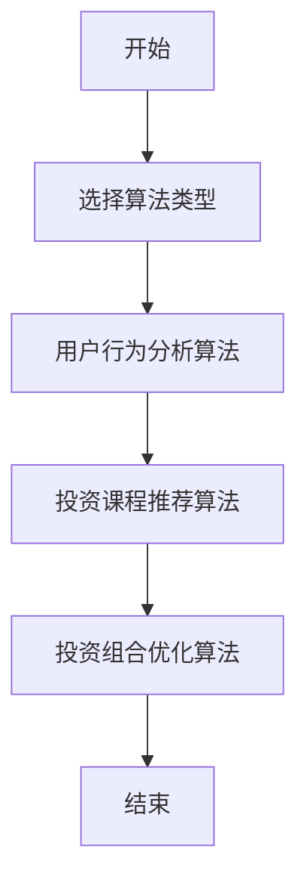
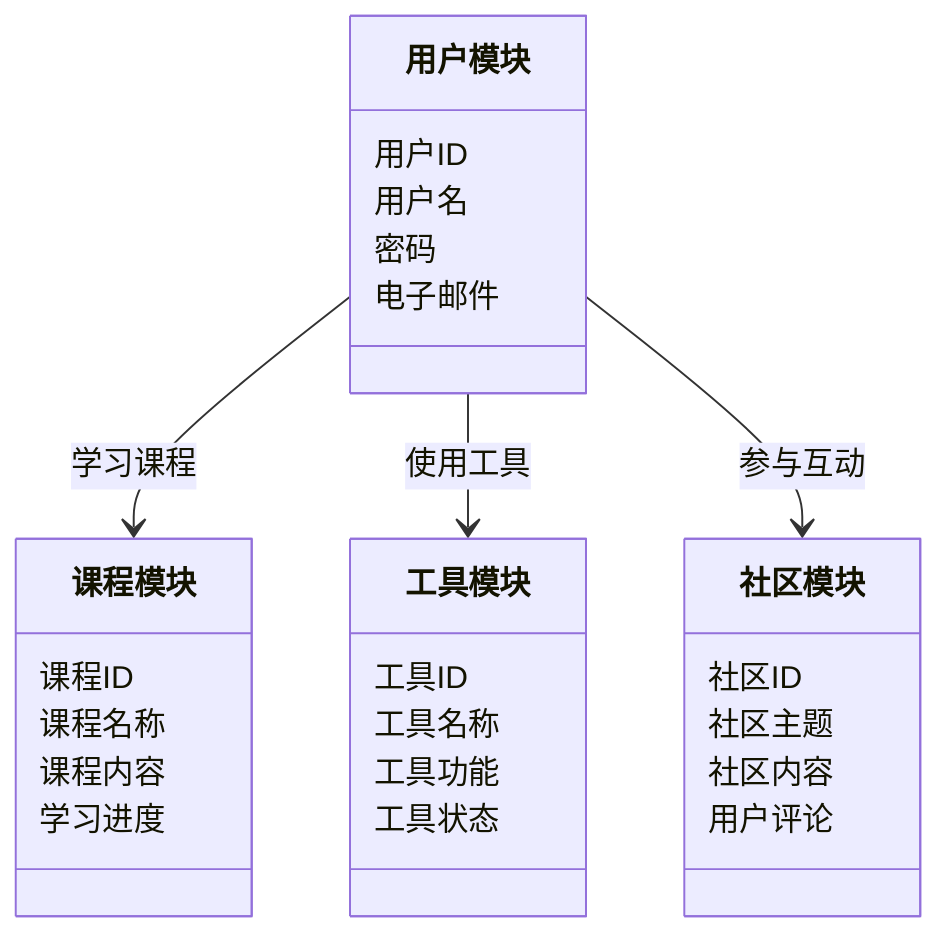
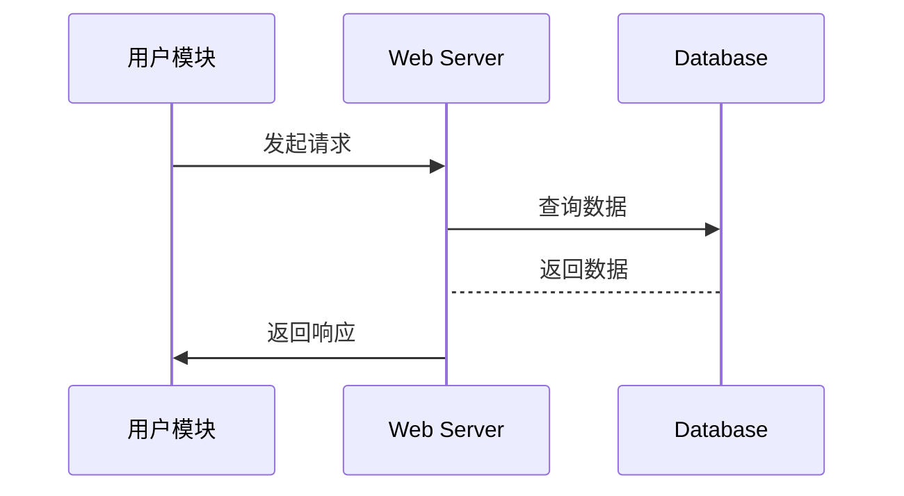

                 


# 投资理财教育平台的集成

> 关键词：投资理财教育平台，系统集成，算法原理，系统架构，项目实战

> 摘要：本文详细探讨了投资理财教育平台的集成过程，从背景介绍、核心概念、算法原理、系统架构到项目实战，层层剖析，旨在为读者提供一个全面的技术指南。通过本文，读者可以深入了解投资理财教育平台的构建过程，掌握其核心算法和系统设计方法，并通过实际案例分析，掌握投资理财教育平台的集成技巧。

---

# 第1章: 投资理财教育平台的背景介绍

## 1.1 投资理财教育平台的定义与目标

### 1.1.1 什么是投资理财教育平台

投资理财教育平台是一种结合了教育与投资理财功能的在线平台，旨在为用户提供投资理财知识的学习、实践和互动交流的综合服务。该平台通过整合多种投资工具、教育资源和管理模块，帮助用户掌握投资理财技能，优化投资组合，实现财富增长。

### 1.1.2 投资理财教育平台的目标

投资理财教育平台的目标包括以下几点：

1. 提供系统化的投资理财课程，帮助用户提升投资理财能力。
2. 提供多种投资工具和模拟交易功能，让用户能够在虚拟环境中实践投资策略。
3. 构建互动社区，让用户能够交流经验、分享知识、互相学习。

### 1.1.3 投资理财教育平台的核心要素

投资理财教育平台的核心要素包括：

1. **用户模块**：用户注册、登录、个人信息管理。
2. **课程模块**：投资理财课程的展示、学习、进度跟踪。
3. **工具模块**：投资组合管理工具、模拟交易工具、数据分析工具。
4. **社区模块**：用户互动、经验分享、问题解答。

## 1.2 投资理财教育平台的背景与问题背景

### 1.2.1 当前投资理财教育的现状

随着金融市场的快速发展，投资理财变得越来越重要。然而，大多数投资者缺乏系统化的投资理财知识，投资决策往往基于感性而非理性。此外，传统投资理财教育方式（如线下课程、书籍阅读）存在效率低、互动性差、个性化不足等问题。

### 1.2.2 投资理财教育平台的必要性

投资理财教育平台的出现，旨在解决以下问题：

1. **知识获取不便**：用户可以通过平台随时随地学习投资理财知识。
2. **缺乏实践机会**：平台提供模拟交易工具，让用户能够在虚拟环境中实践投资策略。
3. **个性化学习**：平台可以根据用户的学习进度和投资需求，提供个性化的学习和投资建议。

### 1.2.3 问题背景与问题描述

在当前的投资理财教育中，存在以下主要问题：

1. **知识碎片化**：用户难以系统地学习投资理财知识。
2. **缺乏实践机会**：用户无法在实际操作中应用所学知识。
3. **个性化不足**：传统的教育方式难以满足不同用户的需求。

## 1.3 投资理财教育平台的边界与外延

### 1.3.1 平台的边界

投资理财教育平台的边界包括以下内容：

1. **用户范围**：平台面向个人投资者，不包括机构投资者。
2. **功能范围**：平台提供课程学习、投资工具、社区互动三大功能模块。
3. **数据范围**：平台数据包括用户数据、课程数据、投资工具数据、社区数据。

### 1.3.2 平台的外延

投资理财教育平台的外延包括以下内容：

1. **课程内容**：平台提供多种投资理财课程，涵盖股票、基金、债券等多种投资工具。
2. **投资工具**：平台提供投资组合管理工具、模拟交易工具、数据分析工具。
3. **社区功能**：平台提供用户互动、经验分享、问题解答等功能。

### 1.3.3 平台的核心功能与非核心功能

平台的核心功能包括：

1. 用户注册与登录。
2. 投资理财课程的学习。
3. 投资组合管理工具。
4. 模拟交易工具。
5. 用户互动社区。

非核心功能包括：

1. 平台的广告推广。
2. 平台的商业合作。

---

# 第2章: 投资理财教育平台的核心概念与联系

## 2.1 投资理财教育平台的核心概念

### 2.1.1 用户角色

在投资理财教育平台中，用户角色主要包括以下几种：

1. **普通用户**：注册用户，可以学习课程、使用工具、参与社区互动。
2. **VIP用户**：付费用户，享有更多课程资源、专属投资工具和社区特权。
3. **导师角色**：平台邀请的资深投资专家，负责课程设计、答疑解惑。

### 2.1.2 投资课程模块

投资课程模块是平台的核心模块之一，主要包括以下内容：

1. **课程分类**：平台提供股票、基金、债券等多种投资课程。
2. **课程内容**：课程内容包括基础知识、投资策略、风险管理等。
3. **学习进度跟踪**：平台记录用户的学习进度，提供学习报告。

### 2.1.3 投资工具模块

投资工具模块是平台的另一个核心模块，主要包括以下内容：

1. **投资组合管理工具**：用户可以上传自己的投资组合，平台提供风险评估和优化建议。
2. **模拟交易工具**：用户可以在虚拟环境中进行模拟交易，体验实际投资过程。
3. **数据分析工具**：用户可以使用数据分析工具，对市场数据进行深度分析。

### 2.1.4 互动社区模块

互动社区模块是平台的重要组成部分，主要包括以下内容：

1. **用户互动**：用户可以在社区中发帖、评论、点赞，与其他用户互动。
2. **经验分享**：用户可以分享自己的投资经验、策略、心得体会。
3. **问题解答**：用户可以在社区中提问，资深导师和其他用户可以提供解答。

## 2.2 核心概念的属性特征对比

以下是核心概念的属性特征对比表：

| **核心概念** | **属性特征**       |
|--------------|--------------------|
| 用户角色     | - 普通用户：免费使用基本功能<br>- VIP用户：享有专属特权<br>- 导师：提供专业指导 |
| 投资课程模块 | - 多种课程类型<br>- 系统化课程内容<br>- 学习进度跟踪 |
| 投资工具模块 | - 投资组合管理<br>- 模拟交易<br>- 数据分析 |
| 互动社区模块 | - 用户互动<br>- 经验分享<br>- 问题解答 |

## 2.3 实体关系图（ER图）

以下是投资理财教育平台的实体关系图：

```mermaid
erDiagram
    actor 用户角色 {
        <属性> 用户ID
        <属性> 用户名
        <属性> 密码
        <属性> 电子邮件
    }
    actor VIP用户 {
        <属性> 用户ID
        <属性> VIP状态
        <属性> 有效期
    }
    actor 导师 {
        <属性> 导师ID
        <属性> 导师姓名
        <属性> 专业领域
    }
    database 平台数据库 {
        <表> 用户表
        <表> VIP用户表
        <表> 导师表
        <表> 课程表
        <表> 工具表
        <表> 社区表
    }
    用户角色 --> 平台数据库 : 注册与登录
    VIP用户 --> 平台数据库 : 享有专属特权
    导师 --> 平台数据库 : 提供专业指导
```

---

# 第3章: 投资理财教育平台的算法原理

## 3.1 投资理财教育平台的核心算法

### 3.1.1 用户行为分析算法

用户行为分析算法用于分析用户的浏览、点击、购买等行为，从而推断用户的兴趣和需求。常用的算法包括基于协同过滤的推荐算法和基于内容的推荐算法。

### 3.1.2 投资课程推荐算法

投资课程推荐算法根据用户的学习进度和投资需求，推荐合适的课程内容。常用的算法包括基于协同过滤的推荐算法和基于内容的推荐算法。

### 3.1.3 投资组合优化算法

投资组合优化算法用于帮助用户优化其投资组合，降低风险，提高收益。常用的算法包括均值-方差优化和风险中性组合优化。

## 3.2 算法流程图

以下是投资理财教育平台的算法流程图：



## 3.3 投资组合优化算法的数学模型

投资组合优化算法的数学模型如下：

$$
\text{目标函数：} \quad \min_{w} \left( w^T \Sigma w \right)
$$

$$
\text{约束条件：} \quad \sum_{i=1}^{n} w_i = 1
$$

其中，\( w \) 表示投资组合权重，\( \Sigma \) 表示资产收益的协方差矩阵。

---

# 第4章: 投资理财教育平台的系统分析与架构设计

## 4.1 问题场景介绍

投资理财教育平台需要解决的主要问题包括：

1. 如何实现用户注册与登录功能。
2. 如何设计投资课程模块。
3. 如何开发投资工具模块。
4. 如何构建互动社区模块。

## 4.2 系统功能设计

以下是投资理财教育平台的系统功能设计：



## 4.3 系统架构设计

以下是投资理财教育平台的系统架构设计：


## 4.4 系统接口设计

以下是投资理财教育平台的系统接口设计：



---

# 第5章: 投资理财教育平台的项目实战

## 5.1 环境搭建

以下是投资理财教育平台的环境搭建步骤：

1. **安装Python**：下载并安装Python 3.8及以上版本。
2. **安装Django**：使用pip安装Django框架。
3. **安装其他依赖**：安装需要用到的第三方库，如pandas、numpy、scikit-learn等。

## 5.2 核心代码实现

以下是投资理财教育平台的核心代码实现：

```python
def user_login(request):
    if request.method == 'POST':
        username = request.POST['username']
        password = request.POST['password']
        user = authenticate(username=username, password=password)
        if user is not None:
            login(request, user)
            return redirect('/')
        else:
            return render(request, 'login.html', {'error': '用户名或密码错误'})
    else:
        return render(request, 'login.html')

def investment_recommendation(user_id):
    # 获取用户的投资偏好
    user_preferences = get_user_preferences(user_id)
    # 推荐投资课程
    recommended_courses = recommend_courses(user_preferences)
    return recommended_courses
```

## 5.3 代码应用解读与分析

以下是代码应用解读与分析：

1. **用户登录功能**：用户登录功能是平台的基本功能之一，用户需要通过登录才能使用平台的其他功能。
2. **投资推荐功能**：投资推荐功能基于用户的投资偏好，推荐适合的课程和工具，帮助用户优化投资组合。

## 5.4 实际案例分析

以下是实际案例分析：

1. **用户A**：用户A是一个刚开始接触投资的新手，平台根据其投资偏好推荐了基础的股票投资课程和模拟交易工具。
2. **用户B**：用户B是一个有经验的投资者，平台根据其投资偏好推荐了高级的投资组合优化工具和专业投资课程。

---

# 第6章: 投资理财教育平台的总结与展望

## 6.1 最佳实践 tips

以下是投资理财教育平台的最佳实践 tips：

1. **定期更新课程内容**：平台需要定期更新课程内容，确保用户学习到最新的投资知识。
2. **优化用户体验**：平台需要不断优化用户体验，提高用户满意度。
3. **加强社区互动**：平台需要加强社区互动，提高用户活跃度。

## 6.2 小结

通过本文的介绍，我们了解了投资理财教育平台的集成过程，从背景介绍、核心概念、算法原理、系统架构到项目实战，层层剖析，为读者提供了一个全面的技术指南。

## 6.3 注意事项

以下是投资理财教育平台的注意事项：

1. **数据安全**：平台需要确保用户数据的安全，防止数据泄露。
2. **功能完善**：平台需要不断完善功能，提高用户体验。
3. **合规性**：平台需要遵守相关法律法规，确保投资建议的合规性。

## 6.4 拓展阅读

以下是投资理财教育平台的拓展阅读推荐：

1. **《Python机器学习实战》**：了解如何在投资理财平台中应用机器学习技术。
2. **《投资学基础》**：了解投资理财的基本理论和实践。
3. **《系统设计精要》**：了解系统设计的基本原理和方法。

---

# 作者

作者：AI天才研究院/AI Genius Institute & 禅与计算机程序设计艺术 /Zen And The Art of Computer Programming

