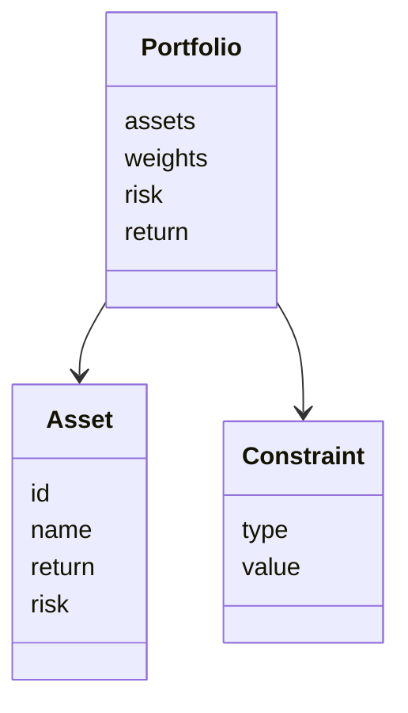
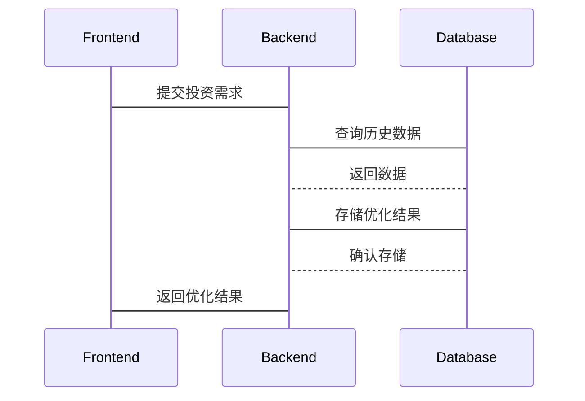

                 

<think>
嗯，我现在需要帮用户完成一本关于投资组合优化模型的详细技术博客文章。用户已经给出了一个详细的目录结构，我需要按照这个结构逐步完成每一部分的内容。首先，我会从背景介绍开始，确保涵盖所有必要的部分，比如定义、理论基础、目标和约束。

接下来，我需要详细讲解核心概念，包括数学模型、风险与收益的权衡，以及约束条件。这部分可能需要使用图表和公式来说明，所以我会考虑使用Mermaid流程图和LaTeX公式来帮助读者理解。

然后是算法原理部分，我需要选择合适的算法，比如均值-方差模型和Black-Litterman模型，并详细解释它们的数学推导和代码实现。这里可能需要使用Python代码示例，并附上详细的注释，以便读者理解和应用。

接下来是系统分析与架构设计，我需要描述项目场景，设计系统功能，绘制类图和架构图。这部分可能需要使用Mermaid来展示系统的各个部分如何交互，确保结构清晰。

然后是项目实战部分，我会指导读者如何安装环境，实现核心功能，并进行案例分析。这部分需要提供具体的代码示例，并解释每个部分的作用，以及如何应用到实际案例中。

最后，我会总结整篇文章，给出一些实用的建议和注意事项，以及推荐进一步阅读的资料。确保整篇文章结构完整，逻辑清晰，内容丰富详细。

在整个过程中，我需要确保语言简洁明了，使用专业的技术术语，同时避免过于复杂的表达，让读者能够轻松理解。另外，图表和公式的使用要恰当，帮助读者更好地掌握内容。

现在，我准备开始撰写每一部分的内容，确保覆盖所有要求，并且保持文章的连贯性和深度。
</think>

# 投资组合优化模型：现代投资理论的实际应用

> 关键词：投资组合优化，现代投资理论，风险收益，资产配置，优化算法

> 摘要：本文系统地探讨了投资组合优化模型在现代投资理论中的实际应用。从背景概念到核心算法，从系统设计到项目实战，层层剖析，旨在帮助读者全面理解投资组合优化的理论与实践。文章详细介绍了投资组合优化的核心模型、算法原理、系统架构设计及实际案例，帮助读者掌握投资组合优化的关键技术，并能够将其应用于实际投资决策中。

---

## 第1章: 投资组合优化模型的背景与概念

### 1.1 投资组合优化的背景介绍

#### 1.1.1 投资组合优化的定义
投资组合优化是指在给定的资产集合中，通过科学的方法选择最优的资产配置，以实现特定的投资目标（如最大化收益、最小化风险或两者兼得）。投资组合优化是现代投资理论的核心内容之一，旨在帮助投资者在复杂多变的市场环境中做出最优决策。

#### 1.1.2 投资组合优化的核心问题
投资组合优化的核心问题是如何在风险与收益之间找到最佳平衡点。具体来说，投资者需要在满足一系列约束条件的前提下，选择最优的资产组合，使得投资目标（如收益最大化或风险最小化）得以实现。

#### 1.1.3 投资组合优化的实际应用
投资组合优化广泛应用于资产管理、基金投资、保险投资等领域。例如，基金公司可以通过投资组合优化模型来确定最优的资产配置比例，从而在控制风险的前提下实现收益最大化。

#### 1.1.4 投资组合优化的边界与外延
投资组合优化的边界包括：
- 可投资资产的范围
- 投资者的风险承受能力
- 市场条件（如市场波动性、资产相关性等）
投资组合优化的外延包括：
- 动态资产配置
- 风险管理
- 投资组合绩效评估

#### 1.1.5 投资组合优化的概念结构与核心要素
- **核心要素**：
  - 资产：可投资的金融资产（如股票、债券、基金等）。
  - 收益：资产的预期收益。
  - 风险：资产的风险程度，通常以波动率或VaR（在险价值）表示。
  - 约束条件：如资金限制、风险限制、流动性要求等。
  - 优化目标：如收益最大化、风险最小化等。

**ER实体关系图：**
```mermaid
er
  图表
    表：投资组合
    表：资产
    表：收益
    表：风险
    表：约束条件
    关系：投资组合 --> 资产（持有资产）
    关系：资产 --> 收益（产生收益）
    关系：资产 --> 风险（伴随风险）
    关系：投资组合 --> 约束条件（满足约束）
```

### 1.2 投资组合优化的理论基础

#### 1.2.1 现代投资组合理论（MPT）的提出
现代投资组合理论（MPT）由哈里·马科维茨（Harry Markowitz）在1952年提出，是投资组合优化的理论基础。MPT的核心思想是通过分散投资来降低投资风险。

#### 1.2.2 马科维茨的有效前沿理论
马科维茨提出，通过优化投资组合，可以在给定风险下实现收益最大化，或者在给定收益下实现风险最小化。这些最优的投资组合构成了所谓的“有效前沿”。

#### 1.2.3 投资组合优化的数学模型
投资组合优化的数学模型通常包括目标函数和约束条件。目标函数可以是收益最大化或风险最小化，约束条件包括资金限制、风险限制等。

### 1.3 投资组合优化的目标与约束

#### 1.3.1 最大化收益或最小化风险
投资组合优化的目标可以是：
- 最大化预期收益（在风险约束下）。
- 最小化风险（在收益约束下）。

#### 1.3.2 投资组合优化的约束条件
常见的约束条件包括：
- 资金限制：投资组合的总价值不能超过可用资金。
- 风险限制：投资组合的风险不能超过某个阈值。
- 流动性要求：投资组合中必须保留一定比例的流动性资产。

#### 1.3.3 目标函数的选择
目标函数的选择取决于投资者的风险偏好和投资目标。例如，风险厌恶型投资者可能更倾向于选择风险最小化的目标函数。

### 1.4 本章小结

#### 1.4.1 投资组合优化的核心概念
投资组合优化的核心概念包括资产、收益、风险、约束条件和优化目标。

#### 1.4.2 投资组合优化的主要方法
主要方法包括：
- 均值-方差模型
- 非线性优化模型
- 基于遗传算法的优化方法

#### 1.4.3 投资组合优化的实际意义
投资组合优化可以帮助投资者在复杂多变的市场环境中做出科学的投资决策，从而实现投资目标。

---

## 第2章: 投资组合优化的核心概念与联系

### 2.1 投资组合优化的数学模型

#### 2.1.1 均值-方差模型
均值-方差模型是马科维茨提出的经典模型，目标是最小化投资组合的风险（即方差），在给定收益下。

#### 2.1.2 均值-方差模型的扩展
扩展包括引入风险调整后的收益、考虑交易成本等。

#### 2.1.3 非线性优化模型
非线性优化模型可以更准确地描述复杂的市场环境，但求解难度较大。

### 2.2 风险与收益的权衡

#### 2.2.1 风险的定义与度量
风险通常可以用波动率、VaR或CVaR等指标度量。

#### 2.2.2 收益的定义与度量
收益可以用预期收益、夏普比率等指标度量。

#### 2.2.3 风险-收益权衡的数学表达
$$ \text{风险} = f(\text{收益}) $$

### 2.3 投资组合优化的约束条件

#### 2.3.1 资产配置约束
资产配置必须满足一定的比例要求。

#### 2.3.2 风险约束
投资组合的风险不能超过某个阈值。

#### 2.3.3 其他约束条件
如税收、交易成本等。

### 2.4 本章小结

#### 2.4.1 投资组合优化的核心模型
均值-方差模型和非线性优化模型是两个主要模型。

#### 2.4.2 风险与收益的权衡
通过优化模型可以在风险与收益之间找到最佳平衡点。

#### 2.4.3 约束条件的多样性
约束条件的多样性使得投资组合优化问题更加复杂，但也更贴近实际投资环境。

---

## 第3章: 投资组合优化的算法原理

### 3.1 均值-方差模型的算法实现

#### 3.1.1 均值-方差模型的数学推导
目标是最小化方差，最大化收益。

#### 3.1.2 均值-方差模型的求解方法
可以通过拉格朗日乘数法求解。

#### 3.1.3 均值-方差模型的代码实现
```python
import numpy as np
import pandas as pd

# 示例数据
returns = pd.Series([0.1, 0.2, 0.15, 0.05, 0.12])
n = len(returns)
cov_matrix = np.identity(n)  # 简单假设，实际应计算协方差矩阵

# 目标函数：最小化方差
def objective(weights):
    return np.dot(weights.T, np.dot(cov_matrix, weights))

# 约束条件：权重之和为1
def constraint(weights):
    return np.sum(weights) - 1

# 使用 scipy.optimize 求解
from scipy.optimize import minimize

result = minimize(objective, np.ones(n)/n, constraints={'type': 'eq', 'fun': constraint})
optimal_weights = result.x
```

### 3.2 非线性优化模型的算法实现

#### 3.2.1 非线性优化模型的数学推导
考虑非线性约束条件。

#### 3.2.2 非线性优化模型的求解方法
可以使用内点法、SQP等方法。

#### 3.2.3 非线性优化模型的代码实现
```python
from scipy.optimize import minimize

# 示例数据
returns = pd.Series([0.1, 0.2, 0.15, 0.05, 0.12])
n = len(returns)
cov_matrix = np.identity(n)

# 目标函数：最小化风险
def objective(weights):
    return np.dot(weights.T, np.dot(cov_matrix, weights))

# 约束条件：收益至少为某个值
def constraint1(weights):
    return np.sum(weights * returns) - 0.1

# 使用 scipy.optimize 求解
result = minimize(objective, np.ones(n)/n, constraints=[
    {'type': 'eq', 'fun': lambda w: np.sum(w) - 1},
    {'type': 'geq', 'fun': constraint1}
])
optimal_weights = result.x
```

### 3.3 本章小结

#### 3.3.1 均值-方差模型的实现步骤
包括数据准备、目标函数定义、约束条件设定、优化求解。

#### 3.3.2 非线性优化模型的实现步骤
与均值-方差模型类似，但考虑了非线性约束。

#### 3.3.3 投资组合优化算法的多样性
包括精确解法和近似解法，如遗传算法等。

---

## 第4章: 投资组合优化的系统分析与架构设计

### 4.1 项目场景介绍
假设我们正在为一家资产管理公司设计一个投资组合优化系统。

### 4.2 系统功能设计

#### 4.2.1 领域模型类图


#### 4.2.2 系统架构图
```mermaid
aws
    architecture
    title 投资组合优化系统架构
    client --> API Gateway
    API Gateway --> Lambda
    Lambda --> RDS
```

### 4.3 系统接口设计
- API接口：提供给前端或第三方系统的接口。
- 数据接口：与数据源（如数据库）交互。

### 4.4 系统交互序列图


### 4.5 本章小结
系统架构设计包括领域模型设计、系统架构设计、接口设计和交互流程设计。

---

## 第5章: 投资组合优化的项目实战

### 5.1 环境安装
安装必要的库，如NumPy、Pandas、SciPy等。

### 5.2 核心功能实现

#### 5.2.1 数据准备
读取历史数据，计算收益和协方差矩阵。

#### 5.2.2 优化模型实现
实现均值-方差模型和非线性优化模型。

#### 5.2.3 结果分析
分析优化结果，计算夏普比率等指标。

### 5.3 案例分析
以实际数据为例，展示优化过程和结果。

### 5.4 本章小结
通过项目实战，读者可以掌握投资组合优化模型的实际应用。

---

## 第6章: 总结与最佳实践

### 6.1 本章总结
投资组合优化是现代投资理论的重要组成部分，通过科学的方法可以帮助投资者实现最优资产配置。

### 6.2 最佳实践 tips
- 理解市场环境和投资者需求。
- 合理选择优化模型和算法。
- 定期评估和调整投资组合。

### 6.3 注意事项
- 数据质量：确保输入数据的准确性和完整性。
- 模型选择：根据实际情况选择合适的优化模型。
- 风险管理：定期监控和评估投资组合的风险。

### 6.4 拓展阅读
- 马科维茨的《投资学的科学方法》。
- 鲍莫格的《投资组合优化与管理》。

---

## 作者：AI天才研究院/AI Genius Institute & 禅与计算机程序设计艺术 /Zen And The Art of Computer Programming

