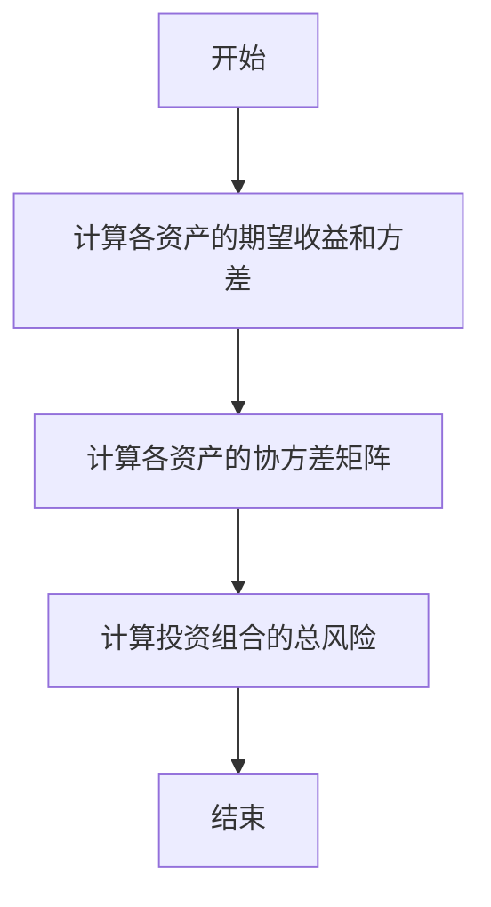
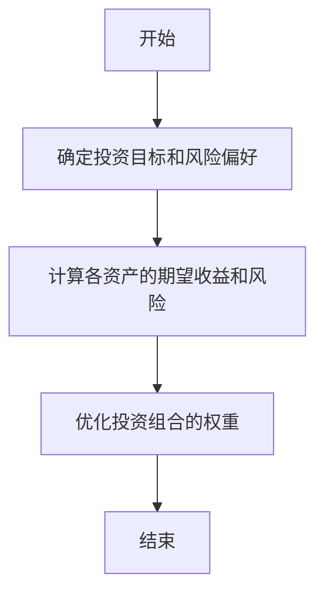
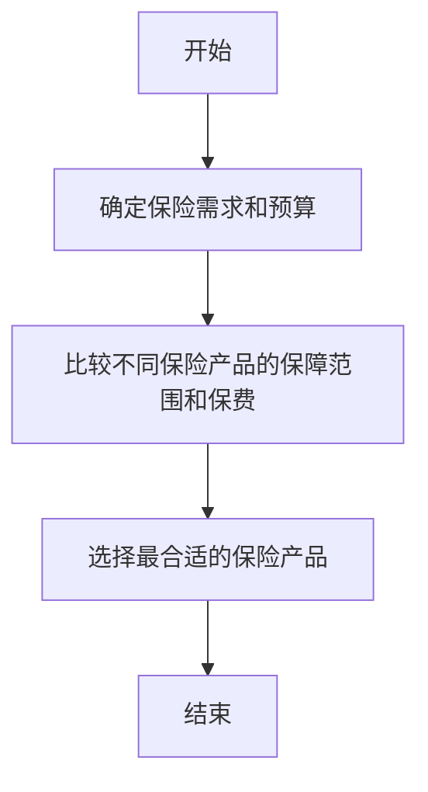
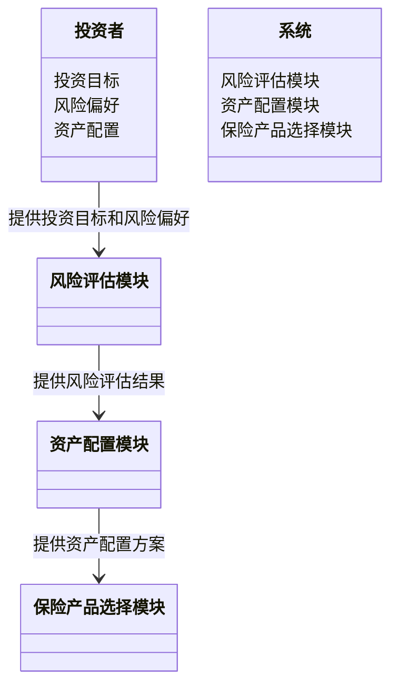
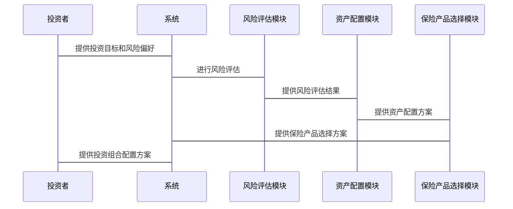

                 


# 投资组合保险策略：保护收益的方法

## 关键词：
- 投资组合保险
- 风险管理
- 保险策略
- 资产配置
- 收益保护

## 摘要：
投资组合保险策略是一种通过科学的保险策略和资产配置方法，帮助投资者在不确定的金融市场中保护和增长收益的有效手段。本文将从投资组合保险策略的核心概念、数学模型、系统设计和项目实战等多个方面，全面阐述如何通过投资组合保险策略来实现收益的保护与增长。通过详细的算法流程图、数学公式的推导以及实际案例的分析，本文为投资者提供了理论与实践相结合的指导，帮助他们在复杂的金融市场中制定有效的投资策略。

---

# 第一部分：投资组合保险策略的背景与概念

## 第1章：投资组合保险策略的背景与概念

### 1.1 投资组合保险策略的背景

#### 1.1.1 金融市场的波动性与风险
金融市场具有高度的不确定性和波动性，投资者在追求收益的同时，也面临着各种风险，如市场风险、流动性风险和通货膨胀风险等。这些风险可能导致投资收益的损失甚至本金的亏损。

#### 1.1.2 投资者保护收益的需求
投资者在进行投资时，通常希望能够在获得收益的同时，降低风险损失。尤其是在市场波动剧烈的情况下，投资者更倾向于通过保险策略来保护自己的收益。

#### 1.1.3 保险策略在投资中的作用
保险策略作为一种风险管理工具，能够在投资组合中起到分散风险、锁定收益的作用。通过将部分资金用于购买保险产品，投资者可以在市场下跌时获得一定的保障，从而实现收益的保护。

### 1.2 投资组合保险策略的核心概念

#### 1.2.1 投资组合保险的定义
投资组合保险是指通过在投资组合中配置保险产品或使用保险策略，以降低投资组合的整体风险，并在市场波动时保护收益的过程。

#### 1.2.2 保险策略的目标与特点
- **目标**：通过保险策略降低投资组合的波动性，保护本金不受损失，同时在市场上涨时获得收益。
- **特点**：灵活性高、风险可控、收益稳定。

#### 1.2.3 投资组合保险的边界与外延
投资组合保险的边界包括保险产品的选择、保险金额的确定以及保险期限的选择。其外延则涉及资产配置、风险评估和动态调整等多个方面。

### 1.3 投资组合保险策略的核心要素

#### 1.3.1 投资目标与风险偏好
投资者的投资目标和风险偏好是制定保险策略的基础。不同目标和风险偏好的投资者需要不同的保险策略。

#### 1.3.2 资产配置与风险分散
通过合理的资产配置，将资金分配到不同的资产类别中，以分散风险。保险产品在投资组合中起到分散风险的作用。

#### 1.3.3 保险产品的选择与应用
选择合适的保险产品是投资组合保险策略的核心。不同保险产品有不同的保障范围和赔付机制，需要根据投资目标和风险偏好进行选择。

### 1.4 本章小结
本章介绍了投资组合保险策略的背景、核心概念和核心要素。通过理解这些内容，投资者可以更好地制定适合自己的保险策略。

---

## 第2章：投资组合保险策略的核心原理

### 2.1 保险策略与投资组合的关系

#### 2.1.1 保险策略在投资组合中的位置
保险策略通常作为投资组合的一部分，用于降低整体风险。它可以通过对冲风险或提供保障来增强投资组合的稳定性。

#### 2.1.2 保险策略对收益的保护作用
通过购买保险产品，投资者可以在市场下跌时获得一定的赔付，从而保护投资收益。

#### 2.1.3 保险策略对风险的控制机制
保险策略通过转移风险或分散风险，降低投资组合的整体风险。例如，购买保险产品可以将部分市场风险转移到保险公司。

### 2.2 保险策略的核心原理

#### 2.2.1 风险转移与风险分散
- **风险转移**：通过购买保险产品，将部分风险转移给保险公司。
- **风险分散**：通过合理的资产配置，将资金分配到不同的资产类别中，以分散风险。

#### 2.2.2 保险产品的保障机制
保险产品的赔付机制是其核心保障机制。当触发赔付条件时，保险公司将根据保险合同支付赔款，从而保护投资者的收益。

#### 2.2.3 投资组合的动态调整
投资组合需要根据市场环境的变化进行动态调整。保险策略也需要根据市场波动和投资目标进行相应的调整，以保持其保护收益的功能。

### 2.3 核心概念的属性对比

#### 2.3.1 不同保险策略的比较
- **全保策略**：将所有投资组合的风险通过保险产品完全对冲。
- **部分保险策略**：仅对部分投资组合进行保险，以降低整体风险。

#### 2.3.2 投资组合保险与传统保险的区别
- **传统保险**：主要针对特定风险提供保障，如人寿保险、财产保险等。
- **投资组合保险**：针对投资组合的风险进行保险，通常与金融市场的波动相关。

#### 2.3.3 保险策略与风险管理的联系
保险策略是风险管理的重要组成部分。通过保险策略，投资者可以更好地管理投资组合的风险，实现收益的保护。

### 2.4 本章小结
本章从保险策略与投资组合的关系出发，详细讲解了保险策略的核心原理和核心概念的属性对比。通过理解这些内容，投资者可以更好地制定和实施保险策略。

---

## 第3章：投资组合保险策略的数学模型与算法

### 3.1 投资组合保险的数学模型

#### 3.1.1 投资组合的收益与风险模型
投资组合的收益可以用期望收益来衡量，风险可以用方差或标准差来衡量。投资组合的收益与风险可以通过以下公式表示：

$$ E(r_p) = \sum_{i=1}^n w_i E(r_i) $$
$$ Var(r_p) = \sum_{i=1}^n \sum_{j=1}^n w_i w_j Cov(r_i, r_j) $$

其中，\( w_i \) 是资产 \( i \) 的权重，\( E(r_i) \) 是资产 \( i \) 的期望收益，\( Cov(r_i, r_j) \) 是资产 \( i \) 和资产 \( j \) 的协方差。

#### 3.1.2 保险策略的风险评估公式
保险策略的风险评估公式可以表示为：

$$ Risk = \sum_{i=1}^n w_i \times (1 - \beta_i) $$

其中，\( \beta_i \) 是资产 \( i \) 的贝塔系数，表示资产 \( i \) 的系统性风险。

#### 3.1.3 投资组合的最优配置模型
投资组合的最优配置可以通过以下公式求解：

$$ \min_{w} \sum_{i=1}^n \sum_{j=1}^n w_i w_j Cov(r_i, r_j) $$
$$ \text{subject to} \quad \sum_{i=1}^n w_i = 1 $$

### 3.2 保险策略的算法原理

#### 3.2.1 风险评估算法
风险评估算法通过分析投资组合中各资产的风险，确定保险策略的覆盖范围。

步骤如下：
1. 计算各资产的期望收益和方差。
2. 计算各资产的协方差矩阵。
3. 计算投资组合的总风险。

#### 3.2.2 资产配置算法
资产配置算法通过优化投资组合的权重，实现风险与收益的最优配置。

步骤如下：
1. 确定投资目标和风险偏好。
2. 计算各资产的期望收益和风险。
3. 优化投资组合的权重，使总风险最小化。

#### 3.2.3 保险产品选择算法
保险产品选择算法通过比较不同保险产品的保障范围和保费，选择最合适的保险产品。

步骤如下：
1. 确定保险需求和预算。
2. 比较不同保险产品的保障范围和保费。
3. 选择最合适的保险产品。

### 3.3 投资组合保险策略的流程图

#### 3.3.1 风险评估流程


#### 3.3.2 资产配置流程


#### 3.3.3 保险产品选择流程


### 3.4 本章小结
本章通过数学模型和算法，详细讲解了投资组合保险策略的风险评估、资产配置和保险产品选择的流程。通过理解这些内容，投资者可以更好地制定和实施保险策略。

---

## 第4章：投资组合保险策略的系统分析与架构设计

### 4.1 系统分析

#### 4.1.1 问题场景介绍
在金融市场中，投资者需要通过投资组合保险策略来保护收益。系统需要能够根据投资者的风险偏好和市场环境，自动调整投资组合的配置。

#### 4.1.2 项目介绍
本项目旨在开发一个基于投资组合保险策略的管理系统，帮助投资者实现收益的保护与增长。

#### 4.1.3 系统功能设计（领域模型）



### 4.2 系统架构设计

#### 4.2.1 系统架构图


#### 4.2.2 系统接口设计
系统接口包括投资者输入投资目标和风险偏好，输出投资组合配置方案。

#### 4.2.3 系统交互序列图



### 4.3 本章小结
本章通过系统分析与架构设计，详细讲解了投资组合保险策略的实现过程。通过理解这些内容，投资者可以更好地制定和实施保险策略。

---

## 第5章：投资组合保险策略的项目实战

### 5.1 环境安装与配置

#### 5.1.1 开发环境的选择
建议使用Python编程语言和相关库（如numpy、pandas、matplotlib）进行开发。

#### 5.1.2 工具安装与配置
安装Python和相关库，配置开发环境。

#### 5.1.3 数据源获取与准备
从金融市场数据源获取历史数据，用于风险评估和资产配置。

### 5.2 系统核心实现源代码

#### 5.2.1 风险评估模块

```python
import numpy as np
import pandas as pd

def calculate_variance(cov_matrix):
    return np.mean(np.diag(cov_matrix))
```

#### 5.2.2 资产配置模块

```python
def optimize_weights(expected_returns, cov_matrix):
    n = len(expected_returns)
    ones = np.ones(n)
    G = np.matrix(np.diag([10**6]*n))
    h = np.zeros(n)
    A = ones.T
    b = 1
    H = np.bmat([[G, 0], [0, -1]])
    f = np.zeros(2*n)
    f[n:] = -10**6
    solution = np.linalg.lstsq(H, f, rcond=None)[0]
    weights = solution[:n]
    return weights
```

#### 5.2.3 保险产品选择模块

```python
def select_insurance_products(insurance_products, risk_level):
    selected = []
    for product in insurance_products:
        if product['risk_level'] == risk_level:
            selected.append(product)
    return selected
```

### 5.3 代码应用解读与分析

#### 5.3.1 风险评估模块解读
上述代码通过协方差矩阵计算投资组合的方差，从而评估投资组合的风险。

#### 5.3.2 资产配置模块解读
上述代码通过优化权重，实现投资组合的最优配置，使总风险最小化。

#### 5.3.3 保险产品选择模块解读
上述代码根据投资者的风险偏好，选择最合适的保险产品。

### 5.4 实际案例分析和详细讲解剖析
以某投资者为例，假设其风险偏好为中等风险，目标是通过投资组合保险策略保护收益。系统会根据投资者的风险偏好，选择合适的保险产品，并优化资产配置。

### 5.5 本章小结
本章通过项目实战，详细讲解了投资组合保险策略的实现过程。通过理解这些内容，投资者可以更好地制定和实施保险策略。

---

## 第6章：总结与展望

### 6.1 本章总结
投资组合保险策略是一种有效的风险管理工具，能够帮助投资者在金融市场中保护收益。通过合理的资产配置和保险产品的选择，投资者可以在市场波动中实现收益的保护与增长。

### 6.2 未来展望
随着金融市场的不断发展，投资组合保险策略也将不断创新。未来的研究方向包括开发更加智能的算法、引入大数据和人工智能技术，以及探索新的保险产品和风险管理工具。

---

## 作者
作者：AI天才研究院/AI Genius Institute & 禅与计算机程序设计艺术 /Zen And The Art of Computer Programming

