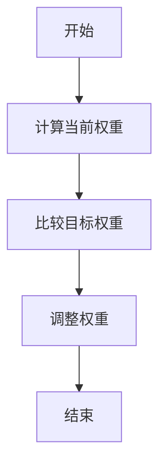
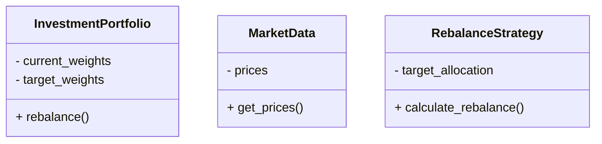

                 

<think>
嗯，好的，我现在需要帮用户设计一个详细的投资组合再平衡的技术博客文章的目录。首先，我得理解用户的需求。他们希望有一篇标题为《投资组合再平衡：维持风险收益目标的关键》的技术博客，内容需要逻辑清晰、结构紧凑，使用专业的技术语言，并且要一步一步地分析推理。

用户已经提供了一个详细的目录大纲，我需要根据这个大纲进行扩展，并确保每个部分都符合他们的要求。首先，我应该仔细阅读用户提供的目录，确保理解每个章节的内容和结构。看起来目录分为六个主要部分：背景介绍、核心概念、算法原理、系统架构、项目实战和最佳实践。

接下来，我需要确保每个章节和小节都详细展开，包含必要的内容，比如数学模型、流程图、代码示例等。例如，在“算法原理”部分，用户提到了使用mermaid流程图和Python代码，我需要确保这些内容能够正确嵌入，并且解释清楚。

另外，用户强调文章需要使用专业的技术语言，同时要保持简单易懂，所以我需要在内容上找到平衡点，既要有深度，又要让读者容易理解。例如，在解释数学公式时，可能需要先给出定义，再通过例子来说明应用。

我还注意到用户希望文章有摘要和关键词，这部分需要放在开头，帮助读者快速了解文章的核心内容。在正文部分，每个章节都需要有详细的解释，包括背景、理论、算法、系统设计、项目案例和总结等部分。

最后，检查整个目录的逻辑连贯性，确保每个部分之间有自然的过渡，并且内容覆盖全面，没有遗漏关键点。同时，要确保字数在10000到12000字之间，这可能意味着每个章节需要详细展开，包含足够的细节和实例。

总的来说，我需要按照用户提供的大纲，逐步扩展每个部分，确保内容全面、结构合理，并且符合技术博客的风格。这将帮助读者系统地理解投资组合再平衡的各个方面，从理论到实践，从概念到算法，从系统设计到项目实施。
</think>

# 投资组合再平衡：维持风险收益目标的关键

## 关键词：
投资组合再平衡、风险收益管理、资产配置、现代投资组合理论、动态优化、风险管理策略

## 摘要：
投资组合再平衡是投资管理中的关键策略，用于维持预设的风险和收益目标。本文详细探讨了投资组合再平衡的背景、核心概念、数学模型、算法原理、系统架构和实际应用。通过理论分析和实践案例，本文揭示了再平衡策略在不同市场环境下的优化方法，帮助投资者和资产管理者更好地理解和应用这些策略。

---

# 第一部分: 投资组合再平衡的背景与概念

## 第1章: 投资组合再平衡的背景与重要性

### 1.1 投资组合再平衡的基本概念
#### 1.1.1 投资组合的基本概念
- 投资组合：将资金分配到不同资产（股票、债券、现金等）以分散风险。
- 再平衡：定期调整资产权重，以维持预设的风险和收益目标。

#### 1.1.2 投资组合再平衡的定义与目的
- 定义：通过调整资产配置，使投资组合的权重回归到目标配置。
- 目的：优化风险收益比，应对市场变化，避免过度偏离目标。

#### 1.1.3 再平衡在风险收益管理中的作用
- 确保投资组合与目标一致。
- 降低风险，提高收益。

### 1.2 投资组合再平衡的重要性
#### 1.2.1 维持风险收益目标的关键性
- 防止单一资产的过度暴露。
- 适应市场波动。

#### 1.2.2 应对市场波动的必要性
- 股市波动可能导致资产权重偏离目标。
- 再平衡可以恢复平衡，降低风险。

#### 1.2.3 优化投资收益的策略性
- 定期再平衡可以捕捉市场机会。
- 动态再平衡适应市场变化。

## 第2章: 投资组合再平衡的历史与发展

### 2.1 投资组合管理的历史演变
#### 2.1.1 传统投资组合理论的起源
- Harry Markowitz的现代投资组合理论（MPT）奠定了基础。

#### 2.1.2 现代投资组合理论的发展
- 引入均值-方差优化模型。
- 考虑风险调整后的收益。

#### 2.1.3 当代再平衡策略的创新
- 动态再平衡策略的出现。
- 多因素模型的应用。

### 2.2 投资组合再平衡的框架与分类
#### 2.2.1 定期再平衡与动态再平衡的区分
- 定期再平衡：固定时间间隔调整。
- 动态再平衡：根据市场变化实时调整。

#### 2.2.2 不同市场环境下的再平衡策略
- 牛市：减少风险资产配置。
- 熊市：增加防御性资产。

#### 2.2.3 各类资产配置的再平衡方法
- 等权重配置：每种资产权重相等。
- 目标权重配置：根据风险承受能力设定目标权重。

---

# 第二部分: 投资组合再平衡的核心概念与原理

## 第3章: 投资组合再平衡的数学模型与公式

### 3.1 投资组合优化的数学模型
#### 3.1.1 Markowitz有效前沿模型
- 有效前沿：在给定风险下，收益最高的组合。
- 数学表达：$$ \text{Minimize } \sigma^2 \text{ subject to } \mu \geq \text{target return} $$

#### 3.1.2 风险调整后的收益模型
- Sharpe比率：衡量收益与风险的关系。
- 公式：$$ \text{Sharpe Ratio} = \frac{E[r] - r_f}{\sigma} $$

#### 3.1.3 现金流量匹配模型
- 现金流入与流出匹配。
- 应用于负债驱动型投资组合。

### 3.2 再平衡策略的数学表达
#### 3.2.1 资产权重调整公式
- 权重调整：$$ w_i = \frac{A_i}{\sum A_j} $$
- 调整幅度：$$ \Delta w_i = w_i^{\text{target}} - w_i^{\text{current}} $$

#### 3.2.2 基于波动率的再平衡频率计算
- 波动率与再平衡频率的关系：波动率越高，再平衡频率越高。

#### 3.2.3 风险收益比的优化算法
- 最优化问题：$$ \text{Maximize } \frac{\mu}{\sigma} $$

## 第4章: 投资组合再平衡的算法原理

### 4.1 现代投资组合理论（MPT）的应用
#### 4.1.1 基于均值-方差优化的再平衡策略
- 使用拉格朗日乘数法优化权重。

#### 4.1.2 再平衡的步骤
1. 计算当前资产权重。
2. 比较与目标权重的差异。
3. 调整资产权重以恢复平衡。

### 4.2 再平衡算法的实现
#### 4.2.1 算法流程图


#### 4.2.2 Python代码示例
```python
def rebalance_portfolio(current_weights, target_weights):
    # 计算调整幅度
    delta = target_weights - current_weights
    # 调整资产权重
    new_weights = current_weights + delta
    return new_weights
```

---

# 第三部分: 投资组合再平衡的系统架构与实现

## 第5章: 投资组合再平衡的系统分析

### 5.1 问题场景介绍
- 投资者希望根据市场变化调整资产配置。
- 系统需要实时或定期计算再平衡需求。

### 5.2 系统功能设计
#### 5.2.1 领域模型类图


#### 5.2.2 系统架构图


---

# 第四部分: 投资组合再平衡的项目实战

## 第6章: 投资组合再平衡的实战案例

### 6.1 项目环境安装
- 安装Python和相关库（pandas, numpy, matplotlib）。

### 6.2 系统核心实现源代码
```python
import pandas as pd
import numpy as np

def calculate_rebalance(current_weights, target_weights):
    delta = target_weights - current_weights
    return delta

# 示例数据
current_weights = np.array([0.6, 0.3, 0.1])
target_weights = np.array([0.5, 0.3, 0.2])

delta = calculate_rebalance(current_weights, target_weights)
new_weights = current_weights + delta

print("调整幅度:", delta)
print("新权重:", new_weights)
```

### 6.3 代码应用解读与分析
- 计算当前权重与目标权重的差异。
- 调整权重以恢复平衡。

### 6.4 实际案例分析
- 假设目标权重为60%股票、30%债券、10%现金。
- 当市场下跌，股票权重下降到50%，需要再平衡。

---

# 第五部分: 投资组合再平衡的最佳实践

## 第7章: 最佳实践与总结

### 7.1 小结
- 再平衡是维持投资组合健康的重要策略。
- 定期检查和调整是关键。

### 7.2 注意事项
- 考虑交易成本和税收影响。
- 避免过度交易。

### 7.3 拓展阅读
- 阅读更多关于投资组合管理的书籍和论文。

---

# 作者：AI天才研究院/AI Genius Institute & 禅与计算机程序设计艺术 /Zen And The Art of Computer Programming

---

这篇文章详细介绍了投资组合再平衡的核心概念、算法原理和实际应用，结合理论与实践，帮助读者系统地理解并应用这些策略。

