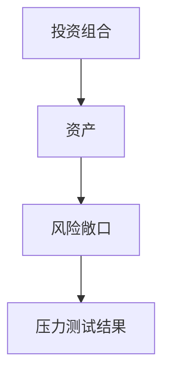
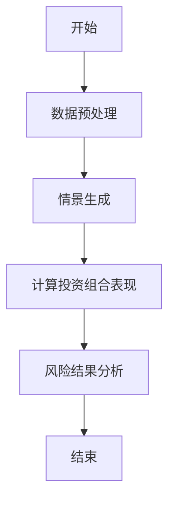
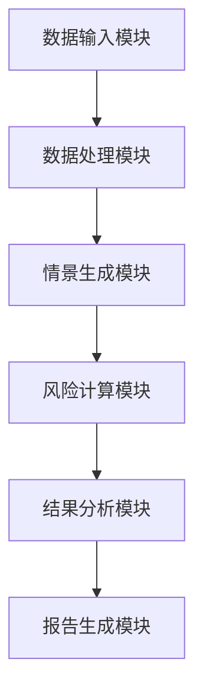

                 


```markdown
# 投资组合压力测试：评估极端情景下的风险敞口

> 关键词：投资组合，压力测试，风险敞口，VaR，CVaR，金融建模

> 摘要：本文深入探讨了投资组合压力测试的核心概念、数学模型、系统架构和项目实战。通过分析极端情景下的风险敞口，结合VaR和CVaR等风险度量模型，展示了如何利用金融建模和系统设计来优化投资组合风险管理。本文还提供了实际案例分析和代码实现，为读者提供了全面的指导。

---

## 第一部分: 投资组合压力测试概述

### 第1章: 投资组合压力测试的背景与重要性

#### 1.1 压力测试的基本概念
压力测试是一种评估投资组合在极端市场条件下的表现和风险的方法。它帮助投资者和机构识别潜在风险，制定应对策略。

#### 1.2 投资组合风险敞口的定义
风险敞口是指投资组合在特定市场条件下的潜在损失程度。通过压力测试，可以量化投资组合在极端情景下的损失情况。

#### 1.3 压力测试在金融风险管理中的重要性
压力测试是金融机构进行风险管理和资本规划的重要工具，尤其是在应对市场波动和极端事件时。

---

### 第2章: 投资组合压力测试的核心概念

#### 2.1 风险度量的数学模型
- **方差-协方差矩阵的构建**：用于描述资产之间的相关性。
- **VaR（风险价值）**：计算在特定置信水平下的潜在损失。
- **CVaR（条件风险价值）**：VaR的延伸，考虑尾部风险。

#### 2.2 压力测试的算法流程
1. 数据预处理：清洗和标准化数据。
2. 情景生成：基于历史数据或假设情景生成极端市场情况。
3. 投资组合表现计算：在不同情景下计算投资组合的收益和损失。
4. 风险结果分析：评估投资组合在极端情景下的风险敞口。

#### 2.3 核心概念的对比分析
| 概念       | VaR         | CVaR       |
|------------|-------------|-------------|
| 定义       | 分位数损失   | 条件期望损失 |
| 优点       | 计算简单     | 更全面       |
| 缺点       | 未考虑尾部风险| 计算复杂     |

#### 2.4 实体关系图（ER图）


---

## 第二部分: 投资组合压力测试的数学模型与算法

### 第3章: 风险度量的数学模型

#### 3.1 VaR的计算公式
$$ VaR = \mu + z \times \sigma $$
其中，$\mu$ 是平均值，$z$ 是标准正态分布的分位数，$\sigma$ 是标准差。

#### 3.2 CVaR的计算公式
$$ CVaR = \frac{1}{\alpha} \int_{-\infty}^{VaR} (x - VaR) f(x) dx $$
其中，$\alpha$ 是置信水平，$f(x)$ 是概率密度函数。

#### 3.3 VaR与CVaR的对比
- VaR仅提供在某一置信水平下的潜在损失，而CVaR考虑了超过VaR的平均损失。

---

### 第4章: 算法流程与实现

#### 4.1 算法流程


#### 4.2 算法实现
```python
import numpy as np

def calculate_VaR(data, confidence_level=0.95):
    sorted_data = np.sort(data)
    VaR = np.quantile(sorted_data, confidence_level)
    return VaR

def calculate_CVaR(data, confidence_level=0.95):
    VaR = calculate_VaR(data, confidence_level)
    mask = data <= VaR
    CVaR = np.mean(data[mask] - VaR)
    return CVaR

# 示例数据
data = np.random.normal(0, 1, 1000)
VaR = calculate_VaR(data)
CVaR = calculate_CVaR(data)
print(f"VaR: {VaR}, CVaR: {CVaR}")
```

---

## 第三部分: 投资组合压力测试的系统架构

### 第5章: 系统功能模块设计

#### 5.1 数据输入与处理模块
- 负责读取和清洗投资组合数据。

#### 5.2 情景生成模块
- 基于历史数据生成极端市场情景。

#### 5.3 投资组合风险计算模块
- 计算投资组合在不同情景下的VaR和CVaR。

#### 5.4 结果分析与报告模块
- 生成压力测试报告，包括风险敞口和应对策略。

---

### 第6章: 系统架构设计

#### 6.1 系统架构图


#### 6.2 接口设计
- 数据接口：用于数据输入和输出。
- 情景接口：用于生成和传递极端情景数据。
- 报告接口：用于输出压力测试结果。

---

## 第四部分: 项目实战与分析

### 第7章: 项目实战

#### 7.1 环境安装
- 安装必要的Python库：numpy、pandas、scipy。

#### 7.2 核心代码实现
```python
import numpy as np

def stress_test(portfolio, scenarios):
    results = []
    for scenario in scenarios:
        returns = portfolio.dot(scenario)
        VaR = np.quantile(returns, 0.95)
        CVaR = np.mean(returns[returns <= VaR] - VaR)
        results.append({'VaR': VaR, 'CVaR': CVaR})
    return results

# 示例投资组合和情景
portfolio = np.array([0.3, 0.2, 0.5])
scenarios = np.array([
    [1.0, -0.2, 0.1],
    [-0.5, 0.4, 0.3],
    [0.2, -0.1, 0.6]
])

results = stress_test(portfolio, scenarios)
print(results)
```

#### 7.3 实例分析
- 分析投资组合在不同情景下的VaR和CVaR，评估风险敞口。

---

## 第五部分: 总结与展望

### 第8章: 总结

#### 8.1 核心概念回顾
- 投资组合压力测试是金融风险管理的重要工具。
- VaR和CVaR是常用的度量方法。

#### 8.2 最佳实践
- 定期进行压力测试，尤其是在市场波动加剧时。
- 结合历史数据和假设情景进行综合分析。

#### 8.3 注意事项
- 数据质量和情景假设的准确性直接影响结果。
- 结果分析时需考虑其他风险因素。

### 第9章: 展望

#### 9.1 未来研究方向
- 结合机器学习进行情景生成和风险预测。
- 开发更复杂的数学模型以提高准确性。

#### 9.2 拓展阅读
- 建议阅读《金融风险管理》和《投资组合优化》等相关书籍。

---

## 作者：AI天才研究院/AI Genius Institute & 禅与计算机程序设计艺术/Zen And The Art of Computer Programming

---

通过本文的详细分析，您可以全面了解投资组合压力测试的核心概念、数学模型和系统架构，并通过实际案例掌握其应用方法。希望本文对您在金融风险管理领域的实践有所帮助！
```

