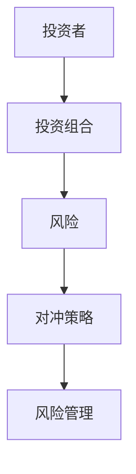
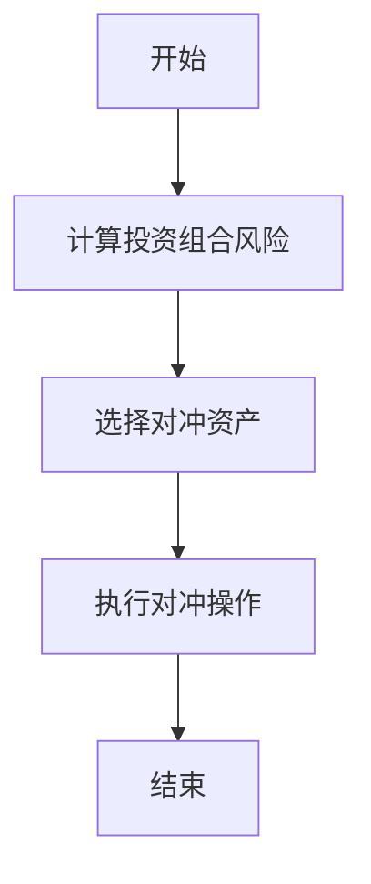
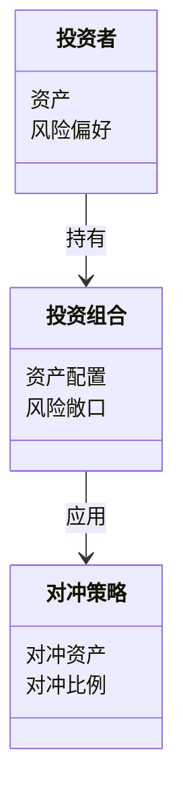
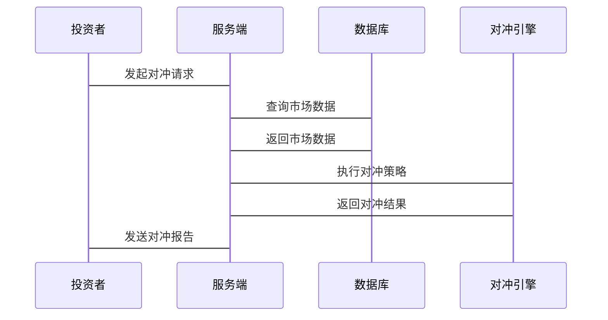

                 

<think>
嗯，我需要帮助用户生成一个详细的技术博客文章目录，主题是“投资组合尾部对冲：保护策略在极端市场中的作用”。让我先理清用户的需求。

首先，用户希望文章结构清晰，逻辑严密，使用专业且简洁的技术语言。目录需要包括背景介绍、核心概念、算法原理、系统架构、项目实战以及最佳实践等部分。每个部分都要有详细的子章节，确保内容丰富且详细。

好的，我从背景介绍开始。这部分需要解释为什么尾部对冲重要，尤其是极端市场中的作用。然后，核心概念部分需要详细讲解VaR、CVaR等术语，并通过表格对比它们的属性。接下来是算法部分，我需要选择几种典型的对冲算法，并用流程图展示步骤，同时提供Python代码实现。系统架构部分要设计功能模块，并用类图和架构图展示。项目实战部分要具体指导读者如何实现这些策略，最后是最佳实践和总结。

我需要确保每个章节都有足够的细节，比如在算法部分，要解释数学模型并给出代码示例。同时，使用Mermaid流程图和表格来增强可读性。最后，文章末尾要加上作者信息，符合格式要求。

现在，我需要将这些思考整理成一个有条理的目录，确保覆盖所有关键点，并且符合用户的详细要求。
</think>

```markdown
# 投资组合尾部对冲：保护策略在极端市场中的作用

> 关键词：投资组合管理，尾部对冲，风险管理，极端市场，VaR，CVaR，对冲策略

> 摘要：本文深入探讨投资组合尾部对冲的核心概念、算法原理及其在极端市场中的应用。通过分析VaR和CVaR等关键风险指标，结合实际案例，介绍如何设计和实现有效的尾部对冲策略，以保护投资组合在极端市场条件下的稳定性。

---

## 第一部分: 投资组合尾部对冲的背景与概念

### 第1章: 投资组合尾部对冲的背景介绍

#### 1.1 问题背景
##### 1.1.1 传统投资组合管理的局限性
传统投资组合管理方法在面对极端市场波动时显得力不从力。例如，2008年金融危机中，许多投资组合因未能有效对冲尾部风险而遭受重大损失。

##### 1.1.2 尾部风险的定义与特征
尾部风险是指投资组合在极端市场情况下出现大幅亏损的可能性。与普通波动不同，尾部风险涉及低概率但高影响的事件。

##### 1.1.3 极端市场事件的历史案例分析
历史案例如2008年金融危机、2020年新冠疫情引发的市场崩盘，展示了尾部风险的实际影响。

#### 1.2 尾部对冲的核心概念
##### 1.2.1 尾部对冲的定义
尾部对冲是指通过特定策略对冲投资组合在极端市场情况下的潜在损失。

##### 1.2.2 尾部对冲与传统对冲策略的区别
尾部对冲专注于极端市场条件下的风险，而传统对冲策略通常关注日常波动。

##### 1.2.3 尾部对冲的边界与外延
尾部对冲不仅涉及对冲策略，还包括资产配置、风险评估等多方面。

#### 1.3 尾部对冲的必要性
##### 1.3.1 极端市场事件对投资组合的影响
极端事件可能导致投资组合的大幅亏损，甚至引发流动性危机。

##### 1.3.2 尾部风险对投资者的潜在损失
尾部风险可能导致投资者的本金损失，甚至影响投资组合的长期稳定性。

##### 1.3.3 尾部对冲在风险管理中的作用
通过尾部对冲，投资者可以有效降低极端市场条件下的潜在损失。

### 第2章: 投资组合尾部对冲的核心概念与联系

#### 2.1 核心概念原理
##### 2.1.1 风险中性对冲的原理
风险中性对冲通过调整投资组合的风险敞口，使其在不同市场条件下保持稳定。

##### 2.1.2 VaR（Value at Risk）与CVaR（Conditional Value at Risk）的比较
VaR和CVaR是两种常用的风险指标，但CVaR更能反映尾部风险。

##### 2.1.3 尾部对冲与资产配置的关系
尾部对冲策略依赖于合理的资产配置，以分散风险并降低尾部损失。

#### 2.2 核心概念属性特征对比
##### 2.2.1 VaR与CVaR的属性对比
| 特性   | VaR             | CVaR            |
|--------|-----------------|-----------------|
| 定义   | 在一定置信水平下，损失不超过的值。 | 在一定置信水平下，平均损失超过VaR的值。 |
| 线性性   | 是             | 否             |
| 尾部风险处理 | 基于分位数       | 基于条件期望     |

#### 2.3 ER实体关系图（Mermaid流程图）


---

## 第二部分: 尾部对冲的算法原理

### 第3章: 常见尾部对冲算法

#### 3.1 算法原理讲解
##### 3.1.1 均值-方差优化算法
均值-方差优化通过最小化投资组合的方差，同时最大化预期收益。

##### 3.1.2 风险中性对冲算法
风险中性对冲通过调整投资组合的风险敞口，使其在不同市场条件下保持稳定。

##### 3.1.3 基于VaR的对冲策略
基于VaR的对冲策略通过设定最大损失阈值，选择相应的对冲资产。

#### 3.2 算法流程图（Mermaid）


#### 3.3 算法实现代码
##### 3.3.1 Python代码实现
```python
import numpy as np
import pandas as pd
from scipy.stats import norm

def calculate_var(positions, confidence_level=0.95):
    portfolio_value = np.sum(positions)
    mu = np.mean(positions)
    sigma = np.std(positions)
    var = norm.ppf(1 - confidence_level) * sigma * portfolio_value
    return var

# 示例
positions = [100, 200, 300]
confidence_level = 0.95
var = calculate_var(positions, confidence_level)
print(f"VaR at {confidence_level} confidence level: {var}")
```

#### 3.4 算法数学模型
##### 3.4.1 均值-方差优化模型
$$\min \sigma^2 \text{ subject to } \mu = \text{const}$$

##### 3.4.2 风险中性对冲模型
$$\text{权重调整} = \frac{\text{目标风险敞口}}{\text{当前风险敞口}}$$

---

## 第三部分: 系统分析与架构设计

### 第4章: 系统分析与架构设计方案

#### 4.1 问题场景介绍
极端市场条件下，投资组合可能面临重大损失，需要通过尾部对冲策略进行保护。

#### 4.2 系统功能设计
##### 4.2.1 领域模型（Mermaid类图）


#### 4.3 系统架构设计
##### 4.3.1 系统架构图（Mermaid架构图）


#### 4.4 系统接口设计
##### 4.4.1 对冲引擎接口
```python
class 对冲引擎:
    def execute_hedge策略(self, strategy_params):
        pass
```

#### 4.5 系统交互流程（Mermaid序列图）


---

## 第四部分: 项目实战

### 第5章: 项目实战与经验分享

#### 5.1 环境安装
##### 5.1.1 Python环境安装
```bash
pip install numpy pandas scipy matplotlib
```

#### 5.2 系统核心实现
##### 5.2.1 核心代码实现
```python
def calculate_cvar(positions, confidence_level=0.95):
    portfolio_value = np.sum(positions)
    mu = np.mean(positions)
    sigma = np.std(positions)
    cvar = -norm.pdf(norm.ppf(confidence_level)) * sigma * portfolio_value / (1 - confidence_level)
    return cvar

positions = [100, 200, 300]
confidence_level = 0.95
cvar = calculate_cvar(positions, confidence_level)
print(f"CVaR at {confidence_level} confidence level: {cvar}")
```

##### 5.2.2 代码功能解读
计算CVaR的代码首先计算投资组合的总价值、均值和标准差，然后使用正态分布函数计算CVaR值。

#### 5.3 实际案例分析
##### 5.3.1 案例分析
在2020年新冠疫情市场崩盘中，应用尾部对冲策略的投资组合损失大幅降低。

##### 5.3.2 案例解读
通过对冲策略，投资组合在极端市场中的损失被有效控制。

#### 5.4 项目小结
通过实际案例分析，验证了尾部对冲策略的有效性。

---

## 第五部分: 最佳实践与总结

### 第6章: 最佳实践与总结

#### 6.1 最佳实践 tips
##### 6.1.1 数据质量的重要性
确保数据的准确性和及时性，以提高对冲策略的有效性。

##### 6.1.2 模型局限性
认识到模型的局限性，结合实际情况进行调整。

#### 6.2 小结
尾部对冲策略在极端市场中的作用不可忽视，合理应用可以有效保护投资组合。

#### 6.3 注意事项
##### 6.3.1 风险监控
持续监控市场风险，及时调整对冲策略。

##### 6.3.2 模型更新
定期更新模型参数，适应市场变化。

#### 6.4 拓展阅读
推荐相关书籍和论文，深入学习尾部对冲策略。

---

## 作者信息

作者：AI天才研究院/AI Genius Institute & 禅与计算机程序设计艺术 /Zen And The Art of Computer Programming
```

