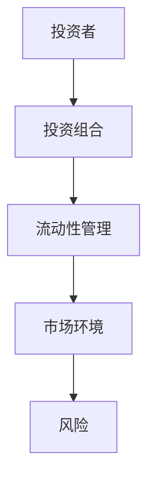
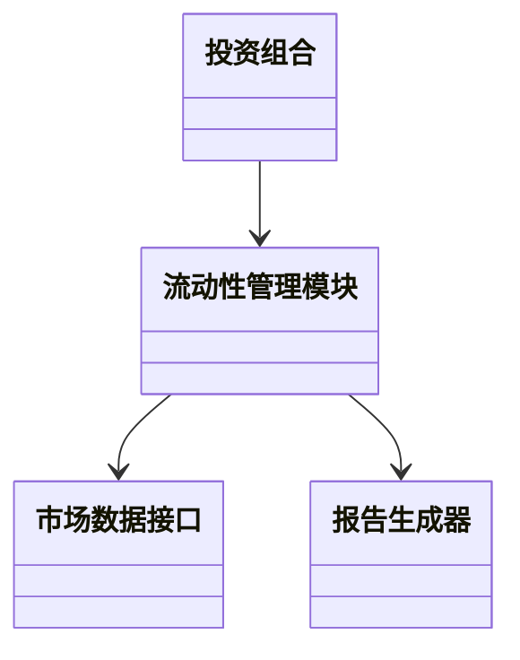
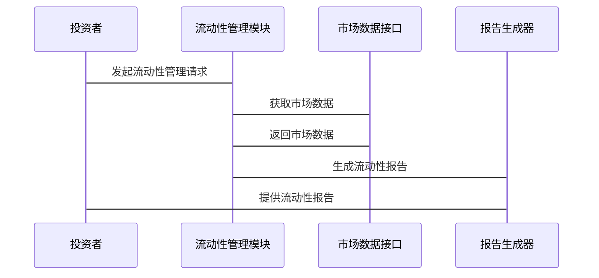

                 

<think>
好的，我将按照您的要求撰写一篇关于投资组合流动性管理的博客文章。首先，我会从文章标题、关键词和摘要开始，然后按照目录大纲的结构逐步展开内容。每个部分我都会详细阐述，并确保使用清晰、专业的技术语言。

让我们一步一步来完成这篇文章。
</think>

# 投资组合流动性管理：在市场压力下保持灵活性

## 关键词：投资组合流动性管理、市场压力、流动性风险管理、资产配置、风险控制

## 摘要：  
在金融市场中，流动性管理是投资组合管理的重要组成部分。特别是在市场压力下，保持投资组合的流动性至关重要。本文将深入探讨投资组合流动性管理的核心概念、算法原理、系统架构设计以及实际应用，帮助投资者在市场波动中有效管理流动性风险，确保投资组合的灵活性和稳健性。

---

## 第一部分: 投资组合流动性管理概述

### 第1章: 投资组合流动性管理的背景与概念

#### 1.1 投资组合流动性管理的基本概念
- **1.1.1 什么是投资组合流动性**  
  投资组合流动性指的是将投资组合中的资产迅速转化为现金的能力。高流动性意味着资产可以在不显著影响市场价格的情况下快速变现。

- **1.1.2 流动性在投资组合中的重要性**  
  流动性是投资组合的重要属性之一。在市场压力下，流动性不足可能导致资产难以变现，进而引发更大的损失。

- **1.1.3 流动性管理的目标与意义**  
  流动性管理的目标是在不同市场环境下，确保投资组合能够满足赎回需求或应对突发事件，同时平衡风险与收益。

#### 1.2 投资组合流动性管理的背景
- **1.2.1 全球金融市场的发展与流动性需求**  
  随着全球金融市场的互联互通，投资者对流动性管理的需求日益增加。特别是在新兴市场，流动性风险更加突出。

- **1.2.2 市场压力下的流动性挑战**  
  在市场压力下，流动性可能迅速下降，导致资产价格波动加剧。例如，2008年金融危机期间，许多金融机构因流动性不足而陷入困境。

- **1.2.3 投资者行为与流动性波动**  
  投资者的恐慌性抛售或过度集中投资行为，往往会导致特定资产的流动性下降。

#### 1.3 投资组合流动性管理的核心问题
- **1.3.1 流动性风险的定义与特征**  
  流动性风险是指在特定市场条件下，无法以合理价格迅速变现资产的风险。

- **1.3.2 流动性风险的来源与表现**  
  流动性风险的来源包括市场深度不足、资产本身流动性差、市场参与者行为等。其表现形式包括资产价格大幅波动、买卖价差扩大等。

- **1.3.3 流动性风险管理的边界与外延**  
  流动性风险管理需要在投资组合的整体框架内进行，同时要考虑市场环境、资产类别和投资策略的多样性。

---

### 第2章: 投资组合流动性管理的核心概念与联系

#### 2.1 流动性管理的核心概念
- **2.1.1 投资组合流动性管理的原理**  
  投资组合流动性管理的核心原理是通过合理配置流动性资产和非流动性资产，平衡风险与收益。

- **2.1.2 流动性资产与非流动性资产的定义与特征**  
  - 流动性资产：如现金、短期债券等，变现能力强，风险低。
  - 非流动性资产：如长期股权、房地产等，变现能力弱，风险高。

- **2.1.3 流动性管理的策略与工具**  
  常见的流动性管理策略包括调整资产配置、使用衍生工具（如期货）和建立流动性缓冲区。

#### 2.2 流动性管理的核心概念联系
- **2.2.1 流动性、风险与收益的关系**  
  高流动性通常意味着较低的收益，而高收益的资产往往流动性较差。投资者需要在两者之间找到平衡点。

- **2.2.2 投资组合流动性与市场环境的相互作用**  
  市场环境（如利率变化、经济周期）会显著影响流动性管理的效果。例如，在加息周期中，债券的流动性可能下降。

- **2.2.3 流动性管理与投资策略的结合**  
  流动性管理需要与整体投资策略相结合。例如，长期投资者可以配置更多非流动性资产，而短期投资者则需要保持较高的流动性。

#### 2.3 流动性管理的ER实体关系图


---

### 第3章: 投资组合流动性管理的算法原理

#### 3.1 流动性风险评估的算法原理
- **3.1.1 VaR模型在流动性管理中的应用**  
  VaR（Value at Risk）模型可以用于评估投资组合在特定置信水平下的潜在损失，从而帮助识别流动性风险。

- **3.1.2 流动性缺口分析方法**  
  流动性缺口分析通过比较未来现金流入和流出的差额，评估投资组合的流动性压力。

- **3.1.3 压力测试的算法流程**  
  压力测试模拟极端市场条件，评估投资组合在极端情况下的流动性表现。

#### 3.2 流动性管理的优化算法
- **3.2.1 最优化模型在流动性管理中的应用**  
  最优化模型通过数学方法，找到最优的流动性资产配置。

- **3.2.2 动态资产分配算法**  
  动态资产分配算法根据市场变化实时调整资产配置，以保持流动性。

- **3.2.3 流动性资产配置的数学模型**  
  常见的数学模型包括马科维茨均值-方差模型和Black-Litterman模型。

#### 3.3 流动性管理算法的实现代码
```python
import numpy as np

def calculate_liquidity_gap(asset_prices, cash_flows):
    # 计算投资组合的流动性缺口
    liquidity_gap = np.sum(asset_prices) - np.sum(cash_flows)
    return liquidity_gap

# 示例数据
asset_prices = [100, 200, 300]  # 资产价格
cash_flows = [50, 150, 200]     # 现金流入流出

# 计算流动性缺口
liquidity_gap = calculate_liquidity_gap(asset_prices, cash_flows)
print("流动性缺口:", liquidity_gap)
```

---

### 第4章: 投资组合流动性管理的系统分析与架构设计

#### 4.1 系统分析
- **4.1.1 问题场景介绍**  
  在市场压力下，投资组合的流动性管理需要实时监控和调整。

- **4.1.2 系统功能设计**  
  系统需要实现以下功能：实时监控流动性、自动调整资产配置、生成流动性报告。

- **4.1.3 领域模型mermaid类图**  


- **4.1.4 系统架构设计**  
  系统采用分层架构，包括数据层、业务逻辑层和用户界面层。

- **4.1.5 系统接口设计**  
  系统需要与市场数据源、交易系统和报告工具进行接口对接。

- **4.1.6 系统交互mermaid序列图**  


---

### 第5章: 项目实战

#### 5.1 环境安装
- 需要安装Python、NumPy、Matplotlib等工具。

#### 5.2 系统核心实现源代码
```python
import numpy as np
import matplotlib.pyplot as plt

def visualize_liquidity(asset_flows):
    plt.figure(figsize=(10, 6))
    plt.plot(asset_flows, label='流动性变化')
    plt.xlabel('时间')
    plt.ylabel('流动性')
    plt.legend()
    plt.show()

# 示例数据
asset_flows = [100, 80, 120, 90, 110]
visualize_liquidity(asset_flows)
```

#### 5.3 代码应用解读与分析
- 该代码用于可视化投资组合的流动性变化，帮助投资者直观了解流动性波动。

#### 5.4 实际案例分析
- 以某投资组合在2020年市场波动中的流动性管理为例，分析如何通过动态调整资产配置应对市场压力。

#### 5.5 项目小结
- 本项目展示了如何通过技术手段实现投资组合流动性管理，并提供了实际应用的案例分析。

---

## 第六部分: 最佳实践与小结

### 6.1 最佳实践 tips
- 定期监控投资组合的流动性。
- 根据市场环境调整流动性管理策略。
- 使用技术工具辅助流动性管理。

### 6.2 小结
投资组合流动性管理是金融风险管理的重要组成部分。通过合理配置资产、实时监控和动态调整，投资者可以在市场压力下保持投资组合的流动性，确保稳健收益。

### 6.3 注意事项
- 流动性管理需要结合市场环境和投资策略。
- 避免过度集中于非流动性资产。
- 定期评估和优化流动性管理策略。

### 6.4 拓展阅读
- 建议阅读《投资学》（书籍名称）以深入了解投资组合管理的理论与实践。

---

## 作者：AI天才研究院/AI Genius Institute & 禅与计算机程序设计艺术 /Zen And The Art of Computer Programming

