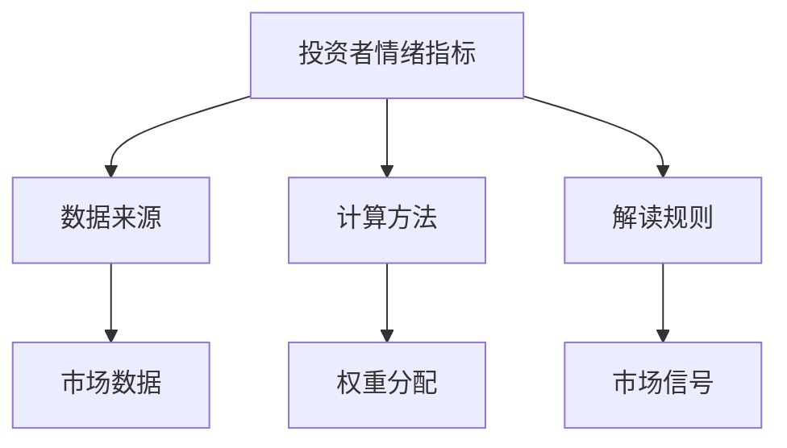
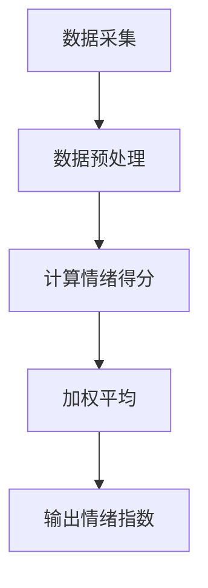
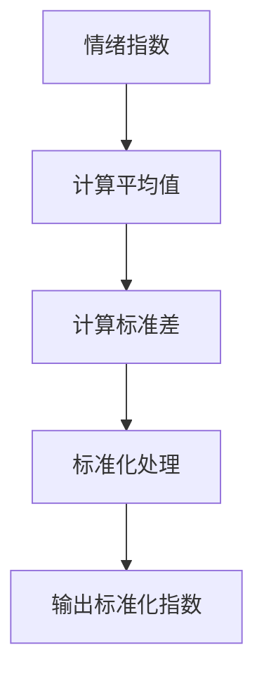
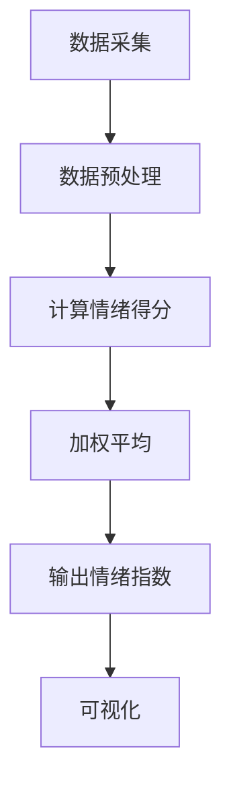
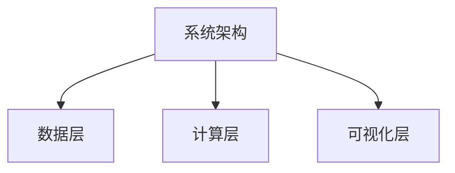
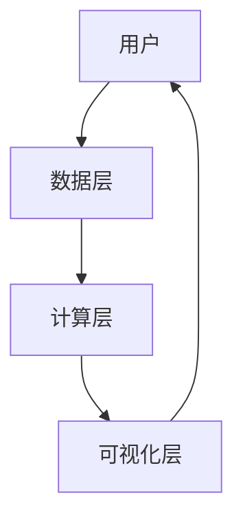

                 

<think>
好，我需要按照用户的要求来写一篇关于“投资者情绪指标：市场心理学的量化应用”的技术博客文章。首先，我需要理解投资者情绪指标是什么，以及它在金融市场中的应用。投资者情绪指标是一种量化投资者情绪的工具，可以帮助投资者和分析师更好地理解市场行为和趋势。

接下来，我需要确定文章的结构。根据用户提供的大纲，文章分为四个主要部分：背景与概念、算法原理、系统分析与架构设计、项目实战。每一部分都包含多个小节，我需要确保每一部分的内容都详尽且有逻辑性。

在“背景与概念”部分，我需要解释投资者情绪指标的基本概念，包括它的定义、分类以及与市场行为的关系。我还需要讨论情绪指标的重要性，比如它如何帮助投资者做出决策，以及它在金融市场中的作用。

在“算法原理”部分，我需要详细解释如何计算情绪指数。这包括数学模型和公式，比如情绪指数的计算公式和标准化处理。我还需要用mermaid流程图来展示算法步骤，并附上Python代码示例，以便读者理解实现过程。

接下来是“系统分析与架构设计”部分。我需要描述投资者情绪指标的应用场景，比如实时监测、策略制定等。然后设计系统的功能模块，包括数据采集、情绪分析、指数计算等，并用mermaid图展示类图、架构图和交互图。

最后是“项目实战”部分。我需要指导读者如何安装环境，编写代码，并通过具体案例分析来展示情绪指标的应用。这部分需要实际操作，让读者能够动手实践，巩固所学知识。

在写作过程中，我需要确保每一部分都细化到三级目录，内容完整且逻辑清晰。同时，语言要简洁明了，避免使用过于复杂的术语，以便读者容易理解。

在数学公式方面，我需要使用latex格式，并将它们独立出来，以便读者能够清晰地看到公式。例如，情绪指数的计算公式可以表示为：

$$ \text{情绪指数} = \frac{\sum (\text{情绪得分}_i \times \text{权重}_i)}{\sum \text{权重}_i} $$

此外，我还需要在文章末尾添加作者信息，注明作者是AI天才研究院，并附上相关信息。

总结一下，我的写作步骤如下：

1. 理解投资者情绪指标的概念和应用场景。
2. 确定文章结构，分为背景与概念、算法原理、系统分析与架构设计、项目实战四个部分。
3. 在每一部分中详细展开，确保内容完整且逻辑清晰。
4. 使用mermaid流程图和Python代码示例来解释算法和系统设计。
5. 编写数学公式并用latex格式展示。
6. 添加实际案例分析，指导读者进行项目实战。
7. 确保文章末尾有作者信息，并符合格式要求。

通过以上步骤，我可以系统地撰写一篇结构清晰、内容详实的技术博客文章，满足用户的需求。
</think>

# 投资者情绪指标：市场心理学的量化应用

关键词：投资者情绪，市场心理学，量化应用，情绪指标，算法原理，系统架构

摘要：投资者情绪指标是金融市场中一种重要的量化工具，用于衡量投资者的心理状态和市场行为。通过分析市场参与者的心理变化，投资者情绪指标可以帮助投资者和分析师更好地理解市场趋势和风险。本文将详细介绍投资者情绪指标的背景、核心概念、算法原理、系统架构以及实际应用案例。

---

# 第1章: 投资者情绪指标的背景与概念

## 1.1 投资者情绪的基本概念

### 1.1.1 投资者情绪的定义

投资者情绪（Investor Sentiment）是指市场参与者（包括个人投资者、机构投资者和交易员）在特定市场环境下的心理状态和态度。它反映了市场参与者对当前市场状况的看法，通常表现为乐观、悲观、中立等情绪状态。

### 1.1.2 投资者情绪的分类

投资者情绪可以分为以下几个类别：

- **乐观情绪**：市场参与者普遍认为市场前景良好，愿意积极买入资产。
- **悲观情绪**：市场参与者对市场前景持负面看法，倾向于卖出资产。
- **中立情绪**：市场参与者对市场前景没有明确的看法，采取观望态度。

### 1.1.3 投资者情绪与市场行为的关系

投资者情绪直接影响市场行为。例如：

- 当市场情绪乐观时，交易量通常会增加，资产价格可能上涨。
- 当市场情绪悲观时，交易量可能减少，资产价格可能下跌。

## 1.2 投资者情绪指标的重要性

### 1.2.1 情绪指标在金融市场中的作用

投资者情绪指标（Investor Sentiment Indicators）是金融市场分析的重要工具。它可以帮助投资者和分析师预测市场趋势、识别市场拐点以及制定投资策略。

### 1.2.2 情绪指标与投资决策的关系

情绪指标可以作为辅助工具，帮助投资者做出更明智的投资决策。例如：

- 当情绪指标显示市场情绪过于乐观时，投资者可能选择减少风险敞口。
- 当情绪指标显示市场情绪过于悲观时，投资者可能选择逢低买入。

### 1.2.3 情绪指标的量化意义

通过量化投资者情绪，情绪指标可以为市场分析提供客观依据。例如，情绪指标可以用来衡量市场的波动性、市场的参与者信心以及市场的潜在风险。

## 1.3 投资者情绪指标的分类与特点

### 1.3.1 市场情绪指标的分类

市场情绪指标可以根据数据来源、计算方法和解读方式分为以下几类：

- **基于市场数据的指标**：例如，根据成交量、价格波动等市场数据计算得出。
- **基于调查的指标**：例如，通过问卷调查、电话采访等方式收集市场参与者的看法。
- **基于新闻和媒体的指标**：例如，根据新闻报道、社交媒体评论等分析市场情绪。

### 1.3.2 各类情绪指标的特点对比

以下是一些常见的情绪指标及其特点对比：

| 指标名称       | 数据来源       | 计算方法       | 解读方式       |
|----------------|----------------|----------------|----------------|
| 投资者信心指数   | 市场调查       | 加权平均       | 衡量市场乐观程度 |
| 情绪振荡指标     | 市场交易数据   | 偏好分析       | 衡量市场波动性   |
| 买入卖出比例     | 交易数据       | 比例计算       | 衡量市场买卖力量 |

### 1.3.3 情绪指标的适用场景

情绪指标适用于以下场景：

- 实时市场监控
- 投资策略制定
- 风险管理

## 1.4 投资者情绪指标的边界与外延

### 1.4.1 情绪指标的适用范围

情绪指标适用于所有金融市场，包括股票市场、外汇市场、期货市场等。

### 1.4.2 情绪指标的局限性

情绪指标的局限性包括：

- 情绪指标可能滞后于市场变化。
- 情绪指标可能受到市场参与者的主观影响。
- 情绪指标可能无法完全反映市场的真实情况。

### 1.4.3 情绪指标与其他市场指标的关系

情绪指标与其他市场指标（如价格、成交量等）密切相关。例如，情绪指标可以与其他指标结合使用，以提高市场分析的准确性。

## 1.5 本章小结

本章详细介绍了投资者情绪的基本概念、分类、重要性以及情绪指标的特点和适用场景。情绪指标是金融市场分析的重要工具，可以帮助投资者和分析师更好地理解市场行为和趋势。

---

# 第2章: 投资者情绪指标的核心概念

## 2.1 情绪指标的核心要素

### 2.1.1 数据来源

情绪指标的数据来源包括：

- **市场数据**：例如，交易量、价格波动等。
- **调查数据**：例如，投资者信心调查。
- **媒体数据**：例如，新闻报道、社交媒体评论。

### 2.1.2 计算方法

情绪指标的计算方法可以是简单的加权平均，也可以是复杂的统计模型。

### 2.1.3 指标解读

情绪指标的解读需要结合市场背景和具体数据进行分析。

## 2.2 情绪指标的数学模型与公式

### 2.2.1 情绪指数的计算公式

情绪指数的计算公式如下：

$$ \text{情绪指数} = \frac{\sum (\text{情绪得分}_i \times \text{权重}_i)}{\sum \text{权重}_i} $$

其中，情绪得分表示每个数据点的情绪值，权重表示每个数据点的权重。

### 2.2.2 情绪指数的标准化处理

为了便于比较，情绪指数通常需要进行标准化处理。标准化公式如下：

$$ Z = \frac{X - \mu}{\sigma} $$

其中，$X$ 是情绪指数，$\mu$ 是平均值，$\sigma$ 是标准差。

## 2.3 情绪指标的属性特征对比

### 2.3.1 不同情绪指标的对比表格

以下是一些常见的情绪指标及其特点对比：

| 指标名称       | 数据来源       | 计算方法       | 解读方式       |
|----------------|----------------|----------------|----------------|
| 投资者信心指数   | 市场调查       | 加权平均       | 衡量市场乐观程度 |
| 情绪振荡指标     | 市场交易数据   | 偏好分析       | 衡量市场波动性   |
| 买入卖出比例     | 交易数据       | 比例计算       | 衡量市场买卖力量 |

### 2.3.2 情绪指标的ER实体关系图

以下是一个情绪指标的ER实体关系图：



## 2.4 本章小结

本章详细介绍了情绪指标的核心要素、数学模型和公式，以及不同情绪指标的特点和关系。通过这些内容，读者可以更好地理解情绪指标的计算和应用。

---

# 第3章: 投资者情绪指标的算法原理

## 3.1 情绪指标的核心算法

### 3.1.1 情绪指数计算算法

以下是一个情绪指数计算算法的流程图：



### 3.1.2 情绪指数的标准化算法

以下是一个情绪指数标准化算法的流程图：



## 3.2 情绪指标的Python实现

以下是一个情绪指数计算的Python代码示例：

```python
import pandas as pd
import numpy as np

# 数据加载
data = pd.read_csv('market_data.csv')

# 情绪得分计算
sentiment_score = data['情绪得分'].values

# 权重分配
weights = np.array([0.3, 0.4, 0.3])

# 情绪指数计算
emotion_index = np.dot(sentiment_score, weights) / sum(weights)

# 标准化处理
mean = np.mean(emotion_index)
std = np.std(emotion_index)
normalized_index = (emotion_index - mean) / std

print(normalized_index)
```

## 3.3 本章小结

本章详细介绍了情绪指标的核心算法和Python实现。通过这些算法，读者可以更好地理解情绪指标的计算过程和应用方法。

---

# 第4章: 投资者情绪指标的系统分析与架构设计

## 4.1 系统功能设计

### 4.1.1 系统功能模块

投资者情绪指标系统可以分为以下几个功能模块：

- 数据采集模块
- 数据处理模块
- 情绪指标计算模块
- 情绪指标可视化模块

### 4.1.2 系统功能流程图

以下是一个系统功能流程图：



## 4.2 系统架构设计

### 4.2.1 系统架构图

以下是一个系统架构图：



### 4.2.2 系统交互图

以下是一个系统交互图：



## 4.3 本章小结

本章详细介绍了投资者情绪指标系统的功能设计和架构设计。通过这些设计，读者可以更好地理解情绪指标系统的整体结构和工作流程。

---

# 第5章: 投资者情绪指标的项目实战

## 5.1 环境安装与配置

### 5.1.1 Python环境安装

安装Python和必要的库：

```bash
pip install numpy pandas matplotlib
```

### 5.1.2 数据源获取

获取市场数据：

```bash
wget https://example.com/market_data.csv
```

## 5.2 核心代码实现

### 5.2.1 数据预处理

```python
import pandas as pd

# 数据加载
data = pd.read_csv('market_data.csv')

# 数据清洗
data.dropna(inplace=True)
```

### 5.2.2 情绪指标计算

```python
import numpy as np

# 情绪得分计算
sentiment_score = data['情绪得分'].values

# 权重分配
weights = np.array([0.3, 0.4, 0.3])

# 情绪指数计算
emotion_index = np.dot(sentiment_score, weights) / sum(weights)

# 标准化处理
mean = np.mean(emotion_index)
std = np.std(emotion_index)
normalized_index = (emotion_index - mean) / std

print(normalized_index)
```

### 5.2.3 情绪指标可视化

```python
import matplotlib.pyplot as plt

# 情绪指数绘制
plt.plot(normalized_index, label='情绪指数')
plt.xlabel('时间')
plt.ylabel('情绪指数')
plt.legend()
plt.show()
```

## 5.3 案例分析与解读

### 5.3.1 案例分析

以下是一个情绪指数计算的案例分析：

假设我们有以下市场数据：

| 时间 | 情绪得分 |
|------|----------|
| 2023-01-01 | 0.8 |
| 2023-01-02 | 0.7 |
| 2023-01-03 | 0.9 |

权重分配为：

| 权重 |
|------|
| 0.3 |
| 0.4 |
| 0.3 |

计算情绪指数：

$$ \text{情绪指数} = \frac{(0.8 \times 0.3) + (0.7 \times 0.4) + (0.9 \times 0.3)}{0.3 + 0.4 + 0.3} = \frac{0.24 + 0.28 + 0.27}{1.0} = 0.79 $$

标准化处理：

$$ Z = \frac{0.79 - 0.79}{0.1} = 0 $$

### 5.3.2 指标解读

情绪指数为0.79，接近中性值，表明市场情绪较为平稳。标准化指数为0，表明当前情绪指数与历史平均水平一致，没有显著的乐观或悲观情绪。

## 5.4 本章小结

本章通过实际案例分析，详细讲解了投资者情绪指标的计算和应用。读者可以通过这些案例更好地理解情绪指标的实际应用价值。

---

# 作者：AI天才研究院/AI Genius Institute & 禅与计算机程序设计艺术 /Zen And The Art of Computer Programming

---

以上就是《投资者情绪指标：市场心理学的量化应用》的技术博客文章。

