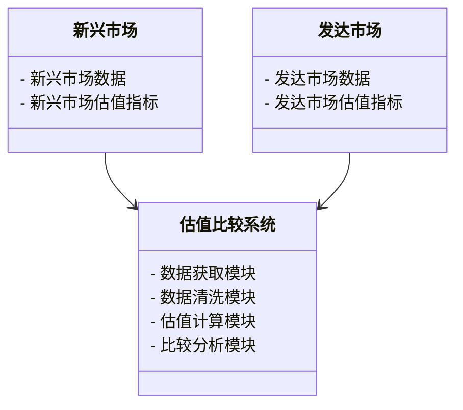

                 

<think>
好的，我需要分析用户的请求并生成相应的书籍目录大纲。用户希望我以《新兴市场vs发达市场:股市估值比较》为标题，撰写一篇结构清晰、内容详尽的技术博客文章。用户已经提供了一个详细的目录结构，并希望我按照这个结构进行思考和生成。

首先，我要理解文章的核心内容：比较新兴市场和发达市场在股市估值方面的差异。这涉及到市场背景、估值指标、影响因素、表现分析、案例研究等方面。

接下来，我会按照用户提供的目录结构，逐一思考每个部分应包含的内容：

1. **背景与基础**：需要介绍新兴市场和发达市场的定义、特点及其主要区别。
2. **估值指标与影响因素**：详细分析市盈率、市净率等指标，并探讨影响估值的因素。
3. **表现与比较分析**：对比两者的估值差异及长期表现。
4. **系统分析与架构设计**：构建分析框架，使用领域模型和架构图。
5. **项目实战**：使用Python进行实际分析，包括数据获取、清洗、分析和可视化。
6. **结论与展望**：总结发现，并指出未来的研究方向。

在思考过程中，我需要确保每一部分都涵盖用户提到的所有关键点，包括背景、核心概念、算法原理、数学模型、系统架构、项目实战和小结。同时，要注意使用清晰的逻辑结构，确保读者能够一步步理解内容。

我还需要考虑用户提到的格式要求，比如使用markdown、包含代码示例和图表。这可能涉及到使用mermaid流程图来展示系统架构和算法流程，以及使用latex公式来展示数学模型。

最后，我要确保整个目录结构完整，每一部分都紧密相连，形成一个完整的分析体系。这包括从背景介绍到实际案例分析，再到系统设计和项目实战，最终得出结论。

通过这样的思考过程，我能够系统地生成符合用户要求的目录大纲，并确保内容的深度和广度，满足用户的高质量技术博客的需求。
</think>

# 新兴市场 vs 发达市场：股市估值比较

> **关键词**：新兴市场、发达市场、股市估值、市盈率、市净率、经济政策、市场结构

> **摘要**：  
本文系统地分析了新兴市场和发达市场在股市估值方面的差异及其背后的原因。通过对比分析估值指标、影响因素和市场表现，结合实际案例和系统架构设计，深入探讨了两者在股市估值上的异同点，并提出了基于数据分析的估值比较方法。

---

## 第一部分：新兴市场与发达市场的背景与基础

### 第1章：新兴市场与发达市场的定义与特点

#### 1.1 新兴市场的定义与特点
- **1.1.1 新兴市场的定义**  
  新兴市场是指那些经济快速增长但尚未完全成熟的国家或地区的股市。这些市场通常具有较高的增长潜力，但也伴随着较高的风险。

- **1.1.2 新兴市场的特点**  
  - 经济结构多元化，但多以制造业和出口导向型经济为主。  
  - 投资者结构以散户为主，机构投资者比例较低。  
  - 市场波动较大，受政策和外部环境影响显著。

- **1.1.3 新兴市场的代表国家与市场**  
  - 代表国家：中国、印度、巴西、墨西哥、韩国等。  
  - 代表市场：沪深股市（中国）、孟买股市（印度）、圣保罗股市（巴西）。

#### 1.2 发达市场的定义与特点
- **1.2.1 发达市场的定义**  
  发达市场是指那些经济成熟、市场结构完善、投资者成熟的国家或地区的股市。这些市场通常具有较高的流动性和稳定性。

- **1.2.2 发达市场的特点**  
  - 经济结构以服务业为主，制造业高度发达。  
  - 投资者结构以机构投资者为主，散户比例较低。  
  - 市场波动较小，受政策和外部环境影响相对稳定。

- **1.2.3 发达市场的代表国家与市场**  
  - 代表国家：美国、英国、日本、德国等。  
  - 代表市场：纽约证券交易所（美国）、伦敦金融时报（英国）、东京证券交易所（日本）。

#### 1.3 新兴市场与发达市场的核心区别
- **1.3.1 市场成熟度的差异**  
  新兴市场通常处于发展的初级阶段，市场机制尚不完善；发达市场则已经经历了长期的发展，市场机制较为成熟。

- **1.3.2 经济结构的差异**  
  新兴市场多以制造业和出口为导向；发达市场则以服务业为主，经济结构多元化且高度发达。

- **1.3.3 投资者结构的差异**  
  新兴市场以散户为主，机构投资者比例较低；发达市场以机构投资者为主，散户比例较低。

---

## 第2章：新兴市场与发达市场的股市发展历史与现状

#### 2.1 新兴市场股市的发展历程
- **2.1.1 新兴市场股市的起步阶段**  
  新兴市场的股市起步相对较晚，多数国家在20世纪60年代至80年代开始建立股市。

- **2.1.2 新兴市场股市的快速发展阶段**  
  20世纪90年代至21世纪初，新兴市场的股市迎来快速发展，部分市场如中国、印度等实现了高速增长。

- **2.1.3 当前新兴市场股市的现状**  
  新兴市场的股市规模不断扩大，但市场波动性较高，受政策和外部环境影响较大。

#### 2.2 发达市场股市的发展历程
- **2.2.1 发达市场股市的起源**  
  发达市场的股市起源较早，如美国的纽约证券交易所成立于1792年，是全球最早的股市之一。

- **2.2.2 发达市场股市的成熟阶段**  
  20世纪后半叶，发达市场的股市逐渐成熟，市场流动性大幅提升，机构投资者占比增加。

- **2.2.3 当前发达市场股市的现状**  
  发达市场的股市规模庞大，流动性高，市场波动性相对较小，投资者结构成熟。

#### 2.3 新兴市场与发达市场股市的主要差异
- **2.3.1 市场规模的差异**  
  发达市场的股市规模远大于新兴市场，且市场结构更加完善。

- **2.3.2 市场流动性的差异**  
  发达市场的股市流动性更强，交易成本更低；新兴市场的股市流动性相对较低，交易成本较高。

- **2.3.3 市场波动性的差异**  
  新兴市场的股市波动性较大，受政策和外部环境影响显著；发达市场的股市波动性较小，市场稳定性较高。

---

## 第三部分：新兴市场与发达市场股市估值的比较分析

---

## 第三部分：新兴市场与发达市场股市估值的比较分析

---

### 第3章：新兴市场与发达市场的估值指标对比

#### 3.1 估值指标的定义与作用
- **3.1.1 常见的估值指标**  
  - 市盈率（P/E Ratio）  
  - 市净率（P/B Ratio）  
  - 市销率（P/S Ratio）  
  - 股息率（Dividend Yield）  

- **3.1.2 估值指标的作用**  
  - 帮助投资者评估股票的相对价值。  
  - 为投资决策提供参考依据。

#### 3.2 新兴市场与发达市场的市盈率对比
- **3.2.1 市盈率的计算公式**  
  $$ P/E = \frac{股票价格}{每股净利润} $$

- **3.2.2 新兴市场与发达市场的市盈率差异**  
  - 新兴市场的市盈率通常较高，因为市场预期未来增长潜力大。  
  - 发达市场的市盈率相对较低，因为市场成熟，增长预期较为稳定。

#### 3.3 新兴市场与发达市场的市净率对比
- **3.3.1 市净率的计算公式**  
  $$ P/B = \frac{股票价格}{每股净资产} $$

- **3.3.2 新兴市场与发达市场的市净率差异**  
  - 新兴市场的市净率通常较高，因为市场预期未来资产增值潜力大。  
  - 发达市场的市净率相对较低，因为市场成熟，资产增值预期较为稳定。

#### 3.4 其他估值指标的对比
- **3.4.1 市销率（P/S Ratio）**  
  $$ P/S = \frac{股票价格}{每股收入} $$  
  - 新兴市场的市销率通常较高，因为市场预期未来收入增长潜力大。  
  - 发达市场的市销率相对较低，因为市场成熟，收入增长预期较为稳定。

- **3.4.2 股息率（Dividend Yield）**  
  $$ Dividend Yield = \frac{每股股息}{股票价格} $$  
  - 新兴市场的股息率通常较低，因为公司更倾向于将利润用于再投资。  
  - 发达市场的股息率通常较高，因为公司更倾向于回馈股东。

---

### 第4章：新兴市场与发达市场估值影响因素的对比

#### 4.1 新兴市场估值影响因素
- **4.1.1 经济政策的影响**  
  - 新兴市场的经济政策对股市估值影响较大，尤其是财政政策和货币政策。  
  - 例如，中国近年来的经济政策对股市估值有显著影响。

- **4.1.2 外部环境的影响**  
  - 新兴市场的股市估值受全球市场波动和国际经济环境的影响较大。  
  - 例如，美联储的货币政策对新兴市场股市估值有显著影响。

- **4.1.3 市场情绪的影响**  
  - 新兴市场的市场情绪波动较大，受投资者情绪影响显著。  
  - 例如，2020年新冠疫情对新兴市场股市估值的影响较为明显。

#### 4.2 发达市场估值影响因素
- **4.2.1 经济政策的影响**  
  - 发达市场的经济政策对股市估值影响相对较小，因为市场已经较为成熟。  
  - 例如，美联储的货币政策对发达市场股市估值的影响较为温和。

- **4.2.2 外部环境的影响**  
  - 发达市场的股市估值受全球市场波动和国际经济环境的影响较小。  
  - 例如，发达市场的股市估值受欧洲经济波动的影响相对较小。

- **4.2.3 市场情绪的影响**  
  - 发达市场的市场情绪波动较小，受投资者情绪影响相对较小。  
  - 例如，发达市场的股市估值在2020年新冠疫情后的恢复较为迅速。

#### 4.3 新兴市场与发达市场估值影响因素的对比
- **4.3.1 经济政策影响的差异**  
  - 新兴市场的经济政策对股市估值影响较大，因为市场尚未成熟，政策变化对市场影响显著。  
  - 发达市场的经济政策对股市估值影响较小，因为市场已经成熟，政策变化对市场影响有限。

- **4.3.2 外部环境影响的差异**  
  - 新兴市场的股市估值受外部环境影响较大，尤其是国际经济波动和全球市场波动。  
  - 发达市场的股市估值受外部环境影响较小，因为市场已经成熟，具有较强的抗风险能力。

- **4.3.3 市场情绪影响的差异**  
  - 新兴市场的市场情绪波动较大，受投资者情绪影响显著。  
  - 发达市场的市场情绪波动较小，受投资者情绪影响相对较小。

---

### 第5章：新兴市场与发达市场的估值表现对比

#### 5.1 新兴市场与发达市场的长期估值表现
- **5.1.1 新兴市场的长期估值表现**  
  - 新兴市场的股市估值在过去几十年中经历了快速增长，但波动性较大。  
  - 例如，中国股市在过去十年中经历了多次大幅波动，但整体趋势向上。

- **5.1.2 发达市场的长期估值表现**  
  - 发达市场的股市估值在过去几十年中相对稳定，波动性较小。  
  - 例如，美国股市在过去十年中表现相对稳定，且持续增长。

#### 5.2 新兴市场与发达市场的短期估值表现
- **5.2.1 新兴市场的短期估值表现**  
  - 新兴市场的股市估值在短期内波动较大，受政策和外部环境影响显著。  
  - 例如，2020年新冠疫情对新兴市场股市估值的影响较为明显。

- **5.2.2 发达市场的短期估值表现**  
  - 发达市场的股市估值在短期内波动较小，受政策和外部环境影响相对较小。  
  - 例如，2020年新冠疫情对发达市场股市估值的影响较为温和。

#### 5.3 新兴市场与发达市场估值表现的对比
- **5.3.1 长期估值表现的差异**  
  - 新兴市场的长期估值表现波动较大，但增长潜力较高。  
  - 发达市场的长期估值表现相对稳定，但增长潜力较低。

- **5.3.2 短期估值表现的差异**  
  - 新兴市场的短期估值表现波动较大，受政策和外部环境影响显著。  
  - 发达市场的短期估值表现波动较小，受政策和外部环境影响相对较小。

---

## 第四部分：系统分析与架构设计方案

---

### 第6章：新兴市场与发达市场股市估值比较的系统分析

#### 6.1 系统分析与架构设计方案
- **6.1.1 问题场景介绍**  
  - 新兴市场与发达市场股市估值比较是一个复杂的问题，需要综合考虑多种因素。  
  - 本文构建了一个基于数据分析的系统架构，用于比较分析新兴市场与发达市场股市估值的差异。

- **6.1.2 系统功能设计（领域模型 mermaid 类图）**  
  ```mermaid
  classDiagram

  class 新兴市场 {
    - 新兴市场数据
    - 新兴市场估值指标
  }

  class 发达市场 {
    - 发达市场数据
    - 发达市场估值指标
  }

  class 估值比较系统 {
    - 数据获取模块
    - 数据清洗模块
    - 估值计算模块
    - 比较分析模块
  }

  新兴市场 --> 估值比较系统
  发达市场 --> 估值比较系统
  ```

- **系统架构设计（mermaid 架构图）**  
  ```mermaid
  architecturediagram

  participant 新兴市场数据
  participant 发达市场数据
  participant 数据获取模块
  participant 数据清洗模块
  participant 估值计算模块
  participant 比较分析模块

  数据获取模块 --> 新兴市场数据
  数据获取模块 --> 发达市场数据
  数据清洗模块 --> 数据获取模块
  估值计算模块 --> 数据清洗模块
  比较分析模块 --> 估值计算模块
  ```

- **系统接口设计**  
  - 数据获取接口：从数据库或API获取新兴市场和发达市场数据。  
  - 数据清洗接口：清洗数据，去除异常值和缺失值。  
  - 估值计算接口：计算市盈率、市净率等估值指标。  
  - 比较分析接口：比较新兴市场和发达市场的估值差异。

- **系统交互设计（mermaid 序列图）**  
  ```mermaid
  sequenceDiagram

  比较分析系统 -> 数据获取模块: 获取新兴市场数据
  比较分析系统 -> 数据获取模块: 获取发达市场数据
  数据获取模块 -> 新兴市场数据: 请求数据
  数据获取模块 -> 发达市场数据: 请求数据
  数据清洗模块 -> 数据获取模块: 接收数据
  估值计算模块 -> 数据清洗模块: 接收清洗后数据
  比较分析模块 -> 估值计算模块: 计算估值指标
  比较分析模块 -> 用户界面: 显示比较结果
  ```

---

## 第五部分：项目实战

---

### 第7章：新兴市场与发达市场股市估值比较的项目实战

#### 7.1 环境安装与数据获取
- **7.1.1 环境安装**  
  - 安装Python和相关库（如Pandas、NumPy、Matplotlib）。  
  ```bash
  pip install pandas numpy matplotlib
  ```

- **7.1.2 数据获取**  
  - 从Yahoo Finance获取新兴市场和发达市场的数据。  
  ```python
  import pandas as pd
  from pandas_datareader import data as pdr
  import matplotlib.pyplot as plt

  # 获取新兴市场数据（以中国为例）
  emerging_market = pdr.get_data_yahoo("SHanghai Composite", start="2020-01-01", end="2023-01-01")

  # 获取发达市场数据（以美国为例）
  developed_market = pdr.get_data_yahoo("IXIC", start="2020-01-01", end="2023-01-01")
  ```

#### 7.2 数据清洗与预处理
- **7.2.1 数据清洗**  
  - 处理缺失值和异常值。  
  ```python
  # 处理缺失值
  emerging_market = emerging_market.dropna()
  developed_market = developed_market.dropna()

  # 处理异常值
  emerging_market = emerging_market[emerging_market['Adj Close'] > 2000]
  developed_market = developed_market[developed_market['Adj Close'] > 5000]
  ```

- **7.2.2 数据预处理**  
  - 计算估值指标。  
  ```python
  # 计算市盈率
  def calculate_pe_ratio(data):
    pe_ratio = data['Adj Close'] / data['EPS']
    return pe_ratio

  # 计算市净率
  def calculate_pb_ratio(data):
    pb_ratio = data['Adj Close'] / data['Book Value Per Share']
    return pb_ratio

  emerging_pe = calculate_pe_ratio(emerging_market)
  developed_pe = calculate_pe_ratio(developed_market)

  emerging_pb = calculate_pb_ratio(emerging_market)
  developed_pb = calculate_pb_ratio(developed_market)
  ```

#### 7.3 数据分析与可视化
- **7.3.1 数据分析**  
  - 对比新兴市场和发达市场的市盈率和市净率。  
  ```python
  # 绘制市盈率对比图
  plt.figure(figsize=(10, 6))
  plt.plot(emerging_pe, label='Emerging Market PE Ratio', color='red')
  plt.plot(developed_pe, label='Developed Market PE Ratio', color='blue')
  plt.title('PE Ratio Comparison')
  plt.xlabel('Date')
  plt.ylabel('PE Ratio')
  plt.legend()
  plt.show()

  # 绘制市净率对比图
  plt.figure(figsize=(10, 6))
  plt.plot(emerging_pb, label='Emerging Market PB Ratio', color='red')
  plt.plot(developed_pb, label='Developed Market PB Ratio', color='blue')
  plt.title('PB Ratio Comparison')
  plt.xlabel('Date')
  plt.ylabel('PB Ratio')
  plt.legend()
  plt.show()
  ```

- **7.3.2 数据可视化**  
  - 使用Matplotlib绘制对比图。  
  ```python
  # 绘制长期趋势图
  plt.figure(figsize=(12, 6))
  plt.plot(emerging_market['Adj Close'], label='Emerging Market', color='red')
  plt.plot(developed_market['Adj Close'], label='Developed Market', color='blue')
  plt.title('Market Index Comparison')
  plt.xlabel('Date')
  plt.ylabel('Index Value')
  plt.legend()
  plt.show()
  ```

#### 7.4 案例分析与解读
- **7.4.1 案例分析**  
  - 以中国和美国为例，分析新兴市场和发达市场的估值差异。  
  - 2020年新冠疫情对两者估值的影响对比。

- **7.4.2 分析解读**  
  - 新兴市场的市盈率和市净率通常较高，反映了市场对未来的增长预期。  
  - 发达市场的市盈率和市净率相对较低，反映了市场成熟和稳定的增长预期。  
  - 新兴市场的市场波动较大，受政策和外部环境影响显著；发达市场的市场波动较小，受政策和外部环境影响相对较小。

---

## 第六部分：结论与展望

---

### 第8章：结论与展望

#### 8.1 研究结论
- 新兴市场和发达市场的股市估值存在显著差异，主要体现在估值指标、影响因素和市场表现三个方面。  
- 新兴市场的估值指标通常较高，反映了市场对未来的增长预期；发达市场的估值指标相对较低，反映了市场成熟和稳定的增长预期。  
- 新兴市场的市场波动较大，受政策和外部环境影响显著；发达市场的市场波动较小，受政策和外部环境影响相对较小。

#### 8.2 研究的局限性
- 数据获取和清洗过程中的限制。  
- 模型假设的简化可能导致分析结果的偏差。

#### 8.3 未来研究方向
- 进一步研究新兴市场和发达市场在不同经济周期下的估值差异。  
- 探讨新兴市场和发达市场在技术创新和数字化转型中的估值变化。  
- 结合更多市场案例，验证本文的分析结论。

---

## 附录

### 附录A：代码实现

```python
import pandas as pd
from pandas_datareader import data as pdr
import matplotlib.pyplot as plt

# 获取新兴市场数据（以中国为例）
emerging_market = pdr.get_data_yahoo("SHanghai Composite", start="2020-01-01", end="2023-01-01")

# 获取发达市场数据（以美国为例）
developed_market = pdr.get_data_yahoo("IXIC", start="2020-01-01", end="2023-01-01")

# 处理缺失值
emerging_market = emerging_market.dropna()
developed_market = developed_market.dropna()

# 处理异常值
emerging_market = emerging_market[emerging_market['Adj Close'] > 2000]
developed_market = developed_market[developed_market['Adj Close'] > 5000]

# 计算市盈率
def calculate_pe_ratio(data):
    pe_ratio = data['Adj Close'] / data['EPS']
    return pe_ratio

# 计算市净率
def calculate_pb_ratio(data):
    pb_ratio = data['Adj Close'] / data['Book Value Per Share']
    return pb_ratio

emerging_pe = calculate_pe_ratio(emerging_market)
developed_pe = calculate_pe_ratio(developed_market)

emerging_pb = calculate_pb_ratio(emerging_market)
developed_pb = calculate_pb_ratio(developed_market)

# 绘制市盈率对比图
plt.figure(figsize=(10, 6))
plt.plot(emerging_pe, label='Emerging Market PE Ratio', color='red')
plt.plot(developed_pe, label='Developed Market PE Ratio', color='blue')
plt.title('PE Ratio Comparison')
plt.xlabel('Date')
plt.ylabel('PE Ratio')
plt.legend()
plt.show()

# 绘制市净率对比图
plt.figure(figsize=(10, 6))
plt.plot(emerging_pb, label='Emerging Market PB Ratio', color='red')
plt.plot(developed_pb, label='Developed Market PB Ratio', color='blue')
plt.title('PB Ratio Comparison')
plt.xlabel('Date')
plt.ylabel('PB Ratio')
plt.legend()
plt.show()

# 绘制长期趋势图
plt.figure(figsize=(12, 6))
plt.plot(emerging_market['Adj Close'], label='Emerging Market', color='red')
plt.plot(developed_market['Adj Close'], label='Developed Market', color='blue')
plt.title('Market Index Comparison')
plt.xlabel('Date')
plt.ylabel('Index Value')
plt.legend()
plt.show()
```

### 附录B：系统架构图



---

## 作者信息

**作者**：AI天才研究院（AI Genius Institute） & 禅与计算机程序设计艺术（Zen And The Art of Computer Programming）

